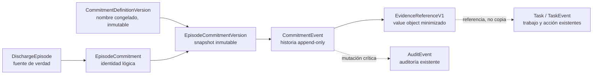
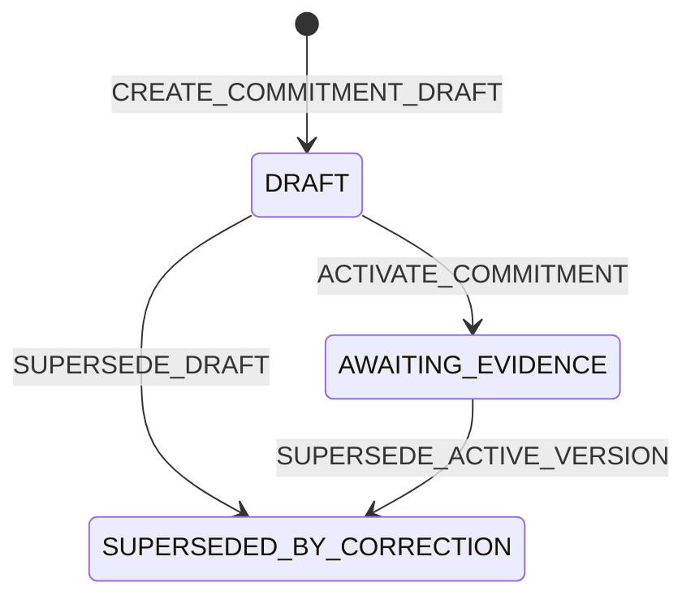

# Especificación del motor de compromisos verificables

## Control y condición de uso

| Campo | Valor |
| --- | --- |
| Estado | `APPROVED FOR SYNTHETIC SANDBOX IMPLEMENTATION / NOT IMPLEMENTED / NOT AUTHORIZED FOR REAL USE` |
| Autoridad y significado de `APPROVED` | Aprobación técnica interna del repositorio, exclusivamente para el sandbox sintético 5B; no es aprobación clínica, institucional, jurídica, regulatoria, de seguridad ni operativa |
| Rama | `docs/commitment-sandbox-implementation-gate` |
| Commit base inspeccionado | `26190a66554274665f4042c8497da9f403d4f578` |
| Fecha de corte | 2026-08-02 |
| Frontera rectora | [Frontera de aseguramiento del circuito](../system-assurance-boundary.md) y [ADR-0015](../adr/0015-guardian-core-clinical-rules-boundary.md) |
| Concurrencia | [ADR-0016](../adr/0016-commitment-evaluation-concurrency.md) |
| Datos permitidos | Exclusivamente sintéticos |
| Estado regulatorio, clínico e institucional | No evaluado o pendiente; no acreditado |

La aprobación técnica interna autoriza únicamente una futura implementación del
slice 5B delimitado en este documento. No cambia ningún estado canónico REQ o DEC:
`DEC-005`, `DEC-013`, `DEC-014`, `DEC-015`, `DEC-016` y `DEC-017` continúan
`Pendiente`; `READY_FOR_INSTITUTIONAL_DECISION` y `REAL PILOT = NO_GO` se
mantienen. Los nombres enumerados abajo quedan congelados para el sandbox, sin
afirmar que existan ya en Prisma o en runtime.

Esta especificación no afirma que el motor exista. El baseline no registra un
compromiso explícito con plazo y política de evidencia, no ejecuta un scheduler
y no detecta automáticamente ausencias de evidencia.

## Gates y contrato normativo del slice 5B

### Gate A — implementación técnica sintética

`SYNTHETIC SANDBOX IMPLEMENTATION = GO` e
`IMPLEMENTATION SLICE 5B = GO` significan exclusivamente que la autoridad técnica
interna del repositorio permite construir y probar el núcleo aislado descrito en
esta sección con datos, definiciones, actores e identidades sintéticos. No
significan aprobación clínica, institucional, jurídica, regulatoria, de seguridad
o de release.

5B queda limitado a:

- persistencia aditiva del núcleo mínimo mediante una migración como máximo;
- definición y versión sintéticas, identidad del compromiso, versión inmutable y
  eventos append-only;
- vínculo obligatorio con `DischargeEpisode` como fuente de verdad;
- fuente/protocolo y versión obligatorios, acción verificable, `dueAt` explícito,
  zona temporal y política o referencia versionada de evidencia;
- responsable como referencia de rol sin inventar autoridad institucional y
  asignación opcional separada de la responsabilidad;
- revisión/versionado optimista, idempotencia, unit of work y auditoría atómica;
- autorización inyectable deny-by-default, feature flag apagado por defecto y
  pruebas unitarias/de integración exclusivamente sintéticas.

Los únicos estados escribibles por servicios de aplicación en 5B son:

- `DRAFT`;
- `AWAITING_EVIDENCE`;
- `SUPERSEDED_BY_CORRECTION`.

Los únicos comandos autorizados en 5B son:

- `CREATE_COMMITMENT_DRAFT`;
- `ACTIVATE_COMMITMENT`;
- `SUPERSEDE_DRAFT`;
- `SUPERSEDE_ACTIVE_VERSION`.

Los únicos eventos semánticos de compromiso autorizados en 5B son:

- `COMMITMENT_DRAFT_CREATED`;
- `COMMITMENT_ACTIVATED`;
- `COMMITMENT_SUPERSEDED`.

5B no incluye cancelación silenciosa, borrado, cumplimiento manual genérico,
excepción, incumplimiento confirmado, conciliación, resolución de evidencia,
evaluación de vencimiento ni transición automática basada en tiempo. El catálogo
completo posterior se conserva solo como
`DOCUMENTED FOR FUTURE PHASE / NOT REACHABLE IN 5B`; 5B no debe materializar en
Prisma estados que sus servicios no pueden producir.

### Gate B — uso operativo o real

Permanece completamente bloqueado hasta resolver formalmente las decisiones y
evidencias institucionales aplicables: intended use, autoridades, roles, CSO,
aceptabilidad y evaluación de riesgos, clinical/human-factors validation,
identidad institucional, monitorización, incidentes, continuidad, integraciones,
controles transferidos, revisión regulatoria y release. En particular:

```text
DUE EVALUATOR = NO_GO
AUTOMATIC EVALUATION = NO_GO
SCHEDULER / WORKER = NO_GO
EXTERNAL API / UI EXPOSURE = NO_GO
REAL DATA = NO_GO
REAL IDENTITIES = NO_GO
REAL PILOT = NO_GO
PRODUCTION = NO_GO
DCB0129 COMPLIANCE CLAIM = NOT_AUTHORIZED
DCB0160 COMPLIANCE CLAIM = NOT_AUTHORIZED
RESIDUAL RISK ACCEPTANCE = NONE
```

Un feature flag no sustituye autorización; un sandbox no es un piloto; datos
sintéticos y CI verde no demuestran seguridad clínica, eficacia, cumplimiento o
readiness.

### Nombres técnicos congelados para 5B

Se confirman como nombres técnicos definitivos del sandbox:

- `CommitmentDefinition`;
- `CommitmentDefinitionVersion`;
- `EpisodeCommitment`;
- `EpisodeCommitmentVersion`;
- `CommitmentEvent`;
- `EvidenceReferenceV1`.

`DischargeEpisode` conserva la fuente de verdad del episodio; `Task` y
`TaskEvent` conservan trabajo humano y posibles fuentes, no compromisos;
`AuditEvent` sigue siendo la única auditoría. Se reutilizan la abstracción
temporal inyectada existente (`Clock` o equivalente), units of work,
idempotencia y patrones transaccionales existentes.

Se rechazan expresamente `ProcessCommitment`, `EpisodeContract`, `TaskCase`,
`ReviewGate`, una tabla universal `EvidenceRecord`, un segundo `AuditLog`, una
segunda fuente de verdad y una segunda cola u outbox.

### Feature gate técnico

El nombre exacto reservado, compatible con la convención booleana existente, es:

```text
COMMITMENT_ENGINE_ENABLED=false
```

Ausente o `false`, la capacidad está deshabilitada y no permite escrituras. No
cambia rutas, UI, tareas, alertas o episodios y no tiene fallback implícito. No
habilita evaluador, endpoints, scheduler, worker, usuarios reales ni readiness.
5B permanece sin ruta externa incluso si un test controla el gate. Esta rama solo
documenta el gate; no lo implementa.

### Contrato de autorización técnica

- Toda operación requiere un port `CommitmentAuthorizationPolicy` o equivalente
  y autorización por episodio/recurso.
- El adaptador runtime por defecto deniega todas las operaciones.
- No se mapean `admin`, `nurse`, `clinician`, `patient`, `caregiver`, `support`,
  supervisor, auditor o service identity a capabilities de compromiso; no se
  inventan roles.
- Solo pruebas pueden usar un adaptador explícito de autorización sintética,
  ubicado en el árbol de pruebas o soporte inequívocamente sintético y no
  importable desde runtime productivo.
- El actor se identifica inequívocamente como dato de prueba.
- No existe endpoint, UI o comando CLI operativo. DEC-013 y DEC-017 continúan
  bloqueando cualquier mapping real.

### Definiciones y políticas sintéticas

En 5B `CommitmentDefinition` y `CommitmentDefinitionVersion` son exclusivamente
sintéticas y permanecen `DRAFT`. `DRAFT` es un estado técnico de prueba: no
significa aprobación, publicación, vigencia o adopción institucional.

`ACTIVATE_COMMITMENT` solo puede referenciar una
`CommitmentDefinitionVersion` sintética, inmutable y aportada explícitamente por
la fixture o prueba. Activar el compromiso no publica ni aprueba la definición.
No existe comando, evento, endpoint o workflow de aprobación o publicación de
definiciones.

No existe catálogo clínico, seed operativo, plazo, acción, responsable o política
de evidencia predeterminados. Cada prueba aporta explícitamente fuente, versión,
`dueAt`, zona y política. El adaptador sintético de autorización no puede
habilitar uso runtime, y cualquier definición real continúa bloqueada.

Ningún episodio existente recibe compromisos automáticamente. No hay backfill y
un episodio sin compromisos sigue siendo válido y compatible.

### Capacidad autorizada, diferida y bloqueada

| Capacidad | 5B sandbox | Fase futura | Uso real |
| --- | --- | --- | --- |
| Modelo mínimo | Autorizado | — | Bloqueado |
| Migración aditiva | Autorizada | — | Bloqueado |
| Crear borrador sintético | Autorizado internamente | — | Bloqueado |
| Activar compromiso sintético | Autorizado internamente | — | Bloqueado |
| Sustituir versión | Autorizado internamente | — | Bloqueado |
| Evidencia | Solo contrato futuro | Ledger | Bloqueado |
| Evaluar vencimientos | No | Evaluador | Bloqueado |
| Excepción humana | No | Ledger/gobernanza | Bloqueado |
| Confirmar incumplimiento | No | Ledger/gobernanza | Bloqueado |
| API/UI | No | UX futura | Bloqueado |
| Scheduler/worker | No | Operación futura | Bloqueado |
| Datos reales | No | Requiere gates | Bloqueado |
| Piloto | No | Requiere DEC-016 y safety gates | Bloqueado |

## Tesis y límites

Guardián Core debe poder representar un compromiso asistencial explícito como
una **acción verificable del equipo** ligada a un episodio, con responsable,
plazo, fuente versionada y política de evidencia. Al llegar el plazo, Core puede
comprobar determinísticamente si existe una referencia registral compatible. Si
no la localiza, registra `AUSENCIA_DE_EVIDENCIA_EN_PLAZO` y la presenta para
revisión humana.

La máquina:

- no vigila al paciente;
- no infiere compromisos desde notas, SBAR, respuestas o texto libre;
- no interpreta el contenido clínico de una evidencia;
- no atribuye culpa, negligencia, riesgo o prioridad clínica;
- no transforma la no respuesta del paciente en incumplimiento del equipo;
- no crea una actuación, comunicación, derivación, firma, tratamiento o cierre
  clínico;
- no cambia la política de cierre del episodio;
- no importa el DSL, severidad, umbrales o explicación de Clinical Rules.

## Reconocimiento de la arquitectura real

### Mapa capacidad → fuente existente → cambio mínimo

| Capacidad necesaria | Modelo, servicio o patrón existente | Reutilizar, extender o nuevo | Evidencia exacta del baseline |
| --- | --- | --- | --- |
| Episodio fuente | `DischargeEpisode`, `EpisodeTransition` | Reutilizar sin `EpisodeContract` paralelo | `prisma/schema.prisma:364-404`, `:839-858`; ADR-0004 |
| Acción y trabajo humano | `Task`, `TaskEvent`, `CreateNursingTaskService`, `UpdateNursingTaskService` | Reutilizar como ejecución; no convertir toda tarea histórica en compromiso ni crear `TaskCase` | `prisma/schema.prisma:708-764`; `src/application/workqueue/manage-nursing-tasks.ts`; ADR-0008/0013 |
| Responsables | `responsibleNurseId`, `responsibleClinicianId`, `assignedToId`, roles activos | Reutilizar relaciones y patrón de autorización; extender solo mediante una referencia de rol/política aprobada | `prisma/schema.prisma:369-370`, `:714-728`; `src/domain/workqueue/task-accountability.ts`; `src/domain/authorization/human-authorization.ts` |
| Definición versionada | `CheckInProtocolVersion`, `PolicyVersion`, `RuleVersion`, versiones del Plan y Domicilio Seguro | Reutilizar el patrón contextual; nuevo contrato de definición solo porque no existe una definición de compromiso equivalente | `prisma/schema.prisma:406-426`, `:596-623`, `:766-838`, `:860-883` |
| Plazo y zona | `ScheduleConfiguration` y fechas UTC de `CheckInAssignment` | Reutilizar cuando esa versión sea la fuente real; extender con `dueAt` congelado por instancia, nunca con un plazo universal | `prisma/schema.prisma:452-505`; ADR-0006 |
| Evidencia | Registros fuente existentes y patrón `CanonicalProvenanceLineageV1` | Reutilizar registros; nuevo value object Core de referencia minimizada, no un `EvidenceRecord` universal | ADR-0011; `src/domain/provenance/signal-provenance.ts` |
| Revisión humana | `AlertReview` y `DefaultHumanAuthorizationPolicy` | Reutilizar el patrón de evidencia + autorización actual; no reutilizar la semántica clínica ni crear `ReviewGate` | `prisma/schema.prisma:693-706`; `src/domain/authorization/human-authorization.ts` |
| Historial e idempotencia | Eventos append-only, fingerprint, revisión y claves únicas | Extender el patrón a eventos de compromiso | `prisma/schema.prisma:739-764`, `:839-858`; `prisma/migrations/20260716000200_discharge_episode/migration.sql`; `prisma/migrations/20260720000100_nursing_workqueue_tasks/migration.sql` |
| Auditoría | `AuditEvent` | Reutilizar; ampliar en una futura migración el catálogo de acciones, nunca crear `AuditLog` | `prisma/schema.prisma:19-60`, `:1195-1210`; trigger `deny_audit_event_mutation` |
| Read models | `NursingWorkQueue`, `TaskAccountabilityProjection`, `EpisodeGovernanceEvidenceView` | Extender lectores/proyecciones; no persistir dashboards paralelos | ADR-0013/0014; `src/application/ports/governance-evidence-reader.ts`; `src/infrastructure/persistence/prisma-governance-evidence-reader.ts`; `src/infrastructure/persistence/prisma-nursing-workqueue-unit-of-work.ts` |
| Evaluación temporal | No existe scheduler, worker ni job | Nuevo caso de uso futuro; contrato solamente en esta rama | ADR-0006; frontera de aseguramiento, inventario del baseline |

`ProcessCommitment`, `EpisodeContract`, `TaskCase`, `ReviewGate` y
`EvidenceRecord` eran hipótesis. Esta especificación rechaza todos esos nombres o
estructuras paralelas. `EpisodeCommitment` queda confirmado, no provisional, para
hacer explícito el vínculo al agregado real.

## Modelo conceptual formal

### Frontera de agregado



`DischargeEpisode` sigue siendo la fuente de verdad del episodio.
`EpisodeCommitment` no reemplaza el episodio, la tarea ni el protocolo. Su
lifecycle existe porque el baseline no puede representar de forma inequívoca una
acción exigida, su plazo, su evidencia y su revisión.

### Identidad, definición e instancia

#### `CommitmentDefinition` y `CommitmentDefinitionVersion`

Una definición es una plantilla organizativa inmutable y versionada. Debe
contener, como mínimo:

| Campo conceptual | Regla |
| --- | --- |
| `definitionId` | Identidad estable de la definición, no de una instancia |
| `version` | Versión positiva e inmutable; una modificación crea N+1 |
| `sourceRef` | Tipo, ID y versión de protocolo, política o documento fuente |
| `actionKey` | Identificador estable de una acción verificable y content-neutral |
| `actionStatement` | Texto sintético explícito en 5B que describe una acción verificable, nunca un resultado clínico prometido; aprobación institucional diferida |
| `responsibleRoleRef` | Referencia de rol sintética y versionada en 5B; no equivale a un enum técnico ni a una autoridad institucional |
| `dueSourceKind` | Origen del plazo; no contiene un plazo universal |
| `evidencePolicy` | Política inmutable descrita abajo |
| `state` | Solo `DRAFT` en 5B; estados de publicación o retirada se difieren y no equivalen a aprobación institucional |
| `approvalEvidenceRef` | No se usa en 5B; cualquier semántica futura requiere autoridad y evidencia institucionales |
| `effectiveFrom/effectiveTo` | Vigencia si la autoridad decide usarla; no se inventan valores |

No se diseña un DSL. La definición no contiene código, expresiones arbitrarias,
umbrales clínicos o texto ejecutable. 5B solo usa estructuras cerradas aportadas
explícitamente por cada prueba; una fase real requeriría estructuras aprobadas
para seleccionar una fuente de plazo y tipos de evidencia.

#### `EpisodeCommitment`

Es la identidad lógica estable de un compromiso dentro de un único episodio.
Debe tener `id`, `episodeId`, número de revisión y referencia a su versión
vigente. `episodeId` es obligatorio e inmutable. No puede moverse entre
episodios, borrarse ni convertirse en una segunda raíz del episodio.

#### `EpisodeCommitmentVersion`

Cada versión de instancia congela:

- `commitmentId`, `versionNumber` y `basedOnVersionId`;
- `episodeId` coincidente con la identidad lógica;
- `definitionVersionId`; una declaración humana ad hoc queda diferida y no está
  autorizada en 5B;
- `actionKey` y la acción verificable aportada explícitamente por la prueba;
- `responsibleRoleRef` obligatorio;
- `assignedUserId` sintético opcional y decisión del policy de prueba al asignar;
- `dueAt` como instante UTC inequívoco;
- `timeZone` IANA usada para mostrar y, cuando proceda, resolver el instante;
- referencia exacta a la fuente del plazo y datos mínimos de resolución;
- versión exacta de la política de evidencia;
- actor, rol técnico histórico, instante e idempotencia de creación;
- relación de sustitución/corrección cuando proceda.

Editar acción, responsable, asignación, fuente, plazo, zona o política de
evidencia crea N+1. Nunca actualiza el snapshot anterior. Una nueva versión no
borra la evaluación histórica de una versión ya vencida.

### Acción verificable y responsabilidad

Una acción verificable describe qué debe hacer y documentar el equipo. Ejemplos
de forma, no de contenido institucional aprobado:

- válido: «registrar el intento de contacto definido por la versión X»;
- inválido: «el paciente responderá»;
- válido: «ofrecer y documentar una cita conforme al protocolo X»;
- inválido: «el paciente acudirá y mejorará».

`responsibleRoleRef` expresa en 5B una referencia sintética declarada por la
prueba. `assignedUserId` expresa una asignación técnica sintética concreta. No son
sinónimos ni acreditan autoridad institucional. La ausencia de assignee no cambia
por sí sola el plazo, no atribuye incumplimiento y no permite autoasignación.
DEC-013 y DEC-017 deben resolver el mapping institucional, acceptance, suplencia,
turnos y autoridad antes de cualquier uso real.

### Plazo, zona horaria y reloj

- No existe un plazo universal en el dominio.
- `dueAt` se resuelve antes de activar la versión y se persiste como instante
  UTC. La fuente, versión y datos de resolución quedan referenciados.
- `timeZone` conserva la zona IANA usada para presentación o cálculo local. No se
  acepta el huso del navegador como autoridad.
- Ambigüedades DST, calendarios laborables, pausas y excepciones no se resuelven
  mediante defaults. La prueba 5B debe aportar un instante inequívoco; una fase
  real requerirá política aprobada.
- Los servicios 5B y un futuro evaluador reciben `Clock` o la abstracción
  temporal equivalente inyectada. El runtime no llama a `new Date()` dentro de
  reglas de dominio. El contrato de aplicación recibe `now` y valida que sea un
  instante UTC finito.
- Una corrección del reloj o del plazo crea historia; no mueve silenciosamente
  `dueAt` en una versión activa.

#### Cuatro ejes temporales y su autoridad

Los timestamps no son intercambiables. Todos se expresan como instantes UTC y
conservan la procedencia de su reloj o fuente:

| Tiempo | Definición formal | Conclusión para la que es autoritativo |
| --- | --- | --- |
| `occurredAt` | Instante en que la fuente afirma que ocurrió la acción o hecho asistencial. Puede ser opcional si la fuente no lo define. | Describe cuándo ocurrió la acción. No demuestra por sí solo cuándo existía constancia registral y no decide puntualidad de evidencia. |
| `recordedAt` | Instante autoritativo, obtenido de la fuente allowlisted y versionada, en que la constancia quedó registrada en esa fuente. | Es el único timestamp que clasifica evidencia como registrada en plazo (`recordedAt <= dueAt`) o tardía (`recordedAt > dueAt`). Si falta o no es fiable, hay abstención o conciliación; nunca se sustituye por otro tiempo. |
| `discoveredAt` / `linkedAt` | `discoveredAt` es cuando el resolver Core observó por primera vez la referencia candidata; `linkedAt` es cuando Core la vinculó de forma persistente al compromiso. Si el diseño futuro colapsa ambas operaciones, conserva un único `linkedAt` con esa semántica. | Ordenan descubrimiento, enlace, trazabilidad y diagnóstico de visibilidad. No clasifican puntualidad. Si ambos existen, el orden causal debe constar en eventos, sin inferirlo únicamente de relojes distribuidos. |
| `evaluatedAt` | Instante `now` validado e inyectado con el que una transacción evaluó `dueAt` y, si procedía, registró la ausencia. | Demuestra cuándo se efectuó la evaluación y si el plazo ya había vencido (`evaluatedAt >= dueAt`). No fecha la acción ni la constancia fuente. |

Por tanto:

- evidencia ordinaria en plazo exige `recordedAt <= dueAt` y que no exista ya un
  evento de ausencia para esa versión;
- evidencia descubierta o enlazada después de la ausencia conserva su
  clasificación por `recordedAt`, no por `discoveredAt`, `linkedAt` o
  `evaluatedAt`;
- si `recordedAt <= dueAt`, una conciliación humana posterior puede concluir
  `EVIDENCE_RECONCILED_ON_TIME` y debe explicar por qué la constancia no fue
  visible durante la evaluación;
- solo `recordedAt > dueAt` permite usar `LATE_EVIDENCE_RECORDED` o
  `EVIDENCE_RECONCILED_LATE`;
- un orden causal contradictorio, un `recordedAt` mutable/no autoritativo o una
  fuente que no pueda demostrarlo producen abstención, error de datos o
  conciliación; nunca una clasificación temporal inventada.

### Política y referencias de evidencia

En 5B se persiste únicamente una política o referencia de política sintética,
versionada y aportada explícitamente por la prueba. No se resuelve evidencia, no
se consulta una fuente y no se decide si una referencia satisface el compromiso.
La semántica restante de esta sección está
`DOCUMENTED FOR FUTURE PHASE / NOT REACHABLE IN 5B`.

La política de evidencia es cerrada, versionada y content-neutral. Debe declarar:

- tipos de fuente autorizados;
- clase de acción que cada referencia acredita;
- cardinalidad mínima, si procede;
- campo fuente y semántica de `recordedAt` autoritativo, y ventana aplicable;
- pertenencia obligatoria al mismo episodio;
- versiones o estados fuente admisibles;
- si un intento documentado satisface la acción aun sin respuesta del paciente;
- si una referencia requiere conciliación humana;
- resolver/version del adapter que valida la referencia;
- comportamiento ante fuente ausente, inconsistente o no disponible.

`EvidenceReferenceV1` es un value object, no un `EvidenceRecord` universal. Como
máximo contiene `schemaVersion`, `sourceType`, `sourceResourceId`, `episodeId`,
`sourceVersionRef`, `actionKind`, `occurredAt` cuando la fuente lo define,
`recordedAt`, `discoveredAt` o `linkedAt` según el contrato futuro, actor técnico
cuando existe, `resolverVersion` e integridad. `evaluatedAt` pertenece al evento
de evaluación, no se copia desde la fuente. La referencia no copia respuestas,
notas, resumen de tarea, explicación de aviso, diagnóstico, medicación,
contenido del Plan, SBAR o texto del cuidador.

Una referencia aportada por el llamador no se vuelve válida por afirmación. El
resolver la reconstruye desde la fuente autorizada y verifica tipo, ID, episodio,
versión y timestamp dentro del unit of work. Una fuente de Clinical Rules solo
puede llegar como solicitud de revisión separada; Core no usa su severidad,
inputs o explicación como evidencia de cumplimiento.

### Hechos que permanecen separados

| Hecho | Qué demuestra | Qué no demuestra | Tratamiento |
| --- | --- | --- | --- |
| Obligación del equipo | Que se registró una acción verificable con responsable, fuente y plazo | Que la acción ocurrió o fue clínicamente correcta | Instancia explícita y versionada |
| Resultado dependiente del paciente | Que consta respuesta, omisión o asistencia, según la fuente | Que el equipo cumplió o incumplió su acción | Hecho contextual separado; nunca sustituto automático de la acción del equipo |
| Intento documentado | Que consta una actuación concreta del equipo con actor y tiempo | Que el paciente respondió o que hubo resultado clínico | Puede satisfacer la acción solo si la política aprobada lo declara |
| Excepción operativa justificada | Que una persona autorizada aplicó una categoría aprobada | Cumplimiento, seguridad o ausencia de daño | Disposición humana terminal, corregible solo por nuevo evento |
| Evidencia registral en plazo descubierta tras la evaluación | Que la fuente demuestra `recordedAt <= dueAt`, aunque `discoveredAt`/`linkedAt` sea posterior a la ausencia | Que la evidencia fue visible al evaluar o que la ausencia histórica deba borrarse | Conciliación humana `EVIDENCE_RECONCILED_ON_TIME` y explicación de visibilidad |
| Evidencia tardía | Que la fuente autoritativa demuestra `recordedAt > dueAt`, con independencia de cuándo ocurrió, se descubrió o se enlazó | Que no hubo acción, que existe culpa o que hubo impacto | Conserva la ausencia histórica y exige revisión |
| Error de datos | Que existe una contradicción o defecto técnico documentado | Incumplimiento o riesgo clínico | Fail-closed, revisión/corrección y nueva evaluación |
| Evidencia pendiente de conciliación | Que una referencia requiere validación humana | Evidencia aceptada o incumplimiento | Estado no terminal, visible a revisión |
| Incumplimiento confirmado | Que un revisor autorizado emitió esa conclusión con motivo y evidencia | Culpa, negligencia, diagnóstico, prioridad o acción clínica | Solo transición humana explícita y corregible mediante evento |

## Máquina de estados normativa y alcanzable en 5B

> `NORMATIVE AND REACHABLE IN SYNTHETIC SANDBOX 5B`

Solo existen tres estados escribibles y cuatro transiciones autorizadas. Los
actores, episodios, definiciones y políticas son sintéticos; no existe ruta
runtime externa.

| Estado 5B | Naturaleza | Significado exclusivo |
| --- | --- | --- |
| `DRAFT` | No activo | Snapshot sintético pendiente de activación técnica; no se evalúa y no implica aprobación institucional |
| `AWAITING_EVIDENCE` | Activo solo dentro del lifecycle sintético | Compromiso sintético activado; 5B no registra ni resuelve evidencia y no evalúa su vencimiento |
| `SUPERSEDED_BY_CORRECTION` | Terminal estructural | La versión sintética fue sustituida explícitamente; conserva toda su historia |

| Alcance | Origen | Destino | Actor | Precondiciones | Comando | Evento semántico | Idempotencia/corrección |
| --- | --- | --- | --- | --- | --- | --- | --- |
| `5B_REACHABLE` | inexistente | `DRAFT` | Actor sintético admitido por el policy de prueba | Episodio sintético existente; definición/versión, fuente y policy explícitas | `CREATE_COMMITMENT_DRAFT` | `COMMITMENT_DRAFT_CREATED` | actor + clave + fingerprint; no delete |
| `5B_REACHABLE` | `DRAFT` | `AWAITING_EVIDENCE` | Actor sintético admitido por el policy de prueba | Versión de definición sintética `DRAFT`, inmutable y aportada por fixture/prueba; acción, rol, fuente, `dueAt`, zona y policy completos | `ACTIVATE_COMMITMENT` | `COMMITMENT_ACTIVATED` | actor + clave + fingerprint + expected revision; no publica ni aprueba la definición |
| `5B_REACHABLE` | `DRAFT` | `SUPERSEDED_BY_CORRECTION` | Actor sintético admitido por el policy de prueba | Versión reemplazante sintética creada y enlazada | `SUPERSEDE_DRAFT` | `COMMITMENT_SUPERSEDED` | actor + clave + expected revision; solo append |
| `5B_REACHABLE` | `AWAITING_EVIDENCE` | `SUPERSEDED_BY_CORRECTION` | Actor sintético admitido por el policy de prueba | Nueva versión sintética y motivo documentado; no backdating silencioso | `SUPERSEDE_ACTIVE_VERSION` | `COMMITMENT_SUPERSEDED` | actor + clave + expected revision; solo append |



## Catálogo futuro de estados y transiciones

> `DOCUMENTED FOR FUTURE PHASE / NOT REACHABLE IN 5B`

Todos los estados, comandos, eventos y transiciones de esta sección son
`FUTURE_ONLY`. No autorizan registro o resolución de evidencia, clasificación
temporal, ausencia, conciliación, excepción, cumplimiento o incumplimiento,
evaluator, scheduler/worker, API/UI/CLI, notificaciones ni actores, identidades o
datos reales.

### Estados futuros

| Estado futuro | Naturaleza | Significado de diseño diferido |
| --- | --- | --- |
| `EVIDENCE_RECORDED_ON_TIME` | Terminal registral | Referencia compatible resuelta en plazo; no valora calidad clínica |
| `REVIEW_REQUIRED_ABSENCE` | No terminal | Ausencia registral evaluada que requeriría revisión humana |
| `EVIDENCE_PENDING_RECONCILIATION` | No terminal | Referencia candidata pendiente de conciliación humana |
| `LATE_EVIDENCE_RECORDED` | No terminal | Fuente autoritativa con `recordedAt > dueAt` |
| `DATA_ERROR_REVIEW_REQUIRED` | No terminal | Inconsistencia técnica que impide una conclusión fiable |
| `EVIDENCE_RECONCILED_ON_TIME` | Terminal registral humano | Conciliación humana de evidencia registrada en plazo |
| `EVIDENCE_RECONCILED_LATE` | Terminal registral humano | Conciliación humana de evidencia registrada tarde |
| `JUSTIFIED_OPERATIONAL_EXCEPTION` | Terminal humano | Excepción versionada aplicada por autoridad futura |
| `CONFIRMED_NON_FULFILMENT` | Terminal humano | Incumplimiento confirmado por autoridad futura, sin atribuir culpa |
| `CORRECTION_REVIEW_REQUIRED` | No terminal correctivo | Corrección futura de una disposición previa sin overwrite |

### Transiciones futuras

| Alcance | Origen | Destino | Comando futuro | Evento futuro |
| --- | --- | --- | --- | --- |
| `FUTURE_ONLY` | `AWAITING_EVIDENCE` | `EVIDENCE_RECORDED_ON_TIME` | `RECORD_COMPATIBLE_EVIDENCE` | `COMMITMENT_EVIDENCE_RECORDED` |
| `FUTURE_ONLY` | `AWAITING_EVIDENCE` | `REVIEW_REQUIRED_ABSENCE` | `EVALUATE_DUE_WITHOUT_ON_TIME_EVIDENCE` | `COMMITMENT_EVIDENCE_ABSENCE_RECORDED` |
| `FUTURE_ONLY` | `AWAITING_EVIDENCE` | `DATA_ERROR_REVIEW_REQUIRED` | `RECORD_DATA_ERROR` | `COMMITMENT_DATA_ERROR_RECORDED` |
| `FUTURE_ONLY` | `REVIEW_REQUIRED_ABSENCE` | `EVIDENCE_PENDING_RECONCILIATION` | `MARK_PENDING_RECONCILIATION` | `COMMITMENT_RECONCILIATION_STARTED` |
| `FUTURE_ONLY` | `REVIEW_REQUIRED_ABSENCE` | `LATE_EVIDENCE_RECORDED` | `RECORD_LATE_EVIDENCE` | `COMMITMENT_LATE_EVIDENCE_RECORDED` |
| `FUTURE_ONLY` | `REVIEW_REQUIRED_ABSENCE` | `JUSTIFIED_OPERATIONAL_EXCEPTION` | `JUSTIFY_EXCEPTION` | `COMMITMENT_EXCEPTION_RECORDED` |
| `FUTURE_ONLY` | `REVIEW_REQUIRED_ABSENCE` | `CONFIRMED_NON_FULFILMENT` | `CONFIRM_NON_FULFILMENT` | `COMMITMENT_NON_FULFILMENT_CONFIRMED` |
| `FUTURE_ONLY` | `REVIEW_REQUIRED_ABSENCE` | `DATA_ERROR_REVIEW_REQUIRED` | `RECORD_DATA_ERROR` | `COMMITMENT_DATA_ERROR_RECORDED` |
| `FUTURE_ONLY` | `EVIDENCE_PENDING_RECONCILIATION` | `EVIDENCE_RECONCILED_ON_TIME` | `ACCEPT_ON_TIME_EVIDENCE_AFTER_ABSENCE` | `COMMITMENT_ON_TIME_EVIDENCE_RECONCILED` |
| `FUTURE_ONLY` | `EVIDENCE_PENDING_RECONCILIATION` o `LATE_EVIDENCE_RECORDED` | `EVIDENCE_RECONCILED_LATE` | `ACCEPT_LATE_EVIDENCE` | `COMMITMENT_LATE_EVIDENCE_RECONCILED` |
| `FUTURE_ONLY` | `EVIDENCE_PENDING_RECONCILIATION` o `LATE_EVIDENCE_RECORDED` | `JUSTIFIED_OPERATIONAL_EXCEPTION` | `JUSTIFY_EXCEPTION` | `COMMITMENT_EXCEPTION_RECORDED` |
| `FUTURE_ONLY` | `EVIDENCE_PENDING_RECONCILIATION` o `LATE_EVIDENCE_RECORDED` | `CONFIRMED_NON_FULFILMENT` | `CONFIRM_NON_FULFILMENT` | `COMMITMENT_NON_FULFILMENT_CONFIRMED` |
| `FUTURE_ONLY` | `DATA_ERROR_REVIEW_REQUIRED` | `EVIDENCE_PENDING_RECONCILIATION` | `DATA_CORRECTED` | `COMMITMENT_DATA_CORRECTED` |
| `FUTURE_ONLY` | `DATA_ERROR_REVIEW_REQUIRED` | `SUPERSEDED_BY_CORRECTION` | `SUPERSEDE_VERSION` | Evento de corrección futuro |
| `FUTURE_ONLY` | Estado terminal futuro | `CORRECTION_REVIEW_REQUIRED` | `RECORD_CORRECTION` | `COMMITMENT_CORRECTION_RECORDED` |
| `FUTURE_ONLY` | `CORRECTION_REVIEW_REQUIRED` | `EVIDENCE_PENDING_RECONCILIATION` o `SUPERSEDED_BY_CORRECTION` | `REOPEN_RECONCILIATION` o `SUPERSEDE_VERSION` | Evento de corrección futuro |

No existe comando automático hacia `JUSTIFIED_OPERATIONAL_EXCEPTION` o
`CONFIRMED_NON_FULFILMENT`. Después de un evento de ausencia tampoco existe
comando automático hacia `EVIDENCE_RECONCILED_ON_TIME` o
`EVIDENCE_RECONCILED_LATE`: el resolver solo puede dejar la evidencia en un
estado no terminal y la disposición exige revisión humana autorizada.

## Semántica futura de `AUSENCIA_DE_EVIDENCIA_EN_PLAZO`

> `DOCUMENTED FOR FUTURE PHASE / NOT REACHABLE IN 5B`. Esta semántica no autoriza
> resolver evidencia, clasificar puntualidad, crear eventos de ausencia ni
> evaluar automáticamente.

Para una versión de compromiso `c`, su instante `c.dueAt`, la versión de política
`p` y el instante efectivo de evaluación `evaluatedAt = now`, se cumple:

```text
AUSENCIA_DE_EVIDENCIA_EN_PLAZO(c, p, evaluatedAt) :=
  c.state = AWAITING_EVIDENCE
  AND evaluatedAt >= c.dueAt
  AND c y p son coherentes, vigentes para la instancia y evaluables
  AND las fuentes autorizadas por p están disponibles
  AND en la vista autoritativa consultada por el resolver en evaluatedAt
      no es visible/resoluble una EvidenceReferenceV1 válida que:
      - pertenezca al mismo DischargeEpisode;
      - corresponda a la acción y tipo exigidos por p;
      - resuelva a una fuente autorizada y versionada;
      - tenga recordedAt <= c.dueAt;
      - satisfaga la cardinalidad y restricciones registrales de p.
```

Si la fuente no está disponible, la policy no puede resolverse, el reloj no es
fiable o existe una contradicción, el evaluador se **abstiene** o registra un
error técnico para revisión. No registra ausencia como si hubiera observado
correctamente todas las fuentes.

La conclusión es una observación inmutable sobre lo que el evaluador pudo
resolver en `evaluatedAt`, no una afirmación ontológica de que la acción nunca
ocurrió o de que ninguna constancia existía en otro plano de visibilidad. El
evento conserva `evaluatedAt`, policy/resolver version y cobertura de fuentes.

Si una referencia se descubre o enlaza causalmente después del evento de
ausencia:

- `recordedAt <= dueAt` abre conciliación humana y puede terminar en
  `EVIDENCE_RECONCILED_ON_TIME`; la ausencia histórica no cambia y debe
  documentarse por qué no fue visible;
- `recordedAt > dueAt` permite `LATE_EVIDENCE_RECORDED` y, tras revisión humana,
  `EVIDENCE_RECONCILED_LATE`;
- `occurredAt <= dueAt`, por sí solo, no prueba registro en plazo;
- `discoveredAt`, `linkedAt` y `evaluatedAt` nunca convierten evidencia en tardía
  ni puntual.

`AUSENCIA_DE_EVIDENCIA_EN_PLAZO` no significa ni puede convertirse
automáticamente en:

- incumplimiento;
- negligencia o culpa;
- alarma, severidad o riesgo clínicos;
- prioridad clínica;
- escalado clínico;
- no colaboración del paciente;
- decisión de contacto, derivación, tratamiento o cierre.

La no respuesta del paciente no viola automáticamente una obligación del equipo.
Si la acción exigida y aprobada es realizar y documentar un intento, un
`TaskEvent.CONTACT_ATTEMPT` correctamente resuelto puede satisfacerla aunque el
outcome sea `no-answer`, siempre que la policy aplicable lo declare. El dato
`no-answer` no se interpreta como estado clínico ni como incumplimiento del
paciente.

## Invariantes

### Invariantes de dominio

1. Todo compromiso y toda versión pertenecen exactamente a un
   `DischargeEpisode` existente.
2. Toda versión referencia una definición o fuente identificable y versionada.
3. Un compromiso representa una acción verificable del equipo, no un resultado
   clínico prometido ni una conducta exigida al paciente.
4. No existe plazo, calendario, responsable o excepción universal en el dominio.
5. `dueAt`, zona, fuente del plazo y policy de evidencia quedan congelados en la
   versión activa.
6. Definiciones y versiones de instancia son inmutables; editar crea N+1.
7. Una transición terminal no se borra ni reescribe. Toda rectificación añade un
   evento correctivo referenciado.
8. La misma idempotency key con el mismo fingerprint devuelve el resultado
   semántico existente; con otro fingerprint produce conflicto.
9. Reintentos concurrentes no duplican estado, evento de dominio ni auditoría
   semántica.
10. Evidencia, acción del equipo y resultado del paciente son hechos distintos.
11. Un intento documentado solo satisface el compromiso cuando la policy
    versionada lo permite.
12. `recordedAt` procedente de la fuente autoritativa es el único timestamp que
    clasifica registro en plazo o tardío; `occurredAt`, `discoveredAt`, `linkedAt`
    y `evaluatedAt` no lo sustituyen.
13. Descubrir o enlazar evidencia después de una ausencia no la vuelve tardía:
    `recordedAt <= dueAt` exige conciliación humana on-time y `recordedAt > dueAt`
    exige conciliación humana tardía.
14. Toda conciliación posterior conserva el evento histórico de ausencia, sus
    `evaluatedAt` y cobertura, y documenta la diferencia de visibilidad.
15. Solo una persona autorizada puede justificar excepción o confirmar
    incumplimiento.
16. La máquina no atribuye culpa ni toma decisiones clínicas.
17. Clinical Rules no muta compromisos, tareas, episodios, tratamientos o
    comunicaciones. Su única salida admisible sigue siendo una solicitud de
    revisión separada.
18. Resolver una `Task` no completa automáticamente un compromiso. El resolver de
    evidencia debe enlazar y validar el `TaskEvent` exigido por la policy.
19. La máquina no cambia `DischargeEpisode.status`; DEC-002 mantiene el cierre
    denegado.
20. Un episodio `CLOSED`, si algún día se autoriza, no borra compromisos ni
    resuelve retroactivamente sus estados.

### Invariantes de base de datos futuros

Estas son condiciones de diseño, no cambios autorizados:

- FK `RESTRICT` desde identidad de compromiso a `DischargeEpisode`;
- FK compuesta o trigger equivalente que impida cruzar `episodeId` entre
  identidad, versión, evento, tarea referenciada y fuente interna;
- unicidad de `(commitmentId, versionNumber)` y linaje N+1 válido;
- unicidad de `(commitmentId, resultingRevision)` para ordenar eventos;
- unicidad por actor + idempotency key y fingerprint persistido;
- clave semántica única para la evaluación de vencimiento por
  `(commitmentVersionId, dueAt, evidencePolicyVersionId, eventKind)`;
- `dueAt` obligatorio como `timestamptz`, zona IANA no vacía y revisión positiva;
- `recordedAt` obligatorio para cualquier conclusión de puntualidad, con
  `recordedAtSourceField`/versión de fuente; `occurredAt` es opcional;
- `evaluatedAt` obligatorio en el evento de ausencia y `linkedAt` o el evento de
  enlace obligatorio para toda referencia persistida; `discoveredAt` se conserva
  si se materializa separado;
- ningún check presupone `occurredAt <= recordedAt` ni sincronía perfecta entre
  relojes; el orden causal Core se preserva mediante eventos/revisiones;
- checks de forma que separen eventos del evaluador de conclusiones humanas;
- trigger append-only para definiciones, versiones, referencias y eventos;
- update del estado/proyección actual solo si existe un evento coincidente;
- prohibición de hard-delete de compromiso e historia;
- una única versión activa por identidad lógica, si se materializa ese puntero;
- `AuditEvent` en el mismo unit of work que cada mutación semántica;
- ninguna tabla, índice o enum de Clinical Rules se usa para prioridad, plazo o
  estado de compromiso.

## Proyecciones de lectura futuras

> `DOCUMENTED FOR FUTURE PHASE / NOT REACHABLE IN 5B`. 5B no expone readers por
> API/UI ni crea superficies para usuarios reales.

Las vistas son proyecciones; no crean otra fuente de verdad. Todas muestran
estados vacío, parcial, inconsistente y no disponible de forma explícita.

| Audiencia | Contenido mínimo permitido | Autorización y límites | Estado actual |
| --- | --- | --- | --- |
| Paciente | Acción en lenguaje aprobado, fecha/zona, estado registral no culpabilizador, fuente/version y cómo solicitar aclaración | Solo episodio propio; ocultar identidad interna de profesionales, motivos de excepción, auditoría y detalle no autorizado | No existe resource/policy de compromiso; bloqueado |
| Cuidador autorizado | Solo compromisos y campos enumerados por un scope futuro explícito | Doble filtro: autorización vigente + última versión de scope del episodio; rol `caregiver` por sí solo no concede acceso | `CaregiverCapability` no contiene esta capacidad; denegar hasta decisión jurídica/institucional |
| Enfermería/profesional responsable | Cola por episodio con acción, rol, assignee, `dueAt`, estado, cobertura de fuente, referencias minimizadas, historial y comandos humanos autorizados | Rol profesional activo + responsabilidad actual + resource policy; assignment no amplía autoridad | Extensión futura de workqueue/accountability |
| Supervisor | Agregados operativos y excepciones pendientes dentro de scope organizativo aprobado; drill-down solo con relación/autorización | No existe rol `supervisor`; no mapear a `admin`; DEC-013/017 deben definir función, alcance y segregación | Bloqueado |
| Auditor | Historia append-only, policy/source versions, decisiones humanas, correcciones y `AuditEvent` minimizado; sin payload clínico | No existe rol `auditor`; `support` no es sustituto; acceso, exportación y retención dependen de DEC-005/013/014 | Bloqueado |

La proyección profesional puede ampliar `EpisodeGovernanceEvidenceView` o crear
un reader homólogo que componga por referencia. No debe añadir compromisos a
`openObligations` de cierre mientras DEC-002 permanezca abierta.

Cuando la audiencia esté autorizada para ver detalle temporal, la proyección
muestra `occurredAt`, `recordedAt`, `discoveredAt`/`linkedAt` y `evaluatedAt` en
campos separados y etiqueta la puntualidad desde `recordedAt`. Nunca presenta una
conciliación on-time posterior como «evidencia tardía» ni oculta el evento de
ausencia que motivó la revisión.

## Contrato conceptual futuro `evaluateDueCommitments(now, batchSize)`

> `DUE EVALUATOR = NO_GO`; `AUTOMATIC EVALUATION = NO_GO`; este contrato está
> `DOCUMENTED FOR FUTURE PHASE / NOT REACHABLE IN 5B`.

### Firma y entradas

```text
evaluateDueCommitments(now: Instant, batchSize: PositiveInteger)
  -> DueCommitmentEvaluationBatchResult
```

- `now` procede de un `Clock` inyectable, se normaliza a UTC y es el
  `evaluatedAt` autoritativo de la decisión temporal por item. No se sustituye
  silenciosamente por el reloj local ni por timestamps de evidencia.
- `batchSize` tiene límites técnicos configurables y validados. Esta
  especificación no fija un valor.
- El contexto de ejecución aporta `runId`, `correlationId`, identidad de servicio
  o actor iniciador y feature/config version. No recibe payload clínico.
- La consulta ordena establemente por `dueAt`, después por ID.

### Elegibilidad

Solo son candidatos compromisos cuya versión actual esté
`AWAITING_EVIDENCE`, tenga `dueAt <= now`, pertenezca a un episodio coherente y
tenga policy/source version resolubles. No se deriva un compromiso desde
`Task`, `Alert`, check-in o nota existentes.

`REVIEW_REQUIRED_ABSENCE`, `EVIDENCE_PENDING_RECONCILIATION` y los estados de
evidencia posterior no son elegibles: `evaluateDueCommitments` no concilia una
ausencia previa. El enlace posterior y la disposición humana usan comandos
separados y el mismo locking del ADR-0016.

Dentro del lock, el resolver clasifica únicamente por `recordedAt` autoritativo:

- si ve evidencia compatible con `recordedAt <= dueAt`, registra
  `EVIDENCE_RECORDED_ON_TIME`;
- si no ve evidencia en plazo, registra la ausencia con `evaluatedAt`; si además
  ve una candidata con `recordedAt > dueAt`, solo la señala para revisión como
  candidata tardía y no emite una disposición humana;
- si falta un `recordedAt` fiable, se abstiene o registra error revisable;
- nunca usa `occurredAt`, `discoveredAt` o `linkedAt` para decidir puntualidad.

### Resultado

El resultado de lote contiene únicamente metadatos técnicos autorizados:

```text
runId
evaluatedAt
selectedCount
evidenceVisibleOnTimeCount
absenceRecordedCount
lateEvidenceCandidateCount
abstainedCount
skippedLockedCount
conflictCount
failedCount
hasMore
oldestRemainingDueAt?
items[]: commitmentId, priorState, resultCode, resultingRevision?, idempotent
```

Los `resultCode` permitidos son, conceptualmente:

- `EVIDENCE_ALREADY_RECORDED`;
- `EVIDENCE_VISIBLE_RECORDED_ON_TIME`;
- `ABSENCE_RECORDED_NO_ON_TIME_EVIDENCE_VISIBLE`;
- `ABSENCE_RECORDED_LATE_EVIDENCE_CANDIDATE`;
- `ABSTAIN_POLICY_UNAVAILABLE`;
- `ABSTAIN_SOURCE_UNAVAILABLE`;
- `ABSTAIN_INCONSISTENT_REFERENCE`;
- `ABSTAIN_CLOCK_OR_TIMEZONE_INVALID`;
- `SKIPPED_CONCURRENT_EVALUATION`;
- `IDEMPOTENT_REPLAY`;
- `TRANSIENT_FAILURE`.

### Abstenciones y errores

- Un error de policy, fuente, reloj, episodio o referencia no se convierte en
  ausencia de evidencia.
- `LATE_EVIDENCE_RECORDED` no es un resultado del orden de ejecución: solo puede
  derivarse cuando la fuente autoritativa demuestra `recordedAt > dueAt`.
- Un fallo transitorio por item no crea evento semántico; queda disponible para
  reintento.
- Una contradicción persistida produce estado/error revisable y no una
  conclusión de cumplimiento.
- `batchSize` inválido o `now` inválido rechaza todo el comando sin mutaciones.
- Un error global de DB revierte la transacción afectada. No se emite una
  auditoría de éxito fuera de la mutación.

### Idempotencia y concurrencia

- La idempotencia semántica se basa en versión de compromiso, `dueAt`, versión de
  policy y tipo de evaluación; no en la hora concreta de cada invocación.
- El evaluador y el enlace de nueva evidencia serializan sobre la misma fila de
  versión de compromiso conforme a ADR-0016.
- El lock ordena mutaciones Core, pero no redefine tiempos fuente: un enlace que
  ocurre después del evento de ausencia se clasifica por `recordedAt` y queda
  pendiente de conciliación humana.
- Un replay devuelve el evento existente y no duplica el `AuditEvent` de éxito.
- Si otra ejecución mantiene el lock, el item se omite y será elegible de nuevo;
  no se espera indefinidamente.

### Observabilidad

Por ejecución: `runId`, correlation ID, hora de inicio/fin, duración, recuentos,
`hasMore`, oldest due age técnica, versión del evaluador y códigos agregados. Por
item solo se registran IDs técnicos autorizados y códigos; nunca acción textual,
diagnóstico, evidencia clínica, resumen de tarea o identidad directa del
paciente. Las mutaciones producen `AuditEvent`; los scans sin cambio no generan
un evento por fila.

La definición de métricas, sink, acceso, retención, alertado y SLO sigue
bloqueada por DEC-005 y DEC-014. Un dashboard sin heartbeat del disparador no
demuestra que el evaluador esté funcionando.

## Estrategia de disparo futura

> `SCHEDULER / WORKER = NO_GO`; ninguna alternativa de esta sección está
> autorizada para 5B.

### Comparación

| Estrategia | Latencia esperable | Recuperación | Seguridad | Modo de fallo | Observabilidad |
| --- | --- | --- | --- | --- | --- |
| Worker residente | Intervalo/polling + lote; potencialmente baja | Reinicio y reanudación idempotente | Identidad de servicio, mínimo privilegio y operación 24/7 | Worker caído, dos instancias, backlog o clock drift | Heartbeat, lag, lote, errores y backlog; no existen hoy |
| Job protegido invocado por scheduler externo | Intervalo del scheduler + duración del job | Siguiente invocación o replay manual | Endpoint no público, service identity, anti-replay, timeout y rate limit | Scheduler no llama, auth falla, timeout parcial o despliegue sin trigger | Historial de runs, última ejecución exitosa, lag y correlation ID |
| Invocación manual | Depende de una persona; no es automática | Repetición humana idempotente | Sesión profesional y capability explícita | Olvido, retraso, disponibilidad humana | Actor, run y resultado; no acredita detección continua |
| Evaluación oportunista durante una consulta | Depende de que alguien abra una vista | Reintento en siguiente lectura | Mezcla read/write, amplía permisos y sorprende al usuario | Episodios nunca consultados no se evalúan; latencia no acotada | Difícil separar lectura de mutación y medir cobertura |

### Selección

La estrategia objetivo mínima para el monolito es un **job protegido** que
invoca el caso de uso de aplicación. Evita introducir un proceso worker antes de
demostrar volumen o latencia y mantiene dominio/persistencia dentro del runtime
real. Un scheduler externo es infraestructura, no lógica clínica.

La selección es condicional: no existe hoy scheduler, service identity,
endpoint, readiness ni monitorización. 5B no puede invocar el evaluador, ni
siquiera manualmente o en dry-run. Validar este contrato requiere un gate futuro;
no se puede afirmar evaluación bajo demanda ni detección automática.

La evaluación oportunista queda rechazada: una lectura no debe mutar, no ofrece
cobertura temporal y perjudica la autorización. El worker queda como alternativa
futura si un requisito operativo probado supera los límites del job protegido.

Fallos del job seleccionado:

- si no se dispara, no se detectan ausencias; se necesita heartbeat y alarma
  técnica aprobada, no escalado clínico;
- si termina parcialmente, el siguiente run reintenta sin duplicar eventos;
- si la fuente está caída, el evaluador se abstiene y no declara ausencia;
- si el backlog supera la capacidad, aumenta la latencia y se detiene el rollout;
- si falla autenticación o autorización, no hay fallback anónimo ni demo;
- si el reloj es inválido, no evalúa y requiere intervención técnica.

## Plan incremental de migración futura

La aprobación técnica interna autoriza para 5B **una única migración futura como
máximo**, sujeta al contrato estricto siguiente. No autoriza endpoints,
evaluador, scheduler, worker ni operación.

### Slice 5B — contrato de la única migración autorizada

La migración deberá ser:

- aditiva, no destructiva y compatible con episodios existentes;
- nueva, sin modificar migraciones aplicadas y sin backfill;
- sin inferencias desde tareas, alertas, check-ins, SBAR o notas;
- sin datos reales, defaults clínicos, plazos universales ni seeds operativos;
- con FK obligatoria a `DischargeEpisode`, historia append-only y restricciones de
  unicidad justificadas;
- limitada a los nombres, estados, comandos y eventos alcanzables en 5B;
- reversible operacionalmente mediante feature flag y rollback de código, pero
  no eliminable si ya contiene historia;
- validada sobre PostgreSQL desechable antes de declarar `PASS`.

La migración no materializa estados futuros que 5B no puede producir. `Task`,
`TaskEvent`, `DischargeEpisode`, `AuditEvent`, check-ins y avisos conservan su
semántica, y no se crea segunda auditoría, fuente de verdad, cola u outbox.

### Fases posteriores — no autorizadas por este gate

Todo schema adicional para ledger, evaluación, evidencia resuelta, conciliación,
excepción, incumplimiento, operación o exposición queda
`DOCUMENTED FOR FUTURE PHASE / NOT REACHABLE IN 5B`.

No se añade `EvidenceRecord`, `AuditLog`, `EpisodeContract`, `TaskCase` o tabla de
Clinical Rules dentro de Core. Cualquier relación opcional futura entre una
`Task` humana y un compromiso debe ser aditiva y del mismo episodio.

### Compatibilidad de 5B

- Feature flag apagado por defecto.
- El código existente tolera ausencia total de compromisos.
- Episodios existentes sin compromisos muestran `NOT_CONFIGURED` o colección
  vacía; nunca `AUSENCIA_DE_EVIDENCIA_EN_PLAZO`.
- APIs y UI actuales no cambian y 5B no añade rutas externas.
- La gobernanza de cierre no incorpora compromisos ni cambia su denegación.

### Backfill

No se infieren compromisos históricos desde `Task`, `Alert`, check-ins, SBAR,
Plan o notas. El backfill automático es `NOT_ALLOWED`.

5B no adopta episodios existentes ni ofrece un mecanismo de backfill manual. No
se fabrican ausencias retroactivas ni se retrodata evidencia.

### Secuencia de implementación 5B

1. Añadir como máximo una migración aditiva con el feature flag apagado.
2. Verificar constraints, append-only, idempotencia y compatibilidad sobre
   PostgreSQL desechable.
3. Probar definiciones sintéticas `DRAFT`, sin defaults institucionales.
4. Probar exclusivamente los cuatro comandos autorizados mediante adaptador de
   autorización sintética y sin ruta externa.
5. Mantener deshabilitados evaluador, ledger, scheduler/worker, API/UI y cualquier
   uso real.

### Rollback

- Desactivar primero el trigger/job y los write flags.
- Mantener readers capaces de ignorar la nueva capability.
- Conservar todas las filas y eventos ya creados; rollback no significa delete.
- Revertir código a una versión que no use las tablas aditivas es posible si el
  schema permanece compatible.
- Una migración down destructiva solo sería admisible con tablas vacías y
  revisión explícita; con historia, usar corrección forward-only.
- Nunca reescribir una migración aplicada ni restaurar una versión que interprete
  `recordedAt > dueAt` como puntual, o que convierta en tardía una referencia solo
  porque `discoveredAt`/`linkedAt > evaluatedAt`.

### Condiciones de parada

Detener rollout y dejar el flag apagado ante:

- decisión institucional/regulatoria ausente, retirada o sustituida;
- mismatch de episodio, versión, fuente o policy;
- duplicación de evento terminal o auditoría semántica;
- carreras que permitan evidencia y ausencia incompatibles para el mismo corte;
- zona/DST/reloj no resolubles;
- fuente requerida no disponible sin abstención;
- acceso de paciente/cuidador/supervisor/auditor más amplio que el aprobado;
- PHI/PII o texto clínico en logs, métricas, errores o tickets;
- ausencia de heartbeat/recuperación del disparador;
- degradación de DB, deadlocks o backlog fuera de límites aprobados;
- cualquier mutación desde Clinical Rules o cambio indirecto del cierre.

## Pruebas futuras de especificación

No son pruebas ejecutables en esta rama. Una implementación futura deberá cubrir:

- unitarias de todas las transiciones legales e ilegales;
- propiedades de idempotencia y fingerprint incompatible;
- cálculo/rechazo de tiempo, UTC, zona IANA y DST;
- combinaciones de `occurredAt`, `recordedAt`, `discoveredAt`/`linkedAt` y
  `evaluatedAt`, probando que solo `recordedAt` clasifica puntualidad;
- evidencia on-time visible durante evaluación, tardía, ausente, contradictoria
  y fuente caída;
- evidencia con `recordedAt <= dueAt` descubierta después de la ausencia termina,
  solo tras revisión humana, en `EVIDENCE_RECONCILED_ON_TIME`, conserva la
  ausencia y explica la falta de visibilidad;
- evidencia con `occurredAt <= dueAt` pero `recordedAt > dueAt` permanece tardía;
- evidencia con `recordedAt > dueAt` enlazada antes o después de la evaluación
  permanece tardía y requiere conciliación humana;
- intento documentado con `reached` y `no-answer` bajo policies que lo admiten o
  rechazan;
- no respuesta del paciente separada de la obligación del equipo;
- solo humano para excepción e incumplimiento confirmado;
- corrección de cada estado terminal sin overwrite;
- FK/trigger de mismo episodio y append-only;
- dos evaluadores concurrentes, evidencia contra evaluación, las dos ramas de
  conciliación temporal y replays;
- job caído, timeout parcial, backlog y recuperación;
- RBAC negativo de todos los roles actuales y futuros scopes;
- paciente/cuidador con mínimos campos y revocación inmediata;
- supervisor/auditor denegados mientras no exista mapping;
- ausencia de mutación de `Task`, `Alert`, tratamiento, comunicación y episodio;
- ausencia de dependencia del DSL/severidad de Clinical Rules;
- logs, errores y métricas sin contenido sensible;
- episodios históricos sin backfill presentados como no configurados;
- feature flag apagado y rollback compatible.

## Matriz de trazabilidad de diseño

Esta matriz no añade requisitos canónicos ni cambia REQ-01–REQ-14.

| CE | Tratamiento en 5B | Estado de diseño | Fase diferida | Decisión institucional | Peligro HAZ-GAS | Control técnico futuro | Prueba futura | Gate aplicable |
| --- | --- | --- | --- | --- | --- | --- | --- | --- |
| CE-01 Todo compromiso pertenece a un episodio | Implementable: FK obligatoria y autorización de recurso | `DESIGN FROZEN FOR SYNTHETIC SANDBOX`; `NOT IMPLEMENTED` | — | DEC-005 para retención real | HAZ-GAS-001/020 | FK `RESTRICT`, mismo episodio | FK cruzada, delete negativo | `TECHNICAL IMPLEMENTATION AUTHORIZED`; `REAL USE BLOCKED` |
| CE-02 Acción verificable, no outcome | Implementable con entrada sintética explícita | `DESIGN FROZEN FOR SYNTHETIC SANDBOX`; `NOT IMPLEMENTED` | Catálogo gobernado | Autoridad/intended use | HAZ-GAS-013/020 | Estructura cerrada, autoría, sin defaults | Rechazar outcome del paciente y acción ausente | `TECHNICAL IMPLEMENTATION AUTHORIZED`; `CLINICAL EFFECTIVENESS NOT VERIFIED` |
| CE-03 Responsable y asignación separados | Implementable como referencias sin mapping real | `DESIGN FROZEN FOR SYNTHETIC SANDBOX`; `NOT IMPLEMENTED` | Mapping real | DEC-013/017 | HAZ-GAS-004/012/020 | `responsibleRoleRef` obligatorio, asignación opcional | Ausente/revocado/otro episodio | `TECHNICAL IMPLEMENTATION AUTHORIZED`; `REAL USE BLOCKED` |
| CE-04 Sin plazo universal | Implementable: `dueAt`, zona, fuente y versión explícitos | `DESIGN FROZEN FOR SYNTHETIC SANDBOX`; `NOT IMPLEMENTED` | Política real de plazos | DEC-017 | HAZ-GAS-016/020 | Activación fail-closed, snapshot inmutable | Sin default, zona inválida, fuente ausente | `TECHNICAL IMPLEMENTATION AUTHORIZED`; `REAL USE BLOCKED` |
| CE-05 Reloj determinista | Implementable con tiempo inyectado | `DESIGN FROZEN FOR SYNTHETIC SANDBOX`; `NOT IMPLEMENTED` | Operación/evaluador | DEC-014/017 | HAZ-GAS-016 | `Clock` o equivalente, `now` UTC | Fake clock, DST y valor inválido | `TECHNICAL IMPLEMENTATION AUTHORIZED`; evaluator `NO_GO` |
| CE-06 Evidencia tipada y minimizada | Solo contrato `EvidenceReferenceV1`; no resolver ni ledger | `DESIGN FROZEN FOR SYNTHETIC SANDBOX`; `NOT IMPLEMENTED` | Ledger | Fuente/retención DEC-005 | HAZ-GAS-003/014/015 | Referencia sin payload, mismo episodio | Serialización/minimización; resolver futuro | Contrato autorizado; ledger y uso real bloqueados |
| CE-07 Ausencia no es incumplimiento | Solo documentado; no hay evento de ausencia | `NOT IMPLEMENTED` | Evaluador + ledger | Semántica/autoridad | HAZ-GAS-013 | Máquina cerrada y revisión humana futura | Evaluador no emite incumplimiento | Evaluator `NO_GO`; `REAL USE BLOCKED` |
| CE-08 No respuesta separada | Solo documentado; no se consume respuesta | `NOT IMPLEMENTED` | Evaluador + ledger | DEC-006/017 | HAZ-GAS-007/013 | Hechos separados | No respuesta nunca cambia compromiso | Evaluator/ledger `NO_GO`; `CLINICAL EFFECTIVENESS NOT VERIFIED` |
| CE-09 Excepción humana | No implementable en 5B | `NOT IMPLEMENTED` | Ledger/gobernanza | Taxonomía, autoridad, DEC-013/017 | HAZ-GAS-012/013 | Capability, motivo, policy, auditoría futura | Actor/rol/motivo/policy negativos | Ledger `NO_GO`; `REAL USE BLOCKED` |
| CE-10 Clasificación temporal y conciliación conservan historia | Solo documentado | `NOT IMPLEMENTED` | Evaluador + ledger | Fuente y política de conciliación | HAZ-GAS-005/015/017 | Tiempos separados, eventos append-only futuros | Matriz de tiempos y visibilidad | Evaluator/ledger `NO_GO`; `CLINICAL EFFECTIVENESS NOT VERIFIED` |
| CE-11 Error/pending reconciliation abstienen | No implementable en 5B | `NOT IMPLEMENTED` | Evaluador + ledger | Ownership/operación DEC-014/015 | HAZ-GAS-003/014 | Fail-closed y reintento futuros | Fuente caída/inconsistente | Evaluator `NO_GO`; `REAL USE BLOCKED` |
| CE-12 Incumplimiento solo humano | No implementable en 5B | `NOT IMPLEMENTED` | Ledger/gobernanza | Rol, motivo, corrección, DEC-013/017 | HAZ-GAS-013 | Autorización humana y evento corregible futuros | Negar comando automático y rol no aprobado | Ledger `NO_GO`; `REAL USE BLOCKED` |
| CE-13 Corrección sin overwrite | Implementable solo como sustitución de versión | `DESIGN FROZEN FOR SYNTHETIC SANDBOX`; `NOT IMPLEMENTED` | Disposición/corrección de ledger | Segregación futura | HAZ-GAS-005/015/017 | Versiones/eventos append-only, revisión optimista | Sustitución concurrente e idempotente | Sustitución 5B autorizada; ledger `NO_GO` |
| CE-14 Idempotencia | Implementable solo para los cuatro comandos 5B | `DESIGN FROZEN FOR SYNTHETIC SANDBOX`; `NOT IMPLEMENTED` | Idempotencia del evaluador | Límites operativos DEC-014/017 | HAZ-GAS-002/005/017 | Clave, fingerprint, revisión, UoW | Replay y fingerprint incompatible | Ciclo 5B autorizado; evaluator `NO_GO` |
| CE-15 Revisión visible, no acción automática | Solo restricción negativa; sin reader/API/UI | `NOT IMPLEMENTED` | Ledger + UX | Workflow DEC-017 | HAZ-GAS-012/013/019 | Ninguna mutación `Task`/`Alert`/episodio | Comandos 5B no alteran fuentes | API/UI y ledger `NO_GO` |
| CE-16 Proyecciones de mínimo privilegio | No implementable en 5B | `NOT IMPLEMENTED` | UX/read models | DEC-004/005/013 | HAZ-GAS-001/004/008 | Scope, responsabilidad, minimización futuros | Matriz negativa y revocación | API/UI y uso real `NO_GO` |
| CE-17 Disparo real y recuperable | No implementable en 5B | `NOT IMPLEMENTED` | Evaluador/operación | DEC-013/014/015/017 | HAZ-GAS-010/018 | Heartbeat/run history futuros, sin SLO inventado | Caída, timeout, recuperación | Scheduler/worker `NO_GO`; producción `NO_GO` |
| CE-18 Cierre sin cambios | Implementable como prueba negativa | `DESIGN FROZEN FOR SYNTHETIC SANDBOX`; `NOT IMPLEMENTED` | Política futura | DEC-002 | HAZ-GAS-009/019 | Compromisos fuera del cierre | Ciclo 5B no cierra episodio | 5B prueba negativa autorizada; uso real bloqueado |
| CE-19 Frontera Core/Clinical Rules | Implementable como dependencia negativa | `DESIGN FROZEN FOR SYNTHETIC SANDBOX`; `NOT IMPLEMENTED` | Separación operativa | Intended use/regulación | HAZ-GAS-006/019 | Sin DSL, severidad o mutación clínica | Tests de imports y mutaciones negativas | 5B prueba negativa autorizada; uso real bloqueado |
| CE-20 Migración segura | Implementable según contrato de única migración | `DESIGN FROZEN FOR SYNTHETIC SANDBOX`; `NOT IMPLEMENTED` | Migraciones de fases futuras | DEC-005 antes de datos reales | HAZ-GAS-002/005/020 | Aditiva, flag off, sin backfill, historia preservada | PostgreSQL desechable, legacy y rollback de código | `TECHNICAL IMPLEMENTATION AUTHORIZED`; `REAL USE BLOCKED` |

## Decisiones abiertas y riesgos sin aceptación

No bloquean el núcleo técnico sintético 5B, pero bloquean evaluator, ledger,
exposición, integración y cualquier uso real:

- aprobación clínica/institucional/regulatoria de la finalidad prevista de Core;
- definición y autoridad institucional de compromiso, evidencia, excepción,
  corrección e incumplimiento confirmado;
- DEC-017 C/D/E/F y cualquier otra dimensión usada;
- mapeo de roles, supervisor, auditor y service identity en DEC-013;
- retención, acceso y rights workflow en DEC-005;
- observabilidad/alertado técnico y acceso en DEC-014;
- recuperación/continuidad requerida en DEC-015;
- cualificación regulatoria, análisis de peligros, claims y separación efectiva;
- DEC-016 para cualquier uso con personas o datos reales;
- contrato de fuente externa antes de cualquier integración.

Riesgos de diseño pendientes de análisis, estimación y aceptación:

- un plazo organizativo puede percibirse como urgencia clínica en UI;
- la presencia de evidencia puede confundirse con calidad o eficacia;
- una policy demasiado amplia puede aceptar referencias débiles;
- el job puede quedar silenciosamente inactivo sin observabilidad aprobada;
- la separación lógica no elimina el acoplamiento actual del monolito;
- roles técnicos actuales no representan funciones institucionales;
- `Task` y compromiso pueden divergir si una futura relación no se gobierna en
  un único unit of work;
- la fuente puede registrar tarde o con reloj distinto;
- una corrección puede usarse indebidamente para normalizar historia si no existe
  segregación y revisión.

Ninguno de estos riesgos está aceptado. Hasta resolver los gates aplicables, el
motor permanece `NO IMPLEMENTADO`, deshabilitado y sin claim de detección
automática, cumplimiento, seguridad clínica o preparación regulatoria. La única
autorización vigente es construir el slice 5B sintético dentro del Gate A.
