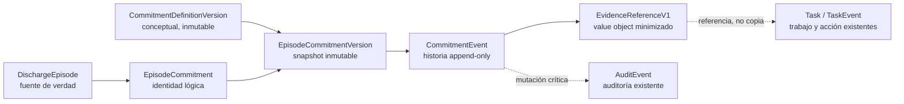

# Especificación del motor de compromisos verificables

## Control y condición de uso

| Campo | Valor |
| --- | --- |
| Estado | `DISEÑO INTERNO / NO IMPLEMENTADO / NO AUTORIZA IMPLEMENTACIÓN` |
| Rama | `design/commitment-engine-spec` |
| Commit base inspeccionado | `ae6ee97643cfba628dafa0fef31bf2fcf6ec8e20` |
| Fecha de corte | 2026-07-31 |
| Frontera rectora | [Frontera de aseguramiento del circuito](../system-assurance-boundary.md) y [ADR-0015](../adr/0015-guardian-core-clinical-rules-boundary.md) |
| Concurrencia | [ADR-0016](../adr/0016-commitment-evaluation-concurrency.md) |
| Datos permitidos | Exclusivamente sintéticos |
| Estado regulatorio, clínico e institucional | No evaluado o pendiente; no acreditado |

La fusión del documento de frontera autoriza únicamente esta especificación
interna. No cambia `ADR-0015 = Propuesta`, `DEC-017 = Pendiente`,
`DEC-016 = Pendiente`, `REAL PILOT = NO_GO` ni el gate institucional
`READY_FOR_INSTITUTIONAL_DECISION`. Los nombres de tipos y tablas de este
documento son conceptuales. No son nombres Prisma aprobados.

Esta especificación no afirma que el motor exista. El baseline no registra un
compromiso explícito con plazo y política de evidencia, no ejecuta un scheduler
y no detecta automáticamente ausencias de evidencia.

## Tesis y límites

Guardián Core debe poder representar un compromiso asistencial explícito como
una **acción verificable del equipo** ligada a un episodio, con responsable,
plazo, fuente versionada y política de evidencia. Al llegar el plazo, Core puede
comprobar determinísticamente si existe una referencia registral compatible. Si
no la localiza, registra `AUSENCIA_DE_EVIDENCIA_EN_PLAZO` y la presenta para
revisión humana.

La máquina:

- no vigila al paciente;
- no infiere compromisos desde notas, SBAR, respuestas o texto libre;
- no interpreta el contenido clínico de una evidencia;
- no atribuye culpa, negligencia, riesgo o prioridad clínica;
- no transforma la no respuesta del paciente en incumplimiento del equipo;
- no crea una actuación, comunicación, derivación, firma, tratamiento o cierre
  clínico;
- no cambia la política de cierre del episodio;
- no importa el DSL, severidad, umbrales o explicación de Clinical Rules.

## Reconocimiento de la arquitectura real

### Mapa capacidad → fuente existente → cambio mínimo

| Capacidad necesaria | Modelo, servicio o patrón existente | Reutilizar, extender o nuevo | Evidencia exacta del baseline |
| --- | --- | --- | --- |
| Episodio fuente | `DischargeEpisode`, `EpisodeTransition` | Reutilizar sin `EpisodeContract` paralelo | `prisma/schema.prisma:364-404`, `:839-858`; ADR-0004 |
| Acción y trabajo humano | `Task`, `TaskEvent`, `CreateNursingTaskService`, `UpdateNursingTaskService` | Reutilizar como ejecución; no convertir toda tarea histórica en compromiso ni crear `TaskCase` | `prisma/schema.prisma:708-764`; `src/application/workqueue/manage-nursing-tasks.ts`; ADR-0008/0013 |
| Responsables | `responsibleNurseId`, `responsibleClinicianId`, `assignedToId`, roles activos | Reutilizar relaciones y patrón de autorización; extender solo mediante una referencia de rol/política aprobada | `prisma/schema.prisma:369-370`, `:714-728`; `src/domain/workqueue/task-accountability.ts`; `src/domain/authorization/human-authorization.ts` |
| Definición versionada | `CheckInProtocolVersion`, `PolicyVersion`, `RuleVersion`, versiones del Plan y Domicilio Seguro | Reutilizar el patrón contextual; nuevo contrato de definición solo porque no existe una definición de compromiso equivalente | `prisma/schema.prisma:406-426`, `:596-623`, `:766-838`, `:860-883` |
| Plazo y zona | `ScheduleConfiguration` y fechas UTC de `CheckInAssignment` | Reutilizar cuando esa versión sea la fuente real; extender con `dueAt` congelado por instancia, nunca con un plazo universal | `prisma/schema.prisma:452-505`; ADR-0006 |
| Evidencia | Registros fuente existentes y patrón `CanonicalProvenanceLineageV1` | Reutilizar registros; nuevo value object Core de referencia minimizada, no un `EvidenceRecord` universal | ADR-0011; `src/domain/provenance/signal-provenance.ts` |
| Revisión humana | `AlertReview` y `DefaultHumanAuthorizationPolicy` | Reutilizar el patrón de evidencia + autorización actual; no reutilizar la semántica clínica ni crear `ReviewGate` | `prisma/schema.prisma:693-706`; `src/domain/authorization/human-authorization.ts` |
| Historial e idempotencia | Eventos append-only, fingerprint, revisión y claves únicas | Extender el patrón a eventos de compromiso | `prisma/schema.prisma:739-764`, `:839-858`; `prisma/migrations/20260716000200_discharge_episode/migration.sql`; `prisma/migrations/20260720000100_nursing_workqueue_tasks/migration.sql` |
| Auditoría | `AuditEvent` | Reutilizar; ampliar en una futura migración el catálogo de acciones, nunca crear `AuditLog` | `prisma/schema.prisma:19-60`, `:1195-1210`; trigger `deny_audit_event_mutation` |
| Read models | `NursingWorkQueue`, `TaskAccountabilityProjection`, `EpisodeGovernanceEvidenceView` | Extender lectores/proyecciones; no persistir dashboards paralelos | ADR-0013/0014; `src/application/ports/governance-evidence-reader.ts`; `src/infrastructure/persistence/prisma-governance-evidence-reader.ts`; `src/infrastructure/persistence/prisma-nursing-workqueue-unit-of-work.ts` |
| Evaluación temporal | No existe scheduler, worker ni job | Nuevo caso de uso futuro; contrato solamente en esta rama | ADR-0006; frontera de aseguramiento, inventario del baseline |

`ProcessCommitment`, `EpisodeContract`, `TaskCase`, `ReviewGate` y
`EvidenceRecord` eran hipótesis. Esta especificación no adopta
`ProcessCommitment`, por ser demasiado amplio, y rechaza los cuatro últimos como
fuentes paralelas. Usa provisionalmente `EpisodeCommitment` para hacer explícito
el vínculo al agregado real; el nombre deberá confirmarse en la futura revisión
de implementación.

## Modelo conceptual formal

### Frontera de agregado



`DischargeEpisode` sigue siendo la fuente de verdad del episodio.
`EpisodeCommitment` no reemplaza el episodio, la tarea ni el protocolo. Su
lifecycle existe porque el baseline no puede representar de forma inequívoca una
acción exigida, su plazo, su evidencia y su revisión.

### Identidad, definición e instancia

#### `CommitmentDefinitionVersion` conceptual

Una definición es una plantilla organizativa inmutable y versionada. Debe
contener, como mínimo:

| Campo conceptual | Regla |
| --- | --- |
| `definitionId` | Identidad estable de la definición, no de una instancia |
| `version` | Versión positiva e inmutable; una modificación crea N+1 |
| `sourceRef` | Tipo, ID y versión de protocolo, política o documento fuente |
| `actionKey` | Identificador estable de una acción verificable y content-neutral |
| `actionStatement` | Texto aprobado que describe una acción del equipo, nunca un resultado clínico prometido |
| `responsibleRoleRef` | Rol o función institucional versionada; no equivale por defecto a un enum técnico actual |
| `dueSourceKind` | Origen del plazo; no contiene un plazo universal |
| `evidencePolicy` | Política inmutable descrita abajo |
| `state` | `DRAFT`, `APPROVED`, `RETIRED` o estados que apruebe la gobernanza; el baseline no los autoriza |
| `approvalEvidenceRef` | Referencia a evidencia de aprobación, no contenido clínico |
| `effectiveFrom/effectiveTo` | Vigencia si la autoridad decide usarla; no se inventan valores |

No se diseña un DSL. La definición no contiene código, expresiones arbitrarias,
umbrales clínicos o texto ejecutable. La futura implementación solo podrá usar
estructuras cerradas y aprobadas para seleccionar una fuente de plazo y tipos de
evidencia.

#### `EpisodeCommitment` conceptual

Es la identidad lógica estable de un compromiso dentro de un único episodio.
Debe tener `id`, `episodeId`, número de revisión y referencia a su versión
vigente. `episodeId` es obligatorio e inmutable. No puede moverse entre
episodios, borrarse ni convertirse en una segunda raíz del episodio.

#### `EpisodeCommitmentVersion` conceptual

Cada versión de instancia congela:

- `commitmentId`, `versionNumber` y `basedOnVersionId`;
- `episodeId` coincidente con la identidad lógica;
- `definitionVersionId` o, para una declaración humana excepcionalmente
  admitida, una `sourceRef` igualmente identificable y versionada;
- `actionKey` y la acción verificable confirmada por una persona autorizada;
- `responsibleRoleRef` obligatorio;
- `assignedUserId` opcional y su evidencia de autorización actual al asignar;
- `dueAt` como instante UTC inequívoco;
- `timeZone` IANA usada para mostrar y, cuando proceda, resolver el instante;
- referencia exacta a la fuente del plazo y datos mínimos de resolución;
- versión exacta de la política de evidencia;
- actor, rol técnico histórico, instante e idempotencia de creación;
- relación de sustitución/corrección cuando proceda.

Editar acción, responsable, asignación, fuente, plazo, zona o política de
evidencia crea N+1. Nunca actualiza el snapshot anterior. Una nueva versión no
borra la evaluación histórica de una versión ya vencida.

### Acción verificable y responsabilidad

Una acción verificable describe qué debe hacer y documentar el equipo. Ejemplos
de forma, no de contenido institucional aprobado:

- válido: «registrar el intento de contacto definido por la versión X»;
- inválido: «el paciente responderá»;
- válido: «ofrecer y documentar una cita conforme al protocolo X»;
- inválido: «el paciente acudirá y mejorará».

`responsibleRoleRef` expresa la función responsable definida por una fuente
aprobada. `assignedUserId` expresa una asignación técnica concreta. No son
sinónimos. La ausencia de assignee no cambia por sí sola el plazo, no atribuye
incumplimiento y no permite autoasignación. DEC-013 y DEC-017 deben resolver el
mapeo institucional, acceptance, suplencia, turnos y autoridad.

### Plazo, zona horaria y reloj

- No existe un plazo universal en el dominio.
- `dueAt` se resuelve antes de activar la versión y se persiste como instante
  UTC. La fuente, versión y datos de resolución quedan referenciados.
- `timeZone` conserva la zona IANA usada para presentación o cálculo local. No se
  acepta el huso del navegador como autoridad.
- Ambigüedades DST, calendarios laborables, pausas y excepciones dependen de una
  política aprobada. Si no pueden resolverse inequívocamente, la activación se
  abstiene o falla de forma cerrada.
- Casos de uso y evaluadores reciben `Clock` inyectable. El runtime no llama a
  `new Date()` dentro de reglas de dominio. El contrato público recibe `now` y
  valida que sea un instante UTC finito.
- Una corrección del reloj o del plazo crea historia; no mueve silenciosamente
  `dueAt` en una versión activa.

#### Cuatro ejes temporales y su autoridad

Los timestamps no son intercambiables. Todos se expresan como instantes UTC y
conservan la procedencia de su reloj o fuente:

| Tiempo | Definición formal | Conclusión para la que es autoritativo |
| --- | --- | --- |
| `occurredAt` | Instante en que la fuente afirma que ocurrió la acción o hecho asistencial. Puede ser opcional si la fuente no lo define. | Describe cuándo ocurrió la acción. No demuestra por sí solo cuándo existía constancia registral y no decide puntualidad de evidencia. |
| `recordedAt` | Instante autoritativo, obtenido de la fuente allowlisted y versionada, en que la constancia quedó registrada en esa fuente. | Es el único timestamp que clasifica evidencia como registrada en plazo (`recordedAt <= dueAt`) o tardía (`recordedAt > dueAt`). Si falta o no es fiable, hay abstención o conciliación; nunca se sustituye por otro tiempo. |
| `discoveredAt` / `linkedAt` | `discoveredAt` es cuando el resolver Core observó por primera vez la referencia candidata; `linkedAt` es cuando Core la vinculó de forma persistente al compromiso. Si el diseño futuro colapsa ambas operaciones, conserva un único `linkedAt` con esa semántica. | Ordenan descubrimiento, enlace, trazabilidad y diagnóstico de visibilidad. No clasifican puntualidad. Si ambos existen, el orden causal debe constar en eventos, sin inferirlo únicamente de relojes distribuidos. |
| `evaluatedAt` | Instante `now` validado e inyectado con el que una transacción evaluó `dueAt` y, si procedía, registró la ausencia. | Demuestra cuándo se efectuó la evaluación y si el plazo ya había vencido (`evaluatedAt >= dueAt`). No fecha la acción ni la constancia fuente. |

Por tanto:

- evidencia ordinaria en plazo exige `recordedAt <= dueAt` y que no exista ya un
  evento de ausencia para esa versión;
- evidencia descubierta o enlazada después de la ausencia conserva su
  clasificación por `recordedAt`, no por `discoveredAt`, `linkedAt` o
  `evaluatedAt`;
- si `recordedAt <= dueAt`, una conciliación humana posterior puede concluir
  `EVIDENCE_RECONCILED_ON_TIME` y debe explicar por qué la constancia no fue
  visible durante la evaluación;
- solo `recordedAt > dueAt` permite usar `LATE_EVIDENCE_RECORDED` o
  `EVIDENCE_RECONCILED_LATE`;
- un orden causal contradictorio, un `recordedAt` mutable/no autoritativo o una
  fuente que no pueda demostrarlo producen abstención, error de datos o
  conciliación; nunca una clasificación temporal inventada.

### Política y referencias de evidencia

La política de evidencia es cerrada, versionada y content-neutral. Debe declarar:

- tipos de fuente autorizados;
- clase de acción que cada referencia acredita;
- cardinalidad mínima, si procede;
- campo fuente y semántica de `recordedAt` autoritativo, y ventana aplicable;
- pertenencia obligatoria al mismo episodio;
- versiones o estados fuente admisibles;
- si un intento documentado satisface la acción aun sin respuesta del paciente;
- si una referencia requiere conciliación humana;
- resolver/version del adapter que valida la referencia;
- comportamiento ante fuente ausente, inconsistente o no disponible.

`EvidenceReferenceV1` es un value object, no un `EvidenceRecord` universal. Como
máximo contiene `schemaVersion`, `sourceType`, `sourceResourceId`, `episodeId`,
`sourceVersionRef`, `actionKind`, `occurredAt` cuando la fuente lo define,
`recordedAt`, `discoveredAt` o `linkedAt` según el contrato futuro, actor técnico
cuando existe, `resolverVersion` e integridad. `evaluatedAt` pertenece al evento
de evaluación, no se copia desde la fuente. La referencia no copia respuestas,
notas, resumen de tarea, explicación de aviso, diagnóstico, medicación,
contenido del Plan, SBAR o texto del cuidador.

Una referencia aportada por el llamador no se vuelve válida por afirmación. El
resolver la reconstruye desde la fuente autorizada y verifica tipo, ID, episodio,
versión y timestamp dentro del unit of work. Una fuente de Clinical Rules solo
puede llegar como solicitud de revisión separada; Core no usa su severidad,
inputs o explicación como evidencia de cumplimiento.

### Hechos que permanecen separados

| Hecho | Qué demuestra | Qué no demuestra | Tratamiento |
| --- | --- | --- | --- |
| Obligación del equipo | Que se registró una acción verificable con responsable, fuente y plazo | Que la acción ocurrió o fue clínicamente correcta | Instancia explícita y versionada |
| Resultado dependiente del paciente | Que consta respuesta, omisión o asistencia, según la fuente | Que el equipo cumplió o incumplió su acción | Hecho contextual separado; nunca sustituto automático de la acción del equipo |
| Intento documentado | Que consta una actuación concreta del equipo con actor y tiempo | Que el paciente respondió o que hubo resultado clínico | Puede satisfacer la acción solo si la política aprobada lo declara |
| Excepción operativa justificada | Que una persona autorizada aplicó una categoría aprobada | Cumplimiento, seguridad o ausencia de daño | Disposición humana terminal, corregible solo por nuevo evento |
| Evidencia registral en plazo descubierta tras la evaluación | Que la fuente demuestra `recordedAt <= dueAt`, aunque `discoveredAt`/`linkedAt` sea posterior a la ausencia | Que la evidencia fue visible al evaluar o que la ausencia histórica deba borrarse | Conciliación humana `EVIDENCE_RECONCILED_ON_TIME` y explicación de visibilidad |
| Evidencia tardía | Que la fuente autoritativa demuestra `recordedAt > dueAt`, con independencia de cuándo ocurrió, se descubrió o se enlazó | Que no hubo acción, que existe culpa o que hubo impacto | Conserva la ausencia histórica y exige revisión |
| Error de datos | Que existe una contradicción o defecto técnico documentado | Incumplimiento o riesgo clínico | Fail-closed, revisión/corrección y nueva evaluación |
| Evidencia pendiente de conciliación | Que una referencia requiere validación humana | Evidencia aceptada o incumplimiento | Estado no terminal, visible a revisión |
| Incumplimiento confirmado | Que un revisor autorizado emitió esa conclusión con motivo y evidencia | Culpa, negligencia, diagnóstico, prioridad o acción clínica | Solo transición humana explícita y corregible mediante evento |

## Máquina de estados

### Estados

| Estado | Naturaleza | Significado exclusivo |
| --- | --- | --- |
| `DRAFT` | No activo | Snapshot incompleto o pendiente de confirmación humana; no se evalúa |
| `AWAITING_EVIDENCE` | Activo | Compromiso activado y aún sin una conclusión registral |
| `EVIDENCE_RECORDED_ON_TIME` | Terminal registral | Antes de existir una ausencia para la versión, se resolvió una referencia compatible con `recordedAt <= dueAt`; no valora calidad clínica |
| `REVIEW_REQUIRED_ABSENCE` | No terminal | En `evaluatedAt >= dueAt` no fue visible evidencia registral en plazo y se registró `AUSENCIA_DE_EVIDENCIA_EN_PLAZO`; requiere revisión humana |
| `EVIDENCE_PENDING_RECONCILIATION` | No terminal | Después de la ausencia apareció una referencia candidata cuya compatibilidad, tiempos y falta de visibilidad debe resolver una persona |
| `LATE_EVIDENCE_RECORDED` | No terminal | La fuente autoritativa demuestra `recordedAt > dueAt`; la ausencia histórica permanece y falta disposición humana |
| `DATA_ERROR_REVIEW_REQUIRED` | No terminal | Una inconsistencia técnica impide una conclusión fiable |
| `EVIDENCE_RECONCILED_ON_TIME` | Terminal registral humano | Revisor autorizado confirmó `recordedAt <= dueAt` para evidencia descubierta o enlazada después de la ausencia y documentó por qué no fue visible; no borra la ausencia histórica |
| `EVIDENCE_RECONCILED_LATE` | Terminal registral humano | Revisor autorizado confirmó `recordedAt > dueAt` sin borrar la ausencia histórica |
| `JUSTIFIED_OPERATIONAL_EXCEPTION` | Terminal humano | Revisor autorizado aplicó una excepción versionada y documentada |
| `CONFIRMED_NON_FULFILMENT` | Terminal humano | Revisor autorizado confirmó incumplimiento de la acción definida; no atribuye culpa ni consecuencia clínica |
| `CORRECTION_REVIEW_REQUIRED` | No terminal correctivo | Un evento correctivo cuestiona una disposición terminal previa sin borrarla |
| `SUPERSEDED_BY_CORRECTION` | Terminal estructural | La versión fue sustituida por otra versión explícita; conserva toda su historia |

Los estados terminales no aceptan transiciones ordinarias. Solo
`RECORD_CORRECTION` puede abrir `CORRECTION_REVIEW_REQUIRED`, con referencia al
evento corregido, actor, motivo y nueva idempotencia. La proyección conserva la
disposición previa y la corrección; no reescribe ninguna fila.

```mermaid
stateDiagram-v2
  [*] --> DRAFT
  DRAFT --> AWAITING_EVIDENCE: ACTIVATE_COMMITMENT
  DRAFT --> SUPERSEDED_BY_CORRECTION: SUPERSEDE_DRAFT
  AWAITING_EVIDENCE --> EVIDENCE_RECORDED_ON_TIME: RECORD_COMPATIBLE_EVIDENCE
  AWAITING_EVIDENCE --> REVIEW_REQUIRED_ABSENCE: EVALUATE_DUE_WITHOUT_ON_TIME_EVIDENCE
  AWAITING_EVIDENCE --> DATA_ERROR_REVIEW_REQUIRED: RECORD_DATA_ERROR
  AWAITING_EVIDENCE --> SUPERSEDED_BY_CORRECTION: SUPERSEDE_ACTIVE_VERSION
  REVIEW_REQUIRED_ABSENCE --> EVIDENCE_PENDING_RECONCILIATION: MARK_PENDING_RECONCILIATION
  REVIEW_REQUIRED_ABSENCE --> LATE_EVIDENCE_RECORDED: RECORD_LATE_EVIDENCE
  REVIEW_REQUIRED_ABSENCE --> JUSTIFIED_OPERATIONAL_EXCEPTION: JUSTIFY_EXCEPTION
  REVIEW_REQUIRED_ABSENCE --> CONFIRMED_NON_FULFILMENT: CONFIRM_NON_FULFILMENT
  REVIEW_REQUIRED_ABSENCE --> DATA_ERROR_REVIEW_REQUIRED: RECORD_DATA_ERROR
  EVIDENCE_PENDING_RECONCILIATION --> EVIDENCE_RECONCILED_ON_TIME: ACCEPT_ON_TIME_EVIDENCE_AFTER_ABSENCE
  EVIDENCE_PENDING_RECONCILIATION --> EVIDENCE_RECONCILED_LATE: ACCEPT_LATE_EVIDENCE
  EVIDENCE_PENDING_RECONCILIATION --> CONFIRMED_NON_FULFILMENT: CONFIRM_NON_FULFILMENT
  EVIDENCE_PENDING_RECONCILIATION --> JUSTIFIED_OPERATIONAL_EXCEPTION: JUSTIFY_EXCEPTION
  LATE_EVIDENCE_RECORDED --> EVIDENCE_RECONCILED_LATE: ACCEPT_LATE_EVIDENCE
  LATE_EVIDENCE_RECORDED --> JUSTIFIED_OPERATIONAL_EXCEPTION: JUSTIFY_EXCEPTION
  LATE_EVIDENCE_RECORDED --> CONFIRMED_NON_FULFILMENT: CONFIRM_NON_FULFILMENT
  DATA_ERROR_REVIEW_REQUIRED --> EVIDENCE_PENDING_RECONCILIATION: DATA_CORRECTED
  DATA_ERROR_REVIEW_REQUIRED --> SUPERSEDED_BY_CORRECTION: SUPERSEDE_VERSION
  EVIDENCE_RECORDED_ON_TIME --> CORRECTION_REVIEW_REQUIRED: RECORD_CORRECTION
  EVIDENCE_RECONCILED_ON_TIME --> CORRECTION_REVIEW_REQUIRED: RECORD_CORRECTION
  EVIDENCE_RECONCILED_LATE --> CORRECTION_REVIEW_REQUIRED: RECORD_CORRECTION
  JUSTIFIED_OPERATIONAL_EXCEPTION --> CORRECTION_REVIEW_REQUIRED: RECORD_CORRECTION
  CONFIRMED_NON_FULFILMENT --> CORRECTION_REVIEW_REQUIRED: RECORD_CORRECTION
  CORRECTION_REVIEW_REQUIRED --> EVIDENCE_PENDING_RECONCILIATION: REOPEN_RECONCILIATION
  CORRECTION_REVIEW_REQUIRED --> SUPERSEDED_BY_CORRECTION: SUPERSEDE_VERSION
```



### Tabla formal de transiciones

En esta tabla, «rol aprobado» significa una capability institucional futura; no
se presupone que `admin`, `nurse` o `clinician` actuales satisfagan ese mapping.

| Origen | Destino | Actor autorizado | Precondiciones | Comando | `AuditEvent` futuro | Idempotencia | Reversibilidad/corrección |
| --- | --- | --- | --- | --- | --- | --- | --- |
| inexistente | `DRAFT` | Profesional con `commitment-write` y responsabilidad actual | Episodio existente; fuente versionada; datos sintéticos en el baseline | `CREATE_COMMITMENT_DRAFT` | `COMMITMENT_DRAFT_CREATED` | actor + clave + fingerprint | Nueva versión o evento correctivo; no delete |
| `DRAFT` | `AWAITING_EVIDENCE` | Profesional autorizado | Acción verificable, rol, fuente, `dueAt`, zona y policy completos; revisión vigente | `ACTIVATE_COMMITMENT` | `COMMITMENT_ACTIVATED` | actor + clave + fingerprint + expected revision | Sustitución N+1; no mutación de snapshot |
| `DRAFT` | `SUPERSEDED_BY_CORRECTION` | Profesional autorizado | Versión reemplazante creada y enlazada | `SUPERSEDE_DRAFT` | `COMMITMENT_SUPERSEDED` | actor + clave + expected revision | Solo nuevo evento correctivo |
| `AWAITING_EVIDENCE` | `EVIDENCE_RECORDED_ON_TIME` | Profesional o evaluador Core autenticado | Referencia resuelta antes de una ausencia; mismo episodio/policy; `recordedAt <= dueAt`; `occurredAt`, `discoveredAt` o `linkedAt` no sustituyen esa comparación | `RECORD_COMPATIBLE_EVIDENCE` | `COMMITMENT_EVIDENCE_RECORDED` | clave semántica de fuente + fingerprint | `RECORD_CORRECTION` |
| `AWAITING_EVIDENCE` | `REVIEW_REQUIRED_ABSENCE` | Evaluador Core autenticado | `evaluatedAt = now >= dueAt`; ninguna referencia compatible con `recordedAt <= dueAt` es visible/resoluble; fuente disponible; lock adquirido | `EVALUATE_DUE_WITHOUT_ON_TIME_EVIDENCE` | `COMMITMENT_EVIDENCE_ABSENCE_RECORDED` | commitment version + dueAt + policy version + event kind | No se borra; revisión o corrección |
| `AWAITING_EVIDENCE` | `DATA_ERROR_REVIEW_REQUIRED` | Evaluador Core o profesional autorizado | Referencia/policy/episode inconsistente; sin inferir conclusión | `RECORD_DATA_ERROR` | `COMMITMENT_DATA_ERROR_RECORDED` | error class + commitment version + fingerprint | Corrección explícita y nueva evaluación |
| `AWAITING_EVIDENCE` | `SUPERSEDED_BY_CORRECTION` | Profesional autorizado | Nueva versión activa y motivo documentado; no backdating silencioso | `SUPERSEDE_ACTIVE_VERSION` | `COMMITMENT_SUPERSEDED` | actor + clave + expected revision | Solo evento correctivo |
| `REVIEW_REQUIRED_ABSENCE` | `EVIDENCE_PENDING_RECONCILIATION` | Profesional autorizado o resolver Core | Referencia descubierta/enlazada causalmente después de la ausencia; `recordedAt` autoritativo disponible o pendiente de validar; se conservan los cuatro tiempos aplicables | `MARK_PENDING_RECONCILIATION` | `COMMITMENT_RECONCILIATION_STARTED` | fuente + commitment version + fingerprint | Nueva conclusión humana; no borrar ausencia |
| `REVIEW_REQUIRED_ABSENCE` | `LATE_EVIDENCE_RECORDED` | Profesional autorizado o resolver Core | Referencia compatible; la fuente autoritativa demuestra `recordedAt > dueAt`; ausencia histórica existente | `RECORD_LATE_EVIDENCE` | `COMMITMENT_LATE_EVIDENCE_RECORDED` | fuente + commitment version | Revisión humana; no borrar ausencia |
| `REVIEW_REQUIRED_ABSENCE` | `JUSTIFIED_OPERATIONAL_EXCEPTION` | Revisor humano autorizado | Categoría y policy version aprobadas; motivo obligatorio; evidencia de autoridad actual | `JUSTIFY_EXCEPTION` | `COMMITMENT_EXCEPTION_RECORDED` | actor + clave + fingerprint | `RECORD_CORRECTION` solamente |
| `REVIEW_REQUIRED_ABSENCE` | `CONFIRMED_NON_FULFILMENT` | Revisor humano autorizado | Revisión explícita; motivo; evidencia considerada; separación de paciente/equipo | `CONFIRM_NON_FULFILMENT` | `COMMITMENT_NON_FULFILMENT_CONFIRMED` | actor + clave + fingerprint | `RECORD_CORRECTION` solamente |
| `REVIEW_REQUIRED_ABSENCE` | `DATA_ERROR_REVIEW_REQUIRED` | Revisor o evaluador autorizado | Contradicción técnica documentada | `RECORD_DATA_ERROR` | `COMMITMENT_DATA_ERROR_RECORDED` | error class + version + fingerprint | Corrección y reevaluación |
| `EVIDENCE_PENDING_RECONCILIATION` | `EVIDENCE_RECONCILED_ON_TIME` | Revisor humano autorizado | Fuente autoritativa confirma `recordedAt <= dueAt`; referencia descubierta/enlazada después de la ausencia; motivo de no visibilidad y decisión registrados | `ACCEPT_ON_TIME_EVIDENCE_AFTER_ABSENCE` | `COMMITMENT_ON_TIME_EVIDENCE_RECONCILED` | actor + clave + evidence fingerprint | `RECORD_CORRECTION` solamente; ausencia intacta |
| `EVIDENCE_PENDING_RECONCILIATION` o `LATE_EVIDENCE_RECORDED` | `EVIDENCE_RECONCILED_LATE` | Revisor humano autorizado | Fuente autoritativa confirma `recordedAt > dueAt`; referencia compatible; motivo/decisión registrados | `ACCEPT_LATE_EVIDENCE` | `COMMITMENT_LATE_EVIDENCE_RECONCILED` | actor + clave + evidence fingerprint | `RECORD_CORRECTION` solamente; ausencia intacta |
| `EVIDENCE_PENDING_RECONCILIATION` o `LATE_EVIDENCE_RECORDED` | `JUSTIFIED_OPERATIONAL_EXCEPTION` | Revisor humano autorizado | La candidata no satisface la acción o concurre excepción aprobada; decisión documentada sin alterar timestamps | `JUSTIFY_EXCEPTION` | `COMMITMENT_EXCEPTION_RECORDED` | actor + clave + fingerprint | `RECORD_CORRECTION` solamente |
| `EVIDENCE_PENDING_RECONCILIATION` o `LATE_EVIDENCE_RECORDED` | `CONFIRMED_NON_FULFILMENT` | Revisor humano autorizado | La candidata fue rechazada motivadamente o no satisface la policy; no existe evidencia válida en plazo; conclusión humana explícita | `CONFIRM_NON_FULFILMENT` | `COMMITMENT_NON_FULFILMENT_CONFIRMED` | actor + clave + fingerprint | `RECORD_CORRECTION` solamente |
| `DATA_ERROR_REVIEW_REQUIRED` | `EVIDENCE_PENDING_RECONCILIATION` | Profesional autorizado | Corrección referenciada; fuentes nuevamente disponibles | `DATA_CORRECTED` | `COMMITMENT_DATA_CORRECTED` | actor + clave + fingerprint | Continúa revisión |
| `EVIDENCE_RECORDED_ON_TIME`, `EVIDENCE_RECONCILED_ON_TIME`, `EVIDENCE_RECONCILED_LATE`, `JUSTIFIED_OPERATIONAL_EXCEPTION` o `CONFIRMED_NON_FULFILMENT` | `CORRECTION_REVIEW_REQUIRED` | Revisor humano autorizado distinto o con segregación aprobada | Referencia al evento corregido y motivo; policy de corrección vigente | `RECORD_CORRECTION` | `COMMITMENT_CORRECTION_RECORDED` | actor + clave + fingerprint | Nueva disposición; historia previa intacta |
| `CORRECTION_REVIEW_REQUIRED` | `EVIDENCE_PENDING_RECONCILIATION` o `SUPERSEDED_BY_CORRECTION` | Revisor humano autorizado | Evidencia de corrección y versión resultante | `REOPEN_RECONCILIATION` o `SUPERSEDE_VERSION` | Acción específica de corrección | actor + clave + expected revision | Solo nuevos eventos |

No existe comando automático hacia `JUSTIFIED_OPERATIONAL_EXCEPTION` o
`CONFIRMED_NON_FULFILMENT`. Después de un evento de ausencia tampoco existe
comando automático hacia `EVIDENCE_RECONCILED_ON_TIME` o
`EVIDENCE_RECONCILED_LATE`: el resolver solo puede dejar la evidencia en un
estado no terminal y la disposición exige revisión humana autorizada.

## Semántica de `AUSENCIA_DE_EVIDENCIA_EN_PLAZO`

Para una versión de compromiso `c`, su instante `c.dueAt`, la versión de política
`p` y el instante efectivo de evaluación `evaluatedAt = now`, se cumple:

```text
AUSENCIA_DE_EVIDENCIA_EN_PLAZO(c, p, evaluatedAt) :=
  c.state = AWAITING_EVIDENCE
  AND evaluatedAt >= c.dueAt
  AND c y p son coherentes, vigentes para la instancia y evaluables
  AND las fuentes autorizadas por p están disponibles
  AND en la vista autoritativa consultada por el resolver en evaluatedAt
      no es visible/resoluble una EvidenceReferenceV1 válida que:
      - pertenezca al mismo DischargeEpisode;
      - corresponda a la acción y tipo exigidos por p;
      - resuelva a una fuente autorizada y versionada;
      - tenga recordedAt <= c.dueAt;
      - satisfaga la cardinalidad y restricciones registrales de p.
```

Si la fuente no está disponible, la policy no puede resolverse, el reloj no es
fiable o existe una contradicción, el evaluador se **abstiene** o registra un
error técnico para revisión. No registra ausencia como si hubiera observado
correctamente todas las fuentes.

La conclusión es una observación inmutable sobre lo que el evaluador pudo
resolver en `evaluatedAt`, no una afirmación ontológica de que la acción nunca
ocurrió o de que ninguna constancia existía en otro plano de visibilidad. El
evento conserva `evaluatedAt`, policy/resolver version y cobertura de fuentes.

Si una referencia se descubre o enlaza causalmente después del evento de
ausencia:

- `recordedAt <= dueAt` abre conciliación humana y puede terminar en
  `EVIDENCE_RECONCILED_ON_TIME`; la ausencia histórica no cambia y debe
  documentarse por qué no fue visible;
- `recordedAt > dueAt` permite `LATE_EVIDENCE_RECORDED` y, tras revisión humana,
  `EVIDENCE_RECONCILED_LATE`;
- `occurredAt <= dueAt`, por sí solo, no prueba registro en plazo;
- `discoveredAt`, `linkedAt` y `evaluatedAt` nunca convierten evidencia en tardía
  ni puntual.

`AUSENCIA_DE_EVIDENCIA_EN_PLAZO` no significa ni puede convertirse
automáticamente en:

- incumplimiento;
- negligencia o culpa;
- alarma, severidad o riesgo clínicos;
- prioridad clínica;
- escalado clínico;
- no colaboración del paciente;
- decisión de contacto, derivación, tratamiento o cierre.

La no respuesta del paciente no viola automáticamente una obligación del equipo.
Si la acción exigida y aprobada es realizar y documentar un intento, un
`TaskEvent.CONTACT_ATTEMPT` correctamente resuelto puede satisfacerla aunque el
outcome sea `no-answer`, siempre que la policy aplicable lo declare. El dato
`no-answer` no se interpreta como estado clínico ni como incumplimiento del
paciente.

## Invariantes

### Invariantes de dominio

1. Todo compromiso y toda versión pertenecen exactamente a un
   `DischargeEpisode` existente.
2. Toda versión referencia una definición o fuente identificable y versionada.
3. Un compromiso representa una acción verificable del equipo, no un resultado
   clínico prometido ni una conducta exigida al paciente.
4. No existe plazo, calendario, responsable o excepción universal en el dominio.
5. `dueAt`, zona, fuente del plazo y policy de evidencia quedan congelados en la
   versión activa.
6. Definiciones y versiones de instancia son inmutables; editar crea N+1.
7. Una transición terminal no se borra ni reescribe. Toda rectificación añade un
   evento correctivo referenciado.
8. La misma idempotency key con el mismo fingerprint devuelve el resultado
   semántico existente; con otro fingerprint produce conflicto.
9. Reintentos concurrentes no duplican estado, evento de dominio ni auditoría
   semántica.
10. Evidencia, acción del equipo y resultado del paciente son hechos distintos.
11. Un intento documentado solo satisface el compromiso cuando la policy
    versionada lo permite.
12. `recordedAt` procedente de la fuente autoritativa es el único timestamp que
    clasifica registro en plazo o tardío; `occurredAt`, `discoveredAt`, `linkedAt`
    y `evaluatedAt` no lo sustituyen.
13. Descubrir o enlazar evidencia después de una ausencia no la vuelve tardía:
    `recordedAt <= dueAt` exige conciliación humana on-time y `recordedAt > dueAt`
    exige conciliación humana tardía.
14. Toda conciliación posterior conserva el evento histórico de ausencia, sus
    `evaluatedAt` y cobertura, y documenta la diferencia de visibilidad.
15. Solo una persona autorizada puede justificar excepción o confirmar
    incumplimiento.
16. La máquina no atribuye culpa ni toma decisiones clínicas.
17. Clinical Rules no muta compromisos, tareas, episodios, tratamientos o
    comunicaciones. Su única salida admisible sigue siendo una solicitud de
    revisión separada.
18. Resolver una `Task` no completa automáticamente un compromiso. El resolver de
    evidencia debe enlazar y validar el `TaskEvent` exigido por la policy.
19. La máquina no cambia `DischargeEpisode.status`; DEC-002 mantiene el cierre
    denegado.
20. Un episodio `CLOSED`, si algún día se autoriza, no borra compromisos ni
    resuelve retroactivamente sus estados.

### Invariantes de base de datos futuros

Estas son condiciones de diseño, no cambios autorizados:

- FK `RESTRICT` desde identidad de compromiso a `DischargeEpisode`;
- FK compuesta o trigger equivalente que impida cruzar `episodeId` entre
  identidad, versión, evento, tarea referenciada y fuente interna;
- unicidad de `(commitmentId, versionNumber)` y linaje N+1 válido;
- unicidad de `(commitmentId, resultingRevision)` para ordenar eventos;
- unicidad por actor + idempotency key y fingerprint persistido;
- clave semántica única para la evaluación de vencimiento por
  `(commitmentVersionId, dueAt, evidencePolicyVersionId, eventKind)`;
- `dueAt` obligatorio como `timestamptz`, zona IANA no vacía y revisión positiva;
- `recordedAt` obligatorio para cualquier conclusión de puntualidad, con
  `recordedAtSourceField`/versión de fuente; `occurredAt` es opcional;
- `evaluatedAt` obligatorio en el evento de ausencia y `linkedAt` o el evento de
  enlace obligatorio para toda referencia persistida; `discoveredAt` se conserva
  si se materializa separado;
- ningún check presupone `occurredAt <= recordedAt` ni sincronía perfecta entre
  relojes; el orden causal Core se preserva mediante eventos/revisiones;
- checks de forma que separen eventos del evaluador de conclusiones humanas;
- trigger append-only para definiciones, versiones, referencias y eventos;
- update del estado/proyección actual solo si existe un evento coincidente;
- prohibición de hard-delete de compromiso e historia;
- una única versión activa por identidad lógica, si se materializa ese puntero;
- `AuditEvent` en el mismo unit of work que cada mutación semántica;
- ninguna tabla, índice o enum de Clinical Rules se usa para prioridad, plazo o
  estado de compromiso.

## Proyecciones de lectura

Las vistas son proyecciones; no crean otra fuente de verdad. Todas muestran
estados vacío, parcial, inconsistente y no disponible de forma explícita.

| Audiencia | Contenido mínimo permitido | Autorización y límites | Estado actual |
| --- | --- | --- | --- |
| Paciente | Acción en lenguaje aprobado, fecha/zona, estado registral no culpabilizador, fuente/version y cómo solicitar aclaración | Solo episodio propio; ocultar identidad interna de profesionales, motivos de excepción, auditoría y detalle no autorizado | No existe resource/policy de compromiso; bloqueado |
| Cuidador autorizado | Solo compromisos y campos enumerados por un scope futuro explícito | Doble filtro: autorización vigente + última versión de scope del episodio; rol `caregiver` por sí solo no concede acceso | `CaregiverCapability` no contiene esta capacidad; denegar hasta decisión jurídica/institucional |
| Enfermería/profesional responsable | Cola por episodio con acción, rol, assignee, `dueAt`, estado, cobertura de fuente, referencias minimizadas, historial y comandos humanos autorizados | Rol profesional activo + responsabilidad actual + resource policy; assignment no amplía autoridad | Extensión futura de workqueue/accountability |
| Supervisor | Agregados operativos y excepciones pendientes dentro de scope organizativo aprobado; drill-down solo con relación/autorización | No existe rol `supervisor`; no mapear a `admin`; DEC-013/017 deben definir función, alcance y segregación | Bloqueado |
| Auditor | Historia append-only, policy/source versions, decisiones humanas, correcciones y `AuditEvent` minimizado; sin payload clínico | No existe rol `auditor`; `support` no es sustituto; acceso, exportación y retención dependen de DEC-005/013/014 | Bloqueado |

La proyección profesional puede ampliar `EpisodeGovernanceEvidenceView` o crear
un reader homólogo que componga por referencia. No debe añadir compromisos a
`openObligations` de cierre mientras DEC-002 permanezca abierta.

Cuando la audiencia esté autorizada para ver detalle temporal, la proyección
muestra `occurredAt`, `recordedAt`, `discoveredAt`/`linkedAt` y `evaluatedAt` en
campos separados y etiqueta la puntualidad desde `recordedAt`. Nunca presenta una
conciliación on-time posterior como «evidencia tardía» ni oculta el evento de
ausencia que motivó la revisión.

## Contrato conceptual `evaluateDueCommitments(now, batchSize)`

### Firma y entradas

```text
evaluateDueCommitments(now: Instant, batchSize: PositiveInteger)
  -> DueCommitmentEvaluationBatchResult
```

- `now` procede de un `Clock` inyectable, se normaliza a UTC y es el
  `evaluatedAt` autoritativo de la decisión temporal por item. No se sustituye
  silenciosamente por el reloj local ni por timestamps de evidencia.
- `batchSize` tiene límites técnicos configurables y validados. Esta
  especificación no fija un valor.
- El contexto de ejecución aporta `runId`, `correlationId`, identidad de servicio
  o actor iniciador y feature/config version. No recibe payload clínico.
- La consulta ordena establemente por `dueAt`, después por ID.

### Elegibilidad

Solo son candidatos compromisos cuya versión actual esté
`AWAITING_EVIDENCE`, tenga `dueAt <= now`, pertenezca a un episodio coherente y
tenga policy/source version resolubles. No se deriva un compromiso desde
`Task`, `Alert`, check-in o nota existentes.

`REVIEW_REQUIRED_ABSENCE`, `EVIDENCE_PENDING_RECONCILIATION` y los estados de
evidencia posterior no son elegibles: `evaluateDueCommitments` no concilia una
ausencia previa. El enlace posterior y la disposición humana usan comandos
separados y el mismo locking del ADR-0016.

Dentro del lock, el resolver clasifica únicamente por `recordedAt` autoritativo:

- si ve evidencia compatible con `recordedAt <= dueAt`, registra
  `EVIDENCE_RECORDED_ON_TIME`;
- si no ve evidencia en plazo, registra la ausencia con `evaluatedAt`; si además
  ve una candidata con `recordedAt > dueAt`, solo la señala para revisión como
  candidata tardía y no emite una disposición humana;
- si falta un `recordedAt` fiable, se abstiene o registra error revisable;
- nunca usa `occurredAt`, `discoveredAt` o `linkedAt` para decidir puntualidad.

### Resultado

El resultado de lote contiene únicamente metadatos técnicos autorizados:

```text
runId
evaluatedAt
selectedCount
evidenceVisibleOnTimeCount
absenceRecordedCount
lateEvidenceCandidateCount
abstainedCount
skippedLockedCount
conflictCount
failedCount
hasMore
oldestRemainingDueAt?
items[]: commitmentId, priorState, resultCode, resultingRevision?, idempotent
```

Los `resultCode` permitidos son, conceptualmente:

- `EVIDENCE_ALREADY_RECORDED`;
- `EVIDENCE_VISIBLE_RECORDED_ON_TIME`;
- `ABSENCE_RECORDED_NO_ON_TIME_EVIDENCE_VISIBLE`;
- `ABSENCE_RECORDED_LATE_EVIDENCE_CANDIDATE`;
- `ABSTAIN_POLICY_UNAVAILABLE`;
- `ABSTAIN_SOURCE_UNAVAILABLE`;
- `ABSTAIN_INCONSISTENT_REFERENCE`;
- `ABSTAIN_CLOCK_OR_TIMEZONE_INVALID`;
- `SKIPPED_CONCURRENT_EVALUATION`;
- `IDEMPOTENT_REPLAY`;
- `TRANSIENT_FAILURE`.

### Abstenciones y errores

- Un error de policy, fuente, reloj, episodio o referencia no se convierte en
  ausencia de evidencia.
- `LATE_EVIDENCE_RECORDED` no es un resultado del orden de ejecución: solo puede
  derivarse cuando la fuente autoritativa demuestra `recordedAt > dueAt`.
- Un fallo transitorio por item no crea evento semántico; queda disponible para
  reintento.
- Una contradicción persistida produce estado/error revisable y no una
  conclusión de cumplimiento.
- `batchSize` inválido o `now` inválido rechaza todo el comando sin mutaciones.
- Un error global de DB revierte la transacción afectada. No se emite una
  auditoría de éxito fuera de la mutación.

### Idempotencia y concurrencia

- La idempotencia semántica se basa en versión de compromiso, `dueAt`, versión de
  policy y tipo de evaluación; no en la hora concreta de cada invocación.
- El evaluador y el enlace de nueva evidencia serializan sobre la misma fila de
  versión de compromiso conforme a ADR-0016.
- El lock ordena mutaciones Core, pero no redefine tiempos fuente: un enlace que
  ocurre después del evento de ausencia se clasifica por `recordedAt` y queda
  pendiente de conciliación humana.
- Un replay devuelve el evento existente y no duplica el `AuditEvent` de éxito.
- Si otra ejecución mantiene el lock, el item se omite y será elegible de nuevo;
  no se espera indefinidamente.

### Observabilidad

Por ejecución: `runId`, correlation ID, hora de inicio/fin, duración, recuentos,
`hasMore`, oldest due age técnica, versión del evaluador y códigos agregados. Por
item solo se registran IDs técnicos autorizados y códigos; nunca acción textual,
diagnóstico, evidencia clínica, resumen de tarea o identidad directa del
paciente. Las mutaciones producen `AuditEvent`; los scans sin cambio no generan
un evento por fila.

La definición de métricas, sink, acceso, retención, alertado y SLO sigue
bloqueada por DEC-005 y DEC-014. Un dashboard sin heartbeat del disparador no
demuestra que el evaluador esté funcionando.

## Estrategia de disparo

### Comparación

| Estrategia | Latencia esperable | Recuperación | Seguridad | Modo de fallo | Observabilidad |
| --- | --- | --- | --- | --- | --- |
| Worker residente | Intervalo/polling + lote; potencialmente baja | Reinicio y reanudación idempotente | Identidad de servicio, mínimo privilegio y operación 24/7 | Worker caído, dos instancias, backlog o clock drift | Heartbeat, lag, lote, errores y backlog; no existen hoy |
| Job protegido invocado por scheduler externo | Intervalo del scheduler + duración del job | Siguiente invocación o replay manual | Endpoint no público, service identity, anti-replay, timeout y rate limit | Scheduler no llama, auth falla, timeout parcial o despliegue sin trigger | Historial de runs, última ejecución exitosa, lag y correlation ID |
| Invocación manual | Depende de una persona; no es automática | Repetición humana idempotente | Sesión profesional y capability explícita | Olvido, retraso, disponibilidad humana | Actor, run y resultado; no acredita detección continua |
| Evaluación oportunista durante una consulta | Depende de que alguien abra una vista | Reintento en siguiente lectura | Mezcla read/write, amplía permisos y sorprende al usuario | Episodios nunca consultados no se evalúan; latencia no acotada | Difícil separar lectura de mutación y medir cobertura |

### Selección

La estrategia objetivo mínima para el monolito es un **job protegido** que
invoca el caso de uso de aplicación. Evita introducir un proceso worker antes de
demostrar volumen o latencia y mantiene dominio/persistencia dentro del runtime
real. Un scheduler externo es infraestructura, no lógica clínica.

La selección es condicional: no existe hoy scheduler, service identity,
endpoint, readiness ni monitorización. Hasta aprobar y construir esos controles,
solo una invocación manual sintética podría validar el contrato, y el claim debe
ser «evaluación bajo demanda». No se puede afirmar detección automática.

La evaluación oportunista queda rechazada: una lectura no debe mutar, no ofrece
cobertura temporal y perjudica la autorización. El worker queda como alternativa
futura si un requisito operativo probado supera los límites del job protegido.

Fallos del job seleccionado:

- si no se dispara, no se detectan ausencias; se necesita heartbeat y alarma
  técnica aprobada, no escalado clínico;
- si termina parcialmente, el siguiente run reintenta sin duplicar eventos;
- si la fuente está caída, el evaluador se abstiene y no declara ausencia;
- si el backlog supera la capacidad, aumenta la latencia y se detiene el rollout;
- si falla autenticación o autorización, no hay fallback anónimo ni demo;
- si el reloj es inválido, no evalúa y requiere intervención técnica.

## Plan incremental de migración futura

Este plan no autoriza migraciones.

### Fase 0 — gates antes de schema

Se requiere, para el scope exacto:

- frontera ADR-0015 aceptada con autoridad y evidencia;
- intended purpose y claims versionados;
- definición aprobada de compromiso, plazo, evidencia, campo fuente autoritativo
  para `recordedAt`, visibilidad, conciliación, excepción, corrección y revisor;
- DEC-017 aprobada en las dimensiones usadas;
- DEC-013 para roles, supervisor, auditor y service identity;
- DEC-005 para retención y derechos;
- DEC-014 para observabilidad operativa necesaria;
- análisis regulatorio y de peligros;
- DEC-016 solo si se pretende cualquier piloto real, que permanece `NO_GO`.

### Fase 1 — cambios aditivos

Una migración futura, nueva y reversible cuando sea seguro, podría añadir las
estructuras conceptuales de definición, identidad, versión y evento, más índices
y triggers. No modificará migraciones aplicadas. `Task`, `TaskEvent`,
`DischargeEpisode`, `AuditEvent`, check-ins y avisos conservarán su semántica.
Los campos/eventos futuros preservarán separadamente `occurredAt`, `recordedAt`,
`discoveredAt`/`linkedAt` y `evaluatedAt`, y el catálogo de estados incluirá las
dos disposiciones de conciliación temporal sin reusar una para la otra.

No se añade `EvidenceRecord`, `AuditLog`, `EpisodeContract`, `TaskCase` o tabla de
Clinical Rules dentro de Core. Cualquier relación opcional futura entre una
`Task` humana y un compromiso debe ser aditiva y del mismo episodio.

### Fase 2 — compatibilidad y readers

- Feature flag apagado por defecto.
- Readers toleran ausencia total de tablas/datos conceptuales durante despliegue
  escalonado.
- Episodios existentes sin compromisos muestran `NOT_CONFIGURED` o colección
  vacía; nunca `AUSENCIA_DE_EVIDENCIA_EN_PLAZO`.
- APIs y UI actuales no cambian mientras el flag esté apagado.
- La gobernanza de cierre no incorpora compromisos ni cambia su denegación.

### Fase 3 — backfill explícito

No se infieren compromisos históricos desde `Task`, `Alert`, check-ins, SBAR,
Plan o notas. El backfill automático es `NOT_ALLOWED`.

Si la autoridad exige adoptar episodios existentes, una persona autorizada crea
versiones explícitas con fuente, plazo y policy vigentes. No se fabrican ausencias
retroactivas ni se retrodata evidencia. Cada adopción se audita y puede limitarse
a episodios sintéticos de prueba.

### Fase 4 — despliegue progresivo

1. Desplegar schema aditivo con el feature flag apagado.
2. Verificar constraints, triggers, roles negativos y compatibilidad de readers.
3. Cargar solo definiciones sintéticas `DRAFT`, sin defaults institucionales.
4. Ejecutar pruebas de especificación y una evaluación read-only/dry-run que no
   escriba estados.
5. Habilitar creación manual en un scope sintético controlado.
6. Validar referencias, concurrencia, correcciones y proyecciones.
7. Habilitar invocación manual del evaluador.
8. Habilitar el job protegido solo tras service identity, heartbeat,
   observabilidad y runbook aprobados.
9. Ampliar scope únicamente con nueva revisión y evidencia.

### Rollback

- Desactivar primero el trigger/job y los write flags.
- Mantener readers capaces de ignorar la nueva capability.
- Conservar todas las filas y eventos ya creados; rollback no significa delete.
- Revertir código a una versión que no use las tablas aditivas es posible si el
  schema permanece compatible.
- Una migración down destructiva solo sería admisible con tablas vacías y
  revisión explícita; con historia, usar corrección forward-only.
- Nunca reescribir una migración aplicada ni restaurar una versión que interprete
  `recordedAt > dueAt` como puntual, o que convierta en tardía una referencia solo
  porque `discoveredAt`/`linkedAt > evaluatedAt`.

### Condiciones de parada

Detener rollout y dejar el flag apagado ante:

- decisión institucional/regulatoria ausente, retirada o sustituida;
- mismatch de episodio, versión, fuente o policy;
- duplicación de evento terminal o auditoría semántica;
- carreras que permitan evidencia y ausencia incompatibles para el mismo corte;
- zona/DST/reloj no resolubles;
- fuente requerida no disponible sin abstención;
- acceso de paciente/cuidador/supervisor/auditor más amplio que el aprobado;
- PHI/PII o texto clínico en logs, métricas, errores o tickets;
- ausencia de heartbeat/recuperación del disparador;
- degradación de DB, deadlocks o backlog fuera de límites aprobados;
- cualquier mutación desde Clinical Rules o cambio indirecto del cierre.

## Pruebas futuras de especificación

No son pruebas ejecutables en esta rama. Una implementación futura deberá cubrir:

- unitarias de todas las transiciones legales e ilegales;
- propiedades de idempotencia y fingerprint incompatible;
- cálculo/rechazo de tiempo, UTC, zona IANA y DST;
- combinaciones de `occurredAt`, `recordedAt`, `discoveredAt`/`linkedAt` y
  `evaluatedAt`, probando que solo `recordedAt` clasifica puntualidad;
- evidencia on-time visible durante evaluación, tardía, ausente, contradictoria
  y fuente caída;
- evidencia con `recordedAt <= dueAt` descubierta después de la ausencia termina,
  solo tras revisión humana, en `EVIDENCE_RECONCILED_ON_TIME`, conserva la
  ausencia y explica la falta de visibilidad;
- evidencia con `occurredAt <= dueAt` pero `recordedAt > dueAt` permanece tardía;
- evidencia con `recordedAt > dueAt` enlazada antes o después de la evaluación
  permanece tardía y requiere conciliación humana;
- intento documentado con `reached` y `no-answer` bajo policies que lo admiten o
  rechazan;
- no respuesta del paciente separada de la obligación del equipo;
- solo humano para excepción e incumplimiento confirmado;
- corrección de cada estado terminal sin overwrite;
- FK/trigger de mismo episodio y append-only;
- dos evaluadores concurrentes, evidencia contra evaluación, las dos ramas de
  conciliación temporal y replays;
- job caído, timeout parcial, backlog y recuperación;
- RBAC negativo de todos los roles actuales y futuros scopes;
- paciente/cuidador con mínimos campos y revocación inmediata;
- supervisor/auditor denegados mientras no exista mapping;
- ausencia de mutación de `Task`, `Alert`, tratamiento, comunicación y episodio;
- ausencia de dependencia del DSL/severidad de Clinical Rules;
- logs, errores y métricas sin contenido sensible;
- episodios históricos sin backfill presentados como no configurados;
- feature flag apagado y rollback compatible.

## Matriz de trazabilidad de diseño

Esta matriz no añade requisitos canónicos ni cambia REQ-01–REQ-14.

| Requisito de diseño | Diseño | Prueba futura | Peligro/riesgo | Control | Decisión pendiente |
| --- | --- | --- | --- | --- | --- |
| CE-01 Todo compromiso pertenece a un episodio | FK obligatoria a `DischargeEpisode`; identidad lógica + versiones | FK cruzada y hard-delete negativo | Compromiso asociado a paciente/episodio incorrecto | FK `RESTRICT`, resolver same-episode, RBAC por recurso | Retención DEC-005 |
| CE-02 Acción verificable, no outcome | `actionKey/actionStatement` aprobados y content-neutral | Rechazar acciones que dependan del resultado del paciente | Culpa o promesa clínica | Autoría humana, catálogo/version y revisión | Definición/autoridad de compromiso; ADR-0015 |
| CE-03 Responsable y asignación separados | `responsibleRoleRef` obligatorio; `assignedUserId` opcional | Assignee no autorizado, revocado y ausente | Assignment confundido con accountability | Patrón de locks/accountability; lenguaje explícito | DEC-013/017 |
| CE-04 Sin plazo universal | `dueAt`, zona y fuente/version por instancia | Varias policies/zonas; no default | Deadline clínico inventado | Activación fail-closed y snapshot inmutable | DEC-017 E/F |
| CE-05 Reloj determinista | `Clock` inyectable y `now` UTC | Fake clock, skew y DST | Evaluación prematura/tardía | Rechazo/abstención y corrección | Operación TI/DEC-014/017 |
| CE-06 Evidencia tipada y minimizada | `EvidenceReferenceV1` resuelta contra fuentes reales | Fuente inexistente, otro episodio, payload extra | Evidencia falsa o duplicación clínica | Resolver allowlist, same-episode, no payload | Catálogo de fuentes/retención |
| CE-07 Ausencia no es incumplimiento | Estado `REVIEW_REQUIRED_ABSENCE` | No existe transición automática a non-fulfilment | Estigmatización, sesgo, acción clínica indebida | Máquina cerrada y gate humano | Semántica/autoridad aprobadas |
| CE-08 No respuesta separada | Resultado paciente no satisface acción del equipo | `no-answer`, omitido y expirado | Culpar al paciente o ocultar omisión del equipo | Hechos separados; policy sobre intento | DEC-006/017 G |
| CE-09 Excepción humana | `JUSTIFIED_OPERATIONAL_EXCEPTION` solo desde review | Actor/role/reason/policy negativos | Excepción silenciosa | Capability, motivo, policy version, auditoría | Taxonomía y autoridad de excepción |
| CE-10 Clasificación temporal y conciliación conservan historia | `recordedAt` decide on-time/late; `EVIDENCE_RECONCILED_ON_TIME` o `EVIDENCE_RECONCILED_LATE` conserva la ausencia | Matriz de cuatro tiempos; on-time descubierto post-evaluación; acción temprana registrada tarde | Clasificar por orden del lock, borrar ausencia o reportar puntualidad falsa | Fuente registral autoritativa, revisión humana, eventos append-only y explicación de visibilidad | Campo registral y política de conciliación |
| CE-11 Error/pending reconciliation abstienen | Estados no terminales específicos | Fuente caída/inconsistente | Falso incumplimiento por fallo técnico | Fail-closed y reintento | Ownership/SLO de fuentes |
| CE-12 Incumplimiento solo humano | `CONFIRMED_NON_FULFILMENT` con revisión | Evaluador no puede emitir comando | Decisión automática o atribución de culpa | Autorización humana y evento corregible | Rol/motivo/appeal institucional |
| CE-13 Terminales corregibles sin overwrite | `RECORD_CORRECTION` y nueva disposición | Corrección concurrente/idempotente | Pérdida de historia | Event stream, revision y trigger | Segregación de funciones |
| CE-14 Evaluación idempotente | Clave semántica + ADR-0016 | Dos jobs y replay | Doble estado/auditoría | Row lock + unicidad semántica | Límites operativos |
| CE-15 Revisión visible, no acción automática | Proyección profesional; sin auto-Task | Ausencia no muta Task/Alert/Episode | Escalado clínico automático | Reader separado y comandos humanos | Workflow de revisión DEC-017 |
| CE-16 Proyecciones de mínimo privilegio | Vistas específicas por audiencia | Matriz negativa y revocación | Exposición de motivos/evidencia | Scope, responsabilidad y minimización | DEC-004/005/013 |
| CE-17 Disparo real y recuperable | Job protegido condicionado; manual hasta entonces | Scheduler omitido/timeout/recovery | Claim falso de detección automática | Heartbeat, run history y claim limitado | DEC-013/014/015/017 |
| CE-18 Cierre sin cambios | Compromisos fuera de policy de cierre | Intento de cierre sigue `NOT_AUTHORIZED` | Cierre automático por estado de compromiso | DEC-002 blocker preservado | DEC-002 |
| CE-19 Frontera Core/Clinical Rules | Interfaces unidireccionales; sin severidad/DSL | Tests de dependencias y mutaciones negativas | Contaminación clínica/regulatoria | ADR-0015 y contrato de módulos | Evaluación regulatoria/intended purpose |
| CE-20 Migración segura | Aditiva, sin backfill inferido, flag off | Episodios legacy/rollback | Ausencias históricas fabricadas | Adopción humana explícita y forward correction | Gates de implementación |

## Decisiones abiertas y riesgos residuales

Bloquean implementación:

- aceptación formal de ADR-0015 y finalidad prevista de Core;
- definición y autoridad institucional de compromiso, evidencia, excepción,
  corrección e incumplimiento confirmado;
- DEC-017 C/D/E/F y cualquier otra dimensión usada;
- mapeo de roles, supervisor, auditor y service identity en DEC-013;
- retención, acceso y rights workflow en DEC-005;
- observabilidad/alertado técnico y acceso en DEC-014;
- recuperación/continuidad requerida en DEC-015;
- cualificación regulatoria, análisis de peligros, claims y separación efectiva;
- DEC-016 para cualquier uso con personas o datos reales;
- contrato de fuente externa antes de cualquier integración.

Riesgos residuales del diseño:

- un plazo organizativo puede percibirse como urgencia clínica en UI;
- la presencia de evidencia puede confundirse con calidad o eficacia;
- una policy demasiado amplia puede aceptar referencias débiles;
- el job puede quedar silenciosamente inactivo sin observabilidad aprobada;
- la separación lógica no elimina el acoplamiento actual del monolito;
- roles técnicos actuales no representan funciones institucionales;
- `Task` y compromiso pueden divergir si una futura relación no se gobierna en
  un único unit of work;
- la fuente puede registrar tarde o con reloj distinto;
- una corrección puede usarse indebidamente para normalizar historia si no existe
  segregación y revisión.

Hasta resolverlos, el motor permanece `NO IMPLEMENTADO`, deshabilitado y sin
claim de detección automática, cumplimiento, seguridad clínica o preparación
regulatoria.
