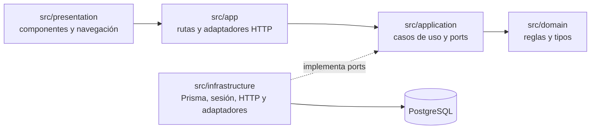
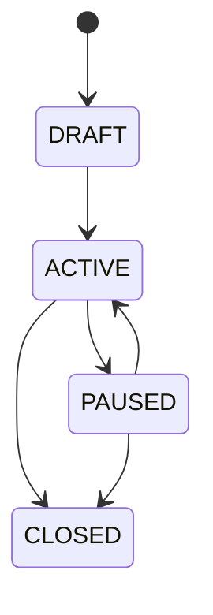
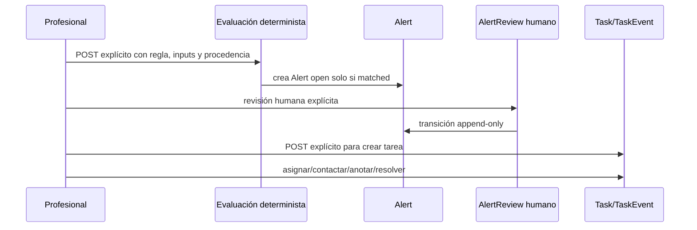

# Guardián Alta Segura 2.0 — estado actual verificado

## Alcance de la auditoría

Auditoría diferencial realizada el 25 de julio de 2026 sobre la rama
`audit/gas2-architecture-delta`, en el commit base `88be7da`. Las conclusiones se
basan en el código, esquema, migraciones, pruebas, CI y documentación presentes en
el repositorio. No acreditan validación clínica, jurídica, institucional, RGPD o
MDR.

Esta rama no cambia comportamiento de producción, no modifica Prisma, no añade
dependencias y no crea una arquitectura paralela. El cambio previo no relacionado
en `next-env.d.ts` estaba presente antes de esta auditoría y queda fuera de su
alcance.

## Stack real

| Área | Implementación verificada |
|---|---|
| Runtime web | Next.js 16.2.10 App Router, React 19.2.7 |
| Lenguaje | TypeScript 5.9.3 estricto, con `noUncheckedIndexedAccess` y `exactOptionalPropertyTypes` |
| Persistencia | PostgreSQL, Prisma 6.19.0, 11 migraciones aplicadas |
| Pruebas | Vitest unitario e integración; Playwright E2E |
| Calidad | Prettier, ESLint, TypeScript, build Next.js y trazabilidad REQ-01 a REQ-14 |
| CI | GitHub Actions con PostgreSQL 16, instalación congelada, migraciones, seed sintético, calidad, pruebas, build y E2E |
| Identidad | Proveedor demo local detrás de `DemoIdentityProvider`; contrato institucional sin implementación |
| Operación | Demo loopback, cookies HttpOnly, CSRF por origen, correlation ID, errores y logs sanitizados |

No existe un directorio `app/` raíz; el App Router está en `src/app`. Tampoco
existen backend separado, microservicios, FHIR, conectores productivos, mensajería
real, scheduler, IA generativa o ML.

## Arquitectura actual

El repositorio ya aplica una arquitectura por capas dentro de un monolito modular:

Las reglas de autorización, transición y validación relevantes residen en dominio
o aplicación. Las rutas vuelven a validar sesión, rol activo y pertenencia al
episodio. Los unit of work Prisma agrupan mutación, historia y auditoría.

## Contextos y responsabilidades existentes

| Contexto | Código principal | Responsabilidad real |
|---|---|---|
| Identidad y RBAC | `src/domain/auth`, `src/application/auth`, `src/application/admin`, `src/infrastructure/auth` | Sesión demo, roles, denegación por defecto y asignación auditada |
| Autorización legal | `src/domain/legal`, `src/application/legal` | Políticas versionadas, registros específicos, decisión fail-closed y revocación append-only |
| Episodio | `src/domain/episode`, `src/application/episode` | Alta sintética, responsables, estado, versión, timeline e idempotencia |
| Plan de Seguridad | `src/domain/safety-plan`, `src/application/safety-plan` | Documento por episodio, versiones N+1, estados y visibilidad por audiencia |
| Check-in | `src/domain/check-in`, `src/application/check-in` | Protocolo versionado, asignaciones, respuestas y no respuesta terminal |
| Avisos explicables | `src/domain/alerts`, `src/application/alerts` | DSL determinista, aprobación/activación, evaluación reproducible, procedencia y revisión humana |
| Cola y tareas | `src/domain/workqueue`, `src/application/workqueue` | Proyección profesional, tarea manual y eventos humanos concurrentes |
| Cuidador | `src/domain/caregiver`, `src/application/caregiver` | Invitación local, scope por episodio, sesión independiente, revocación y observación |
| Domicilio Seguro | `src/domain/home-safety`, `src/application/home-safety` | Registro informativo versionado con procedencia y marca de revisión humana |
| SBAR | `src/application/sbar`, `src/infrastructure/persistence/prisma-sbar-preview.ts` | Preview determinista, minimizado y no firmado |
| Auditoría | `src/domain/audit` y escrituras desde los unit of work | `AuditEvent` técnico minimizado, además de historias de dominio y auditoría específica de cuidador |

Los nombres anteriores son contextos funcionales observados, no bounded contexts
formalmente aislados por paquetes o despliegues. Comparten una base de datos y un
runtime.

## Modelo y agregados relevantes

### Episodio y continuidad

`DischargeEpisode` ya actúa como raíz de continuidad. Conserva paciente
seudonimizado, fecha, duración explícita, responsables de enfermería y clínico,
estado, versión y versión exacta del protocolo de check-in. Se relaciona con
transiciones, Plan de Seguridad, check-ins, evaluaciones, avisos, tareas, accesos
de cuidador y Domicilio Seguro.

La máquina de estados es:

Las transiciones usan actualización condicional por `expectedVersion`, huella de
petición, idempotencia por actor, `EpisodeTransition` append-only y `AuditEvent` en
la misma transacción. La activación exige verificación humana de identidad bajo
una política versionada.

La gobernanza es parcial: existe `EpisodeClosurePolicy`, pero la ruta está
conectada a `AlertModuleUnavailableClosurePolicy`, que deniega todo cierre. Es un
estado seguro, aunque no integra los avisos y tareas actuales ni resuelve DEC-002.

### Señales, avisos y procedencia

No hay un `SignalRecord` canónico. Sí existen piezas de procedencia:

- `CheckInAssignment`, `CheckInOutcome`, `CheckInResponse` y `CheckInAnswer`
  conservan protocolo, pregunta y tiempo;
- `RuleEvaluation` conserva versión, instante, snapshot estructurado, hash,
  resultado e inputs ausentes;
- `Alert` conserva evaluación, regla/versión, referencias estructuradas de origen,
  explicación, responsable de revisión y tiempo;
- Plan de Seguridad y Domicilio Seguro incluyen procedencia por sección o ítem;
- `CaregiverObservation` conserva autoría indirecta por autorización, perfil y
  sesión, pero no crea avisos o tareas.

Las referencias de una evaluación se entregan explícitamente en la petición. No
hay extracción automática, normalización entre fuentes ni contrato de señal para
conectores.

### Tareas y responsabilidad

`Task` pertenece a un episodio y puede enlazar un `Alert` del mismo episodio.
`TaskEvent` registra creación, asignación, reasignación, intento de contacto, nota
y resolución. La responsabilidad actual se expresa mediante:

- `responsibleNurseId` y `responsibleClinicianId` en el episodio;
- `reviewOwner` en la versión de regla y el aviso;
- `assignedToId`, `createdById` y `resolvedById` en la tarea;
- actor, rol y tiempo en transiciones, revisiones y eventos.

No existe una cadena de responsabilidad formal, suplencia, aceptación de tarea,
equipo, guardia, escalado o SLA.

### Consentimiento y cuidador

El modelo ya separa `PolicyVersion`, registros de participación, permiso de
comunicación, autorización de cuidador, base de tratamiento y
`RevocationEvent`. `LegalAuthorizationService` falla de forma cerrada ante
registro ausente, pendiente, vencido, revocado o política no aprobada.

`CaregiverAuthorizationScope` añade versiones append-only por autorización y
episodio. Cada petición del portal revalida identidad, política, vigencia, última
versión del scope y revocación. La revocación serializa contra accesos, invalida
sesiones y conserva historia.

La implementación sigue limitada al demo sintético y no resuelve las decisiones
institucionales DEC-003, DEC-004, DEC-005 y DEC-013.

## Superficies HTTP existentes

El build expone rutas para:

- sesión demo y asignación administrativa de roles;
- episodios, detalle y transición;
- Plan de Seguridad, Domicilio Seguro y preview SBAR;
- protocolos, asignaciones, respuesta, omisión y vencimiento de check-ins;
- catálogo/versiones de reglas, aprobación, activación, evaluación, avisos y
  revisiones;
- cola de enfermería, creación de tareas y eventos de tarea;
- registros legales, acceso de cuidador, invitación, portal y observaciones;
- healthcheck técnico y recursos demo protegidos.

Son APIs internas del monolito y del demo. No constituyen una API de conectores ni
un contrato institucional.

## Human-in-the-loop verificado

El camino implementado es:

No se encontró un camino `signal → clinical action` sin autorización humana
explícita. En concreto:

- evaluar una regla no crea tareas, comunicaciones, derivaciones, cierres, SBAR o
  firmas;
- revisar un aviso no crea una tarea;
- crear una tarea vinculada exige que el aviso no esté `open` y tenga al menos una
  revisión humana;
- la restricción anterior existe en aplicación y en un trigger PostgreSQL;
- resolver una tarea no resuelve el aviso ni cierra el episodio;
- una observación de cuidador no crea aviso o tarea.

La garantía no es todavía un gate transversal reutilizable. `AlertReview` puede
registrar el estado administrativo `actioned` sin referencia estructurada a la
acción, y una tarea independiente puede crearse sin aviso. Ambos caminos siguen
siendo humanos, pero limitan la evidencia de una cadena uniforme
señal-decisión-acción.

## Concurrencia de la cola de enfermería

| Protección | Implementación verificada |
|---|---|
| Revision control | `Task.revision`, `expectedRevision` y actualización condicional |
| Locking | No hay lock pesimista de tarea; se usa control optimista con unicidad y transacción |
| Idempotencia | Clave única por actor + fingerprint para creación y cada evento |
| Conflicto de asignación | Un evento por `taskId/resultingRevision`; una carrera tiene un ganador |
| Conflicto de resolución | Tarea resuelta es terminal; revisión obsoleta devuelve conflicto |
| Orden | `resultingRevision` define el orden causal por tarea; `occurredAt` aporta tiempo |
| Integridad | Triggers impiden borrar tareas/eventos, mutar origen o cambiar proyección sin evento coincidente |
| Vínculo a aviso | Clave compuesta episodio/aviso y trigger que exige revisión humana previa |

Las pruebas de integración cubren carreras de asignación contra resolución, nota
contra resolución, reasignación contra resolución, creación concurrente
idempotente, rol revocado e inserciones SQL con semántica falsa. Las E2E cubren
doble resolución y creación HTTP concurrente.

No existe orden global entre episodios o módulos, cursor de eventos, inbox/outbox
ni garantía de entrega a sistemas externos.

## Auditoría y observabilidad

`AuditEvent` conserva actor, rol, acción, recurso, resultado, correlation ID y
tiempo, sin copiar contenido clínico. Es append-only por trigger. Los historiales
de episodio, Plan de Seguridad, check-in, aviso y tarea aportan evidencia de
dominio. `CaregiverAccessAudit` registra accesos y denegaciones específicas.

La observabilidad operativa es parcial:

- existe `GET /api/health`;
- los errores y logs técnicos contienen código, componente y correlation ID;
- la cola publica recuentos agregados y antigüedad técnica;
- no existen métricas exportables, trazas distribuidas, SLO, alertas operativas,
  detección de proceso omitido ni un flujo de incidentes.

## Interoperabilidad y conectores

No existe FHIR, HL7, HCE/EHR, LAGUN, Tucuvi, Huma, MeMind, wearable, RPM o
mensajería real. Tampoco hay registro de conectores, outbox o contratos canónicos
de entrada.

Existen seams reutilizables:

- `DemoIdentityProvider` y `InstitutionalIdentityProvider`;
- el adaptador local de invitación de cuidador, que no envía mensajes;
- ports de aplicación y unit of work;
- `SafetyPlanExporter`, que es un contrato no conectado y no una capacidad PDF.

Estos seams demuestran el patrón ports/adapters, pero no deben presentarse como
integraciones implementadas.

## Baseline técnico

| Comprobación | Resultado |
|---|---|
| `pnpm format:check` | PASS |
| `pnpm lint` | PASS |
| `pnpm typecheck` | PASS |
| `pnpm test:unit` | PASS — 25 archivos, 201 pruebas |
| `pnpm test:integration` | PASS — 9 archivos, 55 pruebas |
| `pnpm test:e2e` | PASS — 43 pruebas |
| `pnpm build` | PASS — 18 páginas generadas y rutas dinámicas compiladas |
| `pnpm traceability:check` | PASS — REQ-01 a REQ-14 |
| `pnpm db:migrate:status` | PASS — 11 migraciones; esquema actualizado |

Los mensajes `FORBIDDEN`, `UNAUTHENTICATED`, `CONFLICT` y `NOT_FOUND` observados
en la salida E2E corresponden a casos negativos esperados; la suite terminó sin
fallos.

## Conclusión

Guardián Alta Segura ya contiene un núcleo modular y trazable para continuidad
postalta sintética. GAS 2.0 debe ser una evolución de ese núcleo, no un nuevo
árbol de código ni un segundo modelo de datos. Las brechas prioritarias son
componer la gobernanza del episodio sobre los módulos actuales, normalizar
procedencia sin perder linaje, formalizar autorización humana y responsabilidad,
y añadir SLA/proceso seguro una vez resueltas las decisiones locales.
