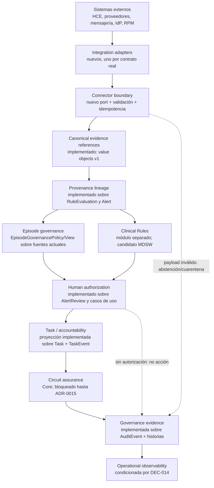
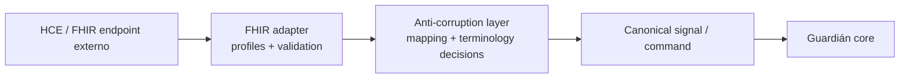

# Guardián Alta Segura 2.0 — arquitectura objetivo incremental

## Decisión arquitectónica

GAS 2.0 evoluciona el monolito modular actual. No se crea `src/guardian2`, una
segunda base de datos, un segundo dominio ni microservicios preventivos. Cada
bloque objetivo se mapea primero a código existente y solo añade un seam cuando
la responsabilidad no está cubierta.

Esta arquitectura queda subordinada a la frontera propuesta en
`docs/system-assurance-boundary.md` y ADR-0015. En particular, no existe todavía
una separación técnica consumada entre Guardián Core y Clinical Rules, y ningún
bloque de reglas o aseguramiento del circuito queda autorizado para implementación
hasta aprobar esa frontera.

## Vista objetivo



Las flechas expresan dependencias de decisión y evidencia, no un pipeline que
obligue a copiar todos los datos entre tablas.

## Mapeo a la arquitectura actual

| Bloque objetivo | Punto de extensión actual | Evolución mínima |
|---|---|---|
| Integration adapters | `src/infrastructure`, `InstitutionalIdentityProvider`, adaptador local de invitación | Adapter por proveedor real; configuración server-only; sin SDK en dominio |
| Connector boundary | `src/application/ports` | Port de ingestión/entrega con autenticidad, idempotencia, versión y resultado; inbox/outbox solo si el contrato lo requiere |
| Canonical signal boundary | Tipos de inputs de reglas y referencias de origen | Implementado para fuentes internas como referencias discriminadas v1; cualquier envelope de ingestión externa sigue aplazado hasta disponer de contrato real |
| Provenance | `RuleEvaluation`, `Alert`, check-ins y procedencia documental | Implementado: lineage fuente → evaluación → aviso sobre IDs y tiempos existentes, con lectura histórica compatible y sin copiar contenido |
| Episode governance | `DischargeEpisode`, `EpisodeTransition`, política de activación, avisos y tareas | Implementado: `EpisodeGovernancePolicy/View` compone responsabilidades, protocolo, autorización técnica, obligaciones y blockers sin persistencia nueva; DEC-002 mantiene cierre denegado |
| Human authorization | `DefaultHumanAuthorizationPolicy`, `ReviewAlertService`, guards de tarea y triggers | Implementado para `CREATE_TASK_FROM_REVIEWED_ALERT`: decisión pura con actor actual, reason codes y referencia minimizada de evidencia |
| Task/accountability | `Task`, `TaskEvent`, `TaskAccountabilityProjection`, `NursingWorkQueue` | Accountability técnica implementada como proyección minimizada y fail-closed del lifecycle, assignment y elegibilidad actual; responsabilidad institucional no validada y condicionada a DEC-017 |
| Circuit assurance (Guardián Core) | Compromiso explícito, responsable, plazo, evidencia y excepción; contrato aún no implementado | Solo tras aprobar ADR-0015: detectar ausencia de constancia como estado organizativo que exige revisión humana; nunca equipararla automáticamente a incumplimiento |
| Clinical Rules | Inputs clínicos definidos, evaluación versionada, resultado explicado y revisión | Extraer tras cualificación y clasificación: no forma parte de la finalidad prevista del Core y no puede iniciar decisiones o acciones clínicas automáticas |
| Governance evidence | `AuditEvent`, historias, gobernanza, provenance, reviews, accountability y correlation ID | Implementado como `EpisodeGovernanceEvidenceView` efímera, minimizada, autorizada y con cobertura explícita |
| Operational observability | Health, logs sanitizados y correlation ID | Métricas sin PHI, SLO/runbooks y salud por conector solo tras DEC-014 y contratos reales |

## Contratos de dominio objetivo

### Episode governance

Debe ser una decisión compuesta, no una entidad paralela:

```text
EpisodeGovernanceView
  episodeId + version + status
  responsible parties
  exact protocol/rule/policy references
  authorization status
  open obligations
  blocking decisions
  evaluatedAt
```

La vista no decide diagnóstico, riesgo, tratamiento o eficacia. Los blockers
derivan de reglas técnicas y configuraciones locales versionadas. Ante política
ausente o pendiente, el resultado es no autorizado.

La implementación actual consulta únicamente IDs, estados, revisiones y
referencias versionadas dentro del `EpisodeUnitOfWork`. Avisos no terminales y
tareas abiertas permanecen en `Alert`/`AlertReview` y `Task`/`TaskEvent`; la vista
no copia explicación, resumen ni contenido clínico. DEC-002 se publica como
`LOCAL_POLICY_PENDING` y no existe un camino de mutación de cierre en esta rama.

### Procedencia canónica interna

`CanonicalProvenanceLineageV1` distingue evidencia `SOURCE` y `DERIVED`, conserva
referencias técnicas, episodio, productor, tiempos, actores y versiones realmente
disponibles y rechaza episodio, versión o tipo incoherentes. Los mappers actuales
cubren respuesta/no respuesta de check-in, observación de cuidador, Plan de
Seguridad y Domicilio Seguro. `RuleEvaluation` y `Alert` añaden derivación,
regla/versión e integridad sin duplicar `inputSnapshot`.

`Alert.inputReferences` conserva el array exigido por el esquema aplicado y guarda
un lineage v1 como único elemento para avisos nuevos. Los registros antiguos se
leen como no versionados y los formatos desconocidos fallan de forma cerrada.

### Canonical signal externo condicionado

Un futuro contrato de ingestión externa, solo tras seleccionar un conector real,
deberá distinguir al menos:

```text
CanonicalSignalEnvelope
  signalId
  episodeId
  signalType + schemaVersion
  source { organization, system, connector, externalReference }
  observedAt + receivedAt
  payloadReference or minimized structured payload
  authorizationReference
  integrity/idempotency metadata
```

No debe contener una interpretación clínica inferida. El adapter conserva el
recurso original por referencia cuando sea posible y traduce solo campos
aprobados.

### Human authorization

La autorización humana reutilizable implementada demuestra:

- actor autenticado y rol activo;
- pertenencia o responsabilidad sobre el episodio;
- objeto y versión revisados;
- decisión explícita y tiempo;
- motivo cuando el lifecycle lo exige;
- acción permitida y vínculo con la evidencia;
- ausencia de ejecución automática si falta cualquiera de los anteriores.

`AlertReview` sigue siendo la historia del aviso. La policy no copia sus filas ni
persiste una decisión: proyecta IDs, `reviewedAt`, referencia real de
`RuleVersion`, actor actual y reason codes. `Alert` no tiene versión propia. El rol
histórico no está ligado de forma inequívoca a cada review y se declara
`HISTORICAL_REVIEWER_ROLE_NOT_PERSISTED`; nunca se sustituye por el rol actual.

El único caso protegido en este alcance es la creación explícita de tarea desde
aviso revisado. Una tarea sin aviso sigue siendo iniciación humana directa. El
estado `actioned` es administrativo y no prueba la existencia de `Task` o
`TaskEvent`.

### Accountability técnica implementada; responsabilidad institucional pendiente

`Task` y `TaskEvent` siguen siendo la fuente de verdad. La proyección actual
separa creator, assignee, event actor, resolver y responsables del episodio;
reconstruye assignment/reassignment por `resultingRevision`, marca cadenas
incoherentes y verifica la elegibilidad técnica actual sin copiar notas o
contenido clínico. La revocación posterior no reescribe historia ni dispara
reasignación. Assignment no implica acceptance ni autoridad exclusiva.

`TECHNICAL TASK ACCOUNTABILITY = implemented`.
`INSTITUTIONAL RESPONSIBILITY / ACCOUNTABILITY POLICY = not validated,
conditioned on DEC-017`. La proyección no determina quién debería actuar ni
modela equipo, turno, suplencia o acceptance.

Una evolución posterior puede añadir configuración versionada de prioridad
administrativa, tiempos objetivo y escalado. Los valores no se codifican antes de
DEC-017.

La expiración o infracción de SLA:

1. se detecta de forma determinista;
2. produce un hallazgo organizativo explicable;
3. puede proponer o crear una tarea administrativa según política aprobada;
4. nunca deriva, trata, contacta o modifica el episodio automáticamente.

## FHIR como anti-corruption layer condicional y de solo lectura

FHIR no forma parte del dominio ni del MVP actual. Si un contrato institucional lo
exige, [ADR-0018](../adr/0018-future-read-only-fhir-boundary.md) limita el punto de
partida a una importación futura de solo lectura:



Condiciones:

- perfiles y versión FHIR institucionales explícitos;
- operaciones, scopes, identidad y consentimiento definidos;
- validación y manejo de extensiones;
- mapping reversible o con pérdida documentada;
- idempotencia y provenance;
- pruebas de contrato sintéticas;
- ninguna exposición de recursos FHIR como modelos internos Prisma.

No se construye un servidor FHIR completo, SMART on FHIR, OAuth, CDS Hooks,
subscriptions, writeback, Bulk Data ni una integración productiva. Los recursos
externos no mutan el dominio y toda reconciliación requiere revisión humana; una
fase posterior necesitaría requisito y autorización separados.

## Seguridad y fallo seguro

- Los secretos de conectores permanecen server-side.
- Autorización deny-by-default antes de leer o actuar.
- Payload inválido, versión desconocida o autorización ausente produce rechazo,
  abstención o cuarentena; nunca un valor inferido.
- Auditoría técnica no copia payload clínico.
- Reintentos usan idempotencia y fingerprint.
- La indisponibilidad de un conector no permite saltar revisión humana.
- La observabilidad separa métricas técnicas de contenido clínico.
- Todos los datos de desarrollo, contrato y demostración siguen siendo sintéticos.

## Despliegue

No hay evidencia que justifique separar servicios. El objetivo permanece en el
monolito modular:

- menor superficie operativa y de secretos;
- transacciones locales para historia y auditoría;
- tests de contrato por módulo;
- extracción futura solo si carga, propiedad de equipo, disponibilidad o
  aislamiento regulatorio lo exigen con datos medidos.

Un connector worker u outbox podría ser un proceso separado en el futuro, pero no
se decide en esta auditoría.

## Invariantes

1. Ninguna señal produce actuación clínica sin persona autorizada.
2. Ninguna revocación borra historia.
3. Ningún documento versionado sobrescribe su versión anterior.
4. Ningún adapter externo se convierte en fuente de verdad del episodio.
5. Ninguna ausencia de datos se rellena mediante inferencia generativa.
6. Ningún SLA o escalado se presenta como riesgo clínico.
7. Ningún log, métrica o ticket contiene PHI/PII o texto clínico.
8. Ningún proveedor potencial se implementa sin contrato real.
