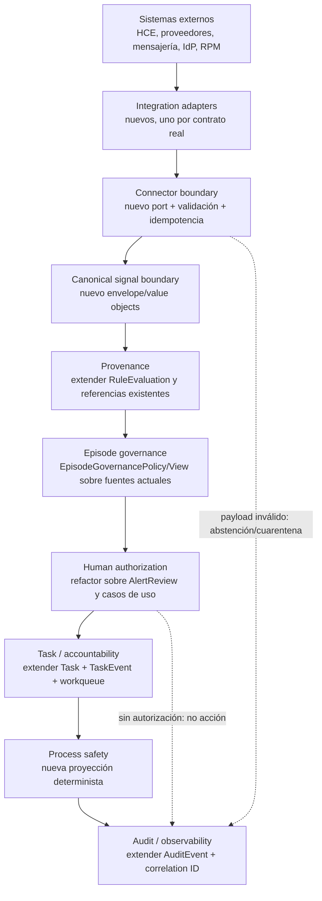
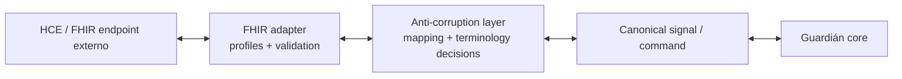

# Guardián Alta Segura 2.0 — arquitectura objetivo incremental

## Decisión arquitectónica

GAS 2.0 evoluciona el monolito modular actual. No se crea `src/guardian2`, una
segunda base de datos, un segundo dominio ni microservicios preventivos. Cada
bloque objetivo se mapea primero a código existente y solo añade un seam cuando
la responsabilidad no está cubierta.

## Vista objetivo



Las flechas expresan dependencias de decisión y evidencia, no un pipeline que
obligue a copiar todos los datos entre tablas.

## Mapeo a la arquitectura actual

| Bloque objetivo | Punto de extensión actual | Evolución mínima |
|---|---|---|
| Integration adapters | `src/infrastructure`, `InstitutionalIdentityProvider`, adaptador local de invitación | Adapter por proveedor real; configuración server-only; sin SDK en dominio |
| Connector boundary | `src/application/ports` | Port de ingestión/entrega con autenticidad, idempotencia, versión y resultado; inbox/outbox solo si el contrato lo requiere |
| Canonical signal boundary | Tipos de inputs de reglas y referencias de origen | Envelope discriminado y versionado; no crear una copia genérica de todos los datos |
| Provenance | `RuleEvaluation`, `Alert`, check-ins y procedencia documental | Resolver linaje fuente → señal → evaluación → aviso sin perder IDs y tiempos |
| Episode governance | `DischargeEpisode`, `EpisodeTransition`, política de activación, avisos y tareas | Implementado: `EpisodeGovernancePolicy/View` compone responsabilidades, protocolo, autorización técnica, obligaciones y blockers sin persistencia nueva; DEC-002 mantiene cierre denegado |
| Human authorization | `AlertReviewService`, guards de tarea y triggers | Política explícita de autorización con actor, rol, decisión, motivo y referencia de evidencia |
| Task/accountability | `Task`, `TaskEvent`, `NursingWorkQueue` | Añadir lifecycle y responsabilidad; SLA solo desde configuración aprobada |
| Process safety | Ventanas/outcomes, avisos, tareas y timestamps | Proyección determinista de pasos vencidos/omitidos que propone trabajo humano |
| Audit/observability | `AuditEvent`, historias, `CaregiverAccessAudit`, correlation ID y health | Vistas de evidencia, métricas sin PHI, SLO/runbooks y salud por conector |

## Contratos de dominio objetivo

### Episode governance

Debe ser una decisión compuesta, no una entidad paralela:

```text
EpisodeGovernanceView
  episodeId + version + status
  responsible parties
  exact protocol/rule/policy references
  authorization status
  open obligations
  blocking decisions
  evaluatedAt
```

La vista no decide diagnóstico, riesgo, tratamiento o eficacia. Los blockers
derivan de reglas técnicas y configuraciones locales versionadas. Ante política
ausente o pendiente, el resultado es no autorizado.

La implementación actual consulta únicamente IDs, estados, revisiones y
referencias versionadas dentro del `EpisodeUnitOfWork`. Avisos no terminales y
tareas abiertas permanecen en `Alert`/`AlertReview` y `Task`/`TaskEvent`; la vista
no copia explicación, resumen ni contenido clínico. DEC-002 se publica como
`LOCAL_POLICY_PENDING` y no existe un camino de mutación de cierre en esta rama.

### Canonical signal

El contrato canónico debe distinguir al menos:

```text
CanonicalSignalEnvelope
  signalId
  episodeId
  signalType + schemaVersion
  source { organization, system, connector, externalReference }
  observedAt + receivedAt
  payloadReference or minimized structured payload
  authorizationReference
  integrity/idempotency metadata
```

No debe contener una interpretación clínica inferida. El adapter conserva el
recurso original por referencia cuando sea posible y traduce solo campos
aprobados.

### Human authorization

Una autorización humana reutilizable debe demostrar:

- actor autenticado y rol activo;
- pertenencia o responsabilidad sobre el episodio;
- objeto y versión revisados;
- decisión explícita y tiempo;
- motivo cuando el lifecycle lo exige;
- acción permitida y vínculo con la evidencia;
- ausencia de ejecución automática si falta cualquiera de los anteriores.

`AlertReview` sigue siendo la historia del aviso. El nuevo contrato no debe copiar
sus filas; debe permitir que los casos de uso verifiquen su evidencia.

### Accountability y SLA

`Task` y `TaskEvent` siguen siendo la fuente de verdad. Una evolución puede añadir
configuración versionada de lifecycle, prioridad administrativa, tiempos objetivo
y escalado. Los valores no se codifican antes de DEC-017.

La expiración o infracción de SLA:

1. se detecta de forma determinista;
2. produce un hallazgo organizativo explicable;
3. puede proponer o crear una tarea administrativa según política aprobada;
4. nunca deriva, trata, contacta o modifica el episodio automáticamente.

## FHIR como anti-corruption layer condicional

FHIR no forma parte del dominio ni del MVP actual. Si un contrato institucional lo
exige, la posición correcta es:



Condiciones:

- perfiles y versión FHIR institucionales explícitos;
- operaciones, scopes, identidad y consentimiento definidos;
- validación y manejo de extensiones;
- mapping reversible o con pérdida documentada;
- idempotencia y provenance;
- pruebas de contrato sintéticas;
- ninguna exposición de recursos FHIR como modelos internos Prisma.

No se construye un servidor FHIR completo, SMART on FHIR, CDS Hooks ni una
integración productiva sin requisito y autorización separados.

## Seguridad y fallo seguro

- Los secretos de conectores permanecen server-side.
- Autorización deny-by-default antes de leer o actuar.
- Payload inválido, versión desconocida o autorización ausente produce rechazo,
  abstención o cuarentena; nunca un valor inferido.
- Auditoría técnica no copia payload clínico.
- Reintentos usan idempotencia y fingerprint.
- La indisponibilidad de un conector no permite saltar revisión humana.
- La observabilidad separa métricas técnicas de contenido clínico.
- Todos los datos de desarrollo, contrato y demostración siguen siendo sintéticos.

## Despliegue

No hay evidencia que justifique separar servicios. El objetivo permanece en el
monolito modular:

- menor superficie operativa y de secretos;
- transacciones locales para historia y auditoría;
- tests de contrato por módulo;
- extracción futura solo si carga, propiedad de equipo, disponibilidad o
  aislamiento regulatorio lo exigen con datos medidos.

Un connector worker u outbox podría ser un proceso separado en el futuro, pero no
se decide en esta auditoría.

## Invariantes

1. Ninguna señal produce actuación clínica sin persona autorizada.
2. Ninguna revocación borra historia.
3. Ningún documento versionado sobrescribe su versión anterior.
4. Ningún adapter externo se convierte en fuente de verdad del episodio.
5. Ninguna ausencia de datos se rellena mediante inferencia generativa.
6. Ningún SLA o escalado se presenta como riesgo clínico.
7. Ningún log, métrica o ticket contiene PHI/PII o texto clínico.
8. Ningún proveedor potencial se implementa sin contrato real.
