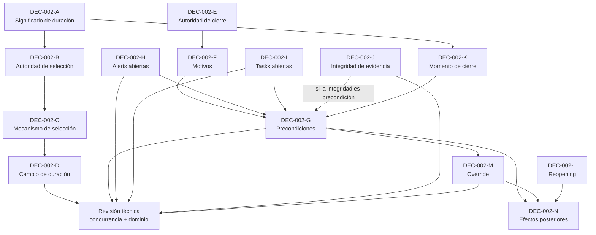

# DEC-002 — Paquete institucional de decisión sobre duración y cierre del episodio

## Control del documento

| Campo | Valor |
|---|---|
| Tipo | `DECISION SUPPORT EVIDENCE` |
| Decisión canónica | `DEC-002` |
| Requisito principal | `REQ-01` |
| Decision pack document status | `FINAL` — no canónico |
| Canonical DEC-002 status | `Pendiente` |
| Current gate | `READY_FOR_INSTITUTIONAL_DECISION` |
| Autoridad primaria registrada | Dirección Médica |
| Evidencia técnica inspeccionada | Repositorio en `2b88dbd` |
| Alcance | Significado y selección de duración; cambio de duración; autoridad, motivos, condiciones, obligaciones abiertas, tiempo, reapertura, override y efectos del cierre |
| No constituye | Decisión institucional, aprobación clínica, jurídica, TI, RGPD o MDR; autorización de piloto o de implementación |

Este paquete organiza hechos técnicos, preguntas, opciones neutrales y evidencia
para que Dirección Médica pueda resolver DEC-002. No selecciona una duración,
autoridad, motivo o regla de cierre y no cambia el comportamiento de Guardián Alta
Segura.

`DEC-002-A` a `DEC-002-N` son identificadores internos de trabajo dentro de la
decisión canónica DEC-002. No son decisiones canónicas independientes salvo
promoción formal futura en `docs/decision-register.md`.

## 1. Principio y vocabulario

El software no define cuándo ha terminado la atención.

| Concepto | Significado en este paquete | No equivale a |
|---|---|---|
| `PROGRAM LENGTH` | Valor técnico explícito almacenado en `programLengthDays` | Pronóstico, recuperación o fecha de cierre |
| `EXPECTED FOLLOW-UP WINDOW` | Ventana de seguimiento que la institución podría definir | Duración clínica necesaria o cierre automático |
| `EPISODE CLOSURE ELIGIBILITY` | Resultado futuro de aplicar invariantes técnicos y política institucional versionada | Mutación, alta clínica o seguridad clínica |
| `ACTUAL CLOSURE EVENT` | Mutación humana autorizada y auditada de `ACTIVE/PAUSED` a `CLOSED` | Elegibilidad por sí sola |
| `CLINICAL DISCHARGE` | Decisión clínica ajena a esta máquina de estado | Estado técnico `CLOSED` |
| `RECOVERY` | Concepto clínico no inferido por Guardián | Fin de programa o ausencia de avisos |
| `SUCCESSFUL OUTCOME` | Resultado que requeriría definición y evidencia clínica propias | Tarea resuelta o episodio cerrado |

En este paquete, «cierre del episodio» significa únicamente el posible evento
técnico `DischargeEpisode → CLOSED`. No se usa «alta» como sinónimo.

## 2. Evidencia inspeccionada

Se inspeccionaron README, workflow, autorización, registro de decisiones,
arquitectura GAS 2.0, trazabilidad Markdown/CSV y ADR-0004, ADR-0012, ADR-0013 y
ADR-0014. También se revisaron:

- `DischargeEpisode`, `EpisodeTransition` y su esquema Prisma;
- `EpisodeGovernancePolicy` y
  `PendingInstitutionalEpisodeGovernancePolicy`;
- `GetEpisodeGovernanceViewService` y
  `TransitionDischargeEpisodeService`;
- `EpisodeUnitOfWork` y `PrismaEpisodeUnitOfWork`;
- `Alert`, `AlertReview`, `Task`, `TaskEvent` y
  `TaskAccountabilityProjection`;
- `EpisodeGovernanceEvidenceView`, su servicio y reader Prisma;
- pruebas unitarias, integración y E2E del episodio y de evidencia.

No se ha usado documentación externa para atribuir significado clínico a los
valores existentes.

## 3. Baseline técnico real

### 3.1. Episodio y duración

| Elemento | Estado actual verificado |
|---|---|
| Estados persistidos | `DRAFT`, `ACTIVE`, `PAUSED`, `CLOSED` |
| Transiciones legales | `DRAFT → ACTIVE`; `ACTIVE → PAUSED|CLOSED`; `PAUSED → ACTIVE|CLOSED` |
| Terminalidad | `CLOSED` no tiene transición de salida |
| Duraciones admitidas | `30`, `60`, `90` días |
| Selección actual | El actor profesional envía `programLengthDays` explícitamente al crear el borrador |
| Valor por defecto en dominio/aplicación | No existe; un valor distinto de 30/60/90 se rechaza |
| Inferencia | No se usa diagnóstico, riesgo, eficacia, ML o IA para elegir duración |
| Persistencia | `programLengthDays` se almacena en `DischargeEpisode`; no existe historial de cambios de duración |
| Cambio posterior | No existe caso de uso, transición ni evento para modificar `programLengthDays` |
| Fecha prevista | No existe `scheduledEndDate`; el código no calcula ni ejecuta cierre por fecha |

La existencia técnica de 30/60/90 no aporta una justificación clínica,
administrativa o de seguimiento. Esa semántica es precisamente parte de DEC-002.

### 3.2. Contrato técnico actual de transición

Toda petición de transición exige:

- actor con rol técnico `nurse` o `clinician`;
- pertenencia actual como responsable del episodio;
- `targetStatus`;
- `expectedVersion` entero positivo;
- `Idempotency-Key` válida;
- fingerprint SHA-256 del episodio, target, versión esperada y motivo;
- motivo obligatorio de 1–500 caracteres para intentar `CLOSED`.

Las transiciones confirmadas incrementan `DischargeEpisode.version`, crean un
`EpisodeTransition` append-only y un `AuditEvent` minimizado dentro de la misma
transacción. La unicidad por actor/idempotency key y por
episodio/resultingVersion evita duplicados silenciosos.

El motivo obligatorio es una validación de forma, no un catálogo institucional de
motivos admisibles. `closedReason`, `closedById` y `closedAt` existen en el esquema,
pero el servicio actual no alcanza esa mutación para `CLOSED`.

### 3.3. Avisos y tareas como obligaciones visibles

| Contexto | Estados actuales | Estados incluidos en `openObligations` |
|---|---|---|
| `Alert` | `open`, `reviewed`, `actioned`, `resolved`, `dismissed-with-reason` | `open`, `reviewed`, `actioned` |
| `Task` | `open`, `resolved` | Solo `open`, con su `revision` |

El código actual considera terminales para la consulta de gobernanza los avisos
`resolved` y `dismissed-with-reason`. Esta clasificación técnica no decide qué
estados son institucionalmente compatibles con el cierre.

Distinciones obligatorias:

```text
Alert reviewed
≠ Alert actioned
≠ Alert resolved
≠ Alert dismissed-with-reason
≠ Episode safe to close

Task open
≠ obligación clínica necesariamente incumplida

Task resolved
≠ Alert resolved
≠ Episode eligible to close
```

### 3.4. Blockers actuales

`PendingInstitutionalEpisodeGovernancePolicy` puede devolver:

| Código | Categoría | Hecho representado |
|---|---|---|
| `DEC_002_EPISODE_CLOSURE_POLICY_PENDING` | `LOCAL_POLICY_PENDING` | Falta la decisión institucional canónica |
| `UNRESOLVED_ALERTS` | `TECHNICAL_OR_OPERATIONAL_BLOCKER` | Existen avisos en estado técnico no terminal |
| `OPEN_TASKS` | `TECHNICAL_OR_OPERATIONAL_BLOCKER` | Existen tareas `open` |
| `RESPONSIBLE_NURSE_INACTIVE` | `TECHNICAL_OR_OPERATIONAL_BLOCKER` | Responsable técnico sin usuario/rol activo requerido |
| `RESPONSIBLE_CLINICIAN_INACTIVE` | `TECHNICAL_OR_OPERATIONAL_BLOCKER` | Responsable técnico sin usuario/rol activo requerido |
| `REQUIRED_CHECK_IN_PROTOCOL_UNAVAILABLE` | `TECHNICAL_OR_OPERATIONAL_BLOCKER` | Falta o no coincide la versión técnica requerida del protocolo |
| `IDENTITY_ACTIVATION_EVIDENCE_INCONSISTENT` | `TECHNICAL_OR_OPERATIONAL_BLOCKER` | Episodio no borrador sin evidencia técnica coherente de activación |
| `GOVERNANCE_POLICY_UNAVAILABLE` | `TECHNICAL_OR_OPERATIONAL_BLOCKER` | No se inyectó policy |
| `GOVERNANCE_EVALUATION_FAILED` | `TECHNICAL_OR_OPERATIONAL_BLOCKER` | La evaluación lanzó una excepción |
| `GOVERNANCE_STATE_INCONSISTENT` | `TECHNICAL_OR_OPERATIONAL_BLOCKER` | La vista contradice episodio, versión, estado o contrato de autorización |

Estos códigos explican condiciones técnicas u organizativas visibles. No son
diagnósticos, pronósticos ni una política clínica aprobada.

### 3.5. Comportamiento fail-closed actual

| Situación | Resultado actual |
|---|---|
| DEC-002 pendiente | Se incluye `DEC_002_EPISODE_CLOSURE_POLICY_PENDING`; `CLOSED` permanece `NOT_AUTHORIZED` |
| Policy ausente | Se añaden `GOVERNANCE_POLICY_UNAVAILABLE` y el blocker DEC-002 |
| Policy lanza error | Se añaden `GOVERNANCE_EVALUATION_FAILED` y el blocker DEC-002; no se expone el detalle de la excepción |
| Vista contradice episodio/versión/estado/target o declara autorización incompatible | Se sustituye por vista fail-closed con `GOVERNANCE_STATE_INCONSISTENT` |
| Policy permisiva inyectada | El servicio vuelve a añadir el blocker DEC-002 y lanza `EpisodeClosureBlockedError` |
| Aviso no terminal | Se publica como obligación y aparece `UNRESOLVED_ALERTS` |
| Tarea abierta | Se publica como obligación y aparece `OPEN_TASKS` |
| Motivo ausente | La petición se rechaza antes de evaluar la policy |
| Versión obsoleta | Se produce conflicto optimista antes de evaluar cierre |

`TransitionDischargeEpisodeService` lanza siempre
`EpisodeClosureBlockedError` en la rama `targetStatus === CLOSED`; no llama a
`updateEpisodeStatus`. Por tanto no crea transición, auditoría ni cambio de estado
de cierre.

### 3.6. Evidencia de gobernanza

`EpisodeGovernanceEvidenceView` es una proyección read-only y no persistida que
compone referencias de episodio/timeline, gobernanza, procedencia, reviews,
accountability y auditoría. Su reader usa una transacción PostgreSQL
`REPEATABLE READ`, limita cada colección a 100 referencias y declara
truncamiento.

| Estado | Significado exclusivo |
|---|---|
| `COMPLETE` | Referencias persistidas esperadas presentes y coherentes para el workflow soportado |
| `PARTIAL` | Evidencia coherente, pero existe truncamiento, procedencia legacy o evidencia no persistida por diseño |
| `INCONSISTENT` | Contradicción técnica conocida entre referencias persistidas o invariantes estructurales |
| `NOT_APPLICABLE` | La categoría no es necesaria para ese workflow |
| `UNAVAILABLE` | La evidencia no se persiste o no puede proyectarse |

```text
COMPLETE ≠ SAFE TO CLOSE
PARTIAL ≠ UNSAFE
UNAVAILABLE ≠ AUTOMATIC CLINICAL DENIAL
INCONSISTENT → NON_OVERRIDABLE_TECHNICAL_FAIL_CLOSED
```

### 3.6.1. Technical integrity invariant vs institutional closure policy

`INCONSISTENT` no es una opción clínica ni una categoría que Dirección Médica
pueda declarar directamente compatible con cierre. Es una contradicción técnica
conocida y, para una futura especificación, produce
`NON_OVERRIDABLE_TECHNICAL_FAIL_CLOSED`.

No admite override clínico, incluido DEC-002-M. El cierre solo puede volver a
evaluarse después de que una revisión arquitectónica formal identifique y corrija
la inconsistencia y se construya una nueva vista coherente.

Dirección Médica sí puede definir el tratamiento institucional de `COMPLETE`,
`PARTIAL`, `UNAVAILABLE` y `NOT_APPLICABLE`, sin convertir ninguno en
`SAFE/UNSAFE` ni permiso automático. La indisponibilidad puede exigir un workflow
humano o técnico aprobado, pero no equivale por sí sola a denegación clínica.

## 4. Descomposición de DEC-002

### DEC-002-A — Program length options

Dirección Médica debe definir qué significa cada valor 30/60/90, si es una ventana
administrativa, clínica o de seguimiento, si los valores son excluyentes, si
podrían existir otros y si el alcance varía por servicio, protocolo o población.
El repositorio solo acredita que esos tres valores son aceptados.

### DEC-002-B — Length selection authority

Debe decidirse quién selecciona duración y con qué autoridad operativa: médico,
enfermería, equipo, protocolo u otro mecanismo aprobado. Dirección Médica
conserva la autoridad canónica de DEC-002; el rol técnico que hoy envía el campo
no resuelve la autoridad institucional.

### DEC-002-C — Length selection semantics

Opciones neutrales: selección manual explícita, selección determinista derivada
de protocolo u otro mecanismo institucional aprobado. Cualquier mecanismo debe
prohibir inferencia diagnóstica, ML, risk score, predicción, LLM o pronóstico
automático. No se selecciona ninguna opción.

### DEC-002-D — Length change after activation

Debe decidirse si puede cambiar 30→60→90 o en sentido inverso; quién lo solicita y
autoriza; motivo, versión e historia requeridos; impacto sobre fechas; y reglas de
ampliación/reducción. El modelo actual no soporta cambio ni historia.

### DEC-002-E — Closure authority

Debe distinguirse quién puede solicitar, autorizar y ejecutar cierre; si pueden
ser la misma persona; si intervienen responsable clínico, equipo, doble
validación u otro mecanismo; y cómo se mapea después a roles institucionales. No
se asume que `nurse` o `clinician` sean la autoridad final.

### DEC-002-F — Closure reasons

Dirección Médica debe aprobar motivos, definiciones, evidencia mínima, scope,
versionado y tratamiento histórico. Etiquetas como `REASON_PLACEHOLDER_A`,
`REASON_PLACEHOLDER_B` y `CUSTOM_OPTION` son neutrales y no constituyen un
catálogo.

### DEC-002-G — Minimum closure preconditions

Debe separar:

- invariantes técnicos: versión coherente, actor técnicamente autorizado,
  gobernanza evaluable y obligaciones conocidas;
- reglas institucionales: qué bloquea, qué genera warning, qué exige
  documentación y qué admite override humano.

Los invariantes actuales no deben convertirse automáticamente en política
clínica.

### DEC-002-H — Open alerts

Debe decidirse qué estados de `Alert` son compatibles con cierre. Opciones
neutrales incluyen:

- no cerrar mientras exista cualquier aviso no terminal;
- permitir determinados estados/categorías solo con documentación adicional;
- otro mecanismo institucional aprobado.

`reviewed`, `actioned`, `resolved` y `dismissed-with-reason` no son equivalentes
entre sí ni acreditan resolución clínica.

### DEC-002-I — Open tasks

Debe decidirse si una tarea abierta bloquea, si todas bloquean, si depende de
categorías futuras, assignment o elegibilidad del assignee, y si una tarea puede
transferirse antes o después del cierre. Si una futura regla depende de
`OVERDUE`, prioridad, SLA o escalado, queda condicionada también por DEC-017.

### DEC-002-J — Closure with partial evidence

La policy institucional puede decidir cómo tratar `COMPLETE`, `PARTIAL`,
`UNAVAILABLE` y `NOT_APPLICABLE` y si requieren revisión o documentación
adicional. No puede seleccionar `INCONSISTENT` como cierre permitido:
`INCONSISTENT → NON_OVERRIDABLE_TECHNICAL_FAIL_CLOSED` hasta corrección
arquitectónica formal y nueva evaluación coherente.

### DEC-002-K — Closure time

Debe decidirse si el final de `programLengthDays` solo informa, abre una ventana
de revisión o permite solicitar cierre manual; y qué fecha/zone se usa. Está
prohibido un cron que cierre el episodio por días transcurridos.

### DEC-002-L — Reopening

El código actual hace `CLOSED` terminal. Debe decidirse si continúa terminal, si
se permite reapertura, si se crea un episodio nuevo, qué ocurre ante un evento
posterior y quién autoriza. No se implementa ninguna opción.

### DEC-002-M — Exception / override

Debe decidirse si puede existir override con obligaciones abiertas, qué actor
solicita y aprueba, motivo/evidencia, alcance, caducidad y versionado. No existe
override actual ni default.

### DEC-002-N — Post-closure effects

Debe decidirse qué queda read-only y qué ocurre con Tasks, Alerts, acceso del
cuidador, check-ins futuros, SBAR, evidencia y auditoría. Cerrar nunca implica
borrar; retención, archivo, exportación y derechos siguen gobernados por DEC-005.

## 5. Grafo de dependencias



Las líneas discontinuas representan dependencia institucional condicional. El
grafo no autoriza implementación.

## 6. Minimum blocking decision set

| ID | Clasificación | Decisión mínima para el alcance |
|---|---|---|
| DEC-002-A | `BLOCKING_FOR_DURATION` | Significado y scope de 30/60/90 |
| DEC-002-B | `BLOCKING_FOR_DURATION` | Autoridad de selección |
| DEC-002-C | `BLOCKING_FOR_DURATION` | Mecanismo permitido y prohibiciones |
| DEC-002-D | `CONDITIONAL_BLOCKER` | `CAN_DEFER` solo si el alcance aprobado hace duración inmutable tras crear; si permite cambio, debe resolver historia, autoridad y concurrencia |
| DEC-002-E | `BLOCKING_FOR_CLOSURE` | Solicitud, autorización y ejecución humana |
| DEC-002-F | `BLOCKING_FOR_CLOSURE` | Motivos admisibles y evidencia |
| DEC-002-G | `BLOCKING_FOR_CLOSURE` | Invariantes, blockers, warnings y precondiciones |
| DEC-002-H | `BLOCKING_FOR_CLOSURE` | Compatibilidad de cada estado/categoría de aviso |
| DEC-002-I | `BLOCKING_FOR_CLOSURE` | Compatibilidad y tratamiento de tareas abiertas |
| DEC-002-J | `CONDITIONAL_BLOCKER` para policy institucional; `TECHNICAL_INTEGRITY_INVARIANT` para `INCONSISTENT` | El tratamiento de `COMPLETE/PARTIAL/UNAVAILABLE/NOT_APPLICABLE` bloquea si el scope usa integridad como regla; `INCONSISTENT` siempre es fail-closed técnico no overrideable |
| DEC-002-K | `BLOCKING_FOR_CLOSURE` | Relación entre duración, revisión y evento manual |
| DEC-002-L | `BLOCKING_FOR_REOPENING` | Puede ser `CAN_DEFER` si el alcance aprobado declara `CLOSED` terminal y no implementa reapertura |
| DEC-002-M | `BLOCKING_FOR_OVERRIDE` | Puede ser `CAN_DEFER` si el alcance aprobado prohíbe override |
| DEC-002-N | `BLOCKING_FOR_CLOSURE` | Efectos mínimos sobre módulos, historia y acceso |

Para una futura especificación de cierre, el mínimo es E, F, G, H, I, K y N. A,
B y C son además necesarios para resolver la duración. D, J, L y M solo pueden
aplazarse mediante una exclusión explícita y no contradictoria del alcance
aprobado.

## 7. Riesgo TOCTOU y frontera atómica futura

El flujo hipotético inseguro es:

```text
governance evaluated
→ concurrent Alert/Task created or changed
→ Episode closed using stale governance
```

`expectedVersion` protege la versión del episodio, pero una mutación concurrente
de `Alert` o `Task` no incrementa esa versión. `PrismaEpisodeUnitOfWork` agrupa la
lectura y la mutación del episodio, pero no declara hoy locks de cierre sobre
Alerts/Tasks ni un isolation level específico. La vista de evidencia usa
`REPEATABLE READ`, pero es read-only y no constituye por sí sola la frontera
atómica de un cierre futuro.

Después de aprobar DEC-002, la revisión técnica deberá decidir, con pruebas
deterministas, qué recursos y hechos forman una única frontera consistente:

- `DischargeEpisode` y su `version`;
- Alerts relevantes y sus cambios de estado/reviews;
- Tasks relevantes, estado y `revision`/eventos;
- hechos de responsables, identidad, protocolo y policy aplicable;
- versión de la política de cierre y evidencia de autorización humana.

Esta rama no decide locks, orden de adquisición, nivel de aislamiento,
serialización, snapshot token ni estrategia de reintento. Tampoco crea una
transacción o migration.

## 8. Gate técnico posterior a la aprobación

La secuencia obligatoria es:

```text
READY_FOR_INSTITUTIONAL_DECISION
→ institutional evidence / approval
→ READY_FOR_TECHNICAL_SPECIFICATION
→ concurrency + domain design review
→ READY_FOR_IMPLEMENTATION
```

`READY_FOR_TECHNICAL_SPECIFICATION` requiere:

- `Canonical DEC-002 status = Aprobada` para una policy version y scope
  inequívocos;
- approval evidence reference;
- policy version;
- approved scope;
- effective date;
- todas las subdecisiones bloqueantes del scope resueltas;
- exclusiones/diferidos explícitos;
- unresolved items que permanecen bloqueados;
- ninguna contradicción entre opciones;
- consultas adicionales requeridas completadas.

### 8.1. Regla canónica de approval scope

Este paquete aplica aprobación scoped porque el registro canónico exige conservar
versión, alcance y evidencia de las decisiones resueltas. `Aprobada` nunca se
interpreta como aprobación ilimitada.

Toda aprobación scoped debe acompañarse obligatoriamente de:

- policy version;
- approved scope inequívoco;
- approval evidence reference;
- explicit excluded/deferred scope;
- unresolved items que permanecen bloqueados.

La funcionalidad fuera del approved scope continúa bloqueada. Si la institución
no admite aprobación scoped para DEC-002, solo podrá usar `Aprobada` cuando todo
el scope canónico aplicable de duración y cierre esté resuelto. No se crean
estados nuevos ni se promocionan DEC-002-A–N.

`Pendiente`, `Propuesta` y `Retirada` no permiten avanzar. `Sustituida` tampoco
permite especificar la versión sustituida; su historia se conserva. Una
aprobación institucional no abre código automáticamente.

## 9. Implementation impact map

Clasificación condicional; no autoriza cambios:

| Área | Impacto posible tras aprobación | Motivo |
|---|---|---|
| `DischargeEpisode` | `NO_CHANGE` o `SCHEMA_CANDIDATE` | Campos actuales pueden bastar; fecha/policy/override podrían requerir persistencia |
| `EpisodeTransition` | `DOMAIN_CHANGE` | Puede necesitar referencias versionadas de autorización/policy sin copiar PHI |
| `EpisodeGovernancePolicy` | `DOMAIN_CHANGE` | Sustituir policy pendiente por evaluación institucional versionada |
| `EpisodeGovernanceView` | `DOMAIN_CHANGE` | Representar decisiones aprobadas, warnings y blockers sin inferencia clínica |
| `TransitionDischargeEpisodeService` | `DOMAIN_CHANGE`; `CONCURRENCY_DESIGN_REQUIRED` | Separación request/authorize/mutate y frontera atómica |
| `EpisodeUnitOfWork` | `CONCURRENCY_DESIGN_REQUIRED` | Lectura consistente de episodio, obligaciones y policy |
| Prisma | `SCHEMA_CANDIDATE`; `MIGRATION_CANDIDATE` | Solo si la historia no puede derivarse de fuentes actuales |
| API | `APPLICATION_ONLY` o `DOMAIN_CHANGE` | Contratos de solicitud, autorización, conflicto e idempotencia |
| UI | `APPLICATION_ONLY` | Flujo humano, estados vacío/error, evidencia y disclaimers |
| `GovernanceEvidenceView` | `NO_CHANGE` o `APPLICATION_ONLY` | Referenciar evidencia útil sin convertir integridad en permiso |
| Tests | `DOMAIN_CHANGE`; `CONCURRENCY_DESIGN_REQUIRED` | Permisos negativos, idempotencia, carreras y TOCTOU |
| Trazabilidad | `DOMAIN_CHANGE` documental | Evidencia DEC-002/REQ-01 y estados preservados |
| ADR | `DOMAIN_CHANGE` documental | Decisión técnica post-aprobación y frontera transaccional |

## 10. Candidatos condicionales de datos

| Candidato | WHY | CAN_DERIVE_FROM_EXISTING_HISTORY? | NEEDS_PERSISTENCE? | NEEDS_VERSIONING? | SCHEMA CHANGE? | MIGRATION? |
|---|---|---|---|---|---|---|
| `closureReasonCode` | Aplicar catálogo aprobado | No desde texto libre de forma fiable | Condicional | Catálogo: sí | Candidato | Condicional |
| `closurePolicyVersionId` | Reconstruir política vigente | No existe referencia actual | Probable si se aprueba política versionada | Sí | Candidato | Condicional |
| `closureRequestedBy` | Separar solicitud de aprobación | No existe evento actual | Condicional | Policy: sí | Candidato o evento | Condicional |
| `closureApprovedBy` | Evidenciar autorización separada | `closedById` solo representaría ejecutor/cierre | Condicional | Policy: sí | Candidato o evento | Condicional |
| `closureApprovedAt` | Momento de autorización | No existe | Condicional | Policy: sí | Candidato o evento | Condicional |
| `scheduledEndDate` | Congelar una fecha si la policy lo exige | Podría derivarse solo si semántica, timezone y cambios son inmutables | Condicional | Sí | Candidato | Condicional |
| `closureOverrideReason` | Evidenciar override aprobado | No existe | Solo si DEC-002-M admite override | Sí | Candidato o evento | Condicional |
| `reopeningReference` | Vincular reapertura/nuevo episodio | No existe | Solo si DEC-002-L lo exige | Sí | Candidato | Condicional |

`NOT REQUIRED` es una conclusión válida para cualquiera de estos candidatos. Se
debe preferir historia existente o eventos append-only cuando permitan
reconstrucción inequívoca.

## 11. Versionado conceptual de política

`EpisodeClosurePolicyVersion` es un nombre conceptual, no una interfaz, tabla o
diseño aprobado. Una política futura debería permitir reconstruir:

| Elemento | Pregunta |
|---|---|
| `version` | ¿Cómo se identifica una versión inmutable? |
| `status` | ¿Qué estados de borrador, aprobación, retirada y sustitución existen? |
| `effectiveFrom` | ¿Desde cuándo aplica y cómo se evitan solapamientos? |
| `scope` | ¿A qué servicio, protocolo, población o entorno aplica? |
| `approvalAuthority` | ¿Cómo se referencia a la autoridad competente sin nombre/PII? |
| `approvalEvidenceReference` | ¿Dónde queda la evidencia formal versionada? |
| `supersededBy` | ¿Cómo se conserva la cadena histórica? |

La especificación futura deberá decidir si cada intento y ejecución de cierre
referencia directamente la versión o si puede resolverla por una regla histórica
inequívoca.

## 12. Autorización humana y evidencia útil

Una policy futura no ejecuta el cierre. La separación mínima debe permanecer:

```text
policy evaluation
→ human request/decision
→ current authorization
→ mutation
```

La vista de evidencia puede mostrar al decisor humano referencias minimizadas de:

- versión/estado/timeline del episodio;
- blockers de gobernanza;
- IDs, estados y tiempos de Alerts;
- accountability y revisiones de Tasks;
- procedencia técnica;
- referencias de auditoría.

No debe crear un `closure score`, resumir seguridad clínica ni inferir
autorización desde `COMPLETE`.

## 13. Safety boundaries

Quedan fuera de cualquier opción admisible:

- cierre clínico automático;
- cierre por risk score, diagnóstico o recomendación de IA;
- cierre por ausencia de avisos solamente;
- cierre por días transcurridos solamente;
- cierre por tareas resueltas solamente;
- decisión de cierre mediante LLM;
- override silencioso;
- reapertura automática;
- cambio terapéutico automático;
- borrado, archivo o retirada de acceso implícitos por `CLOSED`.

Toda actuación clínica conserva revisión y juicio humanos.

## 14. Dependencias institucionales

| Decisión | Relación con DEC-002 | No se resuelve aquí |
|---|---|---|
| DEC-005 | Gobierna retención, archivo, eliminación, exportación y derechos | `CLOSED` no significa delete |
| DEC-017 | Gobierna taxonomía, prioridad, SLA, `OVERDUE`, assignment y escalado de tareas | Una regla DEC-002 dependiente de esos conceptos queda condicionada |
| DEC-016 | Gate institucional de piloto real | Aprobar DEC-002 no autoriza pacientes, datos reales ni piloto |

DEC-002 y DEC-017 conservan autoridades y objetos distintos. La dependencia no
fusiona las decisiones.

## 15. Trazabilidad

| Artefacto | Relación | Estado preservado |
|---|---|---|
| `DEC-002` | Decisión institucional que este paquete prepara | `Pendiente` |
| `REQ-01` | Episodio postalta trazable, duración explícita y cierre fail-closed | Estado canónico sin cambios |
| ADR-0004 | Máquina de estado, concurrencia optimista y cierre bloqueado | Sin cambio |
| ADR-0014 | Evidencia read-only e integridad técnica | Sin cambio |
| DEC-005 | Retención y derechos | `Pendiente` |
| DEC-016 | Gate del piloto real | `Pendiente` |
| DEC-017 | Política operativa de tareas | `Pendiente` |

El paquete es evidencia de apoyo, no evidencia de aprobación, implementación o
validación.

## 16. Entregables y gate actual

- [Matriz neutral de opciones](dec-002-option-matrix.md)
- [Formulario institucional](dec-002-decision-form.md)
- [Agenda de workshop](dec-002-workshop-agenda.md)
- [Resumen ejecutivo](dec-002-executive-brief.md)

Estado del paquete:

- `Decision pack document status = FINAL`;
- `Decision form template status = FINAL`; una futura instancia del workbook
  usará `DRAFT / UNDER_REVIEW / FINAL`;
- `Canonical DEC-002 status = Pendiente`;
- `Current gate = READY_FOR_INSTITUTIONAL_DECISION`.

No debe abrirse una rama de implementación de cierre hasta que exista aprobación
institucional versionada y se complete la revisión técnica de concurrencia y
dominio.
