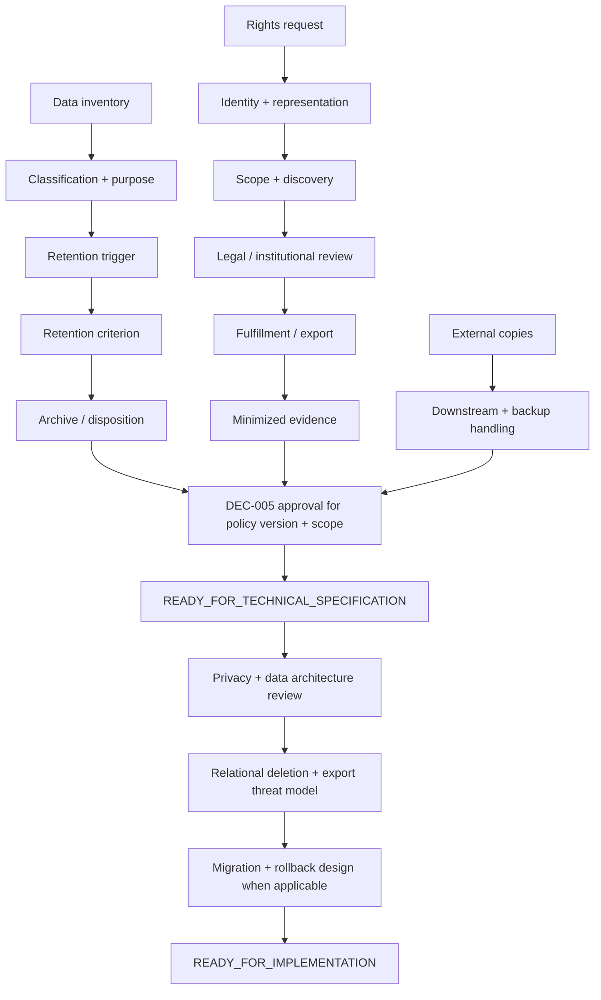

# DEC-005 — Paquete institucional de decisión sobre ciclo de vida de datos

## Control del documento

| Campo | Valor |
|---|---|
| Tipo | `DECISION SUPPORT EVIDENCE` |
| Decisión canónica | `DEC-005` |
| Requisitos relacionados | `REQ-01`, `REQ-02`, `REQ-06`, `REQ-11`, `REQ-13` |
| Decision pack document status | `FINAL` — no canónico |
| Canonical DEC-005 status | `Pendiente` |
| Current gate | `READY_FOR_INSTITUTIONAL_DECISION` |
| Autoridad primaria canónica | Responsable del Tratamiento |
| Funciones consultivas | DPO/DPD, privacidad, asesoría jurídica, Dirección Médica, Dirección de Enfermería, Dirección TI, seguridad y records management dentro de sus competencias; no aprueban DEC-005 por consulta |
| Evidencia técnica inspeccionada | Repositorio en `98c80cb` |
| No constituye | Asesoría jurídica, política de conservación aprobada, clasificación de historia clínica, prueba de cumplimiento RGPD, implementación de derechos, exportación, archivo o eliminación |

Este paquete prepara la decisión institucional:

> Retención, archivo, eliminación, exportación y ejercicio de derechos por clase
> de datos.

`DEC-005-A` a `DEC-005-R` son identificadores de trabajo dentro de la única
decisión canónica DEC-005. No son decisiones canónicas independientes.

Mientras DEC-005 permanezca `Pendiente`, el tratamiento de datos reales y la
retención definitiva siguen bloqueados. Este paquete no cambia ese hecho.

### Modelo de autoridad sin deriva

```text
DEC-005 PRIMARY APPROVER = Responsable del Tratamiento
```

Ninguna consulta o dependencia convierte a otra función en coautoridad de
DEC-005. Una decisión dependiente puede bloquear el alcance que DEC-005 pretende
aprobar, pero su autoridad conserva competencia únicamente sobre esa decisión y
su evidencia.

| Tipo | Función o decisión | Competencia |
|---|---|---|
| `PRIMARY AUTHORITY` | Responsable del Tratamiento | Aprobar DEC-005, su policy version y su approved data-class scope |
| `CONSULTATIVE FUNCTION` | DPO/DPD, privacidad, asesoría jurídica, seguridad y records management | Aportar evaluación y evidencia dentro de su competencia; no aprobar DEC-005 |
| `CONSULTATIVE FUNCTION` | Dirección Médica, Dirección de Enfermería y Dirección TI | Aportar evidencia especializada cuando no actúan como autoridad de una decisión dependiente |
| `DEPENDENCY AUTHORITY` | DEC-001 y DEC-002 — Dirección Médica | Aprobar exclusivamente identidad/alta y episodio/cierre |
| `DEPENDENCY AUTHORITY` | DEC-003 y DEC-004 — Responsable del Tratamiento | Aprobar exclusivamente participación/base y autorización de cuidador |
| `DEPENDENCY AUTHORITY` | DEC-012 — Dirección Médica | Aprobar exclusivamente perfil, campos y destino SBAR |
| `DEPENDENCY AUTHORITY` | DEC-013 y DEC-014 — Dirección TI | Aprobar exclusivamente identidad/acceso técnico e incidentes/operación |
| `DEPENDENCY AUTHORITY` | DEC-015 — Dirección de Enfermería | Aprobar exclusivamente continuidad y backup |
| `DEPENDENCY AUTHORITY` | DEC-016 — Gerencia del Hospital como Responsable del Tratamiento | Resolver exclusivamente el gate institucional final del piloto |

Por ejemplo, un SBAR real puede requerir DEC-012 y DEC-005 aprobadas. Dirección
Médica aprueba DEC-012; el Responsable del Tratamiento aprueba DEC-005. Son dos
decisiones separadas.

## 1. Límites jurídicos y semánticos

El repositorio no determina periodos legales, base jurídica, aplicabilidad de
derechos, excepciones, alcance de historia clínica ni prevalencia normativa. Todo
valor jurídico o institucional permanece `INSTITUTIONAL_VALUE_REQUIRED`.

```text
RETENTION ≠ ARCHIVE ≠ BACKUP
DELETE ≠ REVOKE ACCESS ≠ WITHDRAW CONSENT ≠ CLOSE EPISODE
PSEUDONYMIZATION ≠ ANONYMIZATION
EXPORT ≠ BACKUP
SBAR EXPORT ≠ DATA SUBJECT ACCESS EXPORT
DATA ACCESS ≠ DATA PORTABILITY
RIGHT TO ERASURE ≠ UNCONDITIONAL HARD DELETE
CAREGIVER REVOCATION ≠ ERASURE OF HISTORICAL RECORDS
AUDIT APPEND-ONLY ≠ RETAIN FOREVER
TECHNICAL HISTORY ≠ AUTOMATIC LEGAL RECORD
DATA CLASS ≠ LEGAL RECORD CLASSIFICATION
DATA CLASS ≠ CLINICAL RECORD STATUS
DATA CLASS ≠ RETENTION CATEGORY
```

`append-only` describe un invariant técnico actual. No acredita una obligación
jurídica de conservación indefinida. `Restrict` describe integridad referencial,
no una política de disposición.

## 2. Evidencia inspeccionada

Se revisaron README, workflow clínico-organizativo, matriz de autorización,
clasificación de datos, registro de decisiones, trazabilidad Markdown/CSV, los
cinco documentos de arquitectura GAS 2.0 y los ADR-0001 a ADR-0014. También se
revisaron los paquetes y formularios DEC-002, DEC-013, DEC-014 y DEC-017.

La inspección técnica incluyó:

- `prisma/schema.prisma`, sus 45 modelos y sus 113 relaciones con
  `onDelete: Restrict`;
- las 11 migraciones, sus foreign keys, índices, constraints y triggers;
- todos los modelos persistentes, versiones, historias append-only y
  proyecciones;
- usos de `delete`, `deleteMany`, `DELETE`, `TRUNCATE`, `CASCADE`, archive,
  retention, purge, erasure, export, PDF, logs, incidentes y backup;
- rutas de sesión y cuidador que usan el verbo HTTP `DELETE`;
- preview SBAR, impresión del navegador y el port `SafetyPlanExporter`;
- logs, correlation IDs, `AuditEvent`, `CaregiverAccessAudit` y evidence view;
- seed y scripts demo.

No se usaron fuentes jurídicas externas para seleccionar valores.

## 3. Baseline real de lifecycle

| Pregunta | Hecho verificable |
|---|---|
| Persistencia | PostgreSQL mediante Prisma; 45 modelos persistentes |
| Hard-delete productivo | No se encontró `delete`/`deleteMany`, `DELETE FROM` o `TRUNCATE` productivo |
| HTTP `DELETE` | Solo logout de sesión general y de cuidador; actualiza `revokedAt` y expira cookie, no borra filas |
| Cascadas | Ninguna relación Prisma o migración usa `ON DELETE CASCADE` |
| `SET NULL` | No se encontró `ON DELETE SET NULL` |
| `RESTRICT` | Las 113 relaciones Prisma declaran `onDelete: Restrict` |
| Archivo | No existe estado, tabla, storage, job o workflow de archivo |
| Purge | No existe purge job, cleanup productivo ni scheduler de disposición |
| Retention scheduler | No existe |
| Rights workflow | No existe solicitud de acceso, rectificación, restricción, supresión o portabilidad |
| Data inventory formal | Existía clasificación orientativa; este pack incorpora el primer inventario repository-grounded por objetos |
| Exports | Preview SBAR efímero + impresión HTML; port PDF de Plan sin implementación |
| PDF | No existe generador PDF conectado |
| Backup | Docker usa un volumen de desarrollo; el repositorio no gobierna backups, restore ni retención de copias |
| Downstream | No existen HCE/FHIR, proveedores clínicos o de telemonitorización, messaging, ITSM o monitoring productivos; ningún proveedor está seleccionado |
| Datos | Desarrollo, pruebas y demo usan exclusivamente datos sintéticos |

### 3.1. Mutable, versionado, append-only y transitorio

- Estado mutable controlado: `User`, `Patient`, `DischargeEpisode`,
  `RoleAssignment`, `SessionMetadata`, `CaregiverInvitation`,
  `CaregiverSession`, raíz `SafetyPlan`, `Alert` y `Task`.
- Versionado o historia append-only: políticas de identidad y legales,
  episodios, Plan de Seguridad, check-ins, reglas/evaluaciones/revisiones,
  tareas/eventos, scopes y evidencias de cuidador, Domicilio Seguro y auditoría.
- Proyecciones efímeras: `EpisodeGovernanceView`,
  `TaskAccountabilityProjection`, `EpisodeGovernanceEvidenceView`,
  workqueue y preview SBAR.
- Transitorio: cookies, tokens raw antes de hashear, response HTTP, memoria del
  proceso y DOM de impresión. El repositorio no persiste el archivo impreso o
  descargado por el navegador.
- Configuración: env flags, catálogos/reglas/protocolos versionados y fixtures
  sintéticos. Una configuración retirada o superseded no se borra por ello.

Ausencia de código no demuestra ausencia de obligación jurídica. Solo describe
la capacidad técnica actual.

## 4. Catálogo estable de clases de datos

Este catálogo documental es el mapping canónico entre el inventario técnico, el
approved scope, la lifecycle matrix y la legal applicability matrix. No es una
clasificación jurídica, clínica, de conservación ni de sensibilidad. Agrupa
objetos solo cuando comparten finalidad técnica, lifecycle, semántica de historia
y boundary de decisión. No crea una clase por tabla.

Mientras DEC-005 esté `Pendiente`, cada clase está `DEFERRED` como estado de gate,
no como selección institucional. Una instancia aprobada debe marcar
individualmente cada ID como `IN_SCOPE`, `EXCLUDED` o `DEFERRED`; una clase
omitida se considera `DEFERRED`, nunca aprobada.

| ID | Data class | Repository object / source | Technical form | Factual technical context | Current lifecycle | Current scope |
|---|---|---|---|---|---|---|
| DC-01 | Identity and account | `User`, `RoleAssignment` | Persisted | identity/access context | Estado mutable, revocación con evidencia, FK `RESTRICT` | `DEFERRED` |
| DC-02 | Session evidence | `SessionMetadata` | Persisted | session/access evidence | Expira o se revoca; no se borra en logout | `DEFERRED` |
| DC-03 | Patient identity link | `Patient` | Persisted; synthetic-only today | health-context identifier | Mutable; hard-delete bloqueado | `DEFERRED` |
| DC-04 | Identity verification configuration | `IdentityVerificationPolicyVersion` | Persisted configuration | configuration | Versionado/append-only | `DEFERRED` |
| DC-05 | Episode and timeline | `DischargeEpisode`, `EpisodeTransition` | Persisted | health-context workflow | Raíz mutable + transición append-only | `DEFERRED` |
| DC-06 | Participation policy configuration | `PolicyVersion` | Persisted configuration | configuration | Versionado/append-only | `DEFERRED` |
| DC-07 | Participation and authorization evidence | `ParticipationRecord`, `DigitalParticipationRecord`, `CommunicationPermission`, `ProcessingBasisRecord`, `CaregiverAuthorization`, `RevocationEvent` | Persisted | participation/authorization evidence | Append-only; revocación no borra origen | `DEFERRED` |
| DC-08 | Safety Plan | `SafetyPlan`, `SafetyPlanVersion`, `SafetyPlanSection`, `SafetyPlanSectionPermission`, `SafetyPlanVersionStateChange` | Persisted/versioned | health-context data | Edición N+1; historia protegida | `DEFERRED` |
| DC-09 | Home Safety | `HomeSafetyReviewVersion`, `HomeSafetyItem` | Persisted/versioned | informational health-context data | Edición N+1; historia protegida | `DEFERRED` |
| DC-10 | Check-in configuration | `CheckInProtocolVersion`, `QuestionDefinition`, `ScheduleConfiguration` | Persisted configuration | configuration | Versionado/append-only | `DEFERRED` |
| DC-11 | Check-in interaction evidence | `CheckInAssignmentBatch`, `CheckInAssignment`, `CheckInOutcome`, `CheckInResponse`, `CheckInAnswer`, `NonResponseEvent` | Persisted | health-context interaction evidence | Historial append-only y outcome terminal | `DEFERRED` |
| DC-12 | Rule configuration | `RuleDefinition`, `RuleVersion`, `RuleApproval` | Persisted configuration | deterministic-rule configuration | Versionado, aprobación y retirada | `DEFERRED` |
| DC-13 | Rule evaluation and alert evidence | `RuleEvaluation`, `Alert`, `AlertReview` | Persisted | deterministic evaluation/review evidence | Evaluación/review append-only; alerta controlada | `DEFERRED` |
| DC-14 | Task workflow | `Task`, `TaskEvent` | Persisted | workflow/accountability context | Proyección actual + eventos append-only | `DEFERRED` |
| DC-15 | Caregiver access and session evidence | `CaregiverProfile`, `CaregiverAuthorizationScope`, `CaregiverInvitation`, `CaregiverSession` | Persisted | caregiver identity/access context | Scope versionado; invitación/sesión expirable o revocable | `DEFERRED` |
| DC-16 | Caregiver contribution | `CaregiverObservation` | Persisted | third-party contribution | Append-only; revocación no borra contribución | `DEFERRED` |
| DC-17 | Caregiver access audit | `CaregiverAccessAudit` | Persisted | caregiver access evidence | Append-only | `DEFERRED` |
| DC-18 | Technical AuditEvent | `AuditEvent` | Persisted | minimized technical audit context | Append-only; no texto clínico; no “forever” | `DEFERRED` |
| DC-19 | Governance evidence projections | `EpisodeGovernanceView`, `TaskAccountabilityProjection`, `EpisodeGovernanceEvidenceView`, provenance readers | Derived/read-only; not persisted | inherits source classification | Se recompone; no tiene disposición persistente independiente | `DEFERRED` |
| DC-20 | SBAR preview | `generateSbarPreview`, `SbarPreviewPanel` | Derived/ephemeral | inherits selected source classification | Response/DOM efímero; no archivo server-side | `DEFERRED` |
| DC-21 | Browser print/download copy | salida de `window.print()` o guardado del navegador | External copy candidate | inherits selected source classification | Fuera de control server-side tras entrega | `DEFERRED` |
| DC-22 | Safety Plan PDF candidate | `SafetyPlanExporter` port | Not implemented | inherits selected source classification if implemented | No artifact, endpoint ni lifecycle | `DEFERRED` |
| DC-23 | Rights access export | No source of truth | Not implemented | inherits selected source classification if implemented | Sin package ni workflow | `DEFERRED` |
| DC-24 | Portability package | No source of truth | Not implemented | inherits selected source classification if implemented | Sin package ni workflow | `DEFERRED` |
| DC-25 | Institutional report | No persisted report source | Not implemented | inherits selected source classification if implemented | Sin artifact ni lifecycle | `DEFERRED` |
| DC-26 | Operational telemetry | stderr sanitizado, correlation ID, health y agregados | Runtime/transient | runtime technical context | Sin sink ni retención gobernada en repo | `DEFERRED` |
| DC-27 | Incident/support evidence | No source of truth | Not implemented | incident/support context if implemented | Sin ticket, trace, incident o postmortem | `DEFERRED` |
| DC-28 | Downstream copies | No integration productiva | Not implemented | inherits transferred source classification | Sin copia, contrato ni propagación | `DEFERRED` |
| DC-29 | Backup/restore copies | No source of truth in repo | Not implemented | inherits backed-up source classification | Volumen local no es política de backup | `DEFERRED` |

Los contextos anteriores son descripciones factuales no jerárquicas. No existe
una escala institucional ordinal de sensibilidad aprobada y el paquete no
inventa una.

El catálogo es inventario técnico. No afirma que `SafetyPlan`, `CheckIn`,
`Alert`, `Task`, `AuditEvent` u otro objeto sea o no historia clínica, ni le
asigna una categoría legal de registro o retención. Esa clasificación requiere
la evaluación y decisión institucional aplicable.

### 4.1. Invariante de correspondencia

Las cuatro superficies usan exactamente el conjunto `DC-01`–`DC-29` y los
mismos nombres:

```text
DATA CLASS INVENTORY
↔ APPROVED DATA-CLASS SCOPE
↔ DATA CLASS LIFECYCLE MATRIX
↔ LEGAL APPLICABILITY MATRIX
```

Una futura modificación del catálogo debe actualizar conjuntamente las cuatro
superficies. DC-19 no recibe política de disposición propia: al no persistirse,
hereda el lifecycle y las evaluaciones de sus sources. Si una proyección se
materializa, se convierte en una copia nueva que debe volver a clasificarse.

### 4.2. Frontera de seudonimización

`externalPseudonymousId`, UUID, cuid, hashes de token y correlation IDs son
mecanismos o identificadores técnicos. No son evidencia de anonimización. Una
futura anonimización requiere método formal, assessment de reidentificación,
scope, irreversibilidad, verificación, tratamiento de copias y evidencia.

## 5. Source of truth, proyección y copia

| Concepto | Source of truth | Derivado / copia | Lifecycle actual |
|---|---|---|---|
| Episode governance | `DischargeEpisode`, transiciones, responsabilidades, avisos y tareas | `EpisodeGovernanceView` | Read-only, no persiste |
| Task accountability | `Task` + `TaskEvent` | `TaskAccountabilityProjection` | Read-only, no persiste |
| Governance evidence | Fuentes de episodio, provenance, reviews, tasks y `AuditEvent` | `EpisodeGovernanceEvidenceView` | Read-only, no persiste |
| Signal lineage | Registros fuente + `RuleEvaluation` + `Alert.inputReferences` | `CanonicalProvenanceLineageV1` leído por mapper | El lineage del alert sí persiste; la vista no |
| SBAR | Fuentes estructuradas del episodio | Preview en response/DOM; posible impresión del navegador | No hay archivo server-side |
| Audit reference | `AuditEvent` | Referencia en evidence view | La referencia no duplica la fila |
| Cache | Next/request/browser runtime cuando aplica | No hay cache clínica persistente gobernada | `no-store` en superficies relevantes |

Si una proyección se exporta, captura, imprime o almacena, esa copia puede adquirir
un lifecycle propio. Browser downloads, print output y caches externos quedan
fuera del control técnico actual y requieren política de generación, entrega,
almacenamiento, expiración y evidencia.

## 6. Subdecisiones DEC-005-A a DEC-005-R

| ID | Pregunta que debe resolver la autoridad | Estado actual |
|---|---|---|
| DEC-005-A | Clases de datos reconocidas por la política | Inventario técnico disponible; clasificación institucional pendiente |
| DEC-005-B | Propósito y record role de cada clase | `INSTITUTIONAL_POLICY_REQUIRED`; no todo es ni deja de ser historia clínica |
| DEC-005-C | Evento desde el que se computa retención | No seleccionado |
| DEC-005-D | Periodo o criterio | `INSTITUTIONAL_VALUE_REQUIRED`; sin números |
| DEC-005-E | Significado, entrada, acceso y salida de archivo | No existe archivo; decisión pendiente |
| DEC-005-F | Disposition por clase: hard-delete, deactivation, tombstone, anonymization, external archive u otra | No seleccionado |
| DEC-005-G | Frontera entre seudonimización y anonimización | Solo seudonimización técnica actual |
| DEC-005-H | Holds/excepciones y su autoridad | No existe workflow; categorías solo candidatas |
| DEC-005-I | Workflow de derecho de acceso | No implementado |
| DEC-005-J | Rectificación sin destruir historia | No implementada como rights workflow; mecanismos versionados existentes son candidatos, no decisión |
| DEC-005-K | Restricción/oposición y sus efectos | No implementado; no equivale a deletion |
| DEC-005-L | Evaluación de supresión por clase | No implementado; hard-delete no es default |
| DEC-005-M | Portabilidad: scope, formato, destinatario y seguridad | No implementado; no equivale a FHIR o SBAR |
| DEC-005-N | Lifecycle de exports/copies | Preview/print demo; política pendiente |
| DEC-005-O | Datos de terceros/cuidadores y review | DEC-004/013 + privacy/legal review |
| DEC-005-P | Propagación downstream/procesadores | Sin integraciones actuales; contrato y responsabilidad pendientes |
| DEC-005-Q | Backup/restore copies | Sin gobierno en repo; DEC-015 conserva continuidad |
| DEC-005-R | Enforcement manual, report-only, automático o híbrido | No seleccionado; no hay engine/job |

## 7. Data class lifecycle matrix

La columna de autoridad nombra siempre al aprobador de DEC-005. Las decisiones
citadas son dependencias, no coautoridades.

| ID | Data class | Source/history model | Terminal or boundary event | Current disposition/export | DEC-005 assessment | Authority / dependency |
|---|---|---|---|---|---|---|
| DC-01 | Identity and account | Mutable account/role + revocation evidence | Role revocation/deactivation | No delete/archive/export | Required | Responsable del Tratamiento; DEC-013 dependency |
| DC-02 | Session evidence | Mutable expiry/revocation evidence | Expiry/logout/revocation | No row deletion | Required | Responsable del Tratamiento; DEC-013 dependency |
| DC-03 | Patient identity link | Mutable source | None | Hard-delete blocked | Required | Responsable del Tratamiento; DEC-001/013 dependencies |
| DC-04 | Identity verification configuration | Versioned/append-only | Supersession | No disposition | Required | Responsable del Tratamiento; DEC-001 dependency |
| DC-05 | Episode and timeline | Mutable root + append-only timeline | Closure, if DEC-002 permits | No delete/archive; source for SBAR | Closure is not trigger by default | Responsable del Tratamiento; DEC-002 dependency |
| DC-06 | Participation policy configuration | Versioned/append-only | Supersession | No disposition | Required | Responsable del Tratamiento; DEC-003 dependency |
| DC-07 | Participation and authorization evidence | Append-only evidence | Revocation/supersession | No delete/archive/export | Required | Responsable del Tratamiento; DEC-003/004 dependencies |
| DC-08 | Safety Plan | N+1 versions + state events | Supersession/invalidation | No delete/archive; export port only | Required | Responsable del Tratamiento; consultative clinical function |
| DC-09 | Home Safety | N+1 versions | New version | No delete/archive/export | Required | Responsable del Tratamiento; consultative clinical function |
| DC-10 | Check-in configuration | Versioned/append-only | Retirement/supersession | No disposition | Required | Responsable del Tratamiento |
| DC-11 | Check-in interaction evidence | Append-only interaction/history | Responded/omitted/expired | No delete/archive/export | Required | Responsable del Tratamiento |
| DC-12 | Rule configuration | Versioned + approval/retirement | Retirement/supersession | No disposition | Required | Responsable del Tratamiento |
| DC-13 | Rule evaluation and alert evidence | Evaluation/review history + controlled alert | Resolution/dismissal | No delete/archive/export | Required | Responsable del Tratamiento; DEC-014 dependency when incident-related |
| DC-14 | Task workflow | Mutable projection + append-only event | Resolution | No delete/archive/export | Required | Responsable del Tratamiento |
| DC-15 | Caregiver access and session evidence | Versioned scope + mutable expiry/revocation | Expiry/revocation/logout | No delete/archive/export | Required + third-party review | Responsable del Tratamiento; DEC-004/013 dependencies |
| DC-16 | Caregiver contribution | Append-only contribution | None | No delete/archive/export | Required + third-party review | Responsable del Tratamiento; DEC-004 dependency |
| DC-17 | Caregiver access audit | Append-only evidence | None | No disposition | Required + third-party review | Responsable del Tratamiento; DEC-004/013 dependencies |
| DC-18 | Technical AuditEvent | Append-only evidence | None | No disposition; not “forever” | Required | Responsable del Tratamiento; DEC-013/014 dependencies |
| DC-19 | Governance evidence projections | Recomputed from sources; not persisted | Source change/request end | No independent disposition | Inherits assessments of source IDs | Responsable del Tratamiento; source dependencies |
| DC-20 | SBAR preview | Derived response/DOM | Request/page end | No server file; may lead to DC-21 | Export policy required | Responsable del Tratamiento; DEC-012 dependency |
| DC-21 | Browser print/download copy | Materialized outside server control | Delivery/browser action | Guardián cannot revoke exported copy | Generation/authorization/delivery policy required | Responsable del Tratamiento; DEC-012 dependency for SBAR |
| DC-22 | Safety Plan PDF candidate | No artifact; port only | Not observable | Not implemented | `DEPENDENT_ON_SCOPE` | Responsable del Tratamiento |
| DC-23 | Rights access export | No artifact/workflow | Not observable | Not implemented | `DEPENDENT_ON_SCOPE` | Responsable del Tratamiento |
| DC-24 | Portability package | No artifact/workflow | Not observable | Not implemented | `DEPENDENT_ON_SCOPE` | Responsable del Tratamiento |
| DC-25 | Institutional report | No persisted artifact | Not observable | Not implemented | `DEPENDENT_ON_SCOPE` | Responsable del Tratamiento |
| DC-26 | Operational telemetry | Runtime/transient only | Process/request end | No governed store | Required if introduced/persisted | Responsable del Tratamiento; DEC-013/014 dependencies |
| DC-27 | Incident/support evidence | No source of truth | Not observable | Not implemented | `DEPENDENT_ON_SCOPE` | Responsable del Tratamiento; DEC-014 dependency |
| DC-28 | Downstream copies | No productive integration | Not observable | Not implemented | `DEPENDENT_ON_SCOPE` | Responsable del Tratamiento; selected connector governance dependency |
| DC-29 | Backup/restore copies | No governed source | Not observable | Not implemented | `DEPENDENT_ON_SCOPE` | Responsable del Tratamiento; DEC-015 dependency |

## 8. Retention trigger model

No candidato está seleccionado.

| Data class | Candidate trigger | Observable today? | Ambiguity / dependency |
|---|---|---:|---|
| Identity/account | record creation, account closure, role revocation | Partial | No account closure workflow; DEC-013 |
| Session | creation, expiry, revocation | Yes | TTL demo is not retention |
| Patient/episode | creation, episode closure, end of care | Creation/closure fields exist | DEC-002 closure does not choose trigger |
| Legal/participation | creation, revocation, policy supersession | Yes | Revocation is access/authorization evidence, not delete |
| Safety Plan | version creation, supersession, invalidation, episode closure | Yes | Which event applies is institutional |
| Check-in | assignment, outcome, episode closure, last interaction | Yes | “last interaction” must be defined |
| Rule/alert | evaluation, review, resolution, policy retirement | Yes | Technical terminal state is not legal criterion |
| Task | creation, resolution, episode closure | Yes | DEC-017 defines task semantics, not retention |
| Caregiver | authorization, revocation, session expiry, contribution | Yes | Contribution and access evidence may differ |
| Audit | event creation, incident closure, source disposition | Creation yes | No incident source; append-only is not forever |
| SBAR/export | generation, download, delivery, expiry | Generation audit only | No stored artifact/download evidence |
| Incident evidence | incident closure | No | DEC-014 |
| Backup | backup creation/replacement | No | DEC-015 |

Every approved criterion must reference a policy version, approved data-class
scope, trigger definition, authority, evidence, effective date and review date.

## 9. Append-only analysis

| History | Why append-only now | Correction/supersession today | Delete impact | DEC-005 decision |
|---|---|---|---|---|
| Identity policy + `EpisodeTransition` | Reconstruct activation/state | New policy/version or transition; no rewrite | Breaks episode attribution | Required |
| Legal policies/records/revocations | Preserve decision sequence | New record/revocation/policy version | Breaks authorization evidence | Required |
| Safety Plan versions/sections/state changes | Preserve clinical traceability | N+1, supersede, invalidate with reason | Breaks document history | Required |
| Check-in protocol/questions/schedule | Preserve exact protocol | New protocol version/retire | Breaks assignment/answer lineage | Required |
| Check-in assignments/outcomes/responses/answers/non-response | Preserve interaction/outcome | No generic correction workflow | Breaks terminal exclusivity and provenance | Required |
| Rule definitions/versions/approvals/evaluations | Reproducibility | New version/retire; evaluations immutable | Breaks hash/decision lineage | Required |
| Alert reviews | Human review history | Later review/state event | Breaks human authorization evidence | Required |
| Task events | Accountability | Later event; no history rewrite | Breaks projected state | Required |
| Caregiver scope/observation/access audit | Scope and access history | New scope; session/revocation state | Breaks authorization/contribution evidence | Required |
| Home Safety versions/items | Versioned informational record | New version | Breaks provenance | Required |
| `AuditEvent` | Technical attribution | No amendment mechanism | Breaks evidence references | Required |

A future rectification may use corrected version, amendment, superseding event or
annotation/reference. This pack does not select one and does not assume that
append-only rows are legally immutable forever.

## 10. Relational delete impact

| Parent | Representative children | FK/on delete | Hard-delete effect | History/provenance/audit impact |
|---|---|---|---|---|
| `User` | roles, sessions, authored records, responsibilities, reviews, tasks, audit | `RESTRICT` | Fails while referenced | Loses attribution across nearly every context |
| `Patient` | `DischargeEpisode` | `RESTRICT` + delete trigger | Fails | Orphans episode subject link |
| `DischargeEpisode` | transitions, plans, check-ins, evaluations, alerts, tasks, caregiver, Home Safety | `RESTRICT` + delete trigger | Fails | Breaks full continuity lineage |
| Identity/legal `PolicyVersion` | patients or legal records | `RESTRICT` + append-only trigger | Fails | Loses applicable policy evidence |
| `CheckInProtocolVersion` | questions, schedule, episode, assignments | `RESTRICT` + append-only trigger | Fails | Breaks exact protocol/answer lineage |
| `RuleDefinition`/`RuleVersion` | approval, evaluation, alert | `RESTRICT` + guarded triggers | Fails | Breaks reproducibility |
| `RuleEvaluation` | `Alert` | `RESTRICT` | Fails | Breaks source→evaluation→alert |
| `Alert` | `AlertReview`, optional `Task` | `RESTRICT` + no-delete trigger | Fails | Breaks review/human authorization |
| `Task` | `TaskEvent` | `RESTRICT` + no-delete trigger | Fails | Breaks accountability projection |
| `SafetyPlan`/version/section | versions, sections, permissions, state changes | `RESTRICT` + triggers | Fails | Breaks version history and access provenance |
| `CaregiverAuthorization`/profile/session | scopes, invitations, sessions, observations, access audit | `RESTRICT` + triggers | Fails | Breaks representation, access and third-party history |
| `HomeSafetyReviewVersion` | items | `RESTRICT` + trigger | Fails | Breaks version evidence |
| `AuditEvent.actor` | `User` | `RESTRICT` | User delete fails | Preserves technical attribution |

There are no cascade paths. A future disposition design must handle dependency
order, provenance, audit references, exports and restore resurrection. Therefore:

`DELETION_DESIGN_REVIEW_REQUIRED` before any hard-delete, anonymization or FK
change.

## 11. Revocation, closure and deactivation

| Operation | Current technical effect | Explicitly not |
|---|---|---|
| Participation/communication revocation | Adds `RevocationEvent`; future authorization queries fail closed | Erasure of originating record or clinical history |
| Caregiver authorization revocation | Adds event, revokes all active caregiver sessions and denies future access | Erasure of invitation, scope, session, observation or access audit |
| Role revocation | Sets `RoleAssignment.revokedAt`; future checks deny | Erasure of historical actor attribution |
| Session logout/revocation | Sets session `revokedAt`, expires cookie | Delete account/session row |
| Episode closure | Terminal episode state when DEC-002 permits | Retention trigger or delete permission by default |
| Account deactivation | `User.isActive=false` is representable | Hard-delete of user or dependent evidence |

## 12. Rights-request workflow candidate

No table, endpoint, ticket or engine is implemented.


DEC-013 may provide technical authentication; it does not prove that the
requester is the legally authorized requester. DEC-004 governs caregiver
representation. The institution must decide whether an ITSM/privacy platform is
the source of truth; Guardián should not duplicate it without necessity.

### 12.1. Boundaries by right

- Access: discovery and assembly after identity, scope and third-party review;
  not portability.
- Rectification: may change mutable current state or create amendment/version;
  must not silently rewrite append-only history.
- Restriction/objection: applicability and effects require legal review; may
  block future optional processing while preserving evidence and preventing
  disposition when approved.
- Erasure/suppression: eligibility and preservation are assessed per class; no
  unconditional hard-delete.
- Portability: scope, data provided by subject, format, recipient, direct
  transmission and provenance require separate assessment; not SBAR or FHIR.

## 13. Legal applicability matrix

`YES/NO` is deliberately not used. Only
`LEGAL_ASSESSMENT_REQUIRED`, `INSTITUTIONAL_POLICY_REQUIRED`,
`DEPENDENT_ON_SCOPE` and `NOT_APPLICABLE_TECHNICALLY` are valid here.

| ID | Data class | Access | Rectification | Erasure | Restriction | Portability | Retention / third-party | DEC-005 authority |
|---|---|---|---|---|---|---|---|---|
| DC-01 | Identity and account | `LEGAL_ASSESSMENT_REQUIRED` | `DEPENDENT_ON_SCOPE` | `LEGAL_ASSESSMENT_REQUIRED` | `DEPENDENT_ON_SCOPE` | `DEPENDENT_ON_SCOPE` | `INSTITUTIONAL_POLICY_REQUIRED` | Responsable del Tratamiento |
| DC-02 | Session evidence | `DEPENDENT_ON_SCOPE` | `DEPENDENT_ON_SCOPE` | `LEGAL_ASSESSMENT_REQUIRED` | `DEPENDENT_ON_SCOPE` | `DEPENDENT_ON_SCOPE` | `INSTITUTIONAL_POLICY_REQUIRED` | Responsable del Tratamiento |
| DC-03 | Patient identity link | `LEGAL_ASSESSMENT_REQUIRED` | `LEGAL_ASSESSMENT_REQUIRED` | `LEGAL_ASSESSMENT_REQUIRED` | `LEGAL_ASSESSMENT_REQUIRED` | `DEPENDENT_ON_SCOPE` | `INSTITUTIONAL_POLICY_REQUIRED` | Responsable del Tratamiento |
| DC-04 | Identity verification configuration | `DEPENDENT_ON_SCOPE` | `INSTITUTIONAL_POLICY_REQUIRED` | `LEGAL_ASSESSMENT_REQUIRED` | `DEPENDENT_ON_SCOPE` | `DEPENDENT_ON_SCOPE` | `INSTITUTIONAL_POLICY_REQUIRED` | Responsable del Tratamiento |
| DC-05 | Episode and timeline | `LEGAL_ASSESSMENT_REQUIRED` | `LEGAL_ASSESSMENT_REQUIRED` | `LEGAL_ASSESSMENT_REQUIRED` | `LEGAL_ASSESSMENT_REQUIRED` | `DEPENDENT_ON_SCOPE` | `INSTITUTIONAL_POLICY_REQUIRED` | Responsable del Tratamiento |
| DC-06 | Participation policy configuration | `DEPENDENT_ON_SCOPE` | `INSTITUTIONAL_POLICY_REQUIRED` | `LEGAL_ASSESSMENT_REQUIRED` | `DEPENDENT_ON_SCOPE` | `DEPENDENT_ON_SCOPE` | `INSTITUTIONAL_POLICY_REQUIRED` | Responsable del Tratamiento |
| DC-07 | Participation and authorization evidence | `LEGAL_ASSESSMENT_REQUIRED` | `LEGAL_ASSESSMENT_REQUIRED` | `LEGAL_ASSESSMENT_REQUIRED` | `DEPENDENT_ON_SCOPE` | `DEPENDENT_ON_SCOPE` | `INSTITUTIONAL_POLICY_REQUIRED` | Responsable del Tratamiento |
| DC-08 | Safety Plan | `LEGAL_ASSESSMENT_REQUIRED` | `LEGAL_ASSESSMENT_REQUIRED` | `LEGAL_ASSESSMENT_REQUIRED` | `LEGAL_ASSESSMENT_REQUIRED` | `DEPENDENT_ON_SCOPE` | `INSTITUTIONAL_POLICY_REQUIRED` | Responsable del Tratamiento |
| DC-09 | Home Safety | `LEGAL_ASSESSMENT_REQUIRED` | `LEGAL_ASSESSMENT_REQUIRED` | `LEGAL_ASSESSMENT_REQUIRED` | `LEGAL_ASSESSMENT_REQUIRED` | `DEPENDENT_ON_SCOPE` | `INSTITUTIONAL_POLICY_REQUIRED` | Responsable del Tratamiento |
| DC-10 | Check-in configuration | `DEPENDENT_ON_SCOPE` | `INSTITUTIONAL_POLICY_REQUIRED` | `LEGAL_ASSESSMENT_REQUIRED` | `DEPENDENT_ON_SCOPE` | `DEPENDENT_ON_SCOPE` | `INSTITUTIONAL_POLICY_REQUIRED` | Responsable del Tratamiento |
| DC-11 | Check-in interaction evidence | `LEGAL_ASSESSMENT_REQUIRED` | `LEGAL_ASSESSMENT_REQUIRED` | `LEGAL_ASSESSMENT_REQUIRED` | `LEGAL_ASSESSMENT_REQUIRED` | `DEPENDENT_ON_SCOPE` | `INSTITUTIONAL_POLICY_REQUIRED` | Responsable del Tratamiento |
| DC-12 | Rule configuration | `DEPENDENT_ON_SCOPE` | `INSTITUTIONAL_POLICY_REQUIRED` | `LEGAL_ASSESSMENT_REQUIRED` | `DEPENDENT_ON_SCOPE` | `DEPENDENT_ON_SCOPE` | `INSTITUTIONAL_POLICY_REQUIRED` | Responsable del Tratamiento |
| DC-13 | Rule evaluation and alert evidence | `DEPENDENT_ON_SCOPE` | `DEPENDENT_ON_SCOPE` | `LEGAL_ASSESSMENT_REQUIRED` | `DEPENDENT_ON_SCOPE` | `DEPENDENT_ON_SCOPE` | `INSTITUTIONAL_POLICY_REQUIRED` | Responsable del Tratamiento |
| DC-14 | Task workflow | `DEPENDENT_ON_SCOPE` | `DEPENDENT_ON_SCOPE` | `LEGAL_ASSESSMENT_REQUIRED` | `DEPENDENT_ON_SCOPE` | `DEPENDENT_ON_SCOPE` | `INSTITUTIONAL_POLICY_REQUIRED` | Responsable del Tratamiento |
| DC-15 | Caregiver access and session evidence | `LEGAL_ASSESSMENT_REQUIRED` | `LEGAL_ASSESSMENT_REQUIRED` | `LEGAL_ASSESSMENT_REQUIRED` | `LEGAL_ASSESSMENT_REQUIRED` | `DEPENDENT_ON_SCOPE` | `INSTITUTIONAL_POLICY_REQUIRED`; third-party review | Responsable del Tratamiento |
| DC-16 | Caregiver contribution | `LEGAL_ASSESSMENT_REQUIRED` | `LEGAL_ASSESSMENT_REQUIRED` | `LEGAL_ASSESSMENT_REQUIRED` | `LEGAL_ASSESSMENT_REQUIRED` | `DEPENDENT_ON_SCOPE` | `INSTITUTIONAL_POLICY_REQUIRED`; third-party review | Responsable del Tratamiento |
| DC-17 | Caregiver access audit | `LEGAL_ASSESSMENT_REQUIRED` | `DEPENDENT_ON_SCOPE` | `LEGAL_ASSESSMENT_REQUIRED` | `LEGAL_ASSESSMENT_REQUIRED` | `DEPENDENT_ON_SCOPE` | `INSTITUTIONAL_POLICY_REQUIRED`; third-party review | Responsable del Tratamiento |
| DC-18 | Technical AuditEvent | `DEPENDENT_ON_SCOPE` | `INSTITUTIONAL_POLICY_REQUIRED` | `LEGAL_ASSESSMENT_REQUIRED` | `DEPENDENT_ON_SCOPE` | `DEPENDENT_ON_SCOPE` | `INSTITUTIONAL_POLICY_REQUIRED` | Responsable del Tratamiento |
| DC-19 | Governance evidence projections | `NOT_APPLICABLE_TECHNICALLY` | `NOT_APPLICABLE_TECHNICALLY` | `NOT_APPLICABLE_TECHNICALLY` | `NOT_APPLICABLE_TECHNICALLY` | `NOT_APPLICABLE_TECHNICALLY` | `NOT_APPLICABLE_TECHNICALLY` | Responsable del Tratamiento |
| DC-20 | SBAR preview | `DEPENDENT_ON_SCOPE` | `DEPENDENT_ON_SCOPE` | `DEPENDENT_ON_SCOPE` | `DEPENDENT_ON_SCOPE` | `NOT_APPLICABLE_TECHNICALLY` | `INSTITUTIONAL_POLICY_REQUIRED` | Responsable del Tratamiento |
| DC-21 | Browser print/download copy | `DEPENDENT_ON_SCOPE` | `DEPENDENT_ON_SCOPE` | `LEGAL_ASSESSMENT_REQUIRED` | `DEPENDENT_ON_SCOPE` | `DEPENDENT_ON_SCOPE` | `INSTITUTIONAL_POLICY_REQUIRED` | Responsable del Tratamiento |
| DC-22 | Safety Plan PDF candidate | `NOT_APPLICABLE_TECHNICALLY` | `NOT_APPLICABLE_TECHNICALLY` | `NOT_APPLICABLE_TECHNICALLY` | `NOT_APPLICABLE_TECHNICALLY` | `NOT_APPLICABLE_TECHNICALLY` | `NOT_APPLICABLE_TECHNICALLY` | Responsable del Tratamiento |
| DC-23 | Rights access export | `NOT_APPLICABLE_TECHNICALLY` | `NOT_APPLICABLE_TECHNICALLY` | `NOT_APPLICABLE_TECHNICALLY` | `NOT_APPLICABLE_TECHNICALLY` | `NOT_APPLICABLE_TECHNICALLY` | `NOT_APPLICABLE_TECHNICALLY` | Responsable del Tratamiento |
| DC-24 | Portability package | `NOT_APPLICABLE_TECHNICALLY` | `NOT_APPLICABLE_TECHNICALLY` | `NOT_APPLICABLE_TECHNICALLY` | `NOT_APPLICABLE_TECHNICALLY` | `NOT_APPLICABLE_TECHNICALLY` | `NOT_APPLICABLE_TECHNICALLY` | Responsable del Tratamiento |
| DC-25 | Institutional report | `NOT_APPLICABLE_TECHNICALLY` | `NOT_APPLICABLE_TECHNICALLY` | `NOT_APPLICABLE_TECHNICALLY` | `NOT_APPLICABLE_TECHNICALLY` | `NOT_APPLICABLE_TECHNICALLY` | `NOT_APPLICABLE_TECHNICALLY` | Responsable del Tratamiento |
| DC-26 | Operational telemetry | `DEPENDENT_ON_SCOPE` | `DEPENDENT_ON_SCOPE` | `LEGAL_ASSESSMENT_REQUIRED` | `DEPENDENT_ON_SCOPE` | `DEPENDENT_ON_SCOPE` | `INSTITUTIONAL_POLICY_REQUIRED` | Responsable del Tratamiento |
| DC-27 | Incident/support evidence | `NOT_APPLICABLE_TECHNICALLY` | `NOT_APPLICABLE_TECHNICALLY` | `NOT_APPLICABLE_TECHNICALLY` | `NOT_APPLICABLE_TECHNICALLY` | `NOT_APPLICABLE_TECHNICALLY` | `NOT_APPLICABLE_TECHNICALLY` | Responsable del Tratamiento |
| DC-28 | Downstream copies | `NOT_APPLICABLE_TECHNICALLY` | `NOT_APPLICABLE_TECHNICALLY` | `NOT_APPLICABLE_TECHNICALLY` | `NOT_APPLICABLE_TECHNICALLY` | `NOT_APPLICABLE_TECHNICALLY` | `NOT_APPLICABLE_TECHNICALLY` | Responsable del Tratamiento |
| DC-29 | Backup/restore copies | `NOT_APPLICABLE_TECHNICALLY` | `NOT_APPLICABLE_TECHNICALLY` | `NOT_APPLICABLE_TECHNICALLY` | `NOT_APPLICABLE_TECHNICALLY` | `NOT_APPLICABLE_TECHNICALLY` | `NOT_APPLICABLE_TECHNICALLY` | Responsable del Tratamiento |

`NOT_APPLICABLE_TECHNICALLY` nunca significa `LEGALLY_NOT_APPLICABLE`. En
DC-19 indica que la proyección no es una source persistida independiente; sus
fuentes sí requieren la evaluación que corresponda. En DC-20 indica que el
preview no es por sí mismo un package de portabilidad. En DC-22–DC-25 y
DC-27–DC-29 indica que el artefacto técnico no existe hoy. Si se materializa,
transfiere o persiste, sus fuentes subyacentes y la nueva copia deben recibir
evaluación institucional/jurídica antes de uso.

## 14. Export and copy boundary

| Artifact | Current capability | Source / copy | Lifecycle decision required |
|---|---|---|---|
| SBAR preview | Authorized professional POST; deterministic response; `AuditEvent` | Derived copy candidate | Fields/profile under DEC-012; generation, print, storage, expiry, delivery and evidence under DEC-005 |
| Browser print/download | `window.print()` or browser save | Copy outside server control after delivery | Generation, authorization, minimization, delivery and evidence remain institutional obligations; Guardián cannot technically revoke an exported copy |
| Safety Plan PDF | Port only; no adapter/endpoint | Not implemented | Separate authorization, minimization, storage and delivery |
| Data-subject access export | Absent | Not implemented | Full rights workflow |
| Portability package | Absent | Not implemented | Separate scope/format/security |
| Institutional report | Absent | Not implemented | Separate purpose, authorization, fields, recipients and lifecycle |
| Governance evidence export | Absent | Read-only view only | If materialized, new copy lifecycle |
| Incident/support artifact | Absent | Not implemented | DEC-014 + DEC-005 |
| Backup | Absent as governed repository capability | Recovery copy, not an export | Separate DEC-005/015 policy; never treated as archive or delivered report |

A future export specification must define requester, authorization, purpose,
scope, fields, third-party review, format, provenance, timestamp, delivery,
storage, expiry, download evidence and revocation limits. No email, link, PDF
format or indefinite storage is selected.

Que una impresión o descarga abandone el control server-side no elimina la
obligación de Guardián de disponer de una política institucional aprobada para su
generación, autorización y entrega. Tampoco implica capacidad técnica para
revocar, recuperar o borrar una copia ya exportada.

## 15. Caregiver and third-party lifecycle

Authorization, scope, session, contribution and legal evidence have different
lifecycles:

```text
CaregiverAuthorization + RevocationEvent → legal/access evidence
CaregiverAuthorizationScope             → versioned permitted scope
CaregiverInvitation / Session           → expirable and revocable access
CaregiverObservation                    → historical contribution
CaregiverAccessAudit                    → technical access evidence
```

Revoking access does not erase historical contribution. A patient request may
include caregiver and professional information, so
`THIRD_PARTY_REVIEW_REQUIRED` remains an institutional/legal question.

## 16. Operational, incident and audit lifecycle

`AuditEvent` is technical evidence, not a log, incident record or legal record by
default. Application log, metric, trace, ticket, incident and postmortem are
separate classes. Only a minimal runtime log and functional aggregates exist;
the rest are absent.

DEC-014 governs sanitization, access and incident semantics. DEC-005 governs the
retention/disposition policy of any resulting evidence. Neither decision alone
turns support tooling into a clinical record.

## 17. Backup, restore and downstream

Archive and backup remain separate:

- archive asks where approved records leave the operational dataset and under
  what access/integrity/search rules;
- backup supports recovery and may not permit selective immediate deletion;
- restore can resurrect data already disposed unless disposition is reapplied.

A future policy must define backup retention, encryption, access, immutable
copies, restore behavior, post-restore reconciliation and evidence. DEC-015
retains authority over continuity/RTO/RPO.

There are no current downstream integrations or selected providers. For HCE,
external clinical or telemonitoring services, messaging, IdP, ITSM, monitoring
or another processor/controller, a future contract must identify role, purpose,
fields, source of truth,
responsibilities, propagation limits and evidence. Guardián cannot promise
deletion in a third party without contract and capability.

## 18. Preservation holds and exceptions

Candidate categories only:

- legal/institutional hold;
- security investigation;
- clinical review;
- litigation/claim;
- research/archive under approved conditions.

DEC-005-H must define authority, scope, start/end evidence and interaction with
restriction, disposition and restore. No hold is created or applied by this pack.

## 19. Minimum blocking decision set

| Outcome | Minimum working decisions | Other dependencies |
|---|---|---|
| Real data | DEC-005 approved for a versioned scope; A/B and D for every `IN_SCOPE` class; only the applicable C/E/F/G/H/I–R decisions for that class, purpose and capability | Applicable dependency decisions; DEC-016 remains final pilot gate |
| Retention policy | A, B, C, D, H + policy version/scope/evidence | Legal/institutional evaluation |
| Archive | A, B, C/D as applicable, E, F, H, access and evidence | TI/security/records management |
| Deletion/disposition | A–H, J–L as applicable, relational review and threat model | `DELETION_DESIGN_REVIEW_REQUIRED` |
| Right of access | A/B, I, N, O, P plus identity/representation | DEC-004/013 |
| Rectification/restriction/erasure | A/B, J/K/L, H/O/P/Q as applicable | Legal assessment per class |
| Portability | A/B, M/N/O/P plus identity, scope, format, delivery | Legal assessment; not FHIR/SBAR |
| SBAR/export lifecycle | A/B, N, O/P/Q as applicable | DEC-012 fields/destination |
| Incident evidence | A/B, C/D, H, N/P/Q/R as applicable | DEC-014 |
| Caregiver lifecycle | A/B, C/D, F/H, I–L/O/P/Q as applicable | DEC-004/013 |
| Backup policy | A/B, D/F/H/Q/R | DEC-015 |

DEC-005 `Pendiente` blocks all real data. A future scoped approval unlocks only
classes and purposes that are explicitly `IN_SCOPE`, approved, versioned and
supported by the cited evidence, and only after their applicable dependencies
are resolved. Not every A–R subdecision is a universal blocker when the approved
scope excludes the corresponding capability. Every `EXCLUDED`, `DEFERRED`,
omitted or unresolved class/purpose remains blocked and is never silently
approved.

## 20. Policy versioning model

A future approved policy must be reconstructible from:

```text
policyVersion
approvedScope
dataClass
purpose / recordRole
retentionTrigger
retentionCriterion or external schedule reference
archiveRule
dispositionRule
rightsHandling
exportHandling
exceptions / holds
effectiveDate / reviewDate
authority / approvalEvidenceReference
supersededBy
excludedDeferredScope
unresolvedBlockers
```

This is a documentary contract, not a proposed Prisma schema. A future
`DataLifecyclePolicyVersion`, `RetentionEvaluation`, `DispositionCandidate` or
`DataSubjectRequest` is only a candidate. Prefer an institutional
privacy/records-management system as source of truth when it already covers the
responsibility.

## 21. Dependency graph



## 22. Future implementation impact

| Area | Candidate impact after scoped approval |
|---|---|
| Prisma schema / FKs / migrations | `SCHEMA_CANDIDATE`, `MIGRATION_CANDIDATE`; never automatic |
| Patient/episode/history | `LEGAL_REVIEW_REQUIRED`, possible `APPLICATION_CHANGE` |
| Safety Plan/check-ins/rules/alerts/tasks/caregiver | `POLICY_ONLY` or `APPLICATION_CHANGE`; preserve provenance |
| `AuditEvent` / evidence view | `POLICY_ONLY` or `APPLICATION_CHANGE`; do not duplicate source |
| Identity/session | `SECURITY_CHANGE`; DEC-013 |
| SBAR/exports | `SECURITY_CHANGE`, `APPLICATION_CHANGE`, possible `INTEGRATION_REQUIRED`; DEC-012 |
| Rights/admin workflow | `EXTERNAL_SYSTEM_PREFERRED` or justified application/schema candidate |
| Logs/incidents | `POLICY_ONLY`, `SECURITY_CHANGE` or `INTEGRATION_REQUIRED`; DEC-014 |
| Backup integration | `INTEGRATION_REQUIRED`; DEC-015 |
| Background enforcement | `BACKGROUND_JOB_CANDIDATE` only after R and threat model |
| Tests | Permissions, dependency ordering, holds, idempotency, restore, exports and synthetic-only fixtures |
| Traceability/docs | Policy version, scope, evidence and residual blockers |

This pack makes no implementation recommendation and does not reserve
`feat/gas2-data-lifecycle`.

## 23. Post-approval gate

```text
READY_FOR_INSTITUTIONAL_DECISION
→ institutional evidence / approval
→ READY_FOR_TECHNICAL_SPECIFICATION
→ privacy + data architecture review
→ relational integrity / deletion / export threat model
→ migration + rollback design when applicable
→ READY_FOR_IMPLEMENTATION
```

`READY_FOR_TECHNICAL_SPECIFICATION` requires DEC-005 `Aprobada` for a concrete
policy version and approved data-class scope, with purpose, trigger, criterion,
archive/disposition where applicable, rights/export handling, exceptions,
authority/evidence, effective/review dates, dependencies and absence of
contradictory rules.

Approval does not directly authorize a cron, purge, anonymization, cascade,
rights endpoint or export. Nothing excluded or deferred is enabled.

## 24. Relationship with other decisions

| Decision | Boundary with DEC-005 |
|---|---|
| DEC-001 | Identity/alta; does not select retention |
| DEC-002 | Episode duration/closure; closure is not a retention trigger by default |
| DEC-003 | Participation, communications and basis; withdrawal is not automatic deletion |
| DEC-004 | Caregiver authorization/representation; revocation is not erasure |
| DEC-012 | SBAR fields/destination; DEC-005 governs lifecycle of resulting copy |
| DEC-013 | Technical identity/access; authenticated is not legally authorized requester |
| DEC-014 | Incident semantics/sanitization; DEC-005 governs evidence lifecycle |
| DEC-015 | Continuity, backup, RTO/RPO; DEC-005 governs retention/disposition interaction |
| DEC-016 | Final institutional gate for real patients/data; DEC-005 approval alone is insufficient |

## 25. OUT_OF_SCOPE_PRIVACY_OR_SECURITY_FINDINGS

`NONE_CONFIRMED`.

The inspection found no productive hard-delete, cascade, public download,
unencrypted temporary export, rights endpoint or retention default. The
unimplemented lifecycle, export, backup and rights controls are DEC-005 decision
gaps, not proof of a vulnerability or compliance.

## 26. Traceability and deliverables

| Artifact | Relationship | Preserved state |
|---|---|---|
| DEC-005 | Canonical decision prepared | `Pendiente` |
| REQ-01/02/06/11/13 | Related requirements | Canonical IDs, titles, owners and states unchanged |
| DEC-002/003/004/012/013/014/015/016 | Dependencies | Unchanged |
| ADR-0002 | Synthetic-only | Unchanged |
| ADR-0004/0005/0006/0007/0008/0009/0010/0011/0013/0014 | Current lifecycle evidence | Unchanged |

Related deliverables:

- [Neutral option matrix](dec-005-option-matrix.md)
- [Institutional decision form](dec-005-decision-form.md)
- [Workshop agenda](dec-005-workshop-agenda.md)
- [Executive brief](dec-005-executive-brief.md)

Final documentary state:

- `Decision pack document status = FINAL`;
- `Decision form template status = FINAL`;
- `Canonical DEC-005 status = Pendiente`;
- `Current gate = READY_FOR_INSTITUTIONAL_DECISION`;
- `Primary authority = Responsable del Tratamiento`.
