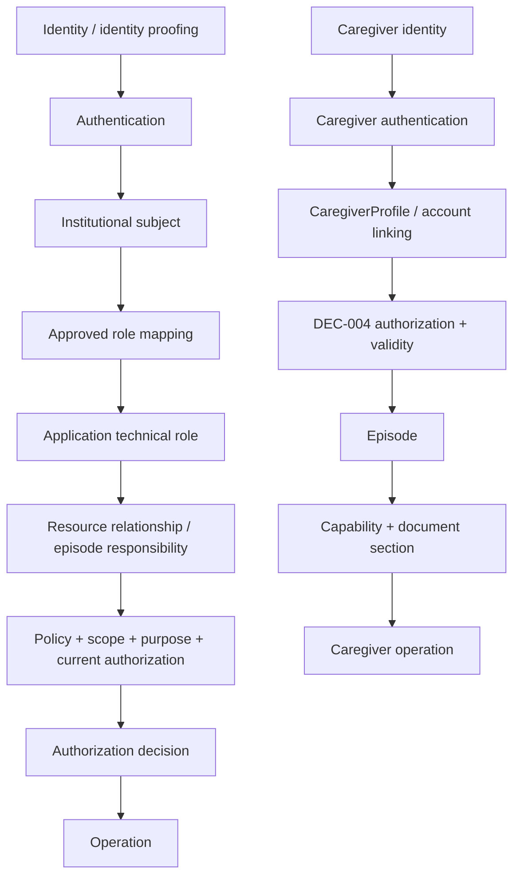
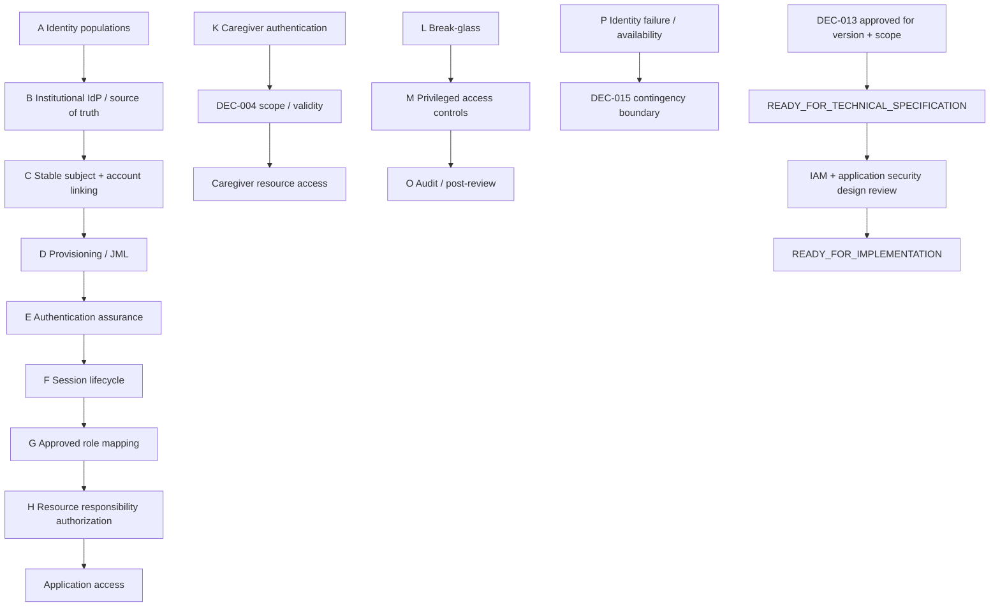

# DEC-013 — Paquete institucional de decisión sobre identidad y acceso

## Control del documento

| Campo | Valor |
|---|---|
| Tipo | `DECISION SUPPORT EVIDENCE` |
| Decisión canónica | `DEC-013` |
| Requisito principal | `REQ-12` |
| Decision pack document status | `FINAL` — no canónico |
| Canonical DEC-013 status | `Pendiente` |
| Current gate | `READY_FOR_INSTITUTIONAL_DECISION` |
| Autoridad primaria registrada | Dirección TI |
| Evidencia técnica inspeccionada | Repositorio en `ac597de` |
| Alcance | Poblaciones de identidad, IdP, subject linking, provisioning, assurance, sesiones, role mapping, autorización por recurso, acceso privilegiado, break-glass, auditoría y fallo de identidad |
| Bloqueo actual | `AUTENTICACIÓN PRODUCTIVA` |
| No constituye | IdP institucional, diseño IAM aprobado, integración, security validation, autenticación productiva, acceso de emergencia, aprobación de piloto ni autorización para implementar |

Este paquete prepara la decisión institucional:

> Proveedor institucional, mapeo de roles, autenticación reforzada, sesiones y
> acceso de emergencia.

`DEC-013-A` a `DEC-013-P` son identificadores de trabajo dentro de la única
decisión canónica DEC-013. No son decisiones canónicas independientes.

## 1. Estado y límites

| Plano | Estado actual / valores | Efecto |
|---|---|---|
| Decision pack document status | `FINAL` | El paquete está preparado para revisión; no aprueba DEC-013 |
| Decision form template status | `FINAL` | La plantilla está preparada; no es un workbook completado |
| Institutional decision workbook status | `DRAFT / UNDER_REVIEW / FINAL` | Estado de una futura instancia; no cambia DEC-013 |
| Canonical DEC-013 status | `Pendiente` | Único estado canónico actual |
| Current gate | `READY_FOR_INSTITUTIONAL_DECISION` | Gate de preparación, no aprobación |

Esta rama no integra un IdP, no selecciona vendor o protocolo, no implementa
MFA, no cambia cookies o sesiones, no modifica roles y no crea break-glass,
impersonation o service accounts.

## 2. Separaciones semánticas obligatorias

```text
IDENTITY PROOFING ≠ AUTHENTICATION
AUTHENTICATION ≠ AUTHORIZATION
AUTHORIZATION ≠ CLINICAL RESPONSIBILITY
ROLE MAPPING ≠ RESOURCE ASSIGNMENT
SESSION ≠ AUTHORIZATION GRANT
ASSIGNEE ≠ AUTHORITY
ADMIN ≠ CLINICAL ACCESS
SUPPORT ≠ ADMIN ≠ INSTITUTIONAL SECURITY FUNCTION ≠ CLINICAL PROFESSIONAL
BREAK-GLASS ≠ NORMAL ACCESS ≠ UNLIMITED ACCESS
```

Los roles técnicos runtime actuales son exactamente `admin`, `nurse`,
`clinician`, `patient`, `caregiver` y `support`. “Institutional security
function” designa una función organizativa de seguridad/IAM, no un séptimo rol
de aplicación.

Una cuenta deshabilitada no implica necesariamente que todas sus sesiones estén
revocadas en el IdP o en otros sistemas. En el demo actual, `User.isActive=false`
hace que una petición posterior no produzca principal autenticado, pero no
actualiza por sí sola `SessionMetadata.revokedAt`. El contrato institucional
debe resolver propagación y revocación real.

`PATIENT LOGIN IDENTITY ≠ DEC-001 discharge identity verification`: autenticar
una cuenta paciente no demuestra que el episodio se vinculó conforme al protocolo
de alta.

`CAREGIVER LOGIN ≠ DEC-004 caregiver authorization`: autenticar a una persona
cuidadora no acredita representación, vigencia, episodio, capability o sección
autorizada.

### Autoridad primaria y dependencias consultivas

`DEC-013 PRIMARY AUTHORITY = Dirección TI`.

Privacidad/DPO, Responsable del Tratamiento, owners de workflows clínicos,
Dirección Médica, Dirección de Enfermería y las autoridades de DEC-001,
DEC-003, DEC-004, DEC-005, DEC-014, DEC-015 y DEC-016 aportan evidencia o
mantienen autoridad sobre sus propias decisiones. Pueden bloquear un capability
scope dependiente, pero no se convierten por ello en coautoridades de DEC-013.

### Approved capability scopes

Cada scope se aprueba, excluye o difiere de forma independiente:

| Capability scope | Límite |
|---|---|
| `WORKFORCE_AUTHENTICATION` | Autenticación de profesionales y workforce expresamente incluidos |
| `PATIENT_AUTHENTICATION` | Autenticación de paciente, separada de DEC-001/003 |
| `CAREGIVER_AUTHENTICATION` | Autenticación de caregiver, separada de DEC-004 |
| `ADMIN_SUPPORT_ACCESS` | Acceso técnico ordinario permitido por función |
| `PRIVILEGED_ACCESS` | Privilegio standing, temporal, JIT o elevado |
| `BREAK_GLASS` | Acceso excepcional de emergencia, si se aprueba |
| `SERVICE_IDENTITY` | Identidad no humana para un contrato real |

`ADMIN_SUPPORT_ACCESS ≠ PRIVILEGED_ACCESS ≠ BREAK_GLASS`. Aprobar un scope no
aprueba ninguno de los otros seis. Todo scope `EXCLUDED` o `DEFERRED` continúa
bloqueado.

## 3. Evidencia inspeccionada

La inspección cubrió README, registro de decisiones, autorización, workflow,
arquitectura GAS 2.0, orden de implementación, ownership boundaries, trazabilidad
Markdown/CSV, paquetes DEC-002/014/017 y ADR-0003/0004/0008/0009/0012/0013/0014.

También se revisaron:

- `IdentityProvider`, `DemoLoginService`, `LogoutService` y
  `PrismaDemoIdentityProvider`;
- `User`, `RoleAssignment`, `SessionMetadata`, `CaregiverSession`,
  `CaregiverAccessAudit` y `AuditEvent`;
- emisión/hash de tokens, cookies, lectura de sesión, entorno, loopback, CSRF y
  rate limiting;
- asignación administrativa de roles y su transacción;
- autorización deny-by-default, guards HTTP, responsabilidad del episodio,
  Human Authorization y evidence view;
- invitación, aceptación, sesión, portal, scope, logout y revocación del cuidador;
- migraciones y pruebas unitarias, integración y E2E de esos contratos;
- búsquedas literales de IdP, session, cookie, roles, poblaciones, revocación,
  login/logout, autorización, loopback, OIDC/OAuth/SAML/MFA, claims, tokens,
  impersonation, break-glass, organization y service identities.

No se usa documentación externa para atribuir capacidades a un IdP o política
institucional inexistentes.

## 4. Baseline técnico real

### 4.1. Poblaciones que pueden autenticarse hoy

El endpoint demo admite únicamente seis aliases fijos sintéticos:

| Población | Alias | Rol técnico inicial | Mecanismo actual |
|---|---|---|---|
| Technical / operations | `demo-admin` | `admin` | Login demo local |
| Workforce clinical | `demo-nurse` | `nurse` | Login demo local |
| Workforce clinical | `demo-clinician` | `clinician` | Login demo local |
| Patient | `demo-patient` | `patient` | Login demo local |
| Caregiver | `demo-caregiver` | `caregiver` | Login demo local; además requiere sesión de portal |
| Technical / operations | `demo-support` | `support` | Login demo local |

No existen cuentas reales ni creación productiva de cuentas. El seed crea las
identidades fijas y normaliza roles demo inesperados sin borrar historia.

### 4.2. Proveedor de identidad

`DemoIdentityProvider` recibe solo `syntheticAlias`. Su adaptador:

- exige `DEMO_MODE=true`;
- rechaza producción;
- resuelve un `User` sintético y activo;
- devuelve todas las `RoleAssignment` con `revokedAt=null`;
- no usa contraseña, federación, token de IdP o atributos clínicos.

`InstitutionalIdentityProvider<AuthenticationContext>` existe solo como port
genérico. No tiene adaptador, contexto, protocolo, claims, issuer, audience,
callback, secreto o tests de integración.

### 4.3. Sesión general

| Elemento | Baseline |
|---|---|
| Creación | `POST /api/demo/session` tras autenticar alias sintético |
| Persistencia | PostgreSQL, tabla `session_metadata` |
| Credencial | 32 bytes aleatorios en base64url; solo SHA-256 se persiste |
| Cookie | `guardian_demo_session`, `HttpOnly`, `SameSite=Strict`, path `/` |
| `Secure` | Configurable; obligatorio en `NODE_ENV=production`, aunque el demo está prohibido allí |
| Expiración | Absoluta; `DEMO_SESSION_TTL_HOURS`, rango 1–12, ejemplo/default demo 8 |
| Idle timeout | Ausente |
| Refresh | Ausente |
| Rotación | Ausente |
| Sesiones concurrentes | No existe límite o unicidad por usuario |
| Logout | Revoca una `SessionMetadata` y expira esa cookie |
| Global logout | Ausente |
| Revocación central de IdP | Ausente |

Cada lectura de sesión revalida que:

1. el hash corresponde a una sesión existente;
2. la sesión no está revocada;
3. no ha expirado;
4. `User.isActive=true`;
5. existe al menos una `RoleAssignment` activa.

Los roles se vuelven a leer en cada petición. La sesión no congela un snapshot de
roles y no concede por sí sola acceso a un recurso.

### 4.4. Login, logout y rate limiting

- El login acepta solo el patrón cerrado de aliases demo.
- Las rutas demo validan `Host` loopback y rechazan cualquier
  `X-Forwarded-Host` no loopback.
- Las mutaciones exigen `Origin` exacto de la aplicación.
- El login aplica 5 intentos por 60 segundos a una clave hash de alias + user
  agent.
- El limiter vive en memoria de proceso: no es distribuido, persistente ni
  perimetral.
- La aceptación de invitación de cuidador no usa ese limiter de login.
- Logout general y logout cuidador invalidan primero la fila persistida y después
  expiran la cookie correspondiente.

### 4.5. `User` y `RoleAssignment`

`User` contiene ID interno, alias y label sintéticos, `isSynthetic`,
`isActive` y `createdAt`. No contiene subject externo, issuer, tenant,
organization, email institucional o datos de identity proofing.

`RoleAssignment` contiene:

```text
userId + role + assignedById? + assignedAt + revokedAt?
```

Un índice parcial impide dos asignaciones activas del mismo rol al mismo usuario.
La lectura de sesión y los casos de uso críticos consideran activa una asignación
solo cuando `revokedAt=null`.

Existe asignación administrativa demo. Requiere actor `admin` activo, target
sintético/activo no reservado, no duplicidad y auditoría en la misma transacción.
No existe endpoint o caso de uso de revocación de `RoleAssignment`, aunque el
schema y el enum de auditoría contemplan `revokedAt`/`ROLE_REVOKED`.

Las seis identidades fijas no admiten roles adicionales por la API. Otros usuarios
sintéticos podrían recibir más de un rol; el principal conserva una lista de
roles, no un único puesto institucional.

### 4.6. Autorización por rol y recurso

La matriz de dominio es deny-by-default. El rol técnico solo supera la primera
puerta. Los casos de uso vuelven a comprobar usuario/rol activo y relación con el
recurso.

Para un episodio profesional:

```text
authenticated principal
+ nurse|clinician technical role
+ active User
+ active RoleAssignment
+ responsibleNurseId|responsibleClinicianId = actor
+ operation-specific policy
= authorization decision
```

La workqueue filtra únicamente episodios donde el actor es responsable actual.
La creación de tarea derivada añade `AlertReview` real y
`DefaultHumanAuthorizationPolicy`. Assignment de tarea no sustituye
responsabilidad de episodio ni autoridad.

### 4.7. Admin y support

| Rol | Puede hacer hoy | No puede hacer hoy |
|---|---|---|
| `admin` | Administrar roles demo bajo restricciones; configurar protocolos/check-in y catálogo/activación técnica de reglas sintéticas; leer metadata técnica simulada | No hereda episodio, Plan, check-ins, avisos, workqueue, evidence view, Domicilio Seguro, SBAR ni notas clínicas |
| `support` | Autenticarse, ver página de health demo y metadata técnica simulada | No administra roles, no accede a contenido clínico, no consulta evidence view, no acepta invitación de cuidador y no impersona |

No existe un rol runtime `security` o `privacy`, ni PAM/JIT productivo.

### 4.8. Sesión y acceso del cuidador

Una persona cuidadora necesita dos capas distintas:

1. sesión general demo con rol técnico `caregiver`;
2. aceptación de invitación local de un uso que crea `CaregiverSession`.

La segunda cookie es `guardian_caregiver_session`, `HttpOnly`,
`SameSite=Strict`, path `/api/demo/caregiver` y `Secure` según la misma
configuración.

`CaregiverSession` reside en PostgreSQL y referencia autorización, perfil,
episodio e invitación. Su expiración es el mínimo entre la autorización y
`CAREGIVER_DEMO_SESSION_TTL_HOURS` (1–12, default demo 8). La invitación usa
5–120 minutos, default demo 30. Son supuestos demo, no política institucional.

Cada petición del portal revalida:

- sesión no revocada/no expirada;
- usuario cuidador activo y rol `caregiver` activo;
- integridad invitación–perfil–autorización–episodio;
- identidad cuidadora coincidente;
- paciente/episodio sintéticos y enlazados;
- política y autorización legal `caregiver:portal` efectivas;
- última versión de scope del episodio;
- capability, sección y permiso documental aplicables.

### 4.9. Revocación actual

| Hecho | Efecto actual | Límite |
|---|---|---|
| Logout general | `SessionMetadata.revokedAt` de esa sesión | No global logout |
| Sesión general revocada/expirada | Siguiente request no autentica | Sin propagación a IdP |
| `User.isActive=false` | Siguiente request no autentica | La fila de sesión no se marca revocada |
| `RoleAssignment.revokedAt` | Rol no aparece en la siguiente lectura | No existe workflow HTTP de revocación; otros roles activos podrían mantener sesión |
| Logout cuidador | Revoca esa `CaregiverSession` | No modifica autorización legal |
| Revocación de caregiver authorization | Crea `RevocationEvent`, revoca todas sus sesiones activas y conserva historia | No resuelve DEC-004/005 |
| Cambio de scope | Crea versión N+1 | La sesión sigue ligada al episodio y usa la última versión |

La revocación de cuidador serializa contra accesos/mutaciones mediante locks y
triggers. No borra invitaciones, scopes, sesiones, observaciones o documentación.

### 4.10. Auditoría de identidad y acceso

`AuditEvent` es append-only y minimizado. Existen acciones para login demo,
logout, asignación/revocación de rol y acceso de cuidador. El comportamiento
verificado incluye:

- login exitoso: sesión + `DEMO_LOGIN SUCCESS` en la misma transacción;
- login denegado: `DEMO_LOGIN DENIED` sin copiar alias;
- logout general: revocación + `SESSION_LOGOUT SUCCESS`;
- asignación de rol: asignación + `ROLE_ASSIGNED SUCCESS`;
- invitación/aceptación/scope/revocación/logout cuidador con `AuditEvent` y/o
  `CaregiverAccessAudit`.

No toda denegación genérica 401/403 crea `AuditEvent`. Los tokens, cookies,
Authorization, aliases intentados y contenido clínico no deben copiarse a
auditoría, logs, tickets, trazas o governance evidence.

### 4.11. Capacidades ausentes confirmadas

| Capacidad | Estado |
|---|---|
| IdP institucional implementado | `ABSENT`; solo port |
| Federation | `ABSENT` |
| OIDC/OAuth/SAML | `ABSENT` |
| MFA/2FA/strong authentication | `ABSENT` |
| Stable external subject/issuer semantics | `ABSENT` |
| Institutional provisioning/JML/SCIM | `ABSENT` |
| Central session management/global logout | `ABSENT` |
| Refresh/rotation/idle timeout | `ABSENT` |
| Production role mapping | `ABSENT` |
| Break-glass/emergency access | `ABSENT` |
| Impersonation | `ABSENT` |
| Account recovery/password/factor recovery | `ABSENT` |
| Organization/hospital/tenant scope | `ABSENT` |
| Non-human/service identity | `ABSENT` |

Estas ausencias no seleccionan la solución futura.

## 5. Poblaciones de identidad

| Población | Baseline | Decisiones separadas necesarias | No asumir |
|---|---|---|---|
| Workforce clinical | `nurse`, `clinician` demo | Realm/IdP, subject, JML, assurance, sesión, role mapping y fuente de responsabilidad de episodio | Acceso global por grupo |
| Technical / operations | `admin`, `support` demo | Segregación admin/support, consulta a la función institucional de seguridad/IAM, privilegio permanente/JIT, assurance, access review y límites de metadata | Admin = clinical; support = admin; crear o asumir rol runtime `security` |
| Patient | `patient` demo | Identity proofing, account linking a `Patient`, recovery, assurance proporcional y sesión | Login = DEC-001 o DEC-003 |
| Caregiver | `caregiver` demo + sesión portal | Identity proofing, invitation acceptance, linking, recovery, sesión y revocación con DEC-004 | Login = representación/autorización |
| Non-human / service | Ausente | Solo si una integración real lo necesita: workload identity, scope, rotación y no-interactive login | Crear service account preventivo |

No se decide si comparten IdP, realm, factores, provisioning o lifecycle.

## 6. Cadena de autorización



Un IdP claim no reemplaza ninguna de las puertas posteriores.
Para `admin` y `support`, el resource layer conserva denegación clínica por
defecto aunque el role mapping sea válido.

## 7. Subdecisiones DEC-013-A a DEC-013-P

### DEC-013-A — Identity populations / realms

Definir poblaciones en scope, realms o dominios, posibles IdP compartidos y
poblaciones diferidas. Aprobar una población no aprueba otra.

### DEC-013-B — Institutional identity provider

Identificar source of truth, uno o varios IdP, disponibilidad, ownership y
protocolos realmente soportados. No se seleccionan vendor, OIDC, SAML u otro
protocolo sin evidencia.

### DEC-013-C — Subject identifier / account linking

Definir issuer + identificador estable, cambios de email/nombre, colisiones,
múltiples organizaciones, unlink/relink y recuperación. No usar email como
identificador estable por conveniencia. Preservar el ID interno inmutable salvo
diseño de migración aprobado.

### DEC-013-D — Account provisioning / lifecycle

Elegir por población entre pre-provisioning, JIT, sync, manual, SCIM u otro
mecanismo real. Definir joiner, mover, leaver, suspensión, reactivación,
terminación, reconciliación y autoridad.

### DEC-013-E — Authentication assurance

REQ-12 exige autenticación reforzada para profesionales. Por ello,
password-only para `nurse`, `clinician` o workforce profesional se clasifica
`NOT_ELIGIBLE_UNDER_CURRENT_REQ_12`; no es una opción libremente seleccionable
mientras el requisito canónico siga vigente. Esto no selecciona MFA ni determina
qué mecanismo o assurance concreto satisface REQ-12.

Para patient/caregiver debe definirse assurance proporcional, incluida la
evaluación institucional de factores, dispositivo, reauthentication, step-up y
evidencia. No se fija nivel ni se afirma cumplimiento normativo.

### DEC-013-F — Session lifecycle

Definir creación, absolute lifetime, idle timeout, refresh, rotation, sesiones
concurrentes, logout local/global, revocación, cambio de credencial/rol,
account disablement y terminación laboral. No se seleccionan tiempos.

### DEC-013-G — Role mapping

Definir y versionar:

```text
IdP group/claim
→ institutional function
→ application technical role
→ resource relationship/responsibility
→ policy/scope
→ authorization
```

Registrar autoridad de alta/cambio/revocación, precedencia, conflictos,
separación de funciones, review y effective date. El mapping no concede acceso
global, responsabilidad de episodio ni acceso directo a un recurso.

### DEC-013-H — Resource / responsibility authorization

Definir la fuente institucional de responsabilidad de episodio, su sincronización,
vigencia, propósito, scope y fallo. No inventar una integración HCE. Preservar
denegación si no puede demostrarse responsabilidad actual.

### DEC-013-I — Admin / support segregation

Definir administración de plataforma, soporte, función institucional de
seguridad/IAM y acceso clínico por separado. La función de seguridad/IAM no es
un rol runtime. Resolver grant de privilegios, dual control, JIT, metadata,
export, impersonation como decisión separada y access review. Preservar:

```text
admin → no clinical access by default
support → no clinical access by default
```

### DEC-013-J — Patient authentication

Definir identity proofing/login, linking a `Patient`, recuperación, account
takeover controls y sesión. Mantener separado DEC-001 y DEC-003. No diseñar
eID/identidad nacional sin evidencia.

### DEC-013-K — Caregiver authentication

Definir identity proofing, invitation acceptance, account linking, recovery,
sesión y efecto de revocación. Mantener DEC-004 como fuente de autorización,
scope, vigencia y representación.

### DEC-013-L — Break-glass / emergency access

Primero decidir si existe una política institucional aplicable. Si se incluye,
definir solicitante, usuario, motivo, scope, duración, step-up, notificación,
audit/review posterior y exportación. No admitir bypass silencioso o acceso
universal irrestricto.

### DEC-013-M — Privileged access / JIT

Decidir standing privilege, temporary privilege, JIT o combinación para admin,
support y funciones institucionales de seguridad/IAM cuando proceda. Definir
aprobación, caducidad, separación, review y evidencia. No se crea un rol
`security` ni PAM.

### DEC-013-N — Non-human / service identities

Solo si existe un job, conector o integración real: decidir workload identity,
client credentials u otro mecanismo; scopes mínimos; rotación; ownership;
revocación; no interactive login; y observabilidad sin secretos. Puede diferirse.

### DEC-013-O — Audit / access evidence

Definir evidencia mínima y retention owner para success/failure, role
assignment/revocation, session revocation, privileged access, break-glass,
account disablement y versión de mapping. No convertir indiscriminadamente logs
en `AuditEvent` y no copiar credenciales.

### DEC-013-P — Identity failure / availability

Definir comportamiento ante IdP unavailable, token inválido, clock skew,
credencial expirada, revocación no propagada y recuperación. Relacionar
contingencia con DEC-015. No usar credenciales demo ni bypass local como fallback
productivo.

## 8. Modelo de roles técnicos

| Technical role | Current technical capabilities | Institutional mapping required? | Global clinical access? | Resource check required? | DEC-013 primary authority |
|---|---|---:|---:|---:|---|
| `admin` | Roles demo; configuración sintética de protocolos/reglas; metadata técnica | Sí | No | Sí para cada superficie; clínico denegado | Dirección TI |
| `nurse` | Episodio/Plan/check-in/avisos/workqueue/evidence/Domicilio/SBAR de episodios responsables | Sí | No | Rol activo + responsabilidad + policy | Dirección TI |
| `clinician` | Igual acceso profesional asignado; aprobación técnica de regla; decisiones legales delimitadas | Sí | No | Rol activo + responsabilidad + policy | Dirección TI |
| `patient` | Registro/consulta propia, check-ins propios y gestión de acceso cuidador bajo protocolo | Sí | No | Identidad propia + relación Patient/episodio + policy | Dirección TI |
| `caregiver` | Aceptar invitación y portal bajo sesión/scope separado | Sí | No | Autorización + episodio + capability + documento | Dirección TI |
| `support` | Health y metadata técnica sanitizada demo | Sí | No | Artefacto técnico allowlisted | Dirección TI |

Los nombres técnicos no son puestos institucionales ni sustituyen el campo
canónico `Rol autorizado` de trazabilidad. Las autoridades de recurso,
DEC-001/003/004 y las autoridades clínicas/jurídicas según operación son
dependencias consultivas separadas; la autoridad primaria de DEC-013 sigue
siendo Dirección TI.

## 9. Matriz de sesiones

| Population | Session source | Storage | Cookie/token | Expiration | Revocation | Global logout? | Role revalidation? | Resource revalidation? | Production ready? |
|---|---|---|---|---|---|---:|---:|---:|---:|
| Workforce | Demo alias | PostgreSQL `SessionMetadata` | `guardian_demo_session` | 1–12 h; default demo 8 | Logout individual; DB flag | No | Sí, cada request | Sí, episodio/caso de uso | No |
| Admin/support | Demo alias | PostgreSQL `SessionMetadata` | Igual | Igual | Igual | No | Sí | Sí, matriz por recurso | No |
| Patient | Demo alias | PostgreSQL `SessionMetadata` | Igual | Igual | Igual | No | Sí | Sí, identidad/relación propia | No |
| Caregiver general | Demo alias | PostgreSQL `SessionMetadata` | Igual | Igual | Igual | No | Sí | Sí | No |
| Caregiver portal | Invitación local + sesión general | PostgreSQL `CaregiverSession` | `guardian_caregiver_session` | Mínimo TTL demo/autorización | Logout individual o revocación masiva por autorización | No | Sí | Sí, authorization/scope/documento | No |
| Service identity | `ABSENT` | `ABSENT` | `ABSENT` | `ABSENT` | `ABSENT` | N/A | N/A | N/A | No |

## 10. Invariantes de revocación que debe resolver DEC-013

1. `role revoked → future requests do not receive that role`.
2. `account disabled → institutional session propagation policy required`.
3. `caregiver authorization revoked → current portal access unusable`, conservando
   la garantía técnica actual y sin borrar historia.
4. `employment termination → product access revocation policy pending`.
5. `mapping version withdrawn → no silent continuation under stale mapping`.
6. `session revoked → token replay denied`.

Role revocation, account disablement, IdP session invalidation y caregiver legal
revocation son hechos distintos.

## 11. Break-glass: opciones y riesgos

Riesgos a evaluar: privilege escalation, scope excesivo, cuenta compartida,
credential theft, uso silencioso, duración olvidada, exportación indebida,
ausencia de post-review y normalización del mecanismo como workflow ordinario.

Opciones neutrales:

- no incluir break-glass en el primer approved scope;
- acceso excepcional solicitado/aprobado con scope y duración limitados;
- mecanismo institucional externo referenciado;
- `CUSTOM_OPTION` que preserve autenticación reforzada, mínimo privilegio,
  evidencia y revisión.

No es una opción admisible `universal unrestricted admin access`.

## 12. Impersonation, recovery, claims y tokens

### Impersonation

`ABSENT`. No se añade como requirement. Si Dirección TI lo considera, requiere
otra decisión explícita sobre purpose, autorización, scope, indicador visible,
duración, auditoría y post-review. Debe evaluarse primero si soporte sin
impersonation satisface la necesidad.

### Authentication failure y account recovery

No existe workflow para password recovery, factor perdido, locked/compromised
account o re-verificación. Debe definirse por población y ownership de helpdesk.
No usar security questions ni introducir PII en el repositorio.

### Claim minimization

Un futuro diseño debe justificar individualmente subject, issuer,
organization/tenant y referencias de grupo/rol. No copiar todos los claims ni
almacenar access token, ID token completo, refresh token o perfil arbitrario sin
requisito.

### Token boundary

Los tokens son credenciales. Están prohibidos en logs, `AuditEvent`,
GovernanceEvidence, tickets, trazas, errores, screenshots e incident records.
Este paquete no decide su almacenamiento.

## 13. Organization scope y separación de entornos

El modelo actual no contiene `organization`, hospital o tenant. No hay
multitenancy. Una futura identidad de organización A no puede adquirir acceso a
organización B; el scope organizativo es una decisión candidata si aplica.

| Entorno | Regla actual / pendiente |
|---|---|
| Local demo | Alias sintéticos, loopback, `DEMO_MODE=true` |
| Test | Datos sintéticos y configuración de prueba |
| Staging | Sin IdP ni cuentas institucionales definidos |
| Production | Demo prohibido; autenticación productiva bloqueada |

El proveedor demo no es fallback productivo. La especificación futura debe
definir gates por entorno, cuentas de prueba sintéticas y evidencia de que demo
login no puede activarse.

## 14. Minimum blocking decision set por scope

Leyenda:

- `B`: bloqueante para el scope;
- `C`: condicional al mecanismo/capacidad seleccionados;
- `D`: puede diferirse con exclusión explícita;
- `N/A`: no pertenece a ese scope.

| ID | WORKFORCE_AUTHENTICATION | PATIENT_AUTHENTICATION | CAREGIVER_AUTHENTICATION | ADMIN_SUPPORT_ACCESS | PRIVILEGED_ACCESS | BREAK_GLASS | SERVICE_IDENTITY | Pilot |
|---|---:|---:|---:|---:|---:|---:|---:|---:|
| A Populations/realms | B | B | B | B | C | C | C | B |
| B IdP | B | B | B | B | B | B | B | B |
| C Subject/linking | B | B | B | B | B | B | B | B |
| D Provisioning/JML | B | B | B | B | B | B | B | B |
| E Assurance | B | B | B | B | B | B | B | B |
| F Session lifecycle | B | B | B | B | B | B | C | B |
| G Role mapping | B | C | C | B | B | B | C | B |
| H Resource responsibility | B | B | B | C | B | B | B | B |
| I Admin/support segregation | N/A | N/A | N/A | B | B | C | C | B |
| J Patient authentication | N/A | B | N/A | N/A | N/A | N/A | N/A | C |
| K Caregiver authentication | N/A | N/A | B | N/A | N/A | N/A | N/A | C |
| L Break-glass | D | D | D | D | C | B | N/A | C |
| M Privileged access/JIT | C | N/A | N/A | B | B | B | C | C |
| N Service identities | D | D | D | D | C | N/A | B | C |
| O Audit/access evidence | B | B | B | B | B | B | B | B |
| P Failure/availability | B | B | B | B | B | B | B | B |

Interpretación:

- workforce puede aprobarse sin patient/caregiver/service identity si quedan
  excluidos;
- patient y caregiver requieren linking y autorización de recurso, no solo IdP;
- `ADMIN_SUPPORT_ACCESS`, `PRIVILEGED_ACCESS` y `BREAK_GLASS` son scopes
  independientes;
- break-glass puede diferirse, pero si está en scope L/M/O/P son bloqueantes;
- service identity puede diferirse hasta existir integración real;
- pilot sigue bloqueado por DEC-016 y todas las decisiones aplicables al approved
  pilot scope.

## 15. Grafo de dependencias



## 16. Future implementation impact map

Clasificación condicional; no autoriza cambios:

| Área | Impacto futuro posible | Baseline |
|---|---|---|
| Identity provider ports | `APPLICATION_CHANGE` + `INTEGRATION_REQUIRED` | Port institucional vacío |
| Authentication routes | `SECURITY_CHANGE` + `APPLICATION_CHANGE` | Solo `/api/demo/session` |
| Sessions | `SECURITY_CHANGE`; `SCHEMA_CANDIDATE` | Sesión server-side demo sin refresh/idle/global logout |
| Cookies | `SECURITY_CHANGE` o `NO_CHANGE` | HttpOnly/Strict; policy productiva ausente |
| `User` | `SCHEMA_CANDIDATE` + `MIGRATION_CANDIDATE` | Sin subject/issuer/org |
| `RoleAssignment` | `APPLICATION_CHANGE` + posible `SCHEMA_CANDIDATE` | Rol técnico local y revocación timestamp |
| Caregiver session/access | `SECURITY_CHANGE` + `INTEGRATION_REQUIRED` | Segunda sesión demo y autorización granular |
| Resource authorization | `SECURITY_CHANGE` + `INTEGRATION_REQUIRED` | Responsabilidad de episodio local |
| Episode responsibility | `INTEGRATION_REQUIRED` | IDs de responsables en `DischargeEpisode` |
| Authorization matrix | `APPLICATION_CHANGE` documental/técnico | Roles demo deny-by-default |
| Admin/support surfaces | `SECURITY_CHANGE` + `APPLICATION_CHANGE` | Configuración/health demo |
| `AuditEvent` | `NO_CHANGE` o `APPLICATION_CHANGE` | No usar como token/log store |
| Error handling | `NO_CHANGE` o `SECURITY_CHANGE` | Contrato público sanitizado |
| Rate limiting | `INFRASTRUCTURE_CHANGE` + `SECURITY_CHANGE` | In-memory local |
| Deployment/config | `INFRASTRUCTURE_CHANGE` | Sin trust/config de IdP |
| Secrets | `INFRASTRUCTURE_CHANGE` + `SECURITY_CHANGE` | No existen secrets de IdP |
| CI/E2E | `APPLICATION_CHANGE` | Solo identidad demo y permisos sintéticos |

No se decide todavía si alguno requiere migration. Toda propuesta debe reutilizar
los IDs internos y fuentes actuales cuando sea seguro, sin crear un segundo
sistema de autorización.

## 17. Riesgos de migración y account linking

La transición demo → IdP puede afectar usuarios sintéticos, assignments,
referencias de sesión y auditoría. Riesgos:

- sustituir IDs internos por email o claim mutable;
- enlazar dos personas por coincidencia débil;
- colisión de subject entre issuers/organizaciones;
- preservar un rol demo como rol institucional;
- sesiones antiguas activas tras linking o cambio de rol;
- pérdida de attribution histórica.

Debe evaluarse mantener `User.id` inmutable y enlazar subjects externos
versionados, pero este paquete no fija el esquema ni diseña la migración.

## 18. Failure modes que deberá cubrir la especificación

| Failure mode | Pregunta / resultado seguro requerido |
|---|---|
| IdP unavailable | ¿Qué falla cerrado y qué deriva a DEC-015? Sin bypass demo |
| Token invalid/signature invalid | Denegar sin revelar detalle ni aceptar claim parcial |
| Clock skew | Tolerancia aprobada y probada; no inventada |
| Credential expired | Reauthentication/recovery por población |
| Role revoked | Próxima autorización sin el rol; propagación medible |
| Account disabled | Política de sesiones y reconciliación |
| Claim changed | Mapping/version conflict y no escalado silencioso |
| Subject collision | Denegar linking y someter a proceso autorizado |
| Session replay | Token revocado/rotado no reutilizable |
| Logout failure | Estado visible, retry seguro y no falsa confirmación |
| Revocation propagation failure | Fail closed y evidencia técnica sin token |
| Break-glass abuse | Detección, limitación, notificación y post-review |

## 19. Security events y fronteras con otras decisiones

Eventos candidatos —no incidentes automáticos— incluyen auth failures repetidos,
role assignment/revocation, privileged access, break-glass y fallo de revocación.
DEC-013 define qué evidencia de identidad/acceso existe; DEC-014 define incident
operations, sanitización operativa y handoffs.

| Decisión | Relación | No se resuelve aquí |
|---|---|---|
| DEC-001 | Verificación de identidad y alta | Patient login no valida el episodio |
| DEC-003 | Participación, comunicaciones y base aplicable | Authentication no equivale a consentimiento |
| DEC-004 | Caregiver representation/scope/validity/revocation | Caregiver login no concede acceso |
| DEC-014 | Support/observability segregation e incident operations | DEC-013 no crea support viewer ni incident workflow |
| DEC-015 | Contingencia ante caída, RTO/RPO y fallback local | DEC-013 no aprueba modo alternativo |
| DEC-016 | Gate de pacientes/datos/entorno real | Aprobar DEC-013 no autoriza piloto |

## 20. Gate posterior a la aprobación

```text
READY_FOR_INSTITUTIONAL_DECISION
→ institutional evidence / approval
→ READY_FOR_TECHNICAL_SPECIFICATION
→ IAM + application security design review
→ integration / migration / rollback design
→ READY_FOR_IMPLEMENTATION
```

`READY_FOR_TECHNICAL_SPECIFICATION` requiere:

- `Canonical DEC-013 status = Aprobada` para policy/design version y approved
  scope concretos;
- cada uno de `WORKFORCE_AUTHENTICATION`, `PATIENT_AUTHENTICATION`,
  `CAREGIVER_AUTHENTICATION`, `ADMIN_SUPPORT_ACCESS`, `PRIVILEGED_ACCESS`,
  `BREAK_GLASS` y `SERVICE_IDENTITY` marcado expresamente como incluido,
  excluido o diferido;
- IdP/source of truth y requisitos de protocolo aprobados;
- subject semantics y account linking;
- provisioning/JML;
- authentication assurance;
- session y revocation policy;
- role mapping bajo autoridad primaria de Dirección TI;
- resource authorization boundary;
- evidencia consultiva y dependencias de security/privacy y otras decisiones;
- approval evidence reference, effective date y review date;
- blockers del scope resueltos y ninguna contradicción.

La aprobación institucional no autoriza código directamente. No debe abrirse
`feat/gas2-institutional-identity` hasta completar este gate y la revisión IAM +
application security. Nada omitido, excluido o diferido en el approved scope
queda habilitado implícitamente.

## 21. OUT_OF_SCOPE_SECURITY_FINDINGS

Resultado de esta inspección documental:

```text
NONE_CONFIRMED_AS_REPORTABLE_FINDING
```

Se observaron límites conocidos y ya documentados —limiter en memoria, ausencia
de global logout/role revocation workflow y controles exclusivamente demo—. Se
registran como baseline y blockers de DEC-013, no como vulnerabilidades
productivas confirmadas. Esta conclusión no constituye una security assessment
completa ni validación de producción.

## 22. Trazabilidad y entregables

| Artefacto | Relación | Estado preservado |
|---|---|---|
| DEC-013 | Decisión que este paquete prepara | `Pendiente` |
| REQ-12 | Autenticación y RBAC | Estado canónico sin cambios |
| REQ-01 | Boundary con identidad/verificación de alta | Sin cambio |
| REQ-05/06 | Caregiver access y revocación | Sin cambio |
| REQ-13 | Support/incident boundary | Sin cambio |
| REQ-14 | Contingencia ante fallo de identidad | Sin cambio |
| ADR-0003 | Demo identity vs institutional SSO | Sin cambio |
| ADR-0009 | Caregiver access/revocation | Sin cambio |

Entregables:

- [Matriz neutral de opciones](dec-013-option-matrix.md)
- [Formulario institucional](dec-013-decision-form.md)
- [Agenda del workshop](dec-013-workshop-agenda.md)
- [Resumen ejecutivo](dec-013-executive-brief.md)

Estado:

- `Decision pack document status = FINAL`;
- `Decision form template status = FINAL`;
- `Canonical DEC-013 status = Pendiente`;
- `Current gate = READY_FOR_INSTITUTIONAL_DECISION`.
