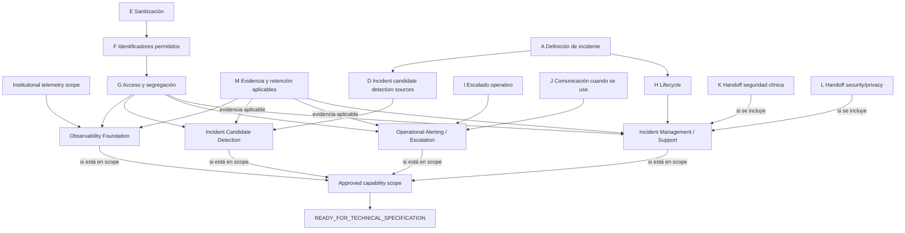

# DEC-014 — Paquete institucional de decisión sobre incidentes y soporte técnico

## Control del documento

| Campo | Valor |
|---|---|
| Tipo | `DECISION SUPPORT EVIDENCE` |
| Decisión canónica | `DEC-014` |
| Requisito principal | `REQ-13` |
| Decision pack document status | `FINAL` — no canónico |
| Canonical DEC-014 status | `Pendiente` |
| Current gate | `READY_FOR_INSTITUTIONAL_DECISION` |
| Autoridad primaria registrada | Dirección TI |
| Evidencia técnica inspeccionada | Repositorio en `82e888c` |
| Alcance | Definición, taxonomía, severidad técnica, sanitización, identificadores, acceso, lifecycle, escalado, comunicación, handoffs, evidencia y aprendizaje |
| No constituye | Procedimiento aprobado, taxonomía, SLO, política de acceso o escalado, selección de herramienta, autorización de soporte productivo o aprobación de piloto |

Este paquete prepara la decisión institucional:

> Taxonomía, segregación, escalado y gestión de incidentes sin datos clínicos.

No implanta observabilidad, soporte, ticketing o gestión de incidentes. Los
identificadores `DEC-014-A` a `DEC-014-N` son una descomposición de trabajo de la
única decisión canónica DEC-014; no son decisiones canónicas independientes.

## 1. Principios y vocabulario

```text
TECHNICAL INCIDENT ≠ CLINICAL DETERIORATION
APPLICATION ERROR ≠ CLINICAL INCIDENT
SECURITY EVENT ≠ CLINICAL RISK SCORE
SUPPORT TICKET ≠ CLINICAL RECORD
CORRELATION ID ≠ PATIENT IDENTIFIER
OBSERVABILITY ≠ SURVEILLANCE OF THE PATIENT
```

| Concepto | Significado en este paquete | No equivale a |
|---|---|---|
| Application error | Resultado técnico aislado de una petición, proceso o dependencia | Incidente por sí solo |
| Incident candidate | Hecho que una política futura podría someter a triage | Incidente confirmado |
| Technical incident | Registro institucional conforme a definición y procedimiento aprobados | Deterioro o daño clínico |
| Security event | Hecho técnico relevante para seguridad que requiere clasificación | Incidente de seguridad confirmado o riesgo clínico |
| Privacy event | Hecho que requiere valoración por la autoridad de privacidad aplicable | Conclusión jurídica o notificación automática |
| Technical severity | Impacto operativo definido por Dirección TI | Severidad del estado de una persona |
| Operational alert | Notificación futura sobre condiciones técnicas aprobadas | `Alert` del dominio clínico-organizativo |
| Clinical-safety handoff | Transferencia de una posible afectación a la autoridad asistencial competente | Decisión clínica de TI |

También se preservan estas fronteras:

- `LOG ≠ AUDIT EVENT`;
- `METRIC ≠ AUDIT EVENT`;
- `TRACE ≠ CLINICAL TRACEABILITY`;
- `INCIDENT ≠ APPLICATION ERROR`;
- `OPERATIONAL ALERT ≠ CLINICAL Alert`.

`src/domain/alerts` conserva su significado actual: avisos deterministas para
revisión humana. No debe reutilizarse como monitoring alert ni como incidente.

## 2. Evidencia inspeccionada

Se revisaron README, workflow, matriz de autorización, registro de decisiones,
arquitectura GAS 2.0, trazabilidad Markdown/CSV, clasificación de datos,
fundación de seguridad, paquetes DEC-002/DEC-017 y ADR-0002, ADR-0003, ADR-0004,
ADR-0007, ADR-0008, ADR-0012, ADR-0013 y ADR-0014.

También se inspeccionaron:

- `src/proxy.ts`, `correlation-id.ts`, `app-error.ts`, `error-handler.ts` y sus
  pruebas;
- todas las rutas de `src/app/api`, incluidas sesión, health y adaptadores de
  error;
- `AuditEvent`, sus escrituras de aplicación, modelo Prisma y evidence view;
- autenticación, autorización deny-by-default y denegaciones específicas;
- soporte UI, health UI y métricas agregadas de la workqueue;
- manejos de errores Prisma, búsquedas literales de logs, mensajes, stack,
  tracing, métricas, readiness, soporte e incidentes;
- `prisma/seed.mjs`, por ser el único otro emisor explícito a `console.error`.

No se usó documentación externa para inventar una política operativa local.

## 3. Baseline técnico real

### 3.1. Errores HTTP

El contrato público está centralizado en `AppError` y `errorResponse`.

| Error code público | HTTP | Mensaje público estable |
|---|---:|---|
| `BAD_REQUEST` | 400 | Solicitud no válida |
| `UNAUTHENTICATED` | 401 | Autenticación requerida |
| `FORBIDDEN` | 403 | Acceso denegado |
| `NOT_FOUND` | 404 | Recurso no encontrado |
| `CONFLICT` | 409 | Conflicto con el estado actual |
| `RATE_LIMITED` | 429 | Demasiados intentos |
| `INTERNAL_ERROR` | 500 | Error técnico genérico |

No existe un code público `VALIDATION`: las validaciones de forma y varios
errores de dominio se traducen a `BAD_REQUEST`. Los errores de concurrencia e
idempotencia se traducen a `CONFLICT`. Los fallos inesperados, incluidos fallos
Prisma no traducidos, terminan en `INTERNAL_ERROR`.

Las respuestas de error contienen exclusivamente:

```text
error.code
error.message
error.correlationId
```

El cliente no recibe stack, mensaje original, SQL, detalle Prisma ni `cause`.
Las respuestas exitosas observadas usan 200, 201 o 204 según la operación.

### 3.2. Correlation ID

- `src/proxy.ts` genera un UUID por request, sustituye
  `x-correlation-id` en los headers internos y lo devuelve en el response.
- `getCorrelationId()` valida un header UUID y genera otro si falta o es
  inválido; las rutas lo usan como fallback y seam de pruebas.
- Las rutas pasan el ID a casos de uso y unit of work; las mutaciones auditadas
  lo conservan en `AuditEvent`.
- Los errores lo publican en body y `X-Correlation-ID`.
- No existe `requestId` separado, propagación entre servicios, span, trace
  distribuida ni registro persistido de cada request.
- `Task`, `Alert` y `DischargeEpisode` no usan correlation ID como fuente de
  verdad. La procedencia puede transportar una referencia opcional cuando existe,
  pero no sustituye a sus fuentes de dominio.

Un UUID puede seguir siendo dato personal o permitir vinculación según contexto.
Su admisión en soporte requiere DEC-014-F; la implementación actual no demuestra
que cualquier correlation ID sea compartible fuera del runtime demo.

### 3.3. Logging

El runtime de la aplicación solo contiene un emisor explícito:

```json
{"level":"error","code":"…","correlationId":"…","component":"…"}
```

`logTechnicalError` no registra body, mensaje original, stack o `cause`. No hay
abstracción `logger`, sinks configurados, niveles adicionales, agregación,
consulta, rotación o retención definidas en el repositorio. No se emiten logs de
éxito desde las rutas.

`prisma/seed.mjs` contiene un emisor separado de desarrollo/CI y se trata en
`OUT_OF_SCOPE_SECURITY_FINDINGS`.

### 3.4. AuditEvent y otras historias

`AuditEvent` es una fuente persistida append-only para evidencia de mutaciones:

```text
actorUserId?
actorRole?
action
resourceType
resourceId?
outcome
correlationId
createdAt
```

No tiene texto libre. Las mutaciones críticas lo escriben en la misma transacción
que el cambio. `EpisodeTransition`, `AlertReview`, `TaskEvent` y otras historias
de dominio conservan hechos propios; no son logs operativos.

No toda respuesta 401/403/404/409 crea `AuditEvent`. El login denegado y accesos
de cuidador seleccionados tienen evidencia de denegación, pero una denegación
genérica de ruta normalmente produce el log técnico sanitizado, no auditoría. La
institución debe decidir qué eventos de seguridad requieren evidencia propia sin
convertir cada error en auditoría.

`CaregiverAccessAudit` es una historia específica de acceso de cuidador y tampoco
es un registro general de incidentes.

### 3.5. Health, soporte y métricas

| Capacidad | Estado real |
|---|---|
| Health | `GET /api/health`: 200 con `status` y `service`; no consulta PostgreSQL ni dependencias |
| Readiness | No existe endpoint o contrato de readiness |
| Support UI | Página demo para rol `support`; muestra health y declara «Sin módulo configurado» |
| Technical metadata | Recurso sintético de autorización accesible a `admin`/`support`; no es un visor de logs |
| Admin | Asignación demo de roles; no equivale a soporte, seguridad o respuesta a incidentes |
| Workqueue metrics | Recuentos y antigüedad agregados en response/UI: episodios, pendientes, tareas abiertas/resueltas y edad de la más antigua |
| Metrics exporter | No existe |
| Time series / labels | No existen |
| Tracing / spans | No existen |
| Operational alerts | No existen |
| SLI / SLO / SLA operativos | No existen |
| Log retention | No existe política o configuración |
| Incident record / workflow | No existe |
| Ticketing / communications | No existen |
| On-call / pager | No existen |

Las métricas de la workqueue son una proyección funcional visible a profesionales,
no telemetría exportada ni un SLI aprobado.

## 4. Descomposición de DEC-014

DEC-014 es una única decisión canónica, pero su approved scope debe separar
expresamente cuatro capacidades:

| Capacidad | Incluye | No implica por sí sola |
|---|---|---|
| `OBSERVABILITY_FOUNDATION` | Health, readiness, logs sanitizados, métricas, tracing y correlación | Detectar candidatos, notificar, escalar o gestionar incidentes |
| `INCIDENT_CANDIDATE_DETECTION` | Determinar cuándo una señal o patrón técnico entra en triage como candidato | Confirmar automáticamente un incidente o asignar severidad |
| `OPERATIONAL_ALERTING_ESCALATION` | Notificación, escalado técnico, acknowledgement y comunicación | Mitigación automática o escalado clínico |
| `INCIDENT_MANAGEMENT_SUPPORT` | Lifecycle, ownership, ticketing, handoffs, evidencia y cierre | Historia clínica, decisión clínica o sustitución del juicio humano |

La foundation aporta hechos técnicos; no “crea incidentes”. Una aprobación puede
incluir una, varias o las cuatro capacidades. Cada capacidad no incluida debe
constar como `EXCLUDED` o `DEFERRED` y permanece no autorizada.

| ID | Pregunta institucional | Límite |
|---|---|---|
| DEC-014-A | ¿Qué hecho convierte un error o degradación en incidente técnico? | No confundir con incidente clínico |
| DEC-014-B | ¿Qué categorías institucionales se usan y cómo se versionan? | No seleccionar P1/P2/SEV |
| DEC-014-C | ¿Existe severidad técnica y con qué hechos se determina? | No usar diagnóstico, riesgo o urgencia clínica |
| DEC-014-D | ¿Qué fuentes de detección pueden crear un candidato a incidente y quién confirma? | `INCIDENT CANDIDATE DETECTION SOURCES`; no es un catálogo general de telemetría |
| DEC-014-E | ¿Qué campos se permiten por canal y cómo se prueba la sanitización? | Prohibición de payload clínico y secretos |
| DEC-014-F | ¿Qué identificadores técnicos pueden compartirse y con qué finalidad? | UUID no implica anonimato |
| DEC-014-G | ¿Quién accede a logs, auditoría, métricas, trazas, tickets e incidentes? | Least privilege y segregation of duties |
| DEC-014-H | ¿Qué lifecycle, evidencia, reapertura y cierre tiene un incidente? | No codificar estados |
| DEC-014-I | ¿Qué condición escala, a qué función y con qué acknowledgement? | Escalado técnico, sin tiempos inventados |
| DEC-014-J | ¿Qué canales se permiten y qué contenido admite cada uno? | No configurar canal ni contacto real |
| DEC-014-K | ¿Cómo se entrega una posible afectación asistencial? | TI identifica posibilidad; autoridad clínica decide respuesta |
| DEC-014-L | ¿Cómo se entrega un evento a seguridad/privacidad? | Sin conclusiones jurídicas ni plazos inventados |
| DEC-014-M | ¿Qué evidencia se conserva y quién fija retención? | Retención final condicionada a DEC-005 |
| DEC-014-N | ¿Cuándo se exige RCA/postmortem y cómo se cierran acciones? | No implementar CAPA o issue tracker |

## 5. Error técnico frente a incidente

`Incident candidate?` no confirma un incidente. Significa que una política
institucional podría ordenar triage.

| Technical event | Current system behavior | Incident candidate? | Institutional decision required? | May contain sensitive data? | Sanitization required? | Audit required? |
|---|---|---|---|---|---|---|
| Validation error | 400 `BAD_REQUEST`; log mínimo | Condicional por patrón/alcance; no por defecto | Sí, umbral y abuso | El request sí; response/log actual no | Sí | No existe regla general; posible security evidence |
| Authentication failure | 401; login denegado puede auditarse | Condicional por volumen/patrón | Sí | Identidad, cookie, UA | Sí | Login demo denegado sí; resto por decidir |
| Authorization denial | 403; log mínimo | Condicional por patrón o recurso | Sí | Actor/recurso pueden ser identificables | Sí | No todas las denegaciones se auditan; decidir |
| Not found | 404 genérico | Normalmente no; patrón anómalo podría ser candidato | Sí, anti-enumeration y umbral | ID solicitado | Sí | No por defecto |
| Optimistic conflict | 409 `CONFLICT` | Normalmente no; repetición/degradación podría ser candidato | Sí | ID/revisión/payload original | Sí | Mutación ganadora puede auditarse; conflicto no necesariamente |
| Idempotency conflict | 409 `CONFLICT` | Condicional por frecuencia o abuso | Sí | Fingerprint y payload original | Sí | No existe regla general |
| Database failure | 500 `INTERNAL_ERROR`; log mínimo | Candidato claro a triage, no incidente automático | Sí | Excepción Prisma/SQL puede contener datos | Sí, estricta | Evidencia de incidente futura; no copiar excepción a AuditEvent |
| Unexpected exception | 500 genérico; log mínimo | Condicional por recurrencia/impacto | Sí | Mensaje/stack pueden contener cualquier dato | Sí, estricta | Por decidir |
| Dependency failure | No hay conectores productivos; normalmente 500 si aparece | Futuro candidato | Sí | Request/response de tercero | Sí | Por decidir con contrato |
| Build failure | Fallo de CI/build; sin workflow de incidente | Condicional al impacto de despliegue | Sí | Logs de CI, env o paths | Sí | No existe AuditEvent de build |

## 6. Propiedad de log, audit, metric y trace

| Artifact | Purpose | Source of truth | May contain clinical data? | Allowed consumers | Retention owner | Incident role | Decision required |
|---|---|---|---|---|---|---|---|
| Application log | Diagnóstico operativo de runtime | Salida runtime actual; no almacén definido | `NO` por invariant | `DECISION_REQUIRED` | DEC-005 + Dirección TI/privacidad | Evidencia técnica auxiliar, no historia clínica | Acceso, sink, campos, retención |
| `AuditEvent` | Evidencia inmutable de mutaciones | PostgreSQL `audit_events` | `NO` texto/payload; IDs minimizados | Profesionales autorizados por evidence view; soporte no definido | DEC-005 / autoridad aplicable | Contexto y atribución, no incidente | Consulta de auditoría y segregación |
| Functional aggregate | Resumen de workqueue en UI | Proyección de datos actuales | No payload; puede permitir inferencia por combinación | Profesional responsable | Fuentes de dominio | Contexto funcional, no métrica operativa | No reutilizar como telemetría sin decisión |
| Operational metric | Telemetría agregada futura | No existe | `NO`; labels minimizadas | `DECISION_REQUIRED` | DEC-005 + Dirección TI | Detección/tendencia futura | Indicadores, labels, acceso, retención |
| Trace/span | Diagnóstico de flujo futuro | No existe | `NO` por defecto | `DECISION_REQUIRED` | DEC-005 + Dirección TI | Investigación técnica futura | Attributes, sampling, acceso, retención |
| Support ticket | Coordinación de soporte futura | No existe | `NO` | `DECISION_REQUIRED` | Institución / DEC-005 | Intake y comunicación | Sistema, campos, acceso, lifecycle |
| Incident record | Fuente institucional futura del incidente | No existe | `NO` | `DECISION_REQUIRED` | Institución / DEC-005 | Source of truth del incidente si se aprueba | Ubicación, schema, ownership |
| Postmortem | Aprendizaje y decisiones técnicas | No existe | `NO` | `DECISION_REQUIRED` | Institución / DEC-005 | RCA, acciones y evidencia | Trigger, audiencia, plantilla |
| Governance Evidence View | Trazabilidad técnica read-only por episodio | Proyección sobre fuentes existentes | No copia payload; sí referencias técnicas contextualizables | `nurse`/`clinician` responsables | Fuentes subyacentes | No es visor operativo ni de soporte | Retención/exportación/acceso auditor siguen pendientes |

## 7. Matriz de sanitización

Estados:

- `NO`: prohibido por invariant del repositorio;
- `MINIMAL_ONLY`: campo técnico actual permitido solo en forma minimizada;
- `CONDITIONAL`: requiere finalidad, acceso y política aprobados;
- `SERVER_RESTRICTED`: solo candidato server-side, nunca salida pública directa;
- `N/A`: artefacto no existe o el campo no corresponde.

| Data class | Log | Metric label | Trace attribute | Incident ticket | Postmortem | Allowed? | Reason | Authority |
|---|---|---|---|---|---|---|---|---|
| Patient name | NO | NO | NO | NO | NO | NO | Identificador directo; soporte no es historia clínica | Invariant; privacidad |
| Patient ID | NO | NO | NO | NO | NO | NO | Identificador directo/seudónimo contextual | Invariant; privacidad |
| Technical episode ID | NO actual | NO | CONDITIONAL | CONDITIONAL | CONDITIONAL | CONDITIONAL | Puede vincularse a persona; no asumir anonimato | Dirección TI + privacidad |
| Caregiver ID | NO | NO | NO | NO | NO | NO por defecto | Identidad vinculada a acceso sensible | Privacidad |
| Professional ID | AuditEvent, no log | NO | CONDITIONAL | CONDITIONAL | Por función, no nombre | CONDITIONAL | Atribución puede requerir identidad en sistema segregado | Dirección TI + DEC-013/privacidad |
| Correlation ID | MINIMAL_ONLY | NO | CONDITIONAL | CONDITIONAL | CONDITIONAL | CONDITIONAL | Alta cardinalidad y capacidad de vinculación | Dirección TI |
| Request ID | N/A | NO | N/A | N/A | N/A | DECISION_REQUIRED | No existe identificador separado | Dirección TI |
| Error code | MINIMAL_ONLY | Candidato de baja cardinalidad | CONDITIONAL | CONDITIONAL | CONDITIONAL | CONDITIONAL | Útil sin payload si catálogo estable | Dirección TI |
| Component name | MINIMAL_ONLY | Candidato de baja cardinalidad | CONDITIONAL | CONDITIONAL | CONDITIONAL | CONDITIONAL | Puede revelar arquitectura interna | Dirección TI / seguridad |
| HTTP status | MINIMAL_ONLY | Candidato de baja cardinalidad | CONDITIONAL | CONDITIONAL | CONDITIONAL | CONDITIONAL | Hecho técnico no clínico | Dirección TI |
| Stack trace | NO actual | NO | SERVER_RESTRICTED | NO | NO copia | SERVER_RESTRICTED | Puede contener paths, inputs o secretos | Dirección TI / seguridad |
| SQL error | NO actual | NO | SERVER_RESTRICTED sanitizado | NO | NO copia | SERVER_RESTRICTED | Puede revelar schema, datos o query | Dirección TI / seguridad |
| Prisma error | NO actual | NO | SERVER_RESTRICTED sanitizado | NO | NO copia | SERVER_RESTRICTED | Puede contener argumento/valor/contexto | Dirección TI / seguridad |
| Clinical text | NO | NO | NO | NO | NO | NO | PHI y segunda historia clínica | Invariant |
| Clinical Alert explanation | NO | NO | NO | NO | NO | NO | Contenido clínico-organizativo | Invariant |
| Task summary | NO | NO | NO | NO | NO | NO | Puede contener texto clínico | Invariant |
| Task note | NO | NO | NO | NO | NO | NO | Puede contener texto clínico | Invariant |
| `resolutionReason` | NO | NO | NO | NO | NO | NO | Texto libre potencialmente clínico | Invariant |
| Secret/password/connection string | NO | NO | NO | NO | NO | NO | Credencial o secreto | Invariant / seguridad |
| Token | NO | NO | NO | NO | NO | NO | Credencial activa o revocable | Invariant / seguridad |
| Cookie | NO | NO | NO | NO | NO | NO | Sesión/credencial | Invariant / seguridad |
| Authorization header | NO | NO | NO | NO | NO | NO | Credencial | Invariant / seguridad |
| IP address | NO actual | NO por defecto | CONDITIONAL | CONDITIONAL | Agregada/anonimizada por decidir | CONDITIONAL | Potencialmente identificable | Dirección TI + privacidad |
| User agent | Hash en SessionMetadata, no log raw | NO | CONDITIONAL | NO por defecto | NO por defecto | CONDITIONAL | Potencialmente identificable/fingerprinting | Dirección TI + privacidad |

La tabla no resuelve base jurídica. Los `CONDITIONAL` permanecen bloqueados hasta
evidencia institucional; no significan “permitido hoy”.

### 7.1. Pruebas mínimas de sanitización requeridas tras aprobación

Las pruebas futuras de REQ-13 deben inyectar payload exclusivamente sintético con
todas las clases prohibidas y demostrar ausencia en:

- error público y headers;
- log de aplicación y cualquier sink;
- labels y attributes;
- ticket/incident record/postmortem de prueba;
- capturas y evidencia exportada.

Deben incluir casos de stack, error Prisma/SQL, token, cookie, Authorization,
Task/Alert/Plan/check-in y combinaciones de campos. La prueba debe inspeccionar la
salida real, no solo una función mock. Este paquete no implementa esas pruebas.

## 8. Contrato público frente a detalle server-side

Debe conservarse como `public-safe`:

- code cerrado y estable;
- mensaje genérico y no enumerativo;
- correlation ID técnico conforme a la política aprobada;
- HTTP status;
- ausencia de stack, SQL, Prisma, secreto y contenido clínico.

Un futuro detalle server-side solo puede existir tras definir campos, redacción,
acceso y retención. El mensaje original de una excepción no es seguro por
defecto. Riesgos explícitos:

- stack trace leakage;
- SQL/Prisma leakage;
- secret leakage;
- clinical content leakage;
- enumeración por diferencias de error;
- vinculación mediante IDs técnicos.

## 9. Opciones de severidad técnica

No se selecciona ninguna:

| Opción | Descripción | Límite |
|---|---|---|
| `OPTION_A` | Sin clasificación de severidad; triage humano documentado | No implica ausencia de impacto |
| `OPTION_B` | Matriz institucional de severidad técnica | Dirección TI define semántica, hechos y versionado |
| `OPTION_C` | Asignación determinista desde hechos técnicos aprobados | Requiere regla explicable, abstención y revisión; sin hechos clínicos |
| `CUSTOM_OPTION` | Alternativa institucional documentada | Debe mantener todas las prohibiciones |

Hechos técnicos candidatos a valorar —no aprobados—: disponibilidad, alcance,
degradación, integridad, usuarios afectados y duración. Quedan prohibidos como
inputs: diagnóstico, condición del paciente, severidad del `Alert` de dominio,
riesgo suicida, urgencia clínica, ML o LLM.

## 10. Automatización: decisiones separadas

| Capacidad futura | Estado en este paquete |
|---|---|
| Automated detection | No aprobada |
| Automated technical notification | No aprobada |
| Automated ticket creation | No aprobada |
| Automated escalation | No aprobada |
| Automated mitigation | No aprobada; requiere análisis independiente |

Ninguna automatización técnica puede cerrar `Episode`, resolver `Task`, cambiar
un `Alert` de dominio, modificar tratamiento, contactar a una persona, activar el
recurso de crisis o sustituir una decisión humana.

### 10.1. SLI, SLO y SLA

| Concepto | Significado | Estado DEC-014 |
|---|---|---|
| SLI | Indicador técnico medido | No seleccionado |
| SLO | Objetivo interno aplicado a un SLI y una ventana | No seleccionado |
| SLA | Compromiso formal o contractual, cuando aplique | No seleccionado |

Dirección TI debe decidir qué servicios son críticos, qué indicadores importan,
qué ventanas y objetivos usar y si procede un error budget. No se fijan números.
Estos conceptos operativos tampoco equivalen al SLA de tareas condicionado por
DEC-017.

## 11. Access y segregation of duties

La institución debe separar funciones, no asumir equivalencias:

```text
admin ≠ support ≠ security ≠ clinical professional ≠ privacy
```

Opciones neutrales:

1. acceso por función y artefacto, concedido caso a caso;
2. grupos institucionales segregados con revisión periódica;
3. acceso temporal just-in-time con evidencia y caducidad;
4. combinación o `CUSTOM_OPTION`.

Para cada artefacto deben decidirse lectura, búsqueda, exportación, administración,
break-glass, revisión de acceso y auditoría. No se crean roles runtime. El rol
demo `support` solo prueba denegación clínica y una superficie health; no acredita
el modelo productivo. Cualquier identidad productiva depende de DEC-013.

### 11.1. Funciones de respuesta

Funciones candidatas de gobernanza —no roles de aplicación ni asignaciones
aprobadas—:

- incident coordinator;
- technical responder;
- security responder;
- clinical liaison;
- privacy liaison;
- communications owner.

El procedimiento debe decidir qué funciones necesita cada scope, separación,
suplencia y límites. No se asignan nombres ni se afirma que todas sean
obligatorias.

## 12. Lifecycle, escalado y comunicación

Estados como `detected`, `triaged`, `investigating`, `mitigated`, `resolved`,
`closed` o `postmortem-required` son
`ILLUSTRATIVE_ONLY_NOT_APPROVED`.

Dirección TI debe resolver:

- quién crea y confirma un incidente;
- quién cambia cada estado y con qué evidencia;
- diferencia entre mitigación, resolución y cierre;
- reapertura y duplicados;
- condición de postmortem;
- escalado manual, por severidad, duración, alcance, seguridad o disponibilidad;
- función destinataria, acknowledgement y fallback si nadie responde;
- contenido permitido por canal.

No se fijan tiempos, turnos, on-call, pager, email, teléfono, Teams, Slack o
ticketing. El escalado de DEC-014 es técnico y no reutiliza el escalado de tareas
de DEC-017 ni un proceso clínico.

## 13. Handoffs

### 13.1. Posible impacto asistencial

```text
technical incident management
→ identifica POSSIBLE CLINICAL IMPACT
→ CONSULTATIVE_AUTHORITY_REQUIRED
→ autoridad/proceso clínico competente determina respuesta
```

TI no determina daño, severidad clínica, respuesta asistencial o riesgo del
paciente. Los estados conceptuales `NO KNOWN CLINICAL IMPACT`,
`POSSIBLE CLINICAL IMPACT` y
`CLINICAL IMPACT CONFIRMED BY AUTHORIZED PROCESS` no son estados runtime
aprobados.

El rol o proceso clínico competente no está establecido en el repositorio para
este handoff: `DECISION_REQUIRED / CONSULTATIVE_AUTHORITY_REQUIRED`.

### 13.2. Seguridad y privacidad

Dirección TI gobierna el procedimiento técnico de identificación, contención,
evidencia y handoff. La clasificación jurídica, base, comunicación externa y
posibles obligaciones requieren al Responsable del Tratamiento, DPO/DPD o
security governance cuando aplique.

No se afirma obligación de notificación ni plazo regulatorio. Esos elementos
requieren fuente jurídica e institucional separada.

## 14. Retención, terceros y post-incidente

DEC-014 puede definir la evidencia operativamente necesaria, pero DEC-005 sigue
gobernando retención, archivo, eliminación, exportación y derechos sobre logs,
métricas, trazas, incidentes y postmortems.

Un registro futuro podría conservar, sin PHI:

- incident ID;
- categoría y severidad técnicas aprobadas;
- timestamps;
- actores por función;
- referencias técnicas autorizadas;
- decisiones, mitigación y root cause sanitizados;
- referencias de evidencia y acciones correctivas.

Los proveedores de servicios clínicos, telemonitorización, HCE, IdP, cloud o
monitoring son solo terceros futuros no seleccionados. No se presume contrato,
canal o permiso de datos.

La institución debe decidir cuándo exige RCA/postmortem, participantes,
seguimiento de acciones, evidencia de cierre y enfoque no culpabilizante. El
repositorio no implementa ITSM, CAPA o issue tracker.

## 15. IncidentRecord / ITSM candidate

No se recomienda duplicar un sistema institucional de incidentes. Las opciones a
decidir son:

- sistema institucional externo como única source of truth y Guardián sin
  persistencia;
- sistema externo como source of truth y Guardián conserva solo una referencia
  técnica minimizada;
- `IncidentRecord` en Guardián si se demuestra lifecycle propio no cubierto;
- `CUSTOM_OPTION`.

No se selecciona ServiceNow, Jira ni otro producto. La decisión debe demostrar
ownership, autorización, integración, minimización, retención, idempotencia y
salida del proveedor.

## 16. Minimum blocking decision set

| ID | Clasificación | Decisión mínima |
|---|---|---|
| A | `BLOCKING_FOR_INCIDENT_DETECTION`; `BLOCKING_FOR_INCIDENT_MANAGEMENT` | Definición y umbral error→candidato→incidente; no bloquea la foundation |
| B | `CONDITIONAL_BLOCKER_FOR_TAXONOMY` | Bloquea solo si el approved scope clasifica por categoría; si no, `CAN_DEFER` |
| C | `CONDITIONAL_BLOCKER_FOR_TECHNICAL_SEVERITY` | Bloquea solo si el approved scope usa severidad; si no, triage humano explícito |
| D | `BLOCKING_FOR_INCIDENT_DETECTION` | `INCIDENT CANDIDATE DETECTION SOURCES` y confirmación; no catálogo general de telemetría |
| E | `BLOCKING_FOR_SANITIZATION` para todo artefacto en scope | Matriz de campos y pruebas de redacción |
| F | `BLOCKING_FOR_PERMITTED_IDENTIFIERS` para todo artefacto en scope | Identificadores permitidos por finalidad |
| G | `BLOCKING_FOR_ACCESS_SEGREGATION` para todo artefacto en scope | Consumidores, permisos y segregation |
| H | `BLOCKING_FOR_INCIDENT_MANAGEMENT` | Lifecycle, autoridad, evidencia y cierre |
| I | `BLOCKING_FOR_OPERATIONAL_ESCALATION` | Condición, destinatario, acknowledgement y fallback; no bloquea la recogida de telemetría |
| J | `CONDITIONAL_BLOCKER_FOR_COMMUNICATION` | Bloquea cuando el scope usa un canal de comunicación; puede diferirse si no lo usa |
| K | `CONDITIONAL_BLOCKER_FOR_CLINICAL_SAFETY_HANDOFF` | Bloquea incident management cuando el scope incluye ese handoff |
| L | `CONDITIONAL_BLOCKER_FOR_SECURITY_PRIVACY_HANDOFF` | Bloquea cuando el scope incluye ese handoff; no resuelve derecho |
| M | `CONDITIONAL_BLOCKER_FOR_EVIDENCE_RETENTION` con DEC-005 | Evidencia aplicable a cada artefacto; retención final puede diferirse, no ignorarse |
| N | `CAN_DEFER` para una foundation inicial; `CONDITIONAL_BLOCKER` para cierre maduro | Trigger y ownership de RCA/postmortem |

Blockers exactos por capacidad:

- `OBSERVABILITY_FOUNDATION`: institutional telemetry scope explícito; E
  (sanitización), F (identificadores permitidos), G (acceso/segregación) y las
  partes aplicables de M (evidencia/retención). A, D e I no son blockers de la
  foundation si el scope no incluye automatización de incidentes.
- `INCIDENT_CANDIDATE_DETECTION`: A, D, E, F y G; M para la evidencia que se
  conserve; B y C solo si la detección usa taxonomía o severidad.
- `OPERATIONAL_ALERTING_ESCALATION`: I, E, F y G; J cuando se use comunicación;
  M para la evidencia que se conserve; B/C solo si las reglas dependen de
  taxonomía/severidad.
- `INCIDENT_MANAGEMENT_SUPPORT`: A, E, F, G, H y M; I/J cuando el scope incluya
  escalado/comunicación; K/L según los handoffs incluidos; B/C solo si se usan.

DEC-013 bloquea la identidad y el acceso productivos; DEC-005 bloquea la
retención definitiva. Estas dependencias no amplían el approved scope.

## 17. Dependencias



## 18. Implementation impact map

No autoriza cambios:

| Área | Impacto posible tras aprobación | Estado actual |
|---|---|---|
| Error handling | `NO_CHANGE` o `APPLICATION_CHANGE` | Contrato público sanitizado ya existe |
| Logging | `APPLICATION_CHANGE` + `INFRASTRUCTURE_CHANGE` | Solo stderr estructurado mínimo |
| Correlation IDs | `NO_CHANGE` o `SECURITY_CHANGE` | UUID por request; política de uso pendiente |
| Health/readiness | `APPLICATION_CHANGE` + `INFRASTRUCTURE_CHANGE` | Health superficial; readiness ausente |
| Metrics | `INFRASTRUCTURE_CHANGE` + `APPLICATION_CHANGE` | Sin exporter; agregados UI no equivalen |
| Tracing | `INFRASTRUCTURE_CHANGE` | Ausente |
| `AuditEvent` | `NO_CHANGE` o `APPLICATION_CHANGE` | No convertir en log/incident store |
| Governance Evidence View | `NO_CHANGE` | No es superficie de soporte |
| Authorization | `SECURITY_CHANGE` | Identidad productiva depende de DEC-013 |
| Support surfaces | `APPLICATION_CHANGE` + `SECURITY_CHANGE` | Health demo; no gestión de incidentes |
| Deployment | `INFRASTRUCTURE_CHANGE` | Sin diseño productivo |
| CI | `CONFIGURATION_ONLY` o `APPLICATION_CHANGE` | Sanitización de build/logs por especificar |
| Runbooks | `CONFIGURATION_ONLY` documental | `RUNBOOK_REQUIRED_CANDIDATE` |
| Incident system | `INTEGRATION_CANDIDATE` o `SCHEMA_CANDIDATE` | No existe; evitar duplicar ITSM |

Runbooks candidatos tras aprobación:

- database unavailable;
- authentication unavailable;
- authorization anomalies;
- application errors;
- queue/workflow failures;
- dependency unavailable;
- deployment rollback;
- data integrity concern.

Todos permanecen `RUNBOOK_REQUIRED_CANDIDATE`; no contienen instrucciones
productivas sin infraestructura real.

## 19. Gate posterior a la aprobación

```text
READY_FOR_INSTITUTIONAL_DECISION
→ institutional evidence / approval
→ READY_FOR_TECHNICAL_SPECIFICATION
→ observability + security architecture review
→ READY_FOR_IMPLEMENTATION
```

`READY_FOR_TECHNICAL_SPECIFICATION` requiere:

- `Canonical DEC-014 status = Aprobada` para policy version y approved scope;
- approval evidence reference;
- policy version, effective date y review date;
- scope aprobado que enumere cada capacidad incluida, excluida o diferida;
- artefactos, canales, automatizaciones y límites de cada capacidad incluida;
- exclusiones/diferidos y unresolved items;
- subdecisiones bloqueantes del scope resueltas;
- dependencias security/privacy identificadas;
- ninguna contradicción entre opciones;
- pruebas de sanitización especificadas con datos sintéticos.

En ese gate, la especificación debe mapear cada capacidad aprobada a arquitectura
concreta, flujos de datos, controles, ownership, dependencias y pruebas. La
revisión de diseño puede elegir una única rama de observabilidad para el scope
aprobado o incrementos separados para foundation, detección de candidatos y
alerting/escalation. Este paquete no reserva nombres de ramas. Incident
management/support también se especifica solo si está incluido, ya sea mediante
un sistema institucional externo o una capacidad propia justificada.

Nada fuera del approved scope queda habilitado. Si la institución no admite
aprobación scoped, DEC-014 solo puede pasar a `Aprobada` cuando todo el scope
canónico aplicable esté resuelto.

## 20. Relación con DEC-005, DEC-013 y DEC-016

| Decisión | Dependencia | No se resuelve aquí |
|---|---|---|
| DEC-005 | Retención, archivo, eliminación, exportación y derechos | Periodos y base jurídica de logs/traces/incidentes |
| DEC-013 | IdP, role mapping, strong auth, sessions y break-glass | Identidades o roles productivos de soporte |
| DEC-016 | Gate institucional de piloto | Pacientes, datos reales y entorno clínico real |

Aprobar DEC-014 no aprueba retención, autenticación productiva o piloto.

## 21. OUT_OF_SCOPE_SECURITY_FINDINGS

### GAS2-DEC014-OOS-001 — Detalle de excepción en stderr del seed

| Campo | Valor |
|---|---|
| Finding status | `REMEDIATED / VERIFIED_BY_AUTOMATED_TEST` |
| Historical status | `CONFIRMED / OPEN / OUT_OF_SCOPE_FOR_DEC014_DOC_BRANCH` |
| Technical security triage | `UNRATED / TECHNICAL_REMEDIATION_COMPLETE` |
| Archivo | `prisma/seed.mjs`; contrato seguro y pruebas en `prisma/seed-error.mjs` y `prisma/seed-error.test.mjs` |
| Evidencia original confirmada | `technicalDetail` partía de `error.message`, filtraba líneas con `Argument\|argument\|Invalid value`, conservaba como máximo las dos últimas y enviaba el objeto a `console.error` |
| Riesgo | `POTENTIAL_SENSITIVE_DETAIL_DISCLOSURE`: las líneas originales pueden transportar valores o contexto sensible a stderr de desarrollo/CI |
| Ruta runtime productiva | No |
| Remediación | El sobre de error se construye solo desde constantes y allowlists cerradas; elimina `technicalDetail` y `technicalName`, no inspecciona ni serializa `message`, `stack`, `cause` o `meta`, y solo conserva códigos Prisma con formato `P` + cuatro dígitos |
| Metadatos canónicos | `policyKey` y `version` proceden de fixtures sintéticos internos y además se aceptan solo como strings de 1-128 caracteres del alfabeto cerrado `[A-Za-z0-9._:-]`; cualquier otro valor se sustituye por `UNCLASSIFIED` |
| Acceptance test | Excepción sintética con `Invalid value SUPER_SECRET_SYNTHETIC_VALUE_DO_NOT_LOG`; la prueba del emisor real a `console.error` demuestra que stderr es un único JSON parseable y no contiene el marcador ni contenido libre de la excepción |
| Secret real observado | No; no se afirma fuga de secretos ni de datos reales |
| Rama de remediación | `security/sanitize-seed-error-output` |

No se asigna CVSS ni severidad técnica retrospectiva. La historia del hallazgo
confirmado se conserva, pero la ruta concreta de stderr del seed queda remediada
y verificada con datos exclusivamente sintéticos. Este parche no constituye
sanitización end-to-end productiva, no implementa observabilidad o gestión de
incidentes, no aprueba DEC-014 y no cambia su estado canónico `Pendiente`.

## 22. Trazabilidad y entregables

| Artefacto | Relación | Estado preservado |
|---|---|---|
| DEC-014 | Decisión que el paquete prepara | `Pendiente` |
| REQ-13 | Reportar fallos sin exponer datos clínicos | Estado canónico sin cambios |
| ADR-0002 | Datos sintéticos también en logs, tickets e incidentes | Sin cambio |
| ADR-0003 / DEC-013 | Identidad productiva de soporte | Pendiente |
| ADR-0014 | Evidence view no es observabilidad ni soporte | Sin cambio |
| DEC-005 | Retención y derechos | `Pendiente` |
| DEC-016 | Gate de piloto | `Pendiente` |
| DEC-017 | Escalado de tareas, distinto del técnico | `Pendiente` |

Entregables relacionados:

- [Matriz neutral de opciones](dec-014-option-matrix.md)
- [Formulario institucional](dec-014-decision-form.md)
- [Agenda del workshop](dec-014-workshop-agenda.md)
- [Resumen ejecutivo](dec-014-executive-brief.md)

Estado:

- `Decision pack document status = FINAL`;
- `Decision form template status = FINAL`;
- `Canonical DEC-014 status = Pendiente`;
- `Current gate = READY_FOR_INSTITUTIONAL_DECISION`.

No se reserva una rama de implementación. El diseño posterior decidirá la
granularidad de incrementos únicamente cuando DEC-014 esté `Aprobada` para un
scope/version concretos y se complete el gate técnico posterior.
