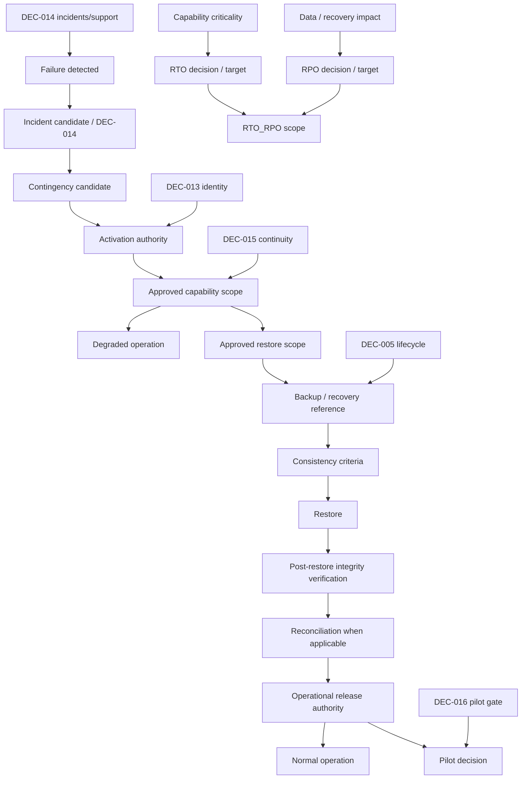

# DEC-015 — Paquete institucional de decisión sobre continuidad y contingencia

## Control del documento

| Campo | Valor |
|---|---|
| Tipo | `DECISION SUPPORT EVIDENCE` |
| Decisión canónica | `DEC-015` |
| Requisito principal | `REQ-14` |
| Decision pack document status | `FINAL` — no canónico |
| Decision form template status | `FINAL` — no canónico |
| Canonical DEC-015 status | `Pendiente` |
| Canonical REQ-14 status | `Pendiente de protocolo local` |
| REQ-14 technical implementation tracking | `No implementado` — no canónico |
| REQ-14 technical validation tracking | `No validado` — no canónico |
| Current gate | `READY_FOR_INSTITUTIONAL_DECISION` |
| Autoridad primaria canónica | Dirección de Enfermería |
| Evidencia técnica inspeccionada | Repositorio en `7fa1100` |
| Bloqueo actual | `CONTINGENCIA DESACTIVADA` |
| Alcance | Activación, acceso, contenido, operación degradada, restauración, reconciliación, RTO/RPO, dependencias, evidencia, pruebas y retorno a operación normal |
| No constituye | Plan local aprobado o probado, procedimiento clínico, modo de contingencia, acceso offline, backup, restore, RTO/RPO, autorización de piloto o autorización para implementar |

Este paquete prepara la decisión institucional:

> Activación, acceso, contenido, restablecimiento, RTO/RPO y retención de
> contingencia.

`DEC-015-A` a `DEC-015-R` son identificadores de trabajo dentro de la única
decisión canónica DEC-015. No son decisiones canónicas independientes.

## 1. Principios y vocabulario

```text
CONTINGENCY ≠ NORMAL OPERATION
BUSINESS CONTINUITY ≠ DISASTER RECOVERY
DISASTER RECOVERY ≠ BACKUP
BACKUP ≠ ARCHIVE ≠ OFFLINE CLINICAL MODE
RTO ≠ RPO ≠ SLA
RPO ≠ RETENTION PERIOD
APPLICATION DOWN ≠ DATABASE LOST
IDP DOWN ≠ DATABASE DOWN
DEPENDENCY DOWN ≠ GUARDIAN DOWN
READ_ONLY ≠ SAFE FOR EVERY CLINICAL USE
CACHED DATA ≠ CURRENT DATA
CONTINGENCY COPY ≠ SOURCE OF TRUTH
RESTORE COMPLETE ≠ DATA RECONCILED
SYSTEM AVAILABLE ≠ CLINICALLY READY
BREAK_GLASS ≠ CONTINGENCY MODE
INCIDENT ≠ CONTINGENCY
FAIL_CLOSED ≠ IGNORE CONTINUITY OF CARE
```

| Concepto | Significado en este paquete | No equivale a |
|---|---|---|
| Technical degradation | Capacidad que responde de forma parcial, errónea o sin una dependencia | Contingencia operativa declarada |
| Incident | Hecho gobernado por DEC-014 | Activación automática de contingencia |
| Contingency candidate | Situación que una política futura sometería a autorización | `CONTINGENCY_ACTIVE` |
| Contingency | Operación institucional excepcional, con scope y autoridad aprobados | Bypass de seguridad o procedimiento improvisado |
| Degraded read-only | Capacidad futura limitada a lectura con freshness, source y acceso explícitos | Dato actual, completo o seguro para cualquier uso |
| Backup | Copia destinada a recuperación bajo política aprobada | Archivo, export o censo de contingencia |
| Restore | Recuperación técnica desde un punto aprobado | Reconciliación o autorización de retorno |
| RTO target | Tiempo objetivo máximo para restaurar una capacidad | Tiempo real medido, SLA o tiempo global único |
| RPO target | Pérdida temporal de datos aceptable según punto recuperable | Edad del backup, retención o consistencia garantizada |

## 2. Evidencia inspeccionada

Se revisaron completamente README, registro de decisiones, trazabilidad
Markdown/CSV, workflow clínico-organizativo, matriz de autorización, los cinco
documentos de arquitectura GAS 2.0, los paquetes DEC-002, DEC-005, DEC-013,
DEC-014 y DEC-017 y los ADR-0001 a ADR-0014.

La inspección técnica incluyó:

- `GET /api/health`, panel de estado técnico y su prueba E2E;
- cliente Prisma, configuración PostgreSQL, schema, migraciones y seed;
- Docker Compose, volumen local y healthcheck `pg_isready`;
- preparación demo, comandos de migración y CI;
- sesiones, autenticación demo, autorización, errores y logs sanitizados;
- episodios, Plan de Seguridad, check-ins, avisos, tareas, cuidador, auditoría,
  evidence view y preview SBAR;
- búsquedas literales de contingency, continuity, offline, degraded, read-only,
  fallback, failover, restore, backup, dump, RTO, RPO, recovery, reconcile,
  retry, health, ready/readiness/liveness, cache, localStorage, IndexedDB,
  serviceWorker, navigator.onLine, postgres, docker, prisma, disconnect,
  migration, session, dependency y unavailable.

No se usó documentación externa para inventar infraestructura o un procedimiento
local. “No existe” significa exclusivamente “no está implementado o documentado
en Guardián”.

## 3. Baseline real de continuidad

| ID | Pregunta | Hecho verificable actual |
|---|---|---|
| A | PostgreSQL indisponible | Las sesiones y capacidades de producto usan Prisma. Las rutas API que capturan el fallo inesperado devuelven `500 INTERNAL_ERROR` sanitizado. No existe una ruta alternativa de datos. |
| B | Aplicación disponible, DB no | `/api/health` continúa pudiendo devolver 200 porque no consulta DB. Las rutas dependientes de DB fallan; no existe banner o estado global de DB degradada. |
| C | Aplicación no responde | El cliente no recibe la aplicación ni sus APIs. No hay service worker, shell offline, censo alternativo o procedimiento manual documentado en Guardián. |
| D | Health | Existe `GET /api/health`; devuelve únicamente `status`, `service`, `Cache-Control: no-store` y correlation ID. |
| E | Readiness | No existe endpoint ni contrato de readiness de aplicación/dependencias. |
| F | Liveness | No existe contrato de liveness separado. El health actual solo demuestra respuesta del proceso/ruta en ese instante. |
| G | Retry | No existe retry automático de recuperación de aplicación o dependencia. Existen replays idempotentes de operaciones y reintentos del healthcheck Docker, que no son failover ni recovery. |
| H | Circuit breaker | No está implementado/documentado. |
| I | Failover | No está implementado/documentado. |
| J | Backup | No existe script, job, configuración o evidencia de backup. El volumen Docker preserva datos locales, pero no es un backup. |
| K | Restore | No existe tooling, procedimiento o ejecución de restore. |
| L | Réplica | No existe réplica PostgreSQL ni read replica documentada. |
| M | Read-only | No existe modo read-only de contingencia. La evidence view es una proyección read-only de operación normal y no un fallback. |
| N | Offline | No existe modo offline. |
| O | Cache clínica en navegador | No existe service worker, Cache Storage o cache clínica de contingencia. Las APIs inspeccionadas envían `no-store`. |
| P | `localStorage` / IndexedDB clínicos | No se usan. El token está en cookie HttpOnly y la base guarda su hash. |
| Q | Censo alternativo | No está implementado/documentado. |
| R | Export para contingencia | No existe. El preview SBAR/impresión HTML no es registro de contingencia ni PDF institucional. |
| S | Procedimiento manual | No existe procedimiento clínico manual aprobado en el repositorio. |
| T | Reconciliación post-contingencia | No está implementada/documentada. |
| U | Pruebas de restauración | No existe evidencia de restore test. CI crea una DB de prueba y aplica migraciones/seed; no restaura un backup. |
| V | Módulo no disponible | Las rutas usan errores sanitizados y varios componentes presentan estados locales de carga/error. No existe coordinación global de degraded mode ni scope de contingencia. |
| W | Fallo cerrado | Autenticación/autorización requieren DB y no tienen bypass; mutaciones críticas agrupan historia/auditoría en transacción; cierre de episodio, crisis, política pendiente y reglas incompletas permanecen bloqueados o abstienen. |

### 3.1. Consecuencia operativa verificable de una caída de DB

```text
GET /api/health
→ 200 técnico posible

DB-dependent request
→ Prisma error
→ sanitized INTERNAL_ERROR
→ no alternate clinical data path
```

El health actual no puede usarse como prueba de readiness o de clinical
readiness. Tampoco existe evidencia de que todos los server components conviertan
una caída de DB en una pantalla degradada uniforme.

### 3.2. Contratos que ya fallan cerrados

- una sesión no puede autenticarse sin leer la fila persistida y roles activos;
- no existe fallback a identidad demo fuera del demo loopback;
- un error inesperado no expone el mensaje Prisma/SQL al cliente;
- una mutación crítica no se confirma por una ruta memory-only sin auditoría;
- Plan de Seguridad, check-ins, avisos, tareas y cuidador conservan invariantes
  transaccionales/append-only cuando la transacción sí confirma;
- crisis permanece sin destino y episode closure permanece no autorizado;
- una ausencia digital no se convierte en cierre, resolución o actuación
  automática.

Estos controles protegen integridad y autorización. No constituyen un plan de
continuidad asistencial.

## 4. Failure scenario matrix

`Contingency candidate?` expresa una pregunta futura; no activa contingencia.

| Scenario | Current system behavior | Clinical/operational impact unknown? | Contingency candidate? | Safe default actual | Institutional decision required | Dependencies | Test required |
|---|---|---:|---|---|---|---|---|
| `APP_RUNNING_DB_DOWN` | Health puede responder; APIs/session DB fallan con error técnico | Sí | `DECISION_REQUIRED` | No presentar capacidad DB como disponible; sin activación automática | Trigger, scope, comunicación, writes y access | A–E, H, I, R; DEC-014 | DB outage controlado |
| `APP_DOWN_DB_UP` | No UI/API; DB puede conservar datos | Sí | `DECISION_REQUIRED` | Sin fallback local ni export improvisado | Trigger, canal alternativo, restore de app | A–D, K–M, R | Application outage |
| `DB_AND_APP_DOWN` | No operación digital de Guardián | Sí | `DECISION_REQUIRED` | Procedimiento institucional externo solo si se aprueba | Scope, dataset, writes, restore y release | A–R | Combined outage |
| `IDP_DOWN` | No IdP productivo existe; demo no puede ser fallback productivo | Sí | `DECISION_REQUIRED` | Sin credencial compartida, anónima o demo | Sesiones existentes, assurance y fallback prohibido | H; DEC-013/014 | IdP outage |
| `NETWORK_CLIENT_DOWN` | Cliente sin acceso a Guardián | Sí | `DECISION_REQUIRED` | Sin cache/offline clínico | Mensaje, workflow externo y reconciliación si aplica | C–J, R | Client network loss |
| `EXTERNAL_DEPENDENCY_DOWN` | No hay conectores productivos | Sí | Futuro | No inventar integración/fallback | Por dependencia y capability | A–E, K–R; contrato futuro | Contract failure |
| `PARTIAL_MODULE_FAILURE` | Error local/HTTP; sin orquestador de degraded mode | Sí | `DECISION_REQUIRED` | Bloquear la función afectada; no declarar el resto seguro | Scope por módulo y funciones permitidas | C–E, R | Module failure |
| `READ_ONLY_DB` | Lecturas podrían responder; writes fallarían sin detección formal | Sí | `DECISION_REQUIRED` | No anunciar read-only seguro ni intentar writes silenciosos | Freshness, access, audit y write guard | D–I | Read-only DB simulation |
| `STALE_CACHE` | No existe cache clínica | Sí | Solo si se aprueba una copia futura | No presentar cache como actual | Freshness, source, purge y scope | F–H, P; DEC-005/013 | Staleness drill |
| `RESTORE_IN_PROGRESS` | Sin estado ni tooling | Sí | Sí, si existe restore futuro | Mantener operación normal bloqueada para el scope afectado | Visibilidad, ownership y acceso | K–L, O, Q, R | Restore exercise |
| `RESTORE_COMPLETE_NOT_RECONCILED` | Sin estado ni reconciliación | Sí | Sí | No equivale a normal operation | Integridad, reconciliación y release humano | J–L, O, Q | Reconciliation drill |
| `MIGRATION_MISMATCH` | Deploy/status son comandos; runtime no publica compatibilidad | Sí | `DECISION_REQUIRED` | No afirmar readiness | Criterio de restore y release | K–L, O, Q | Schema compatibility |
| `CONFIG_POLICY_UNAVAILABLE` | Policies pendientes/ausentes fallan cerradas en módulos relevantes | Sí | `DECISION_REQUIRED` | Mantener acción dependiente bloqueada | Scope, versión y comunicación | D–E, K, R | Config/policy outage |

## 5. Continuity domains

Una aprobación en un dominio no aprueba los demás.

| Dominio | Pregunta de decisión | Baseline |
|---|---|---|
| `APPLICATION_CONTINUITY` | ¿Cómo se recupera UI/API y qué capacidad se declara disponible? | Sin redundancia/failover documentados |
| `DATABASE_CONTINUITY` | ¿Cómo se protege, recupera y verifica PostgreSQL? | Instancia local única; sin backup/replica/restore |
| `IDENTITY_AUTHENTICATION_CONTINUITY` | ¿Qué ocurre con IdP, tokens y sesiones? | IdP productivo ausente; demo no es fallback |
| `NETWORK_CONNECTIVITY` | ¿Qué ocurre por red, unidad o cliente? | Sin offline/local fallback |
| `EXTERNAL_DEPENDENCY_CONTINUITY` | ¿Cómo se aísla cada tercero? | No hay integraciones productivas |
| `CLINICAL_WORKFLOW_CONTINUITY` | ¿Qué proceso asistencial sigue fuera de la ruta digital? | No existe procedimiento manual aprobado en repo |
| `DATA_RECOVERY` | ¿Qué recovery point, restore e integridad se exigen? | Sin backup/restore/RPO |
| `SUPPORT_INCIDENT_CONTINUITY` | ¿Quién detecta, comunica y coordina? | DEC-014 pendiente; sin incident workflow |
| `USER_COMMUNICATION_DURING_OUTAGE` | ¿Qué ve cada población y por qué canal? | Sin banner/canal institucional de contingencia |
| `POST_RESTORE_RECONCILIATION` | ¿Cómo se incorporan hechos producidos durante la caída? | Sin mecanismo |

## 6. Capability criticality worksheet

No se asigna severidad clínica ni `Critical/High/Medium/Low`.

| Capability | Dependency | Failure effect | Operational criticality | Must restore? | May degrade? | May block? | RTO required? | RPO required? | Authority |
|---|---|---|---|---|---|---|---|---|---|
| Episode list/details | App + DB + identity | Sin consulta digital | `INSTITUTIONAL_CRITICALITY_REQUIRED` | `DECISION_REQUIRED` | `DECISION_REQUIRED` | `DECISION_REQUIRED` | `DECISION_REQUIRED` | `DECISION_REQUIRED` | Dirección de Enfermería |
| Safety Plan | App + DB + identity + document policy | Sin acceso/edición digital | Igual | Igual | Igual | Igual | `DECISION_REQUIRED` | `DECISION_REQUIRED` | Dirección de Enfermería |
| Check-ins | App + DB + identity + protocol | Sin asignación/respuesta digital | Igual | Igual | Igual | Igual | `DECISION_REQUIRED` | `DECISION_REQUIRED` | Dirección de Enfermería |
| Alerts | App + DB + rules + identity | Sin evaluación/review digital | Igual | Igual | Igual | Igual | `DECISION_REQUIRED` | `DECISION_REQUIRED` | Dirección de Enfermería |
| Tasks | App + DB + identity | Sin cola/eventos digitales | Igual | Igual | Igual | Igual | `DECISION_REQUIRED` | `DECISION_REQUIRED` | Dirección de Enfermería |
| Caregiver portal | App + DB + identity + authorization | Sin acceso del cuidador | Igual | Igual | Igual | Igual | `DECISION_REQUIRED` | `DECISION_REQUIRED` | Dirección de Enfermería |
| SBAR preview/export | App + DB + identity + profiles | Sin preview/export | Igual | Igual | Igual | Igual | `DECISION_REQUIRED` | `DECISION_REQUIRED` | Dirección de Enfermería |
| Audit persistence | DB | No puede probarse la mutación | Igual | Igual | Igual | Igual | `DECISION_REQUIRED` | `DECISION_REQUIRED` | Dirección de Enfermería |
| Identity | IdP/session store/app/DB | No autenticación/autorización demostrable | Igual | Igual | Igual | Igual | `DECISION_REQUIRED` | `DECISION_REQUIRED` | Dirección de Enfermería |
| Support/communication | App + approved channels | Sin coordinación/mensaje institucional | Igual | Igual | Igual | Igual | `DECISION_REQUIRED` | `DECISION_REQUIRED` | Dirección de Enfermería |

La columna `Authority` expresa exclusivamente `DEC-015 PRIMARY AUTHORITY` y por
tanto es siempre Dirección de Enfermería. Identity conserva como dependencia la
autoridad de Dirección TI bajo DEC-013; el resto de dependencias de contenido,
lifecycle, incident operations y workflow se registran en la sección 21. Pueden
bloquear un scope, pero no crean coaprobación de DEC-015.

`RTO required?` y `RPO required?` preguntan si la capability pertenece al scope
`RTO_RPO`; no preguntan por el valor del target. Si la decisión futura es
`YES / IN_SCOPE`, el target correspondiente permanece
`INSTITUTIONAL_VALUE_REQUIRED` hasta su aprobación. Una capability `EXCLUDED` o
`DEFERRED` de `RTO_RPO` no necesita target aprobado para existir
documentalmente ni para que otra capability sea restaurada. No se selecciona
`YES` o `NO` en este paquete.

## 7. Subdecisiones DEC-015-A a DEC-015-R

| ID | Working subdecision | Pregunta institucional | Límite |
|---|---|---|---|
| A | Contingency trigger | ¿Qué condición convierte degradación en contingency candidate y quién confirma? | Sin thresholds; incident ≠ contingency |
| B | Activation authority | ¿Quién declara `CONTINGENCY_ACTIVE` y con qué evidencia? | No activación clínica automática por health |
| C | Contingency scope | ¿Global, unidad, servicio, módulo, dependencia o población? | No asumir tenant/unit scope inexistente |
| D | Allowed functions | ¿Qué capacidad queda `ALLOWED`, `READ_ONLY`, `BLOCKED` o `NOT_APPLICABLE`? | Opciones de workbook, no configuración actual |
| E | Prohibited functions | ¿Qué debe bloquearse si freshness, auth, consistencia, policy o audit no son demostrables? | No preseleccionar operaciones |
| F | Minimum contingency dataset | ¿Sin dataset local, fuente institucional externa, vista mínima aprobada u otro? | No construir censo ni seleccionar campos |
| G | Data freshness | ¿Qué `generatedAt`, source/version, staleness y last sync se exigen? | No usar “latest” sin prueba |
| H | Access during contingency | ¿Cómo operan identidad, sesiones y assurance durante la caída? | Sin shared password, demo fallback o acceso anónimo |
| I | Write during outage | ¿`NO_WRITES`, workflow manual, sistema externo, cola local aprobada u otro? | No seleccionar ni implementar queue |
| J | Reconciliation | ¿Cómo se verifican, ordenan y deduplican datos de contingencia? | Sin silent last-write-wins |
| K | Restoration criteria | ¿Qué demuestra recuperación técnica y clinical/operational readiness? | “Responde” no basta |
| L | Return-to-normal authority | ¿Quién autoriza `CONTINGENCY_ACTIVE → NORMAL_OPERATION`? | Separar technical recovery de release |
| M | RTO | ¿Qué target requiere cada capability? | `INSTITUTIONAL_VALUE_REQUIRED`; sin número global |
| N | RPO | ¿Qué recovery point consistente admite cada data class/capability? | `INSTITUTIONAL_VALUE_REQUIRED`; RPO ≠ retention |
| O | Backup/restore | ¿Quién opera, qué cubre y qué evidencia prueba integridad/restore? | Sin tecnología seleccionada |
| P | Contingency retention | ¿Qué lifecycle tiene cada copia, papel, queue, export o evidencia? | DEC-005 conserva retention/disposition |
| Q | Test/exercise | ¿Qué tabletop, outage, restore, workflow y reconciliation exercise se exige? | Documento ≠ plan probado |
| R | Communication/human factors | ¿Qué ve el usuario, qué está bloqueado/stale y cómo evita shadow workflow? | Sin canal/contacto real |

## 8. Modelo conceptual de activación y estado

Los siguientes estados son vocabulario del decision pack, no una máquina runtime
aprobada:

```text
NORMAL
→ TECHNICALLY_DEGRADED
→ contingency candidate
→ human authorization
→ CONTINGENCY_ACTIVE
→ RESTORING
→ RECONCILING
→ READY_FOR_OPERATIONAL_RELEASE
→ human release authorization
→ NORMAL
```

Una política puede decidir que alguna transición o estado no sea necesario.
Quedan prohibidos `health fail → automatic clinical contingency` y
`technical restore → automatic normal operation`.

## 9. Allowed / blocked function model

El workbook debe completar una fila por capability y scope:

| Capability | `ALLOWED / READ_ONLY / BLOCKED / NOT_APPLICABLE` | Freshness evidence | Authorization evidence | Audit persistence | Missing-data behavior | Authority/evidence |
|---|---|---|---|---|---|---|
| Episode list | | | | | | |
| Episode details | | | | | | |
| Safety Plan | | | | | | |
| Check-ins | | | | | | |
| Alerts / review | | | | | | |
| Tasks / events | | | | | | |
| Caregiver portal | | | | | | |
| SBAR | | | | | | |
| Audit/evidence | | | | | | |
| Identity/access | | | | | | |
| Support/communication | | | | | | |

Si no puede probarse freshness, autorización, consistencia, policy version o
persistencia de auditoría, cualquier mutación relacionada requiere una decisión
explícita. El pack no determina universalmente si esa operación queda permitida.

## 10. Minimum contingency dataset y freshness

Opciones neutrales:

1. `NO_LOCAL_CONTINGENCY_DATASET`;
2. `READ_ONLY_EXTERNAL_INSTITUTIONAL_SOURCE`;
3. `APPROVED_MINIMAL_READ_ONLY_CONTINGENCY_VIEW`;
4. `OTHER_APPROVED_MECHANISM`.

Una opción futura que copie datos debe definir por campo/clase:

- source of truth y referencia de versión;
- `generatedAt` y última sincronización confirmada;
- staleness visible y criterio de expiración;
- scope, identidad y audiencia;
- minimización, cifrado, dispositivo/ubicación y purge;
- interacción con DEC-005, DEC-012 y DEC-013.

El paquete no selecciona campos clínicos, no crea un censo y no recomienda
almacenamiento local.

## 11. Identity during outage

DEC-013 conserva autoridad sobre IdP, sesiones, roles y break-glass.

| Situación | Baseline / límite |
|---|---|
| IdP available | Futuro; no existe IdP productivo implementado |
| IdP unavailable | No usar demo identity como fallback |
| Existing session | Debe decidir assurance, revocación, expiry y disponibilidad de session store |
| Local fallback | No aprobado ni implementado |
| Emergency access | No confundir con contingency; depende de DEC-013 |
| Read-only access | Sigue requiriendo identidad, scope, freshness y evidencia |

Quedan prohibidos shared credentials, universal local password, anonymous
clinical access y bypass silencioso de RBAC/caregiver scope.

## 12. Write-during-outage y auditoría

Opciones neutrales:

- `NO_WRITES`;
- `PAPER_OR_MANUAL_INSTITUTIONAL_WORKFLOW`;
- `EXTERNAL_INSTITUTIONAL_SYSTEM`;
- `APPROVED_LOCAL_QUEUE`;
- `OTHER_APPROVED_MECHANISM`.

Si una futura opción incluye captura temporal, debe resolver antes de
especificarse: encryption, identity, original timestamp, receipt timestamp,
idempotency, ordering, conflict, duplicate prevention, replay, audit, expiry,
device loss y reconciliation.

No se admite `memory-only audit`, `local file audit` o una mutación no auditada
silenciosa. La continuidad asistencial puede apoyarse en un procedimiento
institucional no digital; eso no autoriza continuidad del write path digital.

Operaciones que requieren evaluación específica incluyen `AlertReview`,
`TaskEvent`, `EpisodeTransition`, `SafetyPlanVersion` y `CheckInResponse`.

## 13. Reconciliation model

```text
contingency artifact
→ identity/provenance verification
→ human verification
→ duplicate/idempotency check
→ conflict detection
→ temporal ordering
→ approved entry into source of truth
→ reconciliation evidence
```

El diseño futuro debe conservar actor, original timestamp, reconciliation actor,
reconciliation timestamp, source/reference y outcome. No se permite silent
last-write-wins. `Manual verification`, `dual review` y el nivel de automatización
son opciones institucionales, no decisiones de este pack.

## 14. Restore, integrity y operational release

Un restore futuro debe verificar al menos:

- DB reachable y punto recuperado identificado;
- schema/migration level compatible;
- foreign keys y constraints;
- historias append-only y revision counters;
- idempotency keys y fingerprints;
- `Episode` versions, `Task` revisions, `AlertReview`, `AuditEvent` y provenance;
- policy/config versions e identidad;
- reaparición de registros dispuestos tras restaurar un backup antiguo;
- trabajo de contingencia y reconciliation status.

Gates documentales:

```text
TECHNICAL_RESTORE_COMPLETE
→ POST_RESTORE_INTEGRITY_REVIEW_REQUIRED
→ CONSISTENT_RECOVERY_POINT_REQUIRED
→ reconciliation when applicable
→ READY_FOR_OPERATIONAL_RELEASE
→ authorized human release
→ NORMAL_OPERATION
```

`TECHNICAL_RESTORE_COMPLETE` no significa data reconciled, clinically ready o
normal operation.

### 14.1. Restore evidence candidate

La evidencia futura puede referenciar, sin PHI/PII:

- backup reference;
- restore start/end;
- operator role;
- environment;
- schema version y migration status;
- integrity checks;
- reconciliation status;
- operational release approval.

No se crea tabla ni se selecciona tooling.

### 14.2. Recovery consistency domains

Un restore futuro no debe asumir que todos los objetos persistidos pertenecen a
un único recovery point atómico. La política institucional debe evaluar por
separado:

| Consistency domain | Ejemplos no exhaustivos | Mecanismos futuros neutrales |
|---|---|---|
| `CLINICAL_WORKFLOW_CONSISTENCY` | `Episode`, `EpisodeTransition`, `RuleEvaluation`, `Alert`, `AlertReview`, `Task`, `TaskEvent`, audit/provenance y referencias policy/config | `RESTORE / RECONSTRUCT / INVALIDATE / REAUTHENTICATE / OTHER_APPROVED_MECHANISM` |
| `AUTHORIZATION_CONSISTENCY` | `RoleAssignment`, `CaregiverAuthorization`, caregiver scopes y referencias de access policy | `RESTORE / RECONSTRUCT / INVALIDATE / REAUTHENTICATE / OTHER_APPROVED_MECHANISM` |
| `SESSION_EPHEMERAL_SECURITY_STATE` | `SessionMetadata`, `CaregiverSession`, tokens y referencias de sesión | `RESTORE / RECONSTRUCT / INVALIDATE / REAUTHENTICATE / OTHER_APPROVED_MECHANISM` |

No se selecciona ningún mecanismo. Restaurar una base clínica no exige restaurar
sesiones de autenticación activas. Una política futura puede requerir invalidar
todas las sesiones y reautenticar después del restore, pero este paquete no
adopta esa opción.

## 15. RTO, RPO y backup dependencies

### RTO

Cada capability necesita una decisión independiente:

| Capability | RTO target | Actual recovery time | Evidence |
|---|---|---|---|
| Application | `INSTITUTIONAL_VALUE_REQUIRED` | Medible en test futuro | |
| Database | `INSTITUTIONAL_VALUE_REQUIRED` | Medible en test futuro | |
| Identity | `INSTITUTIONAL_VALUE_REQUIRED` | Medible en test futuro | |
| Read-only access | `INSTITUTIONAL_VALUE_REQUIRED` | Medible si se aprueba | |
| Task workflow | `INSTITUTIONAL_VALUE_REQUIRED` | Medible si se aprueba | |
| Other approved capability | `INSTITUTIONAL_VALUE_REQUIRED` | Medible si se aprueba | |

Medir un actual recovery time no aprueba el target.

### RPO

RPO requiere declarar el boundary de consistencia aplicable, sin presuponer un
recovery point atómico compartido entre workflow clínico, autorización y estado
efímero de sesión. No basta con la edad de una copia.

| Consistency domain | RPO target | Consistency boundary | Backup/recovery dependency |
|---|---|---|---|
| `CLINICAL_WORKFLOW_CONSISTENCY` | `INSTITUTIONAL_VALUE_REQUIRED` | `CONSISTENCY_BOUNDARY_REQUIRED` | `DECISION_REQUIRED` |
| `AUTHORIZATION_CONSISTENCY` | `INSTITUTIONAL_VALUE_REQUIRED` | `CONSISTENCY_BOUNDARY_REQUIRED` | `DECISION_REQUIRED` |
| `SESSION_EPHEMERAL_SECURITY_STATE` | `INSTITUTIONAL_VALUE_REQUIRED` si se incluye; no se presume | `CONSISTENCY_BOUNDARY_REQUIRED` | `DECISION_REQUIRED` |
| Other approved scope | `INSTITUTIONAL_VALUE_REQUIRED` | Igual | `DECISION_REQUIRED` |

`RESTORE CAPABILITY`, `RTO TARGET` y `RPO TARGET` son decisiones distintas. Un
restore técnico o su prueba necesita una referencia de backup/recovery point y
criterios de consistencia, pero no exige universalmente que los targets RTO/RPO
estén aprobados.

### Backup / restore chain

```text
approved data scope
→ backup creation
→ integrity verification
→ protected lifecycle/access
→ restore test
→ restore execution
→ post-restore integrity
→ reconciliation
→ operational release
```

DEC-015 decide necesidad de continuidad, restore y targets. DEC-005 conserva
retention/disposition de copias y la interacción con derechos. No se selecciona
frecuencia, ubicación, inmutabilidad, cifrado, tecnología o proveedor.

## 16. Offline-data threat model

| Threat | Failure path | Decision/mitigation evidence required before approval |
|---|---|---|
| Device loss | Copia clínica accesible fuera de control | Device ownership, encryption, revoke/purge |
| Shared workstation | Otra persona reutiliza sesión/copia | Identity, session isolation, timeout, access review |
| Browser cache | Datos persisten sin control | Cache policy, no-store verification, purge |
| Unencrypted disk | Lectura directa de copia | Encryption and key management |
| Stale data | Decisión con versión antigua | generatedAt, staleness, last sync, expiry |
| Session persistence | Acceso tras revocación | Online/offline revocation model |
| Copy proliferation | Exports/prints/capturas no inventariados | Copy lifecycle and accountability |
| Screenshots/printing | Copia fuera de la aplicación | Policy, human factors, controlled environment |
| Exfiltration | Extracción por usuario/malware | Least privilege, monitoring and device controls |
| Failure to purge | Datos permanecen después de contingency | Verifiable purge and evidence |
| Incorrect patient | Copia asociada al sujeto equivocado | Identity/linking and human verification |
| Out-of-date Safety Plan | Plan sustituido se presenta como vigente | Version, status and explicit stale warning |

El threat model no recomienda offline storage ni implementa mitigaciones. Una
opción offline requiere DEC-005/013 y revisión específica de privacidad y
seguridad.

## 17. Tests y evidencia de continuidad

```text
PLAN APPROVED ≠ PLAN TESTED
```

Categorías documentales neutrales:

- `TABLETOP_ONLY`;
- `TECHNICAL_RESTORE_TEST`;
- `APPLICATION_RECOVERY_TEST`;
- `WORKFLOW_EXERCISE`;
- `RECONCILIATION_EXERCISE`.

Una no sustituye a las demás. Las pruebas futuras usarán datos sintéticos,
entorno aislado, fallo controlado y reset/recovery documentados. Quedan fuera
production chaos, restore destructivo o simulación con pacientes reales.

La evidencia debe identificar plan version, scope, escenario, entorno, roles,
resultados, actual recovery time/point, desviaciones, acciones y referencia de
aprobación sin PHI/PII.

## 18. External dependencies y experiencia de usuario

LAGUN, Tucuvi, Huma, MeMind, HCE/EHR, IdP, messaging, monitoring e ITSM son
terceros potenciales; no se presume ninguna integración activa. Por cada
dependencia futura debe decidirse qué capability queda bloqueada/stale, quién
declara degraded state, qué evidencia se conserva y si Guardián puede operar sin
ella.

Para patient portal, caregiver portal y check-ins deben definirse mensaje,
funciones ocultas/bloqueadas y canal institucional alternativo, si existe. No se
inventa fallback por teléfono, SMS o email.

REQ-10/DEC-010/011 conservan el recurso de crisis: contingency no puede inventar
un teléfono/URI. DEC-012 gobierna contenido/destino SBAR y DEC-005 el lifecycle
de cualquier copia. `SBAR preview ≠ contingency record`.

## 19. Minimum blocking decision set

Leyenda: `B` bloquea el scope; `C` es condicional; `D` puede diferirse solo con
exclusión explícita; `N/A` no pertenece al scope.

| ID | Activation | Read-only | Offline dataset | Temporary writes | Restore | Reconciliation | RTO/RPO | Operational release for approved scope | Pilot |
|---|---:|---:|---:|---:|---:|---:|---:|---:|---:|
| A Trigger | B | C | C | C | C | C | C | C | B |
| B Activation authority | B | B | B | B | C | C | C | C | B |
| C Scope | B | B | B | B | B | B | B | B | B |
| D Allowed functions | B | B | B | B | C | C | C | C | B |
| E Prohibited functions | B | B | B | B | C | C | C | C | B |
| F Minimum dataset | D | B | B | C | N/A | C | C | C | C |
| G Freshness | D | B | B | B | C | B | B | C | B |
| H Access | B | B | B | B | C | C | C | C | B |
| I Write during outage | D | C | C | B | C | B | C | C | B |
| J Reconciliation | D | D | C | B | C | B | C | C | B |
| K Restoration criteria | D | C | C | C | B | B | B | B | B |
| L Return authority | D | C | C | C | B | B | C | B | B |
| M RTO | D | C | C | C | C | C | B | C | B |
| N RPO | D | C | B | B | C | B | B | C | B |
| O Backup/restore | D | C | B | C | B | B | B | C | B |
| P Retention | D | C | B | B | C | B | C | C | B |
| Q Tests | C | B | B | B | B | B | B | C | B |
| R Communication | B | B | B | B | B | B | C | B | B |

Mínimos por resultado:

- activation: A/B/C/D/E/H/R y Q según el plan aprobado;
- read-only: B/C/D/E/F/G/H/Q/R; I/J solo si el scope produce datos;
- offline dataset: B–H, N/O/P/Q/R; I/J si hay captura;
- temporary writes: B–J, N/P/Q/R y O cuando el recovery point dependa de ello;
- restore: C, K, O, Q/R y una decisión de backup/recovery point/consistency;
  J/P cuando existan datos/copy lifecycle afectados; M/N solo cuando el approved
  restore scope dependa expresamente de esos targets;
- reconciliation: C, G, I–L, N/O/P/Q/R;
- RTO/RPO: C, G, K–O/Q y dependencias de capability/data class;
- operational release: C/K/L/R y únicamente los blockers de capabilities
  `IN_SCOPE`; no existe un prerequisite universal A–R;
- pilot: todos los blockers aplicables al approved pilot scope, más DEC-016.

No todos A–R son blockers universales. Un scope `EXCLUDED`, `DEFERRED` u
`OMITTED` permanece deshabilitado y no se convierte en prerequisite de release
de otro scope.

Clasificación explícita por subdecisión:

| ID | Classification labels |
|---|---|
| A | `BLOCKING_FOR_CONTINGENCY_ACTIVATION`; `CONDITIONAL_BLOCKER` para los scopes cuya entrada o release dependa del trigger |
| B | `BLOCKING_FOR_CONTINGENCY_ACTIVATION`; `BLOCKING_FOR_READ_ONLY_MODE`; `BLOCKING_FOR_OFFLINE_DATA`; `BLOCKING_FOR_TEMPORARY_WRITES`; `CONDITIONAL_BLOCKER_FOR_OPERATIONAL_RELEASE`; `BLOCKING_FOR_PILOT` |
| C | `BLOCKING_FOR_CONTINGENCY_ACTIVATION`; `BLOCKING_FOR_READ_ONLY_MODE`; `BLOCKING_FOR_OFFLINE_DATA`; `BLOCKING_FOR_TEMPORARY_WRITES`; `BLOCKING_FOR_RECONCILIATION`; `BLOCKING_FOR_RESTORE`; `BLOCKING_FOR_RTO`; `BLOCKING_FOR_RPO`; `BLOCKING_FOR_OPERATIONAL_RELEASE`; `BLOCKING_FOR_PILOT` |
| D | `BLOCKING_FOR_CONTINGENCY_ACTIVATION`; `BLOCKING_FOR_READ_ONLY_MODE`; `BLOCKING_FOR_OFFLINE_DATA`; `BLOCKING_FOR_TEMPORARY_WRITES`; `CONDITIONAL_BLOCKER_FOR_OPERATIONAL_RELEASE`; `BLOCKING_FOR_PILOT`; `CONDITIONAL_BLOCKER` para restore/reconciliation sin operación degradada |
| E | `BLOCKING_FOR_CONTINGENCY_ACTIVATION`; `BLOCKING_FOR_READ_ONLY_MODE`; `BLOCKING_FOR_OFFLINE_DATA`; `BLOCKING_FOR_TEMPORARY_WRITES`; `CONDITIONAL_BLOCKER_FOR_OPERATIONAL_RELEASE`; `BLOCKING_FOR_PILOT` |
| F | `BLOCKING_FOR_READ_ONLY_MODE`; `BLOCKING_FOR_OFFLINE_DATA`; `CONDITIONAL_BLOCKER` para temporary writes/reconciliation; `CAN_DEFER` para activation sin dataset |
| G | `BLOCKING_FOR_READ_ONLY_MODE`; `BLOCKING_FOR_OFFLINE_DATA`; `BLOCKING_FOR_TEMPORARY_WRITES`; `BLOCKING_FOR_RECONCILIATION`; `BLOCKING_FOR_RPO`; `CONDITIONAL_BLOCKER_FOR_OPERATIONAL_RELEASE`; `BLOCKING_FOR_PILOT` |
| H | `BLOCKING_FOR_CONTINGENCY_ACTIVATION`; `BLOCKING_FOR_READ_ONLY_MODE`; `BLOCKING_FOR_OFFLINE_DATA`; `BLOCKING_FOR_TEMPORARY_WRITES`; `CONDITIONAL_BLOCKER_FOR_OPERATIONAL_RELEASE`; `BLOCKING_FOR_PILOT` |
| I | `BLOCKING_FOR_TEMPORARY_WRITES`; `BLOCKING_FOR_RECONCILIATION`; `BLOCKING_FOR_PILOT`; `CONDITIONAL_BLOCKER` para read-only/offline dataset; `CAN_DEFER` si el approved scope declara `NO_WRITES` |
| J | `BLOCKING_FOR_RECONCILIATION`; `BLOCKING_FOR_TEMPORARY_WRITES`; `CONDITIONAL_BLOCKER_FOR_OPERATIONAL_RELEASE`; `BLOCKING_FOR_PILOT`; `CONDITIONAL_BLOCKER` para restore/offline sin datos producidos |
| K | `BLOCKING_FOR_RESTORE`; `BLOCKING_FOR_RTO`; `BLOCKING_FOR_RPO`; `BLOCKING_FOR_OPERATIONAL_RELEASE`; `BLOCKING_FOR_PILOT` |
| L | `BLOCKING_FOR_RESTORE`; `BLOCKING_FOR_RECONCILIATION`; `BLOCKING_FOR_OPERATIONAL_RELEASE`; `BLOCKING_FOR_PILOT`; `CONDITIONAL_BLOCKER` para scopes sin retorno gestionado |
| M | `BLOCKING_FOR_RTO`; `CONDITIONAL_BLOCKER_FOR_RESTORE` solo si el approved restore scope depende del target; `BLOCKING_FOR_PILOT` cuando RTO está en el pilot scope; `CAN_DEFER` fuera de `RTO_RPO` |
| N | `BLOCKING_FOR_RPO`; `BLOCKING_FOR_OFFLINE_DATA`; `BLOCKING_FOR_TEMPORARY_WRITES`; `BLOCKING_FOR_RECONCILIATION`; `CONDITIONAL_BLOCKER_FOR_RESTORE`; `CONDITIONAL_BLOCKER_FOR_OPERATIONAL_RELEASE`; `BLOCKING_FOR_PILOT` |
| O | `BLOCKING_FOR_RESTORE`; `BLOCKING_FOR_RECONCILIATION`; `BLOCKING_FOR_RTO`; `BLOCKING_FOR_RPO`; `CONDITIONAL_BLOCKER_FOR_OPERATIONAL_RELEASE`; `BLOCKING_FOR_PILOT`; `CONDITIONAL_BLOCKER` para dataset offline |
| P | `BLOCKING_FOR_OFFLINE_DATA`; `BLOCKING_FOR_TEMPORARY_WRITES`; `BLOCKING_FOR_RECONCILIATION`; `BLOCKING_FOR_PILOT`; `CONDITIONAL_BLOCKER` para restore/operational release |
| Q | `BLOCKING_FOR_READ_ONLY_MODE`; `BLOCKING_FOR_OFFLINE_DATA`; `BLOCKING_FOR_TEMPORARY_WRITES`; `BLOCKING_FOR_RECONCILIATION`; `BLOCKING_FOR_RESTORE`; `BLOCKING_FOR_RTO`; `BLOCKING_FOR_RPO`; `CONDITIONAL_BLOCKER_FOR_OPERATIONAL_RELEASE`; `BLOCKING_FOR_PILOT`; `CONDITIONAL_BLOCKER` para una activation solo documental |
| R | `BLOCKING_FOR_CONTINGENCY_ACTIVATION`; `BLOCKING_FOR_READ_ONLY_MODE`; `BLOCKING_FOR_OFFLINE_DATA`; `BLOCKING_FOR_TEMPORARY_WRITES`; `BLOCKING_FOR_RECONCILIATION`; `BLOCKING_FOR_RESTORE`; `BLOCKING_FOR_OPERATIONAL_RELEASE`; `BLOCKING_FOR_PILOT`; `CONDITIONAL_BLOCKER` para RTO/RPO sin user-visible state |

## 20. Approved capability scopes

Una futura aprobación debe marcar expresamente:

| Capability scope | `IN_SCOPE / EXCLUDED / DEFERRED` | Plan version / limits / evidence |
|---|---|---|
| `CONTINGENCY_ACTIVATION` | | |
| `DEGRADED_READ_ONLY` | | |
| `OFFLINE_DATASET` | | |
| `TEMPORARY_WRITE_CAPTURE` | | |
| `RESTORE` | | |
| `RECONCILIATION` | | |
| `RTO_RPO` | | |
| `OPERATIONAL_RELEASE` | | |
| `CONTINGENCY_TESTING` | | |

Omisión significa `DEFERRED`. Aprobar restore no aprueba offline dataset;
aprobar RTO/RPO no aprueba temporary writes.

## 21. Authority / consultative model

```text
DEC-015 PRIMARY AUTHORITY = Dirección de Enfermería
```

| Tipo | Función/decisión | Competencia |
|---|---|---|
| `PRIMARY AUTHORITY` | Dirección de Enfermería | Aprobar DEC-015, plan version y approved capability scope |
| `CONSULTATIVE` | Dirección TI, infraestructura, arquitectura, operaciones y seguridad | Aportar diseño, recovery evidence y factibilidad |
| `CONSULTATIVE` | Dirección Médica y responsables asistenciales | Aportar workflow/clinical safety sin asumir coautoridad |
| `CONSULTATIVE` | Responsable del Tratamiento y DPO/DPD | Privacidad, lifecycle y datos/copias |
| `DEPENDENCY AUTHORITY` | Responsable del Tratamiento — DEC-005 | Lifecycle/retention/disposition |
| `DEPENDENCY AUTHORITY` | Dirección TI — DEC-013 | IdP, sessions, roles y break-glass |
| `DEPENDENCY AUTHORITY` | Dirección TI — DEC-014 | Incident detection/support/communication |
| `DEPENDENCY AUTHORITY` | Dirección Médica — DEC-002 | Episode closure |
| `DEPENDENCY AUTHORITY` | Dirección de Enfermería — DEC-017 | Task timers/SLA/escalation, como decisión operativa separada |
| `DEPENDENCY AUTHORITY` | Gerencia del Hospital como Responsable del Tratamiento — DEC-016 | Gate de piloto |

Una dependencia puede bloquear un capability scope DEC-015. No convierte a su
autoridad en coapprover de DEC-015. La consulta tampoco produce authority drift.

## 22. Dependency graph



El grafo no representa RTO o RPO como prerequisites universales de restore. Si
un approved restore scope futuro depende expresamente de un target, esa
dependencia será condicional y deberá documentarse en ese scope.

## 23. Future implementation impact map

No autoriza cambios:

| Área | Impacto futuro posible | Baseline |
|---|---|---|
| Health/readiness | `APPLICATION_CHANGE` + `INFRASTRUCTURE_CHANGE` | Health superficial; readiness/liveness ausentes |
| Database/Prisma | `INFRASTRUCTURE_CHANGE`; posible `CONFIGURATION_CHANGE` | Instancia única; sin retry/failover |
| Sessions/identity | `SECURITY_CHANGE` + `INTEGRATION_REQUIRED` | Demo local; DEC-013 pendiente |
| Episode | `NO_CHANGE` o `APPLICATION_CHANGE` | No cierre por outage |
| Safety Plan | `APPLICATION_CHANGE` o `EXTERNAL_SYSTEM_PREFERRED` | Versionado; sin offline copy |
| CheckIn | `APPLICATION_CHANGE`; posible `BACKGROUND_PROCESS_CANDIDATE` | Sin scheduler/offline |
| Alerts/Tasks | `APPLICATION_CHANGE` | Sin timers de outage o replay |
| Caregiver | `SECURITY_CHANGE` + `APPLICATION_CHANGE` | Sin fallback |
| `AuditEvent` | `NO_CHANGE` o `APPLICATION_CHANGE` | No usar como queue/log de contingencia |
| SBAR/export | `APPLICATION_CHANGE` + `SECURITY_CHANGE` | Preview no es export de contingencia |
| UI banners/guards | `APPLICATION_CHANGE` | Sin contingency state |
| Configuration | `CONFIGURATION_CHANGE`; posible policy versioning | Sin plan/scope runtime |
| Deployment | `INFRASTRUCTURE_CHANGE` | Sin HA/failover documentados |
| Backup infrastructure | `INFRASTRUCTURE_CHANGE` + `INTEGRATION_REQUIRED` | Ausente |
| Restore tooling | `INFRASTRUCTURE_CHANGE` | Ausente |
| Reconciliation | `APPLICATION_CHANGE`; posible `SCHEMA_CANDIDATE`/`BACKGROUND_PROCESS_CANDIDATE` | Ausente |
| CI/tests | `CONFIGURATION_CHANGE` + tests de outage/restore | No prueba restore |
| Runbooks | `POLICY_ONLY` / documentación operativa | Ausentes |

Un contingency store futuro debe elegir neutralmente entre
`NO_LOCAL_CONTINGENCY_STORE`, `READ_ONLY_EXTERNAL_INSTITUTIONAL_SOURCE`,
`APPROVED_MINIMAL_LOCAL_STORE` u `OTHER_APPROVED_MECHANISM`. Si existe una fuente
institucional, se prefiere integración/referencia antes que duplicación, sujeto a
decisión y contrato.

## 24. Relaciones con otras decisiones

| Decisión | Frontera con DEC-015 |
|---|---|
| DEC-002 | No hay closure automático por outage; cierre conserva su policy |
| DEC-005 | Gobierna retention/disposition y reaparición post-restore; DEC-015 gobierna necesidad de continuidad/recovery |
| DEC-013 | Gobierna IdP, sessions, roles y break-glass; DEC-015 no crea fallback credentials |
| DEC-014 | Gobierna incident detection/support; incident no activa automáticamente contingency |
| DEC-017 | Gobierna task timers/SLA/escalation; outage no crea overdue/escalation automática |
| DEC-016 | DEC-015 aprobada no autoriza piloto; continuidad aplicable forma parte del gate |

DEC-003/004 siguen gobernando participación, comunicaciones y cuidador; DEC-010/
011 el recurso de crisis; DEC-012 el perfil/destino SBAR.

## 25. OUT_OF_SCOPE_CONTINUITY_OR_SECURITY_FINDINGS

### GAS2-DEC015-OOS-001 — Health no representa readiness de PostgreSQL

| Campo | Valor |
|---|---|
| Finding status | `CONFIRMED / KNOWN / OPEN / OUT_OF_SCOPE_FOR_DOCUMENTAL_BRANCH` |
| File | `src/app/api/health/route.ts:7`; contraste `src/infrastructure/auth/session-reader.ts:11` |
| Line | Health 7–18; session DB read 11–30 |
| Evidence | La ruta devuelve 200 estático sin consultar Prisma/DB; sesiones y rutas de producto sí consultan PostgreSQL |
| Risk | Operación/orquestación podría interpretar respuesta del proceso como servicio listo aunque DB no esté disponible |
| Recommended remediation branch | `DEFERRED_UNTIL_DEC_014_DEC_015_APPROVED`; el diseño posterior elegirá nombre/alcance, sin reservar una rama ahora |
| Acceptance test | Con fallo DB sintético/controlado, liveness y readiness aprobadas expresan semánticas distintas, no exponen detalle sensible y no activan contingencia clínica automáticamente |

No se clasifica como vulnerabilidad ni se corrige en esta rama. Readiness y su
consumidor operativo dependen de DEC-014/015 y del diseño de despliegue.

No se confirmaron cache clínica local, fallback credential, backup secret,
restore inseguro o write path no auditado alternativo. La ausencia de capacidades
de continuidad es baseline/decision gap, no prueba de que la institución carezca
de ellas.

## 26. Gate posterior, trazabilidad y entregables

```text
READY_FOR_INSTITUTIONAL_DECISION
→ institutional evidence / DEC-015 approval for plan version + scope
→ READY_FOR_TECHNICAL_SPECIFICATION
→ continuity + clinical safety + infrastructure design review
→ restore and reconciliation threat model
→ READY_FOR_IMPLEMENTATION
```

`READY_FOR_TECHNICAL_SPECIFICATION` exige:

- `Canonical DEC-015 status = Aprobada` para plan version y approved capability
  scope concretos;
- approval evidence reference, effective/review dates y autoridad;
- cada capability `IN_SCOPE / EXCLUDED / DEFERRED`;
- blockers del scope resueltos, sin opciones contradictorias;
- RTO/RPO por capability/data class cuando estén en scope;
- backup/restore dependencies y test evidence definidos;
- restore/reconciliation threat model y post-restore release gate;
- dependencias DEC-005/013/014/016 y demás aplicables resueltas o acotadas.

Entregables:

- [Matriz neutral de opciones](dec-015-option-matrix.md)
- [Formulario institucional](dec-015-decision-form.md)
- [Agenda del workshop](dec-015-workshop-agenda.md)
- [Resumen ejecutivo](dec-015-executive-brief.md)

Trazabilidad preservada:

| Artefacto | Relación | Estado |
|---|---|---|
| DEC-015 | Decisión preparada | `Pendiente` |
| REQ-14 canonical status | Caída del Sistema | `Pendiente de protocolo local` |
| REQ-14 technical implementation tracking | No canónico | `No implementado` |
| REQ-14 technical validation tracking | No canónico | `No validado` |
| DEC-002/005/013/014/017/016 | Dependencias | Sin cambio |
| ADR-0001/0002/0003/0004/0005/0006/0007/0008/0009/0010/0011/0012/0013/0014 | Invariantes y baseline | Sin cambio |

Estado final documental:

- `Decision pack document status = FINAL`;
- `Decision form template status = FINAL`;
- `Institutional workbook status = DRAFT / UNDER_REVIEW / FINAL`;
- `Canonical DEC-015 status = Pendiente`;
- `Canonical REQ-14 status = Pendiente de protocolo local`;
- `REQ-14 technical implementation tracking = No implementado`;
- `REQ-14 technical validation tracking = No validado`;
- `Current gate = READY_FOR_INSTITUTIONAL_DECISION`;
- `Primary authority = Dirección de Enfermería`;
- `CONTINGENCIA DESACTIVADA`.

No debe abrirse una rama de contingency mode tras este paquete. Una eventual
implementación solo puede evaluarse después de completar todos los gates
anteriores para un plan version y approved capability scope concretos.
