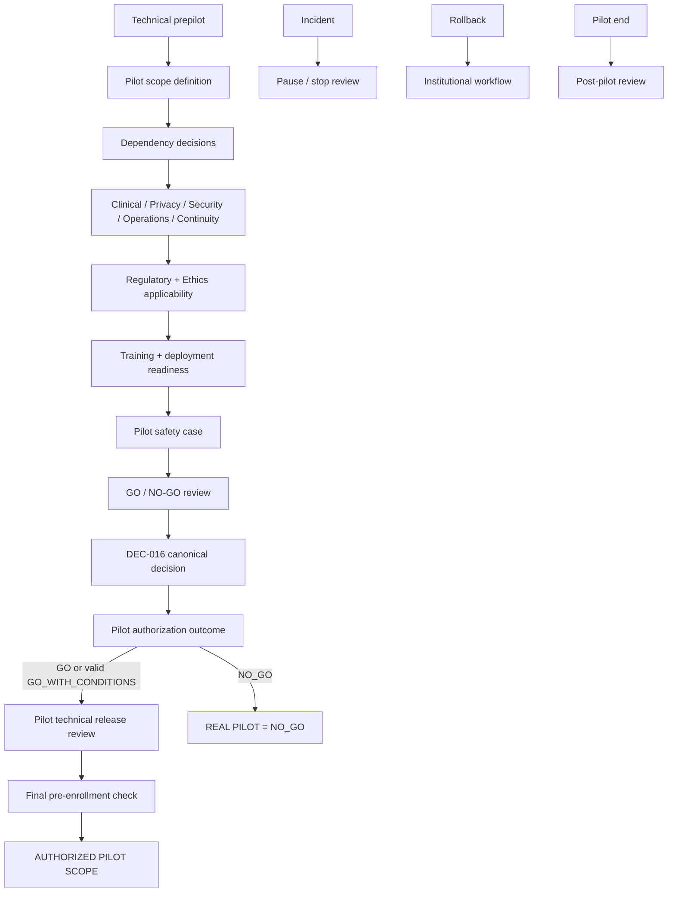

# DEC-016 — Expediente institucional de gate para piloto real

## Control del documento

| Campo | Valor |
|---|---|
| Tipo | `DECISION SUPPORT EVIDENCE` |
| Decisión canónica | `DEC-016` |
| Requisitos relacionados | `REQ-01` a `REQ-14` |
| Decision pack document status | `FINAL` — no canónico |
| Decision form template status | `FINAL` — no canónico |
| Institutional workbook status | `DRAFT / UNDER_REVIEW / FINAL` |
| Canonical DEC-016 status | `Pendiente` |
| Current gate | `READY_FOR_INSTITUTIONAL_DECISION` |
| Current real-pilot status | `NO_GO` |
| Autoridad primaria canónica | Gerencia del Hospital como Responsable del Tratamiento |
| Evidencia técnica inspeccionada | Repositorio en `0ad100a` |
| No constituye | Aprobación de piloto, validación clínica o jurídica, clasificación regulatoria, evaluación ética, despliegue ni autorización para datos o personas reales |

Este expediente permite una decisión humana `GO`, `GO_WITH_CONDITIONS` o
`NO_GO` para una versión y un alcance concretos. No adopta esa decisión.

Mientras DEC-016 permanezca `Pendiente`:

```text
REAL_PATIENTS = BLOCKED
REAL_CLINICAL_DATA = BLOCKED
REAL_CAREGIVER_ACCESS = BLOCKED
REAL_PRODUCTION_IDENTITY = BLOCKED
REAL_CLINICAL_USE = BLOCKED
REAL PILOT = NO_GO
```

`DEC-016-A` a `DEC-016-Z` son identificadores de trabajo dentro de la única
decisión canónica DEC-016. No son decisiones canónicas independientes.

## 1. Separaciones obligatorias

```text
TECHNICAL DEMO ≠ CLINICAL PILOT ≠ PRODUCTION
TECHNICAL VALIDATION ≠ CLINICAL VALIDATION
TESTS PASS ≠ SAFE FOR REAL PATIENTS
HUMAN-IN-THE-LOOP ≠ REGULATORY EXEMPTION
DPIA ≠ LEGAL BASIS
TRAINING DELIVERED ≠ COMPETENCY VERIFIED
DEPLOYED ≠ RELEASED FOR CLINICAL USE
ROLLBACK ≠ DELETE HISTORY
INCIDENT CLOSED ≠ PILOT RESUMED
CANONICAL DECISION STATUS ≠ PILOT AUTHORIZATION OUTCOME
DEC-016 APROBADA ≠ AUTOMATIC GO
GO ≠ AUTOMATIC AUTHORIZED_REAL_PILOT
```

## 2. Evidencia inspeccionada

Se inspeccionaron README, registro de decisiones, trazabilidad Markdown/CSV,
workflow, matriz de autorización, arquitectura actual/objetivo/gaps/orden/límites,
ADR-0001 a ADR-0014 y los expedientes DEC-002, DEC-005, DEC-013, DEC-014,
DEC-015 y DEC-017. También se revisaron el esquema y migraciones Prisma, seeds,
scripts, configuración/CI, módulos de dominio/aplicación/infraestructura/UI y las
pruebas unitarias, de integración y E2E.

La evidencia describe el commit inspeccionado. Una revisión institucional debe
referenciar una release exacta y evidencia CI/deployment más reciente.

## 3. Baseline actual del prepiloto

| Dimensión | Evidencia repository-grounded | Conclusión |
|---|---|---|
| A. Funciona hoy | Episodio versionado; Plan de Seguridad append-only; check-ins; avisos deterministas; revisión humana; tareas; cuidador granular; Home Safety; preview SBAR; auditoría y evidence view | Implementado en distinto grado para demo sintética |
| B. Solo demo sintética | Identidades, pacientes, protocolos, reglas, contenido, recursos y entorno local están marcados `SINTÉTICO / NO USO CLÍNICO` | No transferible a uso real |
| C. Parcial | Participación, cuidador, identity/RBAC, incidentes, lifecycle, exports y operación tienen seams o controles parciales | Requieren decisiones y validación |
| D. No implementado | Identidad productiva, comunicaciones reales, infraestructura productiva, monitoring exportable, soporte/incident workflow, backup/restore, contingencia y enrolment | Ausencia confirmada |
| E. Bloqueado por DEC | DEC-001 a DEC-017 continúan `Pendiente` | El blocker depende del scope; DEC-016 bloquea todo piloto real |
| F. Fail-closed | Cierre DEC-002; políticas legales pendientes; identidad demo fuera de loopback; crisis; traffic light; caregiver policy; fuentes/provenance inválidas | Control técnico, no validación clínica |
| G. Unit | Dominio y aplicación cubren auth, legal, episodio, planes, check-ins, reglas, autorización humana, tareas, evidencia, crisis, Home Safety y SBAR | Evidencia técnica |
| H. Integración | Persistencia cubre episodios, legal, planes, check-ins, alertas, workqueue, cuidador, Home Safety, seguridad y evidence view | Datos sintéticos/PostgreSQL local |
| I. E2E | Flujos fundacionales, episodios, planes, check-ins, alertas, workqueue, cuidador y módulos Build Week | No prueba entorno institucional |
| J. Concurrencia | Episodio, revocación de cuidador y workqueue prueban idempotencia, revisión y orden de locks | Limitada a contratos implementados |
| K. Evidence view | `EpisodeGovernanceEvidenceView` read-only, minimizada y `REPEATABLE READ` | Integridad técnica, no safety/cumplimiento |
| L. Validación clínica | No acreditada; DEC-006–010, DEC-012 y DEC-017 siguen pendientes según capability | Bloqueante si capability entra en scope |
| M. Validación institucional | No existe para uso real | Bloqueante |
| N. Aprobación jurídica | No existe; DEC-003/004/005 pendientes | Bloqueante según personas/datos/canales |
| O. Infraestructura productiva | No existe ni se selecciona | Bloqueante |
| P. Soporte operativo | Health/logs sanitizados parciales; DEC-014 pendiente, sin workflow productivo | Bloqueante |
| Q. Contingencia | DEC-015 pendiente; contingencia desactivada, sin backup/restore gobernados | Bloqueante para capabilities requeridas |
| R. Identidad productiva | Port futuro sin adapter; DEC-013 pendiente | Bloqueante para usuarios reales |

No se encontró un camino implementado `signal → autonomous clinical action`.
Esa constatación no resuelve intended purpose, clasificación regulatoria o
seguridad del uso real.

## 4. Modelo conceptual de madurez

Este modelo pertenece al expediente y no se presenta como clasificación
institucional ya adoptada.

| Nivel | Significado | Estado actual |
|---|---|---|
| `LEVEL_0_DEVELOPMENT` | Componentes en construcción | Superado por varias capabilities |
| `LEVEL_1_SYNTHETIC_DEMO` | Flujo reproducible exclusivamente sintético | Alcanzado |
| `LEVEL_2_CONTROLLED_PREPILOT` | Baseline técnico controlado, trazable y aún no autorizado para realidad | **Nivel documental actual** |
| `LEVEL_3_REAL_PILOT_AUTHORIZED` | DEC-016 `Aprobada` con `GO` o `GO_WITH_CONDITIONS` válido, sin blockers, y release final autorizada para scope exacto | No alcanzado |
| `LEVEL_4_PRODUCTION_OR_SCALE` | Operación ampliada/productiva con gates propios | Fuera de alcance |

`LEVEL_2_CONTROLLED_PREPILOT` no significa readiness clínica. El gate actual es
`READY_FOR_INSTITUTIONAL_DECISION`, no `READY_FOR_REAL_PILOT`.

## 5. Subdecisiones de trabajo DEC-016-A a DEC-016-Z

| ID | Materia que la institución debe resolver | Restricción |
|---|---|---|
| A | Propósito: feasibility, usability, reliability, operations, acceptability, adherence, data quality u otro aprobado | No seleccionar eficacia clínica |
| B | Intended use durante el piloto | No inferir intended purpose regulatorio |
| C | Población, inclusión/exclusión, edad, servicio, estabilidad y vía de alta | No inventar criterios clínicos |
| D | Límites de pacientes, profesionales, unidades, episodios y cuidadores | No llamarlo cálculo estadístico |
| E | Inicio, fin, reviews, early-stop y extensión | No derivar de 30/60/90 días |
| F | Hospital, servicio, unidad, red, entorno y dispositivos | No elegir cloud/on-prem/vendor |
| G | Capability por capability: `IN_SCOPE / EXCLUDED / DEFERRED` | Omitida = `DEFERRED` |
| H | Clases de datos reales permitidas | Depende de DEC-005; hoy bloqueadas |
| I | Participación, comunicaciones, tratamiento y research basis separadas | Depende de DEC-003; no seleccionar base |
| J | Scope de cuidador | Requiere DEC-004/005/013 aplicables |
| K | Identidad, role mapping, sesiones, revocación y acceso por recurso | Requiere DEC-013 |
| L | Protocolos DEC-001/002/006/007/008/009/010/011/012 por capability | Excluir una capability puede permitir deferir su DEC |
| M | Acciones que requieren autorización humana | Prohibido `signal → autonomous action` |
| N | Formación por rol | No crear contenido definitivo |
| O | Competencia y conducta ante personal no acreditado | No inventar examen |
| P | Soporte, intake, ownership, handoff, comunicación y severidad | Depende de DEC-014; sin SLA inventado |
| Q | Continuidad requerida/probada/aprobada por capability | Depende de DEC-015; sin RTO/RPO inventado |
| R | Retención, archivo, disposición, derechos, export y backup interaction | Depende de DEC-005 |
| S | Hazards, controles, evidencia y residual uncertainty | Sin severidad no aprobada |
| T | Privacidad, seguridad, DPIA applicability, data flows y processors | `PRIVACY_ASSESSMENT_REQUIRED` |
| U | Intended purpose, functions, claims, clinical influence y marco aplicable | `REGULATORY_ASSESSMENT_REQUIRED` |
| V | Service evaluation/QI/research/clinical investigation/otra categoría | Solo autoridad competente |
| W | Métricas técnicas, workflow, usability, process, safety-process y data quality | Sin efficacy claims |
| X | `PAUSE / STOP / SUSPEND_ENROLLMENT / REVIEW_REQUIRED` | Sin thresholds inventados ni automatismo |
| Y | Deshabilitar enrolment/módulo, volver a workflow, revocar acceso y preservar historia | Rollback no borra |
| Z | Fin, episodios/tareas abiertos, acceso, datos, informe y siguiente decisión | No cerrar episodios automáticamente |

## 6. Plantilla `PILOT_SCOPE_MANIFEST`

Todos los campos requieren valor, referencia aprobada o exclusión explícita:

| Campo | Estado actual |
|---|---|
| pilot version; purpose; intended use | `UNRESOLVED` |
| site; unit/service; network/environment; devices/browsers | `UNRESOLVED` |
| population; roles; max enrollment; start/end/reviews | `UNRESOLVED` |
| modules/capabilities | Todos `NOT_AUTHORIZED_FOR_PILOT` hasta clasificación explícita |
| data classes; integrations | Todos `NOT_AUTHORIZED_FOR_PILOT` |
| dependency decisions; protocol/configuration versions | `UNRESOLVED` |
| training/competency; support; incident; continuity | `EVIDENCE_REQUIRED` |
| privacy; security; safety; regulatory; ethics | `ASSESSMENT_REQUIRED` |
| deployment; monitoring; stop/pause; rollback; post-pilot | `EVIDENCE_REQUIRED` |
| approval evidence; effective/review dates | `ABSENT` |

Capabilities mínimas a clasificar: Episode governance, Safety Plan, Home Safety,
Check-ins, Alerts, Task workflow, Caregiver portal, SBAR, Crisis resource,
Identity/RBAC, Audit/evidence, Incident handling, Continuity, Exports y External
integrations. Todo elemento omitido queda `DEFERRED` y no autorizado.

## 7. Matriz de dependencias DEC-001 a DEC-017

| DEC | Current status | Dependency decision authority | Affected capability | Required for which scope? | Blocking? | Can defer if excluded? | Evidence required |
|---|---|---|---|---|---|---|---|
| 001 | Pendiente | Dirección Médica | Identidad/alta | Real-patient enrolment | Sí | No si no hay paciente/episodio real | Protocolo versionado/aprobado |
| 002 | Pendiente | Dirección Médica | Duración/cierre | Scope que use esas semantics | Según scope | Sí para cierre si está excluido; duración puede ser transversal | Protocolo y pack completado |
| 003 | Pendiente | Responsable del Tratamiento | Participación/canales/tratamiento | Paciente, datos o comunicaciones | Sí | Solo para capabilities realmente excluidas | Evaluación jurídica y policies |
| 004 | Pendiente | Responsable del Tratamiento | Cuidador | Caregiver | Sí si in scope | Sí | Política jurídica/operativa |
| 005 | Pendiente | Responsable del Tratamiento | Lifecycle de datos | Cualquier dato real; export/backup | Sí | No para real data | Policy version por data class |
| 006 | Pendiente | Dirección Médica | Check-ins | Check-ins | Sí si in scope | Sí | Protocolo versionado |
| 007 | Pendiente | Dirección de Enfermería | Home Safety | Home Safety | Sí si in scope | Sí | Validación clínica local |
| 008 | Pendiente | Dirección Médica | Reglas/avisos | Alerts/rules | Sí si in scope | Sí | Catálogo versionado/probado/aprobado |
| 009 | Pendiente | Dirección Médica | Semáforo | Traffic light | Sí si in scope | Sí; flag sigue off | Validación y decisión de flag |
| 010 | Pendiente | Dirección Médica, autoridad final única | Destino crisis | Crisis resource | Sí si in scope | Sí; botón deshabilitado | Recurso/version aprobados |
| 011 | Pendiente | Dirección TI | Verificación crisis | Crisis resource | Sí si in scope | Sí | Verificación técnica |
| 012 | Pendiente | Dirección Médica | SBAR/export profile | SBAR/export real | Sí si in scope | Sí | Profile/campos/destino aprobados |
| 013 | Pendiente | Dirección TI | IAM institucional | Cualquier usuario real | Sí | No para acceso real | Diseño y pruebas IAM |
| 014 | Pendiente | Dirección TI | Incidente/soporte | Cualquier piloto real | Sí | No | Procedimiento/sanitización/tests |
| 015 | Pendiente | Dirección de Enfermería | Continuidad | Capabilities declaradas required | Sí si required | Sí solo si no required con justificación | Plan versionado/probado |
| 016 | Pendiente | Gerencia del Hospital como Responsable del Tratamiento | Pilot scope/GO-NO-GO | Todo piloto real | Sí universal | No | Expediente, scope y approval evidence |
| 017 | Pendiente | Dirección de Enfermería | Task policy/SLA | Task semantics definitivas | Sí si in scope | Sí | Configuración versionada/validada |

Cada autoridad conserva su competencia. DEC-016 no sustituye ni aprueba ninguna
dependencia.

## 8. Readiness de REQ-01 a REQ-14

| REQ | Canonical status | Technical implementation tracking | Technical validation tracking | Pilot capability | In scope? | Pilot readiness / blocker | Evidence |
|---|---|---|---|---|---|---|---|
| 01 | Pendiente de protocolo local | Parcial | No validado | Alta/episodio | `UNRESOLVED` | `BLOCKED`: DEC-001/002/005/013/016 | Unit/integration/E2E + protocols |
| 02 | Pendiente de evaluación jurídica | Parcial | No validado | Participación/bases | `UNRESOLVED` | `BLOCKED`: DEC-003/005/016 | Legal/policy evidence |
| 03 | Definido para desarrollo | Demo sintética | No validado | Safety Plan | `UNRESOLVED` | `READY_FOR_REVIEW`, no real-use validation | Versioning/access tests + clinical review |
| 04 | Pendiente de protocolo local | Parcial | No validado | Check-ins | `UNRESOLVED` | `BLOCKED` si in scope: DEC-006 | Protocol + tests |
| 05 | Definido para desarrollo | Parcial/demo | No validado | Caregiver | `UNRESOLVED` | `BLOCKED` si in scope: DEC-004/005/013 | Scope/revocation/IAM evidence |
| 06 | Pendiente de evaluación jurídica | Parcial | No validado | Revocation | `UNRESOLVED` | `BLOCKED`: DEC-003/004/005/013 según scope | Legal + concurrency evidence |
| 07 | Pendiente de validación clínica | Demo sintética | No validado | Home Safety | `UNRESOLVED` | `BLOCKED` si in scope: DEC-007 | Clinical validation + tests |
| 08 | Pendiente de validación clínica | Demo sintética | No validado | Alerts/rules | `UNRESOLVED` | `BLOCKED`: DEC-008; DEC-009 si semáforo | Catalog approval + deterministic tests |
| 09 | Definido para desarrollo | Parcial; accountability técnica | No validado institucionalmente | Tasks | `UNRESOLVED` | `BLOCKED` para semantics in scope: DEC-017 | Policy + concurrency/accountability tests |
| 10 | Pendiente de protocolo local | Fail-closed | No validado | Crisis | `UNRESOLVED` | `BLOCKED` si in scope: DEC-010/011 | Clinical approval + TI verification |
| 11 | Definido para desarrollo | Preview demo | No validado | SBAR/export | `UNRESOLVED` | `BLOCKED`: DEC-005/012/013 si in scope | Profile/lifecycle/delivery evidence |
| 12 | Pendiente de verificación técnica | Demo loopback/RBAC | No validado | IAM/RBAC | `UNRESOLVED` | `BLOCKED`: DEC-013 | Institutional IAM tests |
| 13 | Definido para desarrollo | Parcial | No validado | Incident/support | `UNRESOLVED` | `BLOCKED`: DEC-014 | Sanitization/operations evidence |
| 14 | Pendiente de protocolo local | No implementado | No validado | Continuity | `UNRESOLVED` | `BLOCKED` si required: DEC-015 | Plan/restore/reconciliation tests |

## 9. Estado canónico y outcome de autorización

Estados canónicos: `Pendiente`, `Propuesta`, `Aprobada`, `Retirada` y
`Sustituida`. Outcomes del piloto: `GO`, `GO_WITH_CONDITIONS` y `NO_GO`. Son
dimensiones distintas; no se crea un estado canónico nuevo.

| Canonical status | Pilot outcome | Authorization effect |
|---|---|---|
| `Pendiente` | No aplicable o no final | No authorization; `REAL PILOT = NO_GO` |
| `Propuesta` | Cualquiera | No authorization; `REAL PILOT = NO_GO` |
| `Aprobada` | Ausente, inválido o contradictorio | No authorization; requiere outcome explícito |
| `Aprobada` | `NO_GO` | Decisión formal de no iniciar; `REAL PILOT = NO_GO` |
| `Aprobada` | `GO` | Puede avanzar solo a `READY_FOR_PILOT_TECHNICAL_RELEASE_REVIEW` para el scope exacto |
| `Aprobada` | `GO_WITH_CONDITIONS` | Puede avanzar al mismo gate solo sin blockers y con condiciones justificadas como no bloqueantes |
| `Retirada` | Cualquiera | Esa decisión/version no autoriza piloto |
| `Sustituida` | Cualquiera | Esa versión no autoriza; debe evaluarse la versión vigente |

`Aprobada` no implica `GO`. `GO` tampoco implica `AUTHORIZED_REAL_PILOT`.

- `GO` exige ausencia de blockers y contrato de release completo para un scope
  exacto.
- `GO_WITH_CONDITIONS` solo admite condiciones no bloqueantes, verificables,
  con owner, plazo/review, evidencia y efecto si no se cumplen. Puede limitar
  unidad, enrolment, capability, review interval o monitoring, pero no compensar
  blockers clínicos, legales, regulatorios aplicables, de identidad, continuidad
  requerida o seguridad determinados por una evaluación aprobada.
- `NO_GO` aplica ante cualquier blocker no resuelto.

No existe score, media ponderada, semáforo agregado ni compensación entre
dominios. La decisión final es humana.

## 10. Hard NO-GO matrix

| Condición | Aplicabilidad | Efecto |
|---|---|---|
| DEC-016 pendiente o scope/approval evidence ausente | Universal | `NO_GO` |
| Datos reales con DEC-005 pendiente | Real data | `NO_GO` |
| Usuarios reales con DEC-013 pendiente | Cualquier acceso real | `NO_GO` |
| DEC-003 pendiente para participación/procesamiento/canales in scope | Según scope | `NO_GO` |
| Caregiver real con DEC-004 pendiente | Caregiver | `NO_GO` |
| Protocolo clínico requerido pendiente | Capability correspondiente | `NO_GO` |
| Regulatory applicability no evaluada | Universal antes de enrolment | `NO_GO` |
| Ethics/research approval requerida y ausente | Si evaluación la exige | `NO_GO` |
| Unresolved privacy, clinical-safety or security blocker determined by competent assessment | Según evaluación | `NO_GO` |
| Soporte/incidentes insuficientes | Universal para operación real | `NO_GO` |
| Continuidad requerida no aprobada/probada | Capability afectada | `NO_GO` |
| Usuarios requeridos sin formación/competencia acreditada | Rol in scope | `NO_GO` |
| Data integrity, wrong-patient o identity failure sin resolver | Scope afectado | `NO_GO` |
| Sin rollback, stop/pause o workflow institucional alternativo | Universal | `NO_GO` |

Cuando la applicability aún no esté resuelta se usa
`BLOCKING_IF_APPLICABLE`; si una evaluación competente confirma que el requisito
aplica y permanece pendiente, el scope continúa en `NO_GO`. El expediente no
asigna severidad ordinal a findings de seguridad.

## 11. `PILOT_SAFETY_CASE`

El safety case futuro enlazará, para el scope exacto:

| Hazard candidate | Control/evidencia mínima |
|---|---|
| Paciente equivocado | Identidad/subject linking, autorización por recurso y pruebas negativas |
| Dato stale o incompleto | Freshness visible, abstención/fail-closed y workflow humano |
| Acceso no autorizado/caregiver over-access | IAM, scopes, revocación, least privilege y access review |
| Señal no revisada/acción duplicada | Human authorization, idempotencia, concurrencia y accountability |
| Regla/configuración incorrecta | Versión aprobada, freeze, validación y change control |
| Recurso de crisis no disponible/incorrecto | DEC-010/011; si no, capability excluida y deshabilitada |
| Outage/continuity failure | Plan DEC-015, fallback institucional y restore/release evidence |
| Provenance perdida/handover incompleto | Lineage/evidence view y criterios de integridad |
| Automation bias/falsa confianza | Claims, UI, formación, human factors y monitoring |

Cada hazard requiere owner, control, test, evidence reference y residual
uncertainty. La severidad y aceptabilidad requieren metodología institucional.
El único estado futuro permitido es
`SAFETY_CASE_COMPLETE_FOR_APPROVED_SCOPE`; nunca se declara “safe”.

## 12. Gates obligatorios

| Gate | Evidencia mínima | Estado actual |
|---|---|---|
| Privacidad | controller/processors, purposes, legal-basis assessment, inventory, DPIA applicability, minimization, rights, retention, breach/transfers | `PRIVACY_ASSESSMENT_REQUIRED` |
| Seguridad | threat model, IAM, least privilege, secrets/TLS/environment, sanitized logs, dependency handling, backup security, access review/revocation | `SECURITY_ASSESSMENT_REQUIRED` |
| Identidad | IdP/subject/provisioning/assurance/sessions/roles/resource authorization/revocation/failure tests | `BLOCKED_BY_DEC_013` |
| Protocolos clínicos | Matriz DEC-001/002/006–012 según capability y versiones aprobadas | `SCOPE_AND_APPROVAL_REQUIRED` |
| Formación/competencia | Rol, responsabilidad, material versionado, evidencia, refresher decision, conducta de no acreditado y owner | `EVIDENCE_REQUIRED` |
| Incidente/soporte | DEC-014 scope, intake, ownership, handoffs, sanitización, communication y test | `BLOCKED_BY_DEC_014` |
| Continuidad | DEC-015 capability scope, plan version, pruebas/restore/reconciliation según aplicabilidad | `BLOCKED_BY_DEC_015` |
| Technical quality | release exacta, CI, unit/integration/E2E, build, migrations, traceability, security review, rehearsal/rollback/config verification | `READY_FOR_REVIEW`, no suficiente |
| Deployment | aislamiento, secrets, DB, TLS/network, backup, monitoring, identity, logs, ownership y validation | `NOT_IMPLEMENTED` |
| Regulatory | evaluación humana documentada de intended purpose, use, claims, functions, influence, study, status, jurisdiction y current law | `REGULATORY_ASSESSMENT_REQUIRED` |
| Ethics/research | categoría institucional, protocol/objectives/data/participants/risk/monitoring/reporting y approval si aplica | `ASSESSMENT_REQUIRED` |

No se decide si Guardián es o no producto sanitario, su clase, CE/CEIm/AEMPS,
clinical investigation o high-risk AI.

### 12.1. `REGULATORY_APPLICABILITY_GATE`

Valores permitidos:
`ASSESSMENT_REQUIRED / NOT_APPLICABLE_BY_APPROVED_ASSESSMENT /
APPLICABLE_REQUIREMENT_PENDING / APPLICABLE_REQUIREMENT_SATISFIED`.

| Question | Current evidence | Assessment owner | Applicability status | Required evidence | Pilot effect |
|---|---|---|---|---|---|
| Intended purpose exacto | No aprobado | Competent function `UNRESOLVED` | `ASSESSMENT_REQUIRED` | Formulación aprobada | `NO_GO` |
| Información usada para diagnóstico/terapia | Funciones técnicas inspeccionadas; use real no definido | Competent function `UNRESOLVED` | `ASSESSMENT_REQUIRED` | Functional/use assessment | `NO_GO` |
| Evalúa safety/performance/clinical benefit | Purpose no seleccionado | Research/regulatory function `UNRESOLVED` | `ASSESSMENT_REQUIRED` | Pilot protocol/purpose | `NO_GO` |
| Medical-device status/classification | No evaluado | Competent function `UNRESOLVED` | `ASSESSMENT_REQUIRED` | Formal assessment | `NO_GO` |
| Clinical-investigation applicability | No evaluado | Competent function `UNRESOLVED` | `ASSESSMENT_REQUIRED` | Study/use assessment | `NO_GO` |
| CE relevance/status | No evaluado | Competent function `UNRESOLVED` | `ASSESSMENT_REQUIRED` | Formal evidence | `NO_GO` |
| Competent-authority authorization/notification | No evaluado | Competent function `UNRESOLVED` | `ASSESSMENT_REQUIRED` | Jurisdiction/current-law assessment | `NO_GO` if applicable/pending |
| Ethics review | No evaluado | Ethics/research function `UNRESOLVED` | `ASSESSMENT_REQUIRED` | Applicability/approval evidence | `NO_GO` if required/missing |
| Sponsor/reporting duties | No evaluado | Research/regulatory function `UNRESOLVED` | `ASSESSMENT_REQUIRED` | Role/reporting determination | `NO_GO` if applicable/pending |
| AI regulation/high-risk classification | No evaluado; no IA/ML en MVP | Competent function `UNRESOLVED` | `ASSESSMENT_REQUIRED` | Function/use/current-law assessment | `NO_GO` until assessed |
| National/regional requirements | Jurisdiction no fijada en scope | Competent function `UNRESOLVED` | `ASSESSMENT_REQUIRED` | Site/jurisdiction assessment | `NO_GO` |

La ausencia de IA generativa, ML o acción autónoma no decide applicability.

### 12.2. `ETHICS_RESEARCH_GATE`

La autoridad competente debe clasificar el scope como service evaluation,
quality improvement, research, clinical investigation u otra categoría
institucional. Hasta entonces: `ASSESSMENT_REQUIRED`.

| Evidence question | Current state | Required outcome |
|---|---|---|
| Protocol/objectives and claims | No seleccionados | Versioned approved reference |
| Participants/data/participation | No seleccionados | Scope + legal/ethical assessment |
| Risk and monitoring | No aprobado | Plan + owner + evidence |
| Adverse/safety events and reporting | No definido | Applicable process |
| Publication/use of results | No definido | Approved governance |
| Approval/notification | Applicability unknown | Evidence if required |

El expediente no genera un protocolo de investigación ni decide CEIm
applicability.

## 13. Quality, configuration y change control

`PILOT_BASELINE_REFERENCE` debe fijar application release/commit, schema y
migraciones, protocolos, reglas, Plan/check-in/SBAR profiles, identity mapping,
pilot plan, training, incident y continuity plans.

Durante el piloto, el workbook debe clasificar cambios como prohibidos, sujetos
a review, pause, nueva pilot version o proceso de security hotfix. No puede
haber cambio silencioso. CI verde no autoriza release clínica.

## 14. Enrollment y access gates futuros

```text
NO_REAL_EPISODE_WITHOUT_ACTIVE_PILOT_SCOPE
```

Antes de enrolment: site/población aprobados, identidad verificada, participación
y legal assessment resueltos, responsabilidad profesional asignada, protocolo
versionado, piloto no pausado y capability autorizada.

Antes de acceso profesional: identidad/role mapping/resource relationship,
competencia requerida y role in scope. Antes de acceso paciente: identidad,
participación, procesamiento, communications y enrolment se evalúan por separado.
Antes de caregiver: DEC-004/005/013 y scope activo. Ningún guard se implementa
con este expediente.

## 15. Monitoring, eventos y claims

El plan debe separar:

- `TECHNICAL_MONITORING`: availability, errors, integrity y dependencies;
- `OPERATIONAL_MONITORING`: workflow, support y adherence;
- `SAFETY_MONITORING`: hazards, wrong-patient y concerns;
- `RESEARCH/OUTCOME_MONITORING`: solo si evaluación y protocolo lo autorizan.

Las métricas iniciales admisibles son técnicas, workflow, usability, process,
safety-process y data-quality aprobadas. Claims de predicción, prevención de
suicidio/reingreso, detección fiable de recaída, mortalidad o eficacia clínica
quedan `PROHIBITED_UNTIL_VALIDATED`.

Un safety/adverse event requiere recepción, evaluación clínica/técnica,
privacidad/seguridad, reporting regulatorio si aplica y decisión humana de pause
o restart. El software no lo clasifica jurídicamente.

## 16. Pause / stop / resume

`ACTIVE`, `PAUSED`, `STOPPED` y `UNDER_REVIEW` son conceptos operativos
documentales, no una máquina runtime. Identity failure, wrong-patient, data
integrity, security, clinical safety, continuity, incident no resuelto,
instrucción regulatoria o riesgo inesperado deben estar cubiertos como
candidatos a `PAUSE / STOP / SUSPEND_ENROLLMENT / REVIEW_REQUIRED`.

Resume exige causa revisada, acción correctiva si procede, evidencia, autoridad
y scope/version. No existe auto-resume.

## 17. Rollback y fin de piloto

| Trigger candidate | Acción institucional posible | Invariante |
|---|---|---|
| Failure de identidad/datos/seguridad/safety | Suspender enrolment o capability; volver a workflow aprobado | Preservar historia/evidencia |
| Outage/continuity failure | Activar únicamente fallback aprobado | No improvisar dataset/offline |
| Cambio incompatible o incidente | Revocar acceso específico, comunicar y review | No cierre automático |
| Decisión institucional de stop | Deshabilitar scope y conservar follow-up | No borrar datos |

El plan de fin debe resolver enrolment, episodios/tareas/avisos abiertos,
paciente/cuidador, lifecycle/export, incident follow-up, report, lessons learned
y next decision. DEC-002/005/014/017 conservan autoridad. Finalizar piloto no
cierra episodios ni autoriza producción.

## 18. Minimum blocking set por scope

| Scope | Mínimo adicional a DEC-016, safety/privacy/security/regulatory/operations |
|---|---|
| Observacional/técnico con datos reales | DEC-005; DEC-003 y ética/research según propósito; environment/data/identity si personas acceden |
| Professional-only | DEC-013; DEC-014; protocolos de capabilities; training; deployment; continuity requerida |
| Patient-facing | Lo anterior + DEC-001/003 y protocolos de módulos/communications |
| Caregiver | Lo anterior + DEC-004/005/013 y scope/revocation evidence |
| Alerts/rules | DEC-008; DEC-009 solo si semáforo; human authorization y monitoring |
| SBAR/export | DEC-005/012/013, minimización, destino, lifecycle y delivery |
| Research/clinical-investigation candidate | Ethics/research y regulatory assessments, approvals si aplican, protocol/sponsor/reporting |
| Full real-pilot / production-like | Todas las dependencies/capabilities in scope, deployment, support, continuity, rollback y post-pilot |

Una DEC asociada a una capability `EXCLUDED` puede ser `CAN_DEFER`, salvo que
tenga efecto transversal sobre el scope restante.

## 19. Modelo de autoridad

```text
DEC-016 PRIMARY AUTHORITY =
Gerencia del Hospital como Responsable del Tratamiento
```

Dirección Médica, Dirección de Enfermería, Dirección TI y el Responsable del
Tratamiento conservan autoridad sobre sus DEC dependientes. DPO/DPD, privacidad,
seguridad, calidad, investigación/CEIm liaison cuando aplique, responsables
asistenciales, arquitectura/producto y soporte/operaciones son funciones
consultivas dentro de su competencia. No se convierten automáticamente en
coautoridad de DEC-016.

## 20. Grafo de dependencias



La aprobación documental no despliega ni activa automáticamente.

## 21. `REAL_PILOT_RELEASE_CONTRACT`

Exige pilot version, purpose/use, site, population, roles, modules, data classes,
configuration versions, dependency decisions, training/competency, support,
continuity, safety, privacy, security, regulatory/ethics assessments, deployment,
monitoring, stop/pause, rollback, post-pilot y approval evidence. Sin contrato
completo: `NO_GO`.

Secuencia:

```text
READY_FOR_INSTITUTIONAL_DECISION
→ institutional review
→ DEC-016 = Aprobada with GO / valid GO_WITH_CONDITIONS for pilot version + scope
→ READY_FOR_PILOT_TECHNICAL_RELEASE_REVIEW
→ environment/configuration verification
→ final pre-enrollment safety check
→ AUTHORIZED_REAL_PILOT
```

## 22. Evidence index

| Evidence class | Referencia actual / futura |
|---|---|
| Arquitectura y baseline | `docs/architecture/gas2-*.md`, README |
| ADR | `docs/adr/0001` a `0014` |
| Dependencias | Decision packs DEC-002/005/013/014/015/017 y decision register |
| Requirements | `docs/requirements-traceability.md` y CSV canónico |
| Tests/CI | `src/**/*.test.ts`, `src/**/*.integration.test.ts`, `tests/e2e`, `.github/workflows/ci.yml`; futuro CI run/release exacto |
| Clinical/protocol/training | Referencias institucionales minimizadas futuras |
| Privacy/security/regulatory/ethics | Assessment evidence references futuras |
| Incident/continuity/deployment/rollback | Plan y test evidence references futuras |

El repositorio guardará como máximo approver role, approval evidence reference,
decision version/scope, effective date y review date. No guardará firmas, nombres,
patient IDs, contactos ni actas completas con PII.

## 23. OUT_OF_SCOPE_PILOT_READINESS_FINDINGS

`NONE_CONFIRMED`.

Las capacidades ausentes y decisiones pendientes son gaps de readiness, no bugs
ni vulnerabilidades confirmadas. Los expedientes DEC-014 y DEC-015 ya conservan
sus hallazgos históricos propios; este paquete no los duplica.

## 24. Relación con otros decision packs

- DEC-002 gobierna duración/cierre.
- DEC-005 gobierna lifecycle de datos reales.
- DEC-013 gobierna IAM institucional.
- DEC-014 gobierna incidentes/soporte.
- DEC-015 gobierna continuidad.
- DEC-017 gobierna semántica operativa de tareas.
- DEC-016 gobierna el GO/NO-GO del piloto.

DEC-016 puede requerirlos según scope y no reemplaza ninguno.

## 25. Estado final

```text
VERDICT = READY_FOR_INSTITUTIONAL_DECISION
DEC-016 = Pendiente
Decision pack = FINAL
Current gate = READY_FOR_INSTITUTIONAL_DECISION
REAL PILOT = NO_GO
Primary authority = Gerencia del Hospital como Responsable del Tratamiento
```

No hay pacientes, datos, cuidadores o identidad productiva reales. No se
seleccionan población, periodo, sample size, base jurídica, DPIA applicability,
RTO/RPO, SLA, deployment, vendor o monitoring vendor. No se inventan claims,
clasificaciones MDR/AI Act, CE/CEIm/AEMPS ni requisitos de autoridad competente.
No se implementa enrolment, producción, schema, migración, dependencia ni cambio
de runtime.
