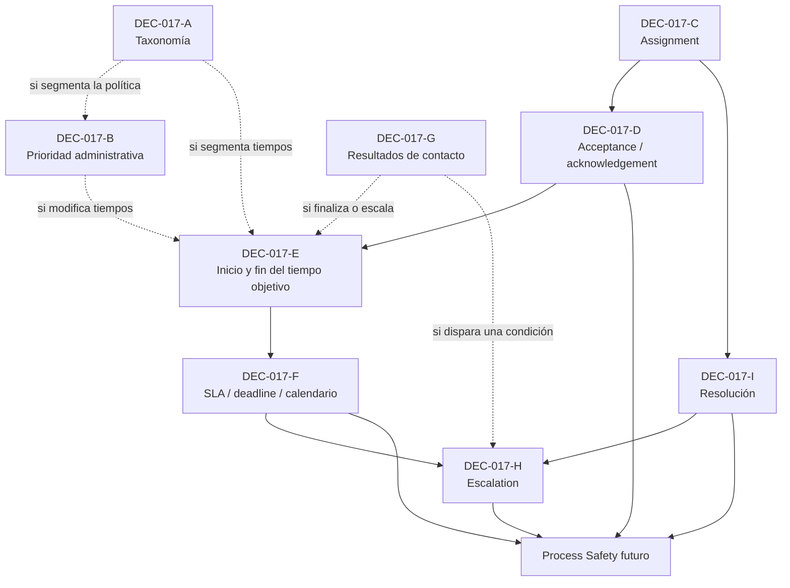

# DEC-017 — Paquete institucional de decisión sobre política operativa de tareas

## Control del documento

| Campo | Valor |
|---|---|
| Tipo | `DECISION SUPPORT EVIDENCE` |
| Decisión | `DEC-017` |
| Requisito principal | `REQ-09` |
| Document working status | `FINAL` — no canónico |
| Canonical DEC-017 status | `Pendiente` |
| Current gate | `READY_FOR_INSTITUTIONAL_DECISION` |
| Autoridad primaria registrada | Dirección de Enfermería |
| Evidencia técnica inspeccionada | Repositorio en `d75dad1` |
| Alcance | Taxonomía, prioridad administrativa, asignación, acceptance, tiempos objetivo, SLA, resultados de contacto, escalado y resolución |
| No constituye | Decisión institucional, aprobación clínica, jurídica, TI, RGPD, MDR ni autorización para implementar |

Este paquete organiza evidencia, opciones, preguntas y una plantilla de decisión.
No selecciona valores ni cambia el comportamiento de Guardián Alta Segura.

### Modelo de estado

| Concepto | Vocabulario | Efecto |
|---|---|---|
| Canonical DEC-017 status | `Pendiente`, `Propuesta`, `Aprobada`, `Retirada`, `Sustituida` | Único estado de decisión; procede de `docs/decision-register.md` |
| Document working status | `DRAFT`, `UNDER_REVIEW`, `FINAL` | Estado no canónico del artefacto; no cambia DEC-017 |
| Gate de preparación | `READY_FOR_INSTITUTIONAL_DECISION`, `READY_FOR_TECHNICAL_SPECIFICATION`, `READY_FOR_IMPLEMENTATION` | Controla la secuencia de trabajo; no es un estado de decisión |

El estado actual combina `Document working status = FINAL`,
`Canonical DEC-017 status = Pendiente` y
`Current gate = READY_FOR_INSTITUTIONAL_DECISION`.

### Identificadores de descomposición

`DEC-017-A` through `DEC-017-I` are working decomposition identifiers inside
canonical `DEC-017`. They are not independent canonical decision records unless
formally promoted into `docs/decision-register.md` by the applicable governance
process.

No se añaden como filas canónicas ni reciben estados canónicos independientes.

## 1. Propósito y límites

El propósito es permitir que Dirección de Enfermería resuelva explícitamente las
decisiones mínimas necesarias antes de autorizar una futura rama
`feat/gas2-task-sla-escalation`.

Este documento:

- describe únicamente capacidades verificadas;
- separa contratos técnicos de política institucional;
- identifica opciones neutrales y su impacto;
- conserva como pendiente cualquier cuestión sin evidencia aprobada;
- mantiene revisión humana antes de cualquier actuación clínica.

Este documento no:

- implementa SLA, escalado, acceptance o Process Safety;
- recomienda categorías, prioridades o plazos;
- convierte assignment en responsabilidad institucional;
- convierte resultados de contacto en interpretación clínica;
- autoriza comunicaciones, derivaciones, cierres o cambios de tratamiento.

## 2. Evidencia inspeccionada

La inspección cubrió README, registro de decisiones, trazabilidad Markdown/CSV,
matriz de autorización, workflow, arquitectura GAS 2.0 y ADR de episodio, cola,
autorización humana y accountability. También cubrió el esquema Prisma, las
migraciones de tareas, dominio, casos de uso, persistencia, API, UI y pruebas
unitarias, de integración y E2E relacionadas.

Fuentes técnicas principales:

- `Task` y `TaskEvent` en `prisma/schema.prisma`;
- `src/domain/workqueue/nursing-task.ts`;
- `src/domain/workqueue/task-accountability.ts`;
- `src/application/workqueue/manage-nursing-tasks.ts`;
- `src/infrastructure/persistence/prisma-nursing-workqueue-unit-of-work.ts`;
- `src/domain/authorization/human-authorization.ts`;
- ADR-0004, ADR-0008, ADR-0012 y ADR-0013.

## 3. Baseline real

### 3.1 Estados actuales

| Concepto | Valores actuales | Naturaleza | Límite |
|---|---|---|---|
| `Task.currentState` | `open`, `resolved` | Estado persistido | No existe otro estado de tarea |
| `TaskAssignmentStatus` | `UNASSIGNED`, `ASSIGNED`, `RESOLVED` | Proyección técnica | No es una máquina de estados persistida |
| Elegibilidad del assignee | `NOT_APPLICABLE`, `CURRENTLY_AUTHORIZED`, `NOT_CURRENTLY_AUTHORIZED` | Proyección técnica actual | No reasigna ni escala |

`ACCEPTED`, `ACKNOWLEDGED`, `OVERDUE` y `ESCALATED` no existen como estados,
eventos ni transiciones actuales.

### 3.2 Tipos actuales de `TaskEvent`

| Valor técnico | Efecto actual |
|---|---|
| `created` | Crea la primera revisión; puede incluir assignee inicial |
| `assigned` | Asigna una tarea abierta previamente no asignada |
| `reassigned` | Cambia el assignee de una tarea abierta |
| `contact-attempt` | Registra un resultado técnico de intento sin transferir assignment |
| `note-recorded` | Registra una nota breve sin transferir assignment |
| `resolved` | Transiciona de `open` a `resolved` con actor, fecha y motivo |

No existen eventos de acceptance, acknowledgement, deadline, vencimiento,
escalado, pausa, reanudación, reapertura o transferencia de turno.

### 3.3 Campos actuales de `Task`

| Campo | Función técnica actual |
|---|---|
| `id` | Identidad técnica |
| `episodeId` | Episodio obligatorio |
| `alertId` | Aviso opcional del mismo episodio |
| `summary` | Resumen de la tarea |
| `currentState` | `open` o `resolved` |
| `assignedToId` | Assignee actual opcional |
| `createdById` | Creador |
| `creationIdempotencyKey` | Idempotencia por creador |
| `creationFingerprint` | Detecta reutilización incompatible |
| `revision` | Concurrencia optimista |
| `resolvedById` | Actor de resolución, si está resuelta |
| `resolvedAt` | Instante de resolución |
| `resolutionReason` | Motivo obligatorio al resolver |
| `createdAt`, `updatedAt` | Tiempos técnicos |

No existen en `Task`: categoría, prioridad, acceptance, acknowledgement,
objetivo temporal, `dueAt`, deadline, referencia de política operativa, estado de
escalado, equipo, turno o suplencia.

### 3.4 Campos actuales de `TaskEvent`

| Campo | Función técnica actual |
|---|---|
| `id`, `taskId` | Identidad del evento y tarea |
| `type` | Tipo de evento cerrado |
| `fromState`, `toState` | Transición de estado |
| `fromAssignedToId`, `toAssignedToId` | Extremos de assignment |
| `note` | Nota solo para `note-recorded` |
| `contactOutcome` | Resultado solo para `contact-attempt` |
| `resolutionReason` | Motivo solo para `resolved` |
| `actorUserId`, `actorRole` | Actor y rol técnico histórico |
| `idempotencyKey`, `requestFingerprint` | Reintento seguro |
| `resultingRevision` | Orden causal por tarea |
| `occurredAt` | Instante del evento |

### 3.5 Identidades distintas

| Identidad | Qué acredita hoy | Qué no acredita |
|---|---|---|
| `createdById` | Quién creó la tarea | Assignee, acceptance o autoridad exclusiva |
| `assignedToId` | Holder técnico actual | Aceptación, actuación realizada o responsabilidad institucional |
| `TaskEvent.actorUserId` | Quién produjo un evento | Assignee o responsable del episodio |
| `resolvedById` | Quién resolvió | Que fuese assignee |
| `responsibleNurseId` | Responsable técnico de enfermería del episodio | Política final de distribución de tareas |
| `responsibleClinicianId` | Responsable técnico clínico del episodio | Política final de distribución de tareas |
| `AlertReview.reviewedById` | Quién registró la revisión histórica | Acting actor actual ni creador de tarea |

## 4. Invariantes técnicos ya implementados y probados

Estos puntos son contratos técnicos del MVP sintético; no son política
institucional aprobada:

1. Toda `Task` pertenece a un `DischargeEpisode`.
2. `alertId` es opcional y, si existe, pertenece al mismo episodio.
3. Una tarea derivada de aviso exige `AlertReview`, guard de recurso y
   `DefaultHumanAuthorizationPolicy`.
4. Una tarea sin aviso es iniciación humana directa.
5. Revisar un aviso no crea una tarea.
6. `Task` conserva estado actual y `TaskEvent` historia append-only.
7. Toda mutación exige `expectedRevision` e idempotencia.
8. Existen assignment, reassignment, contacto, nota y resolución explícitos.
9. La proyección separa creator, assignee, actor, resolver y responsables.
10. Un nuevo assignee debe ser un responsable profesional técnicamente elegible.
11. La revocación posterior conserva historia y no produce autoassignment.
12. Las mutaciones usan el orden de locks episodio → participantes únicos
    ordenados globalmente → roles → tarea/evento.
13. Una creación ya asignada usa `created`; no añade un `assigned` ficticio.
14. Assignment no equivale a acceptance ni a autoridad exclusiva para actuar.
15. Un profesional responsable autorizado puede resolver aunque no sea el
    assignee; esto es capacidad técnica actual, no política aprobada.
16. Resolver una tarea no resuelve el aviso ni cierra el episodio.
17. No existen autoassignment, acceptance, SLA o escalado.

## 5. Subdecisiones de DEC-017

### DEC-017-A — Taxonomía de tareas

Decidir:

- si existen clases institucionales de tarea;
- si representan trabajo clínico, administrativo, mixto u otra estructura;
- quién puede crear cada clase;
- si una clase puede cambiar después de creada;
- cómo se conserva la versión histórica de la taxonomía;
- si una política temporal depende o no de esa clase.

No se proponen categorías. Los identificadores de formulario son placeholders
neutrales.

### DEC-017-B — Prioridad administrativa

Decidir:

- si la tarea necesita prioridad administrativa;
- qué conjunto institucional de niveles existe, si existe;
- quién la selecciona y quién puede cambiarla;
- si toda selección debe ser humana;
- cómo se audita y versiona;
- si puede influir en tiempos o visibilidad sin convertirse en prioridad clínica.

`Alert.administrativeSeverity` (`standard`/`priority`) existe en el contexto de
avisos. No es prioridad de `Task`, depende de reglas de aviso y no debe heredarse
ni reutilizarse automáticamente.

### DEC-017-C — Política de assignment

Decidir:

- si una tarea puede permanecer sin assignee;
- quién puede asignar y reasignar;
- si assignment crea una obligación institucional;
- si requiere acceptance;
- si creator puede ser assignee;
- si puede resolver alguien distinto;
- si pueden actuar los responsables del episodio;
- si existen equipos, turnos, ausencias, suplencias y transferencia formal.

La implementación permite técnicamente tarea sin assignee, self-assignment del
responsable elegible y resolución por otro responsable autorizado. Esos hechos no
responden qué debe exigir la institución.

### DEC-017-D — Acceptance / acknowledgement

Decidir entre:

- `OPTION_A`: assignment suficiente, sin transición explícita;
- `OPTION_B`: transición explícita de acceptance/acknowledgement;
- `CUSTOM_OPTION`: alternativa institucional documentada.

La decisión debe especificar actor, evento, momento, efecto de falta de respuesta,
reversibilidad, reasignación y relación con cualquier medición temporal.
Consecuencias detalladas: [matriz de opciones](dec-017-option-matrix.md).

### DEC-017-E — Tiempos objetivo

Decidir:

- evento de inicio: creación, assignment, acceptance, review u otro aprobado;
- evento final: primer contacto, acknowledgement, resolución u otro aprobado;
- alcance: categoría, prioridad, unidad, horario u otra dimensión;
- pausas, reanudaciones, excepciones y cambios de política;
- si el objetivo es informativo o produce una obligación.

No se fija ningún valor temporal.

### DEC-017-F — SLA

Los términos requieren aprobación separada y no son sinónimos:

| Concepto | Definición institucional requerida |
|---|---|
| `TARGET TIME` | Objetivo operativo; debe definirse si es orientativo o vinculante |
| `SLA` | Compromiso medible con autoridad, alcance y consecuencia definidos |
| `DEADLINE` | Instante límite aplicable a una instancia concreta de tarea |
| `ESCALATION THRESHOLD` | Condición que permite considerar una acción organizativa de escalado |

Para cada concepto seleccionado deben definirse: actor responsable, evento de
inicio, evento final, pausa/reanudación, timezone, calendario laboral,
excepciones, versión y evidencia de aprobación.

### DEC-017-G — Resultados de contacto

| `CURRENT TECHNICAL VALUE` | `INSTITUTIONAL MEANING UNKNOWN?` | `DECISION REQUIRED` | `MIGRATION IMPACT IF CHANGED` |
|---|---|---|---|
| `reached` | Sí | Definir qué hecho acredita y qué evidencia mínima exige | Posible cambio de enum, compatibilidad histórica, UI/API y tests |
| `no-answer` | Sí | Definir alcance y si permite nuevos intentos o alguna consecuencia | Posible cambio de enum, compatibilidad histórica, UI/API y tests |
| `other` | Sí | Definir si sigue permitido y cómo evita semántica ambigua | Posible catálogo versionado o cambio de enum; preservar historia |

Ningún valor acredita resultado clínico, contacto con una persona concreta,
consentimiento de comunicación ni resolución de la tarea sin decisión adicional.

### DEC-017-H — Escalation

Decidir:

- condición de activación: temporal, manual, falta de acceptance, falta de
  contacto, tarea abierta u otra;
- destinatario: persona, rol, equipo, supervisor u otro;
- acción: notificación, visibilidad, nueva tarea, reasignación u otra;
- actor que confirma, cancela o cierra el escalado;
- repetición, deduplicación, pausas, excepciones y evidencia;
- relación con assignment, acceptance, SLA y resolución.

Quedan prohibidas la actuación clínica autónoma y la reasignación basada en
riesgo clínico. Una futura notificación operativa automatizada solo sería
admisible tras aprobación institucional y con el human-in-the-loop aplicable.

### DEC-017-I — Resolución

Decidir:

- qué significa institucionalmente `resolved`;
- quién puede resolver;
- qué motivo y catálogo versionado se exige;
- si puede reabrirse y con qué evidencia;
- relación con la tarea de origen, el aviso y el cierre del episodio.

Se conserva el límite:

```text
Task resolved
≠ Alert resolved automáticamente
≠ Episode closed automáticamente
```

## 6. Grafo de dependencias



Las líneas discontinuas representan dependencias condicionales: solo se vuelven
bloqueantes si la institución decide usar esa dimensión.

## 7. Minimum decision set

El conjunto mínimo para implementar de forma segura una primera capacidad de SLA
y escalado, sin categorías ni prioridad, es:

Taxonomía de clasificación:

- `BLOCKING_FOR_SLA`: debe resolverse para especificar el SLA del alcance;
- `BLOCKING_FOR_ESCALATION`: debe resolverse para especificar escalation;
- `BLOCKING_FOR_PROCESS_SAFETY`: bloquea anomalías futuras dependientes;
- `CONDITIONAL_BLOCKER_FOR_ESCALATION`: bloquea escalation solo cuando la
  condición aprobada depende de esa dimensión;
- `CONDITIONAL_BLOCKER`: bloquea solo si el alcance usa esa dimensión;
- `CAN_DEFER`: puede aplazarse porque el alcance aprobado declara que no la usa.

| ID | Clasificación | Decisión mínima requerida |
|---|---|---|
| DEC-017-A | `CONDITIONAL_BLOCKER` | Bloquea si SLA o escalation varían por categoría; en otro alcance puede ser `CAN_DEFER` |
| DEC-017-B | `CONDITIONAL_BLOCKER` | Bloquea si SLA o escalation varían por prioridad; en otro alcance puede ser `CAN_DEFER` |
| DEC-017-C | `BLOCKING_FOR_SLA`; `CONDITIONAL_BLOCKER_FOR_ESCALATION` | Siempre resuelve quién soporta la obligación temporal; bloquea escalation solo si la condición aprobada depende de assignment o responsabilidad |
| DEC-017-D | `BLOCKING_FOR_SLA`; `CONDITIONAL_BLOCKER_FOR_ESCALATION` | Siempre decide explícitamente acceptance o no acceptance; bloquea escalation si se basa en falta de acceptance y su semántica temporal |
| DEC-017-E | `BLOCKING_FOR_SLA`; `CONDITIONAL_BLOCKER_FOR_ESCALATION` | Siempre fija eventos de inicio y fin temporal; bloquea escalation si su condición depende del tiempo |
| DEC-017-F | `BLOCKING_FOR_SLA`; `CONDITIONAL_BLOCKER_FOR_ESCALATION` | Siempre fija semántica, calendario, excepciones y versionado; bloquea escalation si su condición depende de esa política temporal |
| DEC-017-G | `CONDITIONAL_BLOCKER`; `CONDITIONAL_BLOCKER_FOR_ESCALATION` | Bloquea si un resultado termina el cómputo o dispara escalation; si no, puede ser `CAN_DEFER` |
| DEC-017-H | `BLOCKING_FOR_ESCALATION`; `BLOCKING_FOR_PROCESS_SAFETY` cuando Process Safety dependa de escalation | Condición, destinatario, acción permitida y cierre del escalation |
| DEC-017-I | `CONDITIONAL_BLOCKER`; `CONDITIONAL_BLOCKER_FOR_ESCALATION` | Bloquea si resolution/reopening es evento terminal, regla de escalation o input de Process Safety; si no, puede ser `CAN_DEFER` |

Para el alcance completo de `feat/gas2-task-sla-escalation`, DEC-017-C, D, E, F
y H son bloqueantes. DEC-017-A, B, G e I dependen de las dimensiones y eventos
seleccionados por la institución; no se presume su uso.

No es necesario decidir en este gate:

- catálogos que la primera política aprobada no utilice;
- integración con equipos o turnos si no forma parte del alcance aprobado;
- comunicación externa o canal productivo;
- scoring, predicción, recomendación o acción clínica, que están fuera de alcance.

## 8. Implementation impact map

Clasificación orientativa; no autoriza cambios:

| Subdecisión | Task | TaskEvent | Accountability / WorkQueue | Aplicación, API y UI | Prisma | Tests | Docs / ADR |
|---|---|---|---|---|---|---|---|
| A Taxonomía | `SCHEMA_CANDIDATE` | `DOMAIN_CHANGE` si cambia | `DOMAIN_CHANGE` | `DOMAIN_CHANGE` | `MIGRATION_CANDIDATE` | `DOMAIN_CHANGE` | `DOMAIN_CHANGE` |
| B Prioridad | `SCHEMA_CANDIDATE` | `DOMAIN_CHANGE` si cambia | `DOMAIN_CHANGE` | `DOMAIN_CHANGE` | `MIGRATION_CANDIDATE` | `DOMAIN_CHANGE` | `DOMAIN_CHANGE` |
| C Assignment | `NO_CHANGE` o `DOMAIN_CHANGE` | `DOMAIN_CHANGE` según transferencia | `DOMAIN_CHANGE` | `DOMAIN_CHANGE` | `SCHEMA_CANDIDATE` solo si equipo/turno | `DOMAIN_CHANGE` | `DOMAIN_CHANGE` |
| D Acceptance | `SCHEMA_CANDIDATE` | `DOMAIN_CHANGE` | `DOMAIN_CHANGE` | `DOMAIN_CHANGE` | `MIGRATION_CANDIDATE` | `DOMAIN_CHANGE` | `DOMAIN_CHANGE` |
| E Tiempo objetivo | `SCHEMA_CANDIDATE` | `APPLICATION_ONLY` o `DOMAIN_CHANGE` | `DOMAIN_CHANGE` | `DOMAIN_CHANGE` | `MIGRATION_CANDIDATE` | `DOMAIN_CHANGE` | `DOMAIN_CHANGE` |
| F SLA | `SCHEMA_CANDIDATE` | `DOMAIN_CHANGE` | `DOMAIN_CHANGE` | `DOMAIN_CHANGE` | `MIGRATION_CANDIDATE` | `DOMAIN_CHANGE` | `DOMAIN_CHANGE` |
| G Contacto | `NO_CHANGE` si se conservan valores | `DOMAIN_CHANGE` si cambia catálogo | `APPLICATION_ONLY` | `DOMAIN_CHANGE` | `MIGRATION_CANDIDATE` si cambia enum/modelo | `DOMAIN_CHANGE` | `DOMAIN_CHANGE` |
| H Escalation | `SCHEMA_CANDIDATE` | `DOMAIN_CHANGE` | `DOMAIN_CHANGE` | `DOMAIN_CHANGE` | `MIGRATION_CANDIDATE` | `DOMAIN_CHANGE` | `DOMAIN_CHANGE` |
| I Resolución | `NO_CHANGE` o `DOMAIN_CHANGE` | `DOMAIN_CHANGE` si reapertura/catálogo | `DOMAIN_CHANGE` | `DOMAIN_CHANGE` | `SCHEMA_CANDIDATE` | `DOMAIN_CHANGE` | `DOMAIN_CHANGE` |

Puntos de código probablemente afectados tras aprobación: dominio de workqueue,
casos de uso, port y adaptador Prisma, rutas API, panel de cola, pruebas unitarias,
integración/E2E, trazabilidad y un ADR específico. `Task`/`TaskEvent` deben seguir
siendo fuentes de verdad; no se recomienda un agregado paralelo.

## 9. Candidatos de migración

Son hipótesis condicionadas a una decisión aprobada:

| Candidato | `WHY` | `CAN_DERIVE_FROM_EXISTING_DATA?` | `NEEDS_HISTORY?` | `NEEDS_VERSIONING?` | `MIGRATION_REQUIRED?` |
|---|---|---|---|---|---|
| `taskCategory` | Aplicar taxonomía por tarea | No para tareas históricas | Sí, si puede cambiar | Sí, si el catálogo cambia | Condicional |
| `priority` | Orden o política diferenciada | No | Sí, si puede cambiar | Sí | Condicional |
| `acceptedAt` / `acceptedBy` o evento equivalente | Acreditar acceptance | No | Sí | Semántica de policy, sí | Condicional; podría ser evento sin columnas actuales |
| `dueAt` | Congelar un instante calculado | Solo si se retienen policy y calendario completos | Sí | Sí | Condicional; puede ser proyección |
| `policyVersionId` | Reconstruir la política aplicable | No con el modelo actual | Sí | Sí | Candidato fuerte, no decidido |
| `escalationState` | Lifecycle propio de escalado | No | Sí | Sí | Condicional; puede derivarse de eventos |
| categoría versionada de contacto | Sustituir o ampliar el enum actual | No de forma fiable | Sí | Sí | Condicional |
| equipo/turno/suplencia | Representar assignment no individual | No | Sí | Sí | Condicional |

`NOT REQUIRED` es una conclusión válida. Por ejemplo, `dueAt` no requiere columna
si una proyección reproducible puede reconstruirlo con eventos y política
inmutables; `escalationState` no requiere columna si los eventos aprobados bastan.

## 10. Versionado conceptual de una política futura

`TaskOperationalPolicyVersion` es solo un nombre conceptual para analizar la
evidencia necesaria. No se propone tabla, interfaz ni modelo definitivo.

Una futura política debería permitir reconstruir:

- qué versión estaba vigente al crear, asignar, aceptar o escalar una tarea;
- autoridad y evidencia que aprobaron esa versión;
- alcance organizativo y tipos de tarea incluidos;
- reglas de inicio, fin, pausa, reanudación, timezone y calendario;
- excepciones y precedencia;
- transición entre versiones sin reescribir historia.

Campos conceptuales a evaluar:

| Elemento | Pregunta de decisión |
|---|---|
| `version` | ¿Cómo se identifica una versión inmutable? |
| `status` | ¿Qué estados de borrador, aprobado, retirado o sustituido se admiten? |
| `effectiveFrom` / `effectiveTo` | ¿Cómo se determina vigencia sin solapamientos ambiguos? |
| `approvalAuthority` | ¿Cómo se referencia a la autoridad competente? |
| `approvalEvidenceReference` | ¿Dónde queda la evidencia versionada? |
| `scope` | ¿Unidad, categoría, prioridad u otro ámbito? |
| `configurationReference` | ¿Cómo se referencia la configuración sin copiarla a auditoría? |

La tarea o sus eventos necesitarían una referencia reproducible a la política, o
una regla inequívoca que resuelva la versión histórica. No se elige aquí cuál.

## 11. Safety boundaries

Una futura decisión e implementación deberá prohibir expresamente:

- prioridad derivada automáticamente de diagnóstico;
- scoring probabilístico o clasificación de riesgo opaca;
- predicción de suicidio;
- recomendación terapéutica;
- escalado clínico autónomo;
- cierre automático de tarea, aviso o episodio;
- contacto automático de emergencia;
- asignación automática basada en riesgo clínico;
- modificación automática de tratamiento.

Una `AUTOMATED OPERATIONAL NOTIFICATION` futura solo podrá estudiarse si existe
política institucional aprobada, destino autorizado, trazabilidad, deduplicación,
fallo seguro y revisión humana donde corresponda. No se implementa en esta rama.

## 12. Dependencias de Process Safety

| Hallazgo futuro | Estado | Motivo |
|---|---|---|
| `TASK_OVERDUE` | `BLOCKED_BY_DEC_017` | Falta evento inicial/final, calendario y umbral |
| `REVIEW_SLA_BREACHED` | `BLOCKED_BY_DEC_017` | Falta semántica de SLA y alcance |
| `ESCALATION_REQUIRED` | `BLOCKED_BY_DEC_017` | Falta condición, destinatario y acción |
| `UNACKNOWLEDGED_TASK` | `BLOCKED_BY_DEC_017` | No existe acknowledgement/acceptance |
| `CONTACT_TARGET_NOT_MET` | `BLOCKED_BY_DEC_017` | Falta significado institucional de outcome y objetivo |
| `CURRENT_ASSIGNEE_NOT_CURRENTLY_AUTHORIZED` | Disponible técnicamente | La proyección ya lo detecta sin escalar |
| Inconsistencia de `TaskEvent` | Disponible técnicamente | La proyección y SQL ya validan la cadena |
| Tarea vinculada sin review | Prevenida técnicamente | Guard de aplicación y trigger PostgreSQL |

Los invariantes técnicos disponibles pueden producir visibilidad o fallo cerrado;
no deben renombrarse como anomalías clínicas ni provocar actuación automática.

## 13. Autoridad y evidencia requerida

Dirección de Enfermería continúa como autoridad primaria de DEC-017. Según el
contenido seleccionado, puede requerirse participación consultiva:

- Dirección Médica si una opción introduce significado clínico;
- Dirección TI para timezone, calendario, scheduler, notificación, disponibilidad
  y operación técnica;
- Responsable del Tratamiento si la política cambia contacto, acceso, finalidad,
  minimización o retención.

La consulta no cambia la autoridad primaria registrada sin evidencia formal.

Evidencia mínima antes de implementar:

1. formulario completado y con referencia de aprobación;
2. versión, alcance y fecha efectiva;
3. definiciones inequívocas y ejemplos sintéticos;
4. excepciones y responsables;
5. relación con procedimientos locales;
6. revisión clínica, técnica o jurídica adicional cuando corresponda;
7. criterio de retirada, sustitución y revisión.

## 14. Trazabilidad

| Artefacto | Relación | Estado preservado |
|---|---|---|
| `DEC-017` | Decisión institucional que este paquete ayuda a preparar | `Pendiente` |
| `REQ-09` | Gestión de tareas humanas trazables después de revisión | Estado canónico sin cambios |
| ADR-0008 | Baseline de cola y eventos humanos | Sin cambio |
| ADR-0012 | Gate de autorización humana | Sin cambio |
| ADR-0013 | Accountability técnica | Sin cambio |
| DEC-013 | Mapeo institucional de roles, si afecta autoridades | Sigue pendiente; no se resuelve aquí |
| DEC-014 | Operación de incidentes; no debe confundirse con escalado de tareas | Sigue pendiente; fuera de alcance |

No se altera el estado canónico de ningún requisito ni decisión. Este paquete es
evidencia de apoyo, no evidencia de aprobación.

## 15. Entregables relacionados

- [Matriz neutral de opciones](dec-017-option-matrix.md)
- [Formulario institucional de decisión](dec-017-decision-form.md)
- [Agenda del workshop](dec-017-workshop-agenda.md)
- [Resumen ejecutivo de una página](dec-017-executive-brief.md)

## 16. Gate

El paquete puede pasar al workshop y a revisión institucional cuando sus
artefactos estén completos y las validaciones documentales sean satisfactorias.
No autoriza abrir `feat/gas2-task-sla-escalation`.

Estado actual:

- `Document working status = FINAL`;
- `Canonical DEC-017 status = Pendiente`;
- `Current gate = READY_FOR_INSTITUTIONAL_DECISION`.

Crear un formulario o celebrar el workshop no autoriza implementación. Antes de
alcanzar `READY_FOR_TECHNICAL_SPECIFICATION` deben existir, como mínimo:

- `Canonical DEC-017 status = Aprobada` para la policy version y el approved
  scope que se pretende especificar;
- approval evidence reference;
- policy version;
- approved scope;
- effective date;
- all blocking subdecisions resolved for that scope;
- required consultative evidence where applicable;
- no unresolved contradiction between selected options.

La secuencia conceptual obligatoria es:

```text
READY_FOR_INSTITUTIONAL_DECISION
→ institutional evidence/approval
→ READY_FOR_TECHNICAL_SPECIFICATION
→ technical design review
→ READY_FOR_IMPLEMENTATION
```

Los labels `READY_FOR_*` son gates de preparación, no estados canónicos de
DEC-017. El gate de implementación permanece cerrado hasta completar la secuencia.
`Pendiente`, `Propuesta` y `Retirada` no permiten
`READY_FOR_TECHNICAL_SPECIFICATION`. `Sustituida` tampoco lo permite para la
versión sustituida; su historia se conserva.
